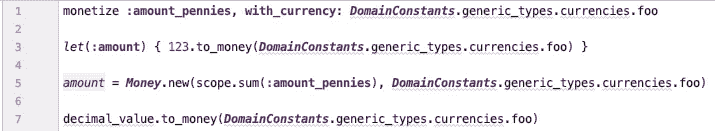

# Ruby 精化——一个用例

> 原文：<https://medium.com/codex/ruby-refinements-a-use-case-184f905e39ee?source=collection_archive---------2----------------------->


# 方案

在这个特定的场景中，我们有一组 Ruby 构造来处理存储在 YAML 文件中的域常量(业务值)。我肯定你见过类似的。对于这个例子，假设我们有一个文件，它定义了许多货币常量，用于 Money gem。该构造的接口有点笨拙，要获得特定货币的底层“代码”——在领域语言中缩写为`foo`——您需要做以下事情:

```
DomainConstants.generic_types.currencies.foo
```

确切的命名和层次结构并不重要——这只是一个例子——重要的是它有点笨拙。

碰巧的是，还有另外两种“通用”货币类型叫做`bar`和`baz`:

```
DomainConstants.generic_types.currencies.barDomainConstants.generic_types.currencies.baz
```

在整个代码中，每当处理货币实例化和定义`Money`属性时，都会引用这些通用货币:



我在这里使用了一个图像来演示没有换行的代码

…坦白地说，这很难看。此外，在 Rubocop 对你摇手指来修正你的行长度之前，只需要在一行上进行几次货币操作。

# 给我一些糖…

这里真正好的是一些语法糖来整理一些东西:

*   首先，`DomainConstants.generic_types.currencies.foo`需要更加简洁。`currency_foo`将会很好地解决这个问题，同时保留这个术语的“可搜索性”。
*   第二，所有这些数字类型到特定货币的转换会容易得多。Ruby 是一种动态的 OO 语言，难道不能这样做:`123.to_foo`？

## 实现“currency_foo”

实现货币方法的第一步可能是创建一个模块，它可以包含在需要这些方法的任何地方:

```
class MyModel
  monetize :amount_pennies, with_currency: DomainConstants.generic_types.currencies.foo

  def some_method
    123.to_money(DomainConstants.generic_types.currencies.foo)
  end
end
```

可能会变成:

```
module GenericCurrencies
  DomainConstants.generic_types.currencies.each do |name, cur_id|
    define_method "currency_#{name}" do
      Money::Currency.new(cur_id)
    end
  end
end class MyModel
 **include GenericCurrencies**

  monetize :amount_pennies, with_currency: **currency_foo**
  def some_method
    123.to_money(**currency_foo**)
  end
end
```

那已经看起来好多了！

但是有一个问题:`monetize :amount_pennies, with_currency: currency_foo`导致了`NameError`，因为新的货币方法只在*实例*上可用。如果我们使用的是 ActiveSupport，那么这个问题很容易解决。否则，我们需要稍微修改一下，让这些方法也进入类范围，但这是一个已经解决的问题，没什么大不了的。

## 我们的‘to _ foo’方法怎么样？

这样我们就可以:

```
def some_method
  123.**to_foo**
end
```

嗯，我们可以通过扩展`Numeric`很容易地实现这一点:

```
class Numeric
  DomainConstants.generic_types.currencies.each do |name, value|
    define_method “to_#{name}” do
      to_money(value)
    end
  end
end
```

那么我们如何看待我们的第一次尝试呢？

从好的方面来看，我们已经(在某种程度上)解决了这个问题。

不利的一面是，我们不得不扩展`Numeric`,使这些货币方法在应用程序中的所有数字上都可用。也许没关系，但是我觉得有点脏。

此外，包含一个模块并不总是给我们预期的行为。例如，在这段代码中:

```
class MyModel
  include GenericCurrencies

  monetize :amount_pennies, with_currency: currency_foo **tricksy_type :gotcha do
    currency_bar
  end** def some_method
    123.to_foo
  end
end
```

从表面上看，这似乎是可行的。但是当代码运行时，我们在传递给`tricksy_type`的块中得到一个`NameError`。结果是，`tricksy_type`使用一些元编程来评估它自己上下文中的给定块，所以`currency_foo`不可用。解决这个问题将是一件令人头疼的事情。这就是使用模块来提供语法糖的根本缺点。

# 为什么应该避免模块

从上面的例子可以看出，包含一个模块会带来一些问题。将模块包含到类中会将其方法引入到该类的任何实例中。在这些实例中，可以在没有显式接收者的情况下调用方法，例如:

```
 currency_foo
```

除非它们是私有的，否则这些方法也可以从实例外部、从代码中的任何地方调用，例如:

```
model_instance.currency_foo
```

虽然这是相当无害的，但它仍然是我们不希望看到的副作用。**我们不打算在模型中添加行为；仅在代码**中提供一种 DSL。

此外，从上面的`monetize`和`tricksy_type`情况可以看出，在作用域的顶部包含一个模块并不一定会使它的方法在需要的地方可用。我们希望在词法范围内得到一些语法上的好处，但最终我们不得不与运行时上下文和 Ruby 复杂的对象模型搏斗。

# 输入细化

事不宜迟，让我们直接进入代码；解决方案已经摆在我们面前，解释起来会更容易:

```
module GenericCurrencies
  DomainConstants.generic_types.currencies.each do |name, cur_id|
    currency = Money::Currency.new(cur_id) # N.B. a closure

    **refine Object** do
      define_method "currency_#{name}" do
        currency
      end
    end

    **refine Numeric** do
      define_method "to_#{name}" do
        to_money(currency)
      end
    end
  end
end
```

这是它使用时的样子:

```
class MyModel
  **using GenericCurrencies**

  monetize :amount_pennies, with_currency: currency_foo **# works fine** tricksy_type :gotcha do
    currency_bar **# works fine**
  end def some_method
    123.to_foo **# works fine**
  enddef self.*baz_other*(*other*)
    *other*.currency_baz **# works fine**
  end
end*model* = *MyModel*.new
*model*.some_method        # works fine
*MyModel*.baz_other(*model*) # works fine

*model*.currency_baz       # ERROR! `currency_baz` not defined!
123.to_foo               # ERROR! `to_foo` not defined!
```

简单地通过在类的顶部引入`using GenericCurrencies`，我们似乎已经满足了我们所有的语法糖渴望。更重要的是，我们已经设法不在代码中的任何地方用非预期的方法污染任何对象！

我们是怎么做到的？

精化的奇妙之处在于它们有**词法范围**。词法范围与*编写的*代码的结构有关；而不是执行代码的*的结构。所以无论你打电话到哪里:*

```
using GenericCurrencies
```

…然后在`GenericCurrencies`中定义的细化在包含的词法范围内(在`using`调用之后)变得活跃，无论它是一个类、一个模块还是一个完整的文件！(注意:细化不能在方法范围内激活)。

让我们从`to_foo`方法开始(减去元编程):

```
**refine Numeric** do
  def **to_foo**
    to_money(:foo)
  end
end
```

这意味着，对于该细化活动范围内的任何代码，从`Numeric`(即`Integer`、`Float`等)开始下降的任何类型的对象。)将响应`to_foo`并返回它的`Money`等价物。

在这个精化活动的范围之外，这个方法消失了！

那`currency_foo`呢？

```
**refine Object** do
  def **currency_foo**
    :foo
  end
end
```

通过细化`Object`，任何从`Object`下降的类型的对象都会响应`currency_foo`，也就是所有对象……包括`Class`！(除了少数从`BasicObject`下来的。)这就是为什么我们能够在类和实例范围内调用`currency_foo`。

当在没有显式接收者的情况下调用`currency_foo`时，它被解释为对`self`的方法调用，然后沿着祖先链向上寻找定义；当它遇到`Object`细化时找到它。包含一个模块做了一件非常类似的事情——它将方法定义添加到祖先链中——只是稍微低一点，并且是针对该对象的生命周期。

但是给`Object`添加方法难道不是一件*坏事*吗？

在我看来，对于这个用例，*没有*。每件事都有时间和地点，对我来说，能够将简单的 DSL 引入一段代码的优势——直观且具有可预测的效果——超过了我可能对`Object`的任何轻微担忧。

如果你还没有发现精化的用途，那么我希望这能给你一些启发。有时候你会发现一种模式。这个对我来说就是。