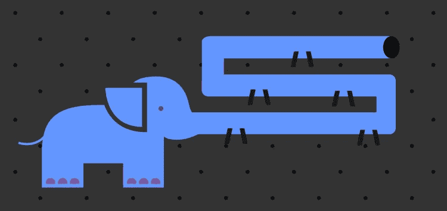

# rudder stack:Pachyderm 管道如何帮助解析客户事件数据

> 原文：<https://medium.com/codex/rudderstack-how-pachyderm-pipelines-help-parse-customer-event-data-a64598b33e09?source=collection_archive---------19----------------------->

这篇文章探讨了业务伙伴 [Pachyderm](https://www.pachyderm.com/) 的客户数据堆栈，它提供了一个基于 Kubernetes 的同名 ETL(提取、转换、加载)工具。我们将展示 Pachyderm 如何利用不同来源的实时客户事件数据来更深入地了解其产品中的用户行为，并优化 UX 以提高客户采用率。

# 什么是厚皮动物？

Pachyderm [的设计](https://thenewstack.io/pachyderm-aims-displace-hadoop-container-based-collaborative-data-analysis-platform/)是为了更容易地构建和管理端到端的 ML/AI 管道，而不管它们的大小和复杂程度。借助 Pachyderm，您可以跟踪您的数据血统，并利用您选择的工具、语言和框架对您的数据进行版本控制，以构建可扩展的数据科学管道。

使用 Pachyderm，有三种简单的方法来启动和运行您的数据科学管道。你既可以在你当地的环境中，在你最喜欢的云提供商上部署 Pachyderm，也可以使用该公司托管和完全管理的 SaaS 平台: [Pachyderm Hub](https://hub.pachyderm.com/) 。

# 厚皮动物如何使用它的数据

作为一个现代数据科学平台，Pachyderm 的所有团队都在所有运营和 KPI 中广泛使用数据。Pachyderm 的客户团队使用他们的客户事件数据(通过 RudderStack 事件流收集、发送和存储)来更好地了解用户行为和产品使用模式。他们还利用这些数据来推动有效的内向和外向营销活动。

Pachyderm 使用其 SaaS 平台 Pachyderm Hub 中的产品使用数据(同样通过 RudderStack 事件流收集、发送和存储)进行产品分析和平台优化。然后，他们利用来自 Salesforce、HubSpot、Zendesk、Slack 和 Google Analytics 等云工具的事件流和产品使用数据以及非事件数据，这些数据是通过 Fivetran 和 Stitch 等工具收集和存储的。

凭借客户事件数据、产品使用数据和来自客户工具的数据的独特组合，以及现代数据存储和处理工具，Pachyderm 建立了一个强大的堆栈，可以利用所有激活用例的无限数据。

# Pachyderm 的客户数据堆栈

*   **数据收集和同步:**方向舵堆栈 SDK，方向舵堆栈事件流，方向舵堆栈仓库动作，Stitch，Fivetran
*   数据仓库: Google BigQuery
*   **数据处理和商业智能:**适马计算
*   **用于激活的云工具集用例:** HubSpot、Google Analytics、Zendesk、Salesforce、Outreach.io

# 数据如何流经厚皮动物堆栈

以下是通过 Pachyderm 数据堆栈的数据流的可视化表示:

**厚皮管道**

# 数据收集

Pachyderm 通过跟踪用户交互和来自云资源的数据生成数百千兆字节的数据。所有这些数据都存储在基于数据仓库 Google BigQuery 的客户数据湖中。

# 数据流和仓储

Pachyderm 团队主要使用客户事件数据来跟踪用户旅程，并触发各种下游用例(如营销活动)。他们使用 [RudderStack](https://rudderstack.com/?utm_content=inline-mention) 事件流将事件数据路由到下游目的地，如 [HubSpot](https://rudderstack.com/integration/hubspot/) 和 [Google Analytics](https://rudderstack.com/integration/google-analytics/) 及其数据仓库 [Google BigQuery](https://rudderstack.com/integration/bigquery/) 。RudderStack 与这些平台的无缝集成允许它们为其激活用例传输接近实时的事件。

为了在他们的 web 应用程序上跟踪和捕捉事件数据，Pachyderm 使用了[ruder stack JavaScript SDK](https://docs.rudderstack.com/rudderstack-sdk-integration-guides/rudderstack-javascript-sdk)。对于服务器端捕获，它使用[ruder stack Go SDK](https://docs.rudderstack.com/rudderstack-sdk-integration-guides/rudderstack-go-sdk)。除了 SDK，Pachyderm 还使用[ruder stack HTTP API 跟踪](https://docs.rudderstack.com/rudderstack-api-spec/http-api-specification)来无缝记录和捕获客户事件。

> “RudderStack 让我们能够更好地访问我们的数据。我们的数据被孤立在云资源中。现在我们把它们都放在一个仓库里，让每个人都可以使用。”
> —丹·贝克，厚皮动物营销运营经理

# 来自其 SaaS 平台和云工具的数据

除了客户活动，Pachyderm 还从其 SaaS 平台 Pachyderm Hub 收集数据。这些数据主要包括客户的工作空间使用详细信息以及与平台使用和性能相关的其他指标。Pachyderm 集群(托管其开源和企业产品)也生成大量工作空间使用数据。这些数据由 [Webhook Relay](https://webhookrelay.com/) 处理，并直接流入公司的数据仓库。

> *“有了舵栈，移动的棋子就少了。拥有 RudderStack 意味着我们不必拥有一堆我们必须为自己构建和支持的手动流程或 API。”
> —丹·贝克，厚皮动物*公司营销运营经理

Pachyderm 还从各种云资源中提取不同类型的数据。其中包括来自 HubSpot 的营销数据、来自 Salesforce 和 Zendesk 等工具的客户和 CRM 数据、来自 Slack 的消息数据、来自 Google Ads 等工具的广告和活动数据以及来自 Google Analytics 的见解。为了收集这些数据，Pachyderm 使用流行的 ETL 工具，如 Fivetran 和 Stitch。

所有这些信息都有助于整合全面的客户资料并了解 Pachyderm 的产品内行为。

# 数据转换和商业智能

数据进入数据仓库后，Pachyderm 使用[适马](https://www.sigmacomputing.com/)——以数据仓库为中心的分析和 BI 工具——进行内部报告和指标跟踪。除了一般的 BI 之外，它还使用适马来构建查询、连接表和聚合从各种来源存储的数据，从而为客户提供真实的单一来源。

这种转换后的数据在 BigQuery 中具体化以供存储。然后，软件使用 RudderStack 仓库操作将转换后的数据从仓库发送到 HubSpot 等下游目的地。

> "*我们已经有了一堆仓库动作的用法，而这只是冰山一角。我们未来的计划包括从仓库中获取更多的数据洞察力，仓库行动将继续成为我们的首选解决方案。”
> —丹·贝克，厚皮动物营销运营经理*

# 数据激活用例

Pachyderm 将转换后的数据用于激活用例的方式非常有趣。所有客户活动数据和来自应用程序和系统的数据主要用于线索鉴定和分析客户旅程和行为。

# 领导资格

当用户第一次在 Pachyderm 上注册时，建议的第一步是创建一个工作空间。Pachyderm 的客户团队通过点滴邮件鼓励这一行动。一旦用户创建了工作区，一个事件就会从应用程序后端发送到他们的数据仓库。

然后，团队使用适马来确定创建的工作区的总数以及自上次运行以来创建的工作区的总数，并将这些数据具体化到数据仓库中。然后，这些信息通过方向舵堆栈仓库操作发送回 HubSpot。一旦进入 HubSpot(呼入销售线索系统)，这些数据将与 Salesforce(呼出销售线索系统)同步。在来自应用程序的行为数据进入他们的 CRM 后，他们使用 Outreach.io 来推动他们的个性化消息和电子邮件活动，并且(在本例中)他们停止向创建了工作区的用户发送点滴电子邮件。

> *“将汇总的活动数据输入 HubSpot 和 Salesforce 是我们销售团队与客户有效沟通的关键。”
> —丹·贝克，厚皮动物公司营销运营经理*

# 客户旅程和行为分析

凭借在各种客户接触点捕获的事件数据，Pachyderm 团队现在可以了解其客户的产品之旅，并查明任何问题。他们还可以更深入地了解用户如何使用平台，并优化产品的特定方面，以改善客户体验。

# 简化的数据访问，没有数据孤岛

在将 RudderStack 整合到他们的客户数据堆栈之前，Pachyderm 的团队必须在 HubSpot 中做任何管道工作，以便在数据仓库中移动数据。这反过来又产生了许多数据孤岛。他们寻找其他客户数据平台来解决这些问题，但是考虑到他们得到的回报，这种成本是不合理的。

借助 RudderStack 这一客户数据堆栈的核心组件，Pachyderm 可以将所有事件数据集中到一个中心位置(数据仓库)，以便高效地用于分析。此外，RudderStack Warehouse Actions 将分析结果发送给下游工具，以进行销售线索确认和个性化营销。

# 免费注册并开始发送数据

测试我们的事件流、ELT 和反向 ETL 管道。使用我们的 HTTP 源在不到 5 分钟的时间内发送数据，或者在您的网站或应用程序中安装我们 12 个 SDK 中的一个。[入门](https://app.rudderlabs.com/signup?type=freetrial)。

本博客最初发布于:
[https://rudder stack . com/blog/rudder stack-how-pachyderm-pipelines-help-parse-customer-event-data](https://rudderstack.com/blog/rudderstack-how-pachyderm-pipelines-help-parse-customer-event-data)