# 方向舵堆栈仓库操作解锁仓库中的数据

> 原文：<https://medium.com/codex/rudderstack-warehouse-actions-unlocks-the-data-in-your-warehouse-2217ec9b28c1?source=collection_archive---------12----------------------->

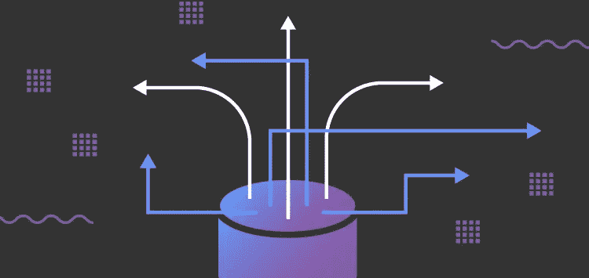

[您的数据仓库是构建客户数据堆栈的平台](https://rudderstack.com/blog/the-complete-customer-data-stack/)。它是一个强大的中央系统，用于推动关键业务决策，同时为整个组织维护统一的事实来源。企业不断寻求改进其产品或营销策略，以获得超越竞争对手的额外优势。数据仓库通过提供分析数据来做出基于事实的决策，推动创新和业务增长，从而帮助您获得竞争优势。虽然团队将这些由分析驱动的见解转化为战略和战术，但很难激活这些见解所基于的数据仓库的实际数据。

为了更容易地利用和激活您的团队构建的所有分析，我们推出了一个名为 RudderStack Warehouse Actions 的新功能。Warehouse Actions 使您能够利用存储在数据仓库中的经过处理的客户数据，并将这些丰富的信息直接发送到整个客户数据堆栈。

在本帖中，我们将详细介绍仓库操作。我们解释了如何将仓库配置为数据源来充分释放数据的价值，仓库操作如何工作，它的一些好处，以及如何在 RudderStack 中设置它。

# 为什么仓库行动？

数据仓库是一种不可或缺的工具，因为它们使决策者能够通过商业智能工具、SQL 客户端和其他分析应用程序快速访问数据。如果没有数据仓库，您将被迫依赖您使用的单个(孤立的)应用程序以及来自每个应用程序的原始数据来进行分析。

通过消除重复记录、错误和不一致的信息，仓库有助于保证数据的统一、一致和高质量。它还使您的团队能够对您的数据执行深入的分析和建模，这在没有仓库的情况下几乎是不可能的。考虑到您的仓库中的数据质量以及您的团队可以从中获得的数据，使用您的仓库中的客户数据来激活您的客户工具是有意义的。

Warehouse Actions 通过将表转换为可以在下游客户工具中触发激活的事件流，使将客户见解输入到您的客户数据管道变得容易。

# 仓库操作的工作原理

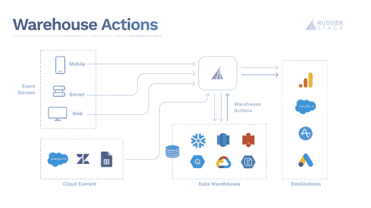

**仓库行动架构**

RudderStack 可以轻松地从不同来源(事件和非事件)收集数据，并安全地将它们接收到您的仓库中。一旦数据被成功接收，您的团队就可以应用高级查询或模型来生成有价值的数据组合(表或视图),这些数据组合经常被具体化(也称为编写)为表并存储在您的数据仓库中。例如， [dbt](https://www.getdbt.com/) 可以用于在您的仓库中转换数据，只需编写 select 语句。dbt 将这些 select 语句转换成表和视图。

借助仓库操作，RudderStack 可以收集对存储在您的仓库中的分析衍生数据集的任何更新，并将其作为事件推送到您的所有客户工具。

# 使用仓库操作的好处

即使跨多个接触点收集和统一了客户事件数据，也可能缺乏必要的信息来构建完整或丰富的客户档案。事件数据本身并不能为存储在客户主数据、活动数据甚至广告数据中的任何信息提供上下文。当您拥有来自事件之外的来源的数据，可以使您的客户资料更好或进行更深入、更有意义的分析时，您需要一个数据仓库。在您的仓库中，您可以组合所有这些不同类型的客户数据，以定义更好的客户档案，并从更深入的分析中获得更有意义的见解。通过仓库操作，您可以将数据仓库中的客户洞察路由到第三方工具，以供进一步激活。

例如，在开展新的营销活动时，您经常面临为个性化电子邮件、推送通知或目标受众收集“正确数据”的挑战。这种“正确的数据”通常从简单的数据开始，如姓名和电子邮件地址，然后扩展到复杂的客户数据，包括行为特征、查看的产品、注册的订阅等等。生成“正确数据”所需的所有数据要么已经在您的数据仓库中，要么很容易找到。

Warehouse Actions 允许您对“正确的数据”采取行动，将您团队的分析结果发送到您所有的客户工具。因此，帮助您的营销团队构建和自动化定制营销活动推荐等工作变得非常容易。此外，它允许你的产品团队为可能流失的用户建立赢回流量。

# 在方向舵堆栈中设置仓库操作

我们将使用一个真实的例子来演示如何设置仓库操作。假设您的公司想要使用七天内的登录次数来计算新用户的销售线索得分。多次登录将增加销售线索得分。

我们还可以说，因为您使用 RudderStack 事件流和 RudderStack 云提取，所以您的仓库中有来自您的网站、iOS 应用程序和 Android 应用程序的登录事件数据，以及来自 Salesforce 的销售线索记录。您可以使用 SQL(或其他查询数据的方法)构建一个简单的模型来计算每个销售线索得分。结果是您的仓库中的一个表，其中列出了 Salesforce 销售线索及其相关分数。

在雪花中，计算销售线索得分并生成表格的查询可能如下所示:

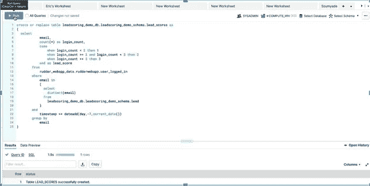

**计算领先分数**

借助 Warehouse Actions，您可以轻松地通过 RudderStack 从 Snowflake 中的表格中提取更新的销售线索档案，并将其发送给 Salesforce，这意味着您的销售团队将获得新注册的最新状态。因为该表被转换成一个事件流，所以您还可以将它发送到任何其他需要线索得分的工具，如营销自动化和客户体验平台。

配置仓库操作很简单，只需要几分钟。

1.  登录您的[舵栈云仪表盘](https://app.rudderlabs.com/signup?type=freetrial)。
2.  导航到左侧面板中的**源**，选择要添加为源的首选数据仓库，然后单击下一个的**。**

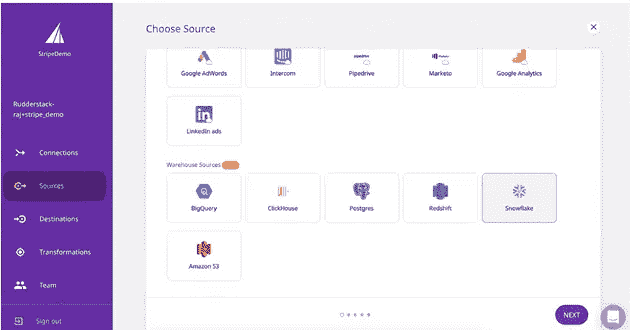

**选择仓库**

*注意:* RudderStack 目前支持 Google BigQuery、ClickHouse、Amazon Redshift、Amazon S3 和 Snowflake 作为源。在本例中，我们选择了雪花作为仓库源。

*   在**命名源**部分为源指定一个名称，并为 RudderStack 访问数据仓库提供连接凭证。(如果您是第一次在 RudderStack 仪表板中配置您的数据仓库，请单击**从头创建凭证**按钮)。

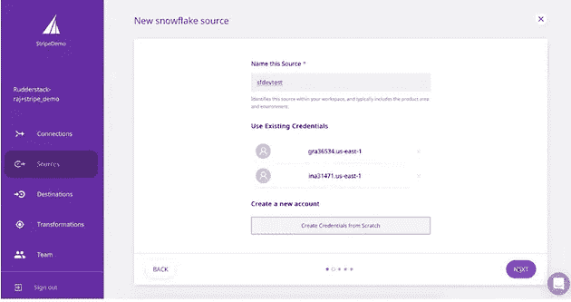

**命名信号源**

*   在“**配置数据**”页面上输入数据仓库模式和表名。RudderStack 将从这个表中收集数据。

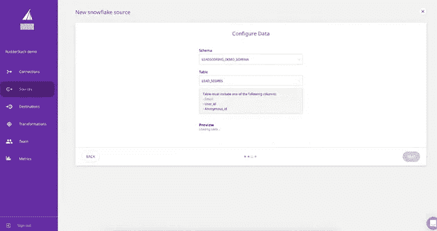

**配置数据**

请注意，您的源表必须至少包括以下一列，才能被视为有效的源:

`email`

`user_id`

`anonymous_id`

*   检查该表，并定义应该从数据仓库中提取的数据。在我们的示例中，我们正在提取销售线索电子邮件和销售线索得分。请注意，您可以看到通过 RudderStack 发送的有效负载，并且可以通过包含/排除键和修改列名来修改该有效负载，以匹配下游目的地中的字段。配置好有效载荷后，点击下一个按钮**。**

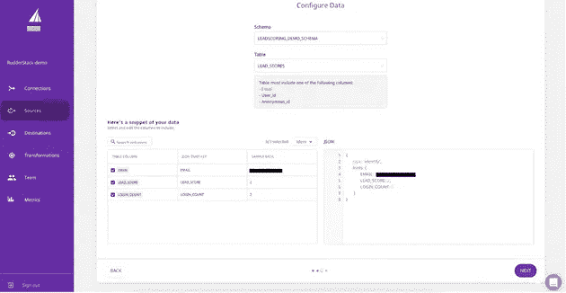

**定义要拉取的数据**

*   在“**计划选项**部分，选择数据拉计划并指定数据同步运行的频率。

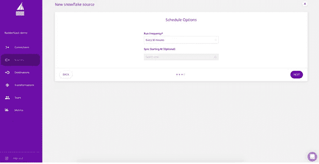

**调度**

就是这样！您的数据仓库现在被配置并添加为 RudderStack 源。

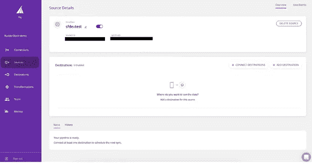

**仓库已配置**

既然您在 Warehouse Actions 中设置了来自 Snowflake 的表，您可以通过 RudderStack 将`identify`调用推送到 Salesforce，这样您的销售团队就可以优先考虑拓展。为此，您需要通过点击**连接目的地**或**添加目的地**将 Salesforce 添加为目的地:

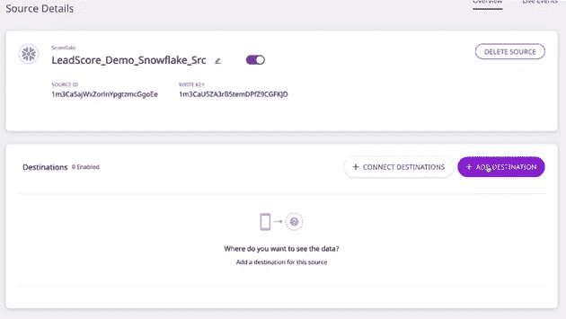

**将 Salesforce 添加为目的地**

接下来，**命名目的地**，并在**连接设置**中将其连接到雪花源。

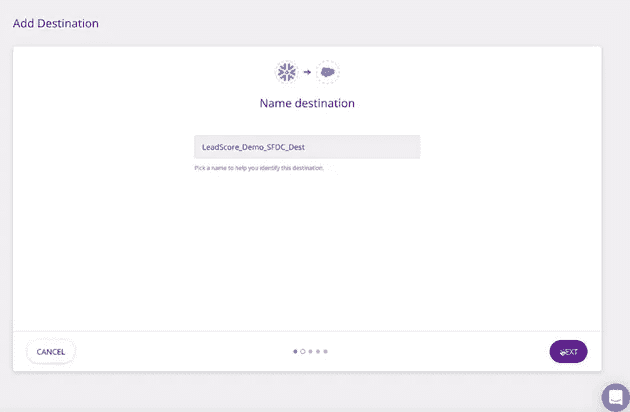

**连接雪花**

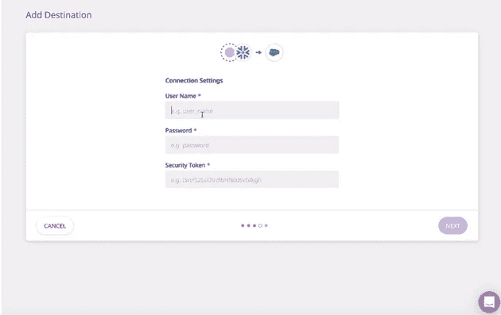

**仓库行动**

就是这样！您已成功将 Salesforce 添加为目标。您的数据将根据您定义的计划进行同步。您也可以点击**立即同步**手动触发同步。

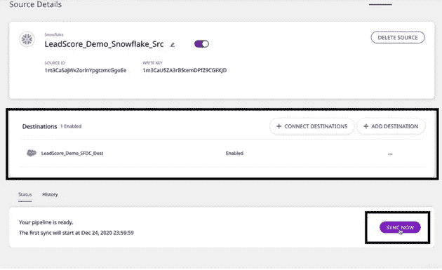

**同步**

数据同步后，您可以点击右上角的“实时活动”选项查看结果。

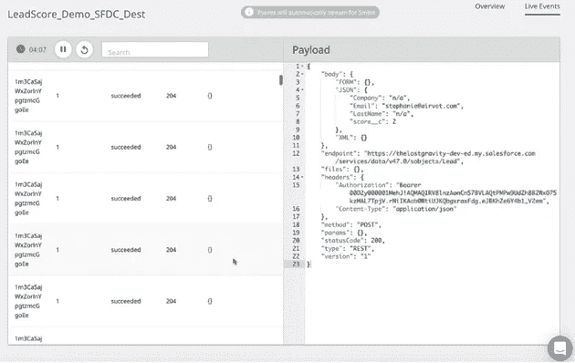

**查看结果**

详细步骤，请阅读我们的文档，[在方向舵堆栈上配置数据仓库操作](https://docs.rudderstack.com/sources/data-warehouse-as-a-source)。

# Pachyderm 使用仓库操作来自动化他们的入职电子邮件

[Pachyderm](https://www.pachyderm.com/) ，一个企业级的开源数据科学平台，为销售线索资格实施了仓库操作。创建帐户后，Pachyderm 希望客户做的第一件事就是创建一个工作空间。他们在通过 [HubSpot](https://www.hubspot.com/) 发送的一系列滴滴电子邮件中鼓励用户这样做，但他们不希望这些滴滴电子邮件发送给已经创建了工作空间的客户。这些数据已经在他们的数据仓库中，现在，通过仓库操作，他们可以自动将这些客户排除在这个滴滴邮件系列之外。

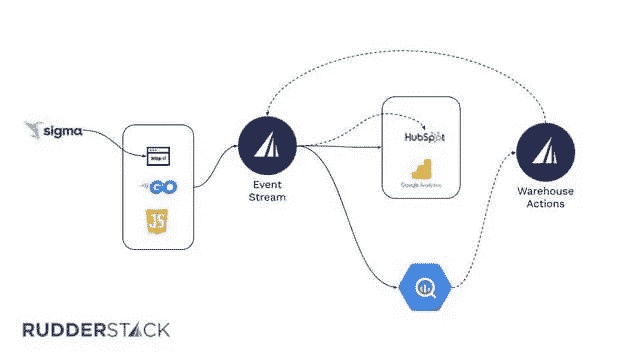

**厚皮堆栈—仓库动作**

Pachyderm 使用他们的 BI 工具[适马](https://www.sigmacomputing.com/)来创建自上次运行以来创建了工作空间的用户的数据组合。然后，他们使用仓库操作将数据组合发送到 HubSpot。HubSpot 从该系列的后续滴滴电子邮件中排除了这部分客户。

确认滴滴邮件的销售线索只是仓库行动的一个用例。还有更多的，厚皮动物公司计划大量增加仓库行动的使用。

> *“我们有一堆仓库动作的用途，而我们只是冰山一角，真的。我们未来想做的很多事情都将涉及通过仓库操作将数据从仓库中取出。”
> ——****丹贝克*** *，市场运营经理，***。**

# *免费注册并开始发送数据*

*测试我们的事件流、ELT 和反向 ETL 管道。使用我们的 HTTP 源在不到 5 分钟的时间内发送数据，或者在您的网站或应用程序中安装我们 12 个 SDK 中的一个。[入门](https://app.rudderlabs.com/signup?type=freetrial)。*

*这篇博客最初发表在
[https://rudder stack . com/blog/rudder stack-warehouse-actions-unlocks-the-data-in-your-warehouse](https://rudderstack.com/blog/rudderstack-warehouse-actions-unlocks-the-data-in-your-warehouse)*