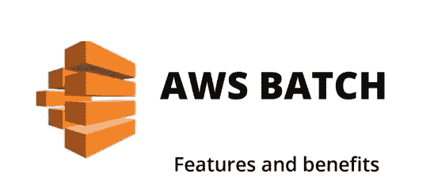
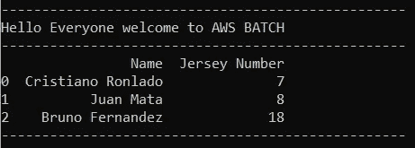
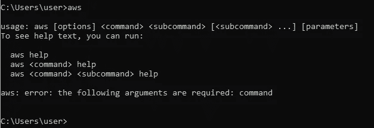
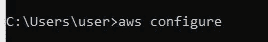
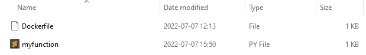
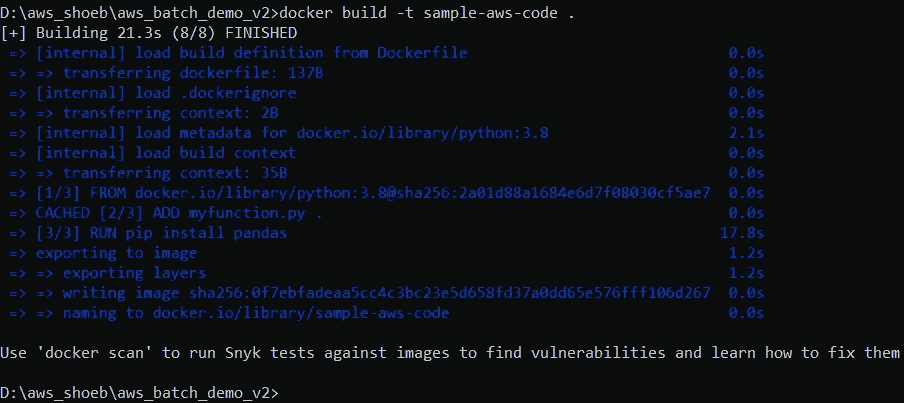
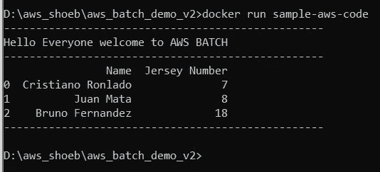

# 在 AWS 批处理上运行 Python 代码第 1 部分:创建 Python 脚本和 Docker 容器。

> 原文：<https://medium.com/codex/run-a-python-code-on-aws-batch-part-1-creation-of-python-script-and-docker-container-1b01dc89eaed?source=collection_archive---------3----------------------->

在 AWS Batch 上运行 python 代码的先决条件是您的系统上已经安装了 Python 和 Docker。不管你是否了解 Docker，我们的目标是在 AWS 批处理中运行 python 代码。

我们将从运行基本的 python 代码开始，它将打印消息。

步骤如下所示:

1.  创建一个 python 脚本。
2.  创建一个 Docker 文件。
3.  创建 Docker 容器。
4.  运行 Docker 容器。

**首先，开始编写 python 脚本。**

上面代码的输出如下所示。

下一步是创建 Docker 文件。在 docker 文件中，我们需要插入一个我在下面给出的特定命令。确保我们正在创建的文件的名称应该是**“docker file”。**我做的 python 脚本，我取的文件名是**“my function . py”。**

Docker 的命令如下所示:

如果你有外部包，就像我拿熊猫一样，同样的方法你也可以添加命令行，在上面代码的第 5 行提到了。

> 运行 pip install pandas numpy more-packages-you-can-add-with-white-separated

到目前为止，我们已经创建了一个 Docker 文件和 Python 脚本，我们的下一个目标是创建一个 Docker 容器。

在创建之前，我们需要设置我们的 AWS CLI，因为我们需要在 AWS 平台上上传 Docker 文件和 Python 脚本。

确保您已经从这些链接安装了 AWS CLI，然后单击这些链接:[https://awscli.amazonaws.com/AWSCLIV2.msi](https://awscli.amazonaws.com/AWSCLIV2.msi)

现在，我们将通过运行某个命令来配置 AWS CLI。

请访问“安全凭据”页面，确保您拥有 AWS 访问密钥 ID 和 AWS 密钥。

如果您想生成该密钥，请访问我的旧文章:[https://medium . com/codex/AWS-S3-with-python-by-shoe b-Ahmed-923 C1 cf 47110](/codex/aws-s3-with-python-by-shoeb-ahmed-923c1cf47110)

获得密钥后，让我们跳到 AWS CLI 并打开命令提示符。

1.  打开 CMD
2.  键入“aws ”,它将显示如下所示的一些消息，这意味着您的系统上安装了 AWS CLI:

3.现在在命令提示符下键入“aws configure ”:

*   输入您的访问密钥，然后按 Enter 按钮。
*   输入您的密钥，然后按 Enter 按钮。
*   之后，它会询问我们需要保留的区域和默认输出格式，因为它是空白的，然后按 Enter 键。

一旦 AWS CLI 完成。现在我们来创建一个容器。

确保 docker 文件和 python 文件位于相同的位置。

我在该位置打开 cmd 并键入:

> **docker 构建-t 样本-AWS-代码。**

请在“ **sample-aws-code** ”后加上空格和点号。

在上面的截图中，我们看到我们的图像文件已经建立。

我们将通过运行以下命令在本地系统中测试该映像文件:

> **docker 运行样本-AWS-代码**

这是示例代码的输出。

我将发布第 2 部分，其中包括 AWS 批处理设置和运行。