# 在 AWS 批处理上运行 Python 代码第 2 部分:将数据上传到 ECR 并创建计算环境。

> 原文：<https://medium.com/codex/run-a-python-code-on-aws-batch-part-2-uploading-data-to-ecr-and-creation-of-computing-c5dab12cd3eb?source=collection_archive---------0----------------------->

在上一篇文章中，我发布了如何创建和运行一个简单的 python 脚本。以及如何创建一个运行在本地系统上的简单 Docker 文件和 Docker 容器。

AWS 批处理+ Python

在本文中，我们将讨论 AWS 批处理方面。为了运行 AWS 批处理，我们需要一个图像文件(Docker 容器)和计算环境。

1.  在"**Amazon Elastic Container Registry**中创建一个存储库
2.  将 Docker 容器推入存储库。
3.  在 AWS 批处理中创建“计算环境”。

为了在 AWS Batch 上运行 Docker 容器，我们需要将它存储在 AWS 平台上，我们将使用**“亚马逊弹性容器注册表”，**来存储我们的 Docker 容器。搜索**亚马逊弹性容器注册表**，我们看到了 ECR 的仪表盘。

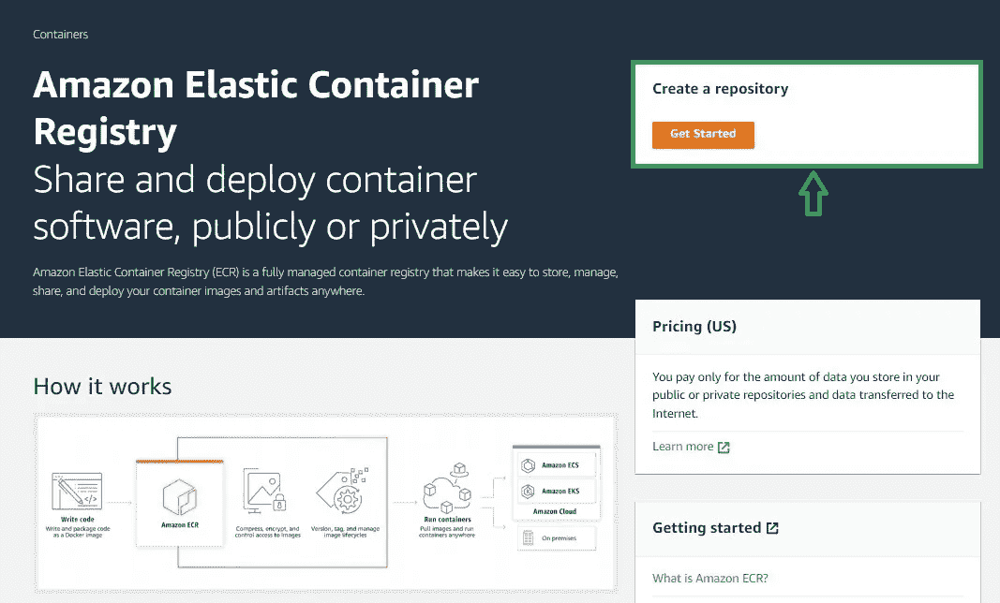

点击**“入门”**。之后，我们将访问创建存储库页面。

我将使用 public，因为我们正处于学习阶段。

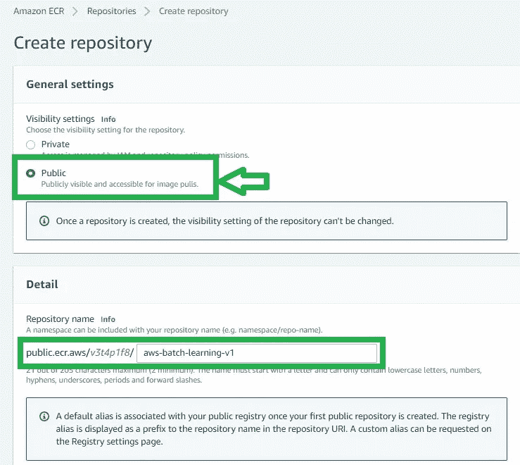

并给出存储库的名称，这是一个必填字段。

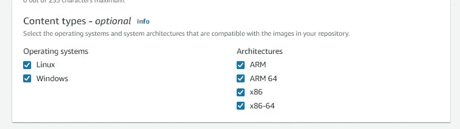

我正在选择所有的**“内容类型”**，您可以选择您的内容类型。

然后，我将单击**“创建存储库”。**之后，我们的页面将重定向到存储库列表，我们可以看到新的存储库列表。

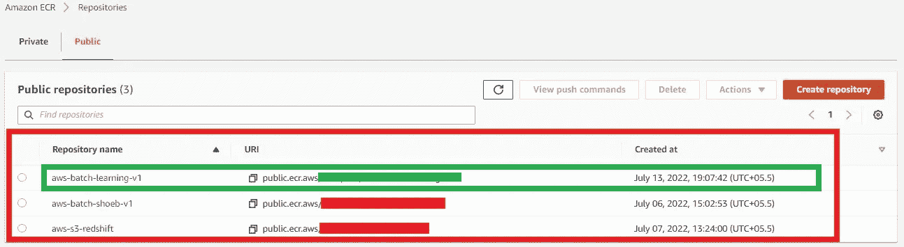

现在，我们单击我们的存储库名称，之后，我们将单击**“查看推送命令”**。

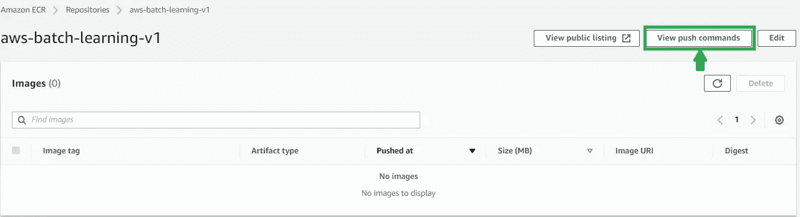

单击该按钮后，我们将看到一个推送命令列表，我们需要执行所有命令。

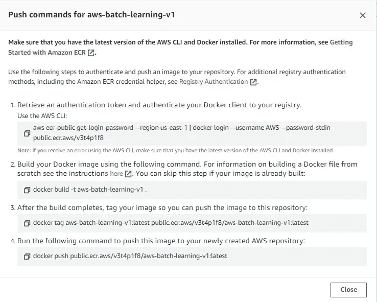

因此，我将在命令提示符下逐行执行该命令。

确保您当前的工作目录应该是您保存 python 脚本和 Docker 文件的地方。

现在我们首先要复制第一个命令。

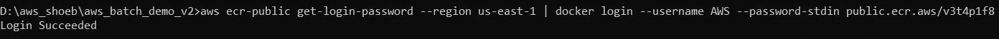

我们得到了“登录成功”。如果您没有成功登录，请再次尝试配置 AWS CLI。

现在我要去听第二个命令。

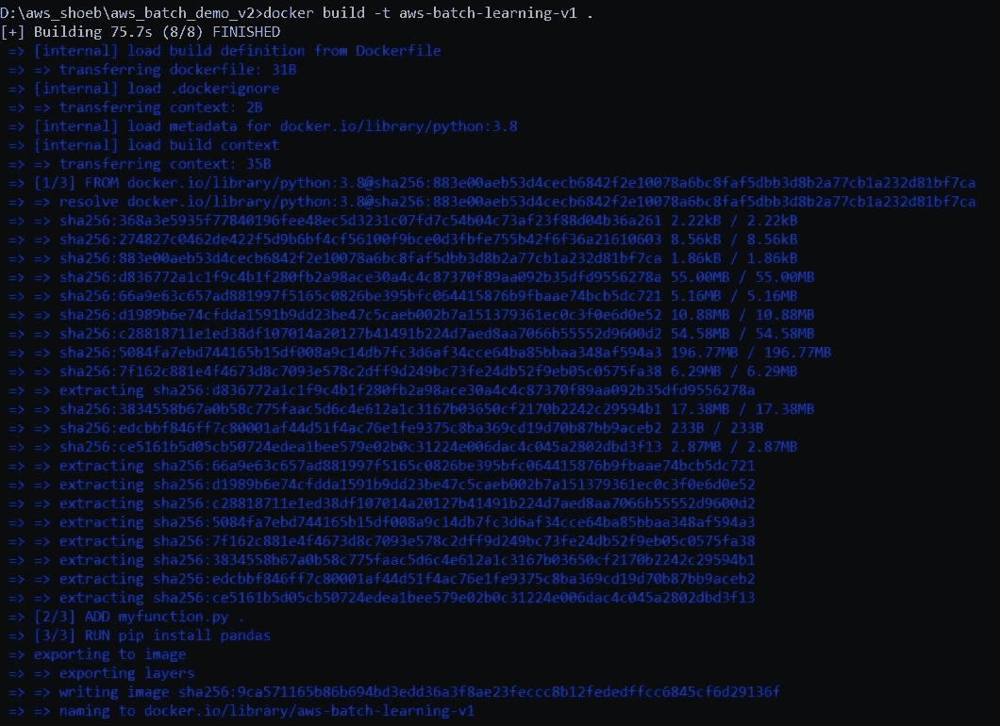

第三命令。

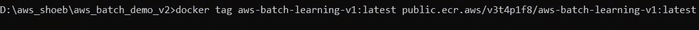

现在，最后一个命令将把您的映像推入存储库。

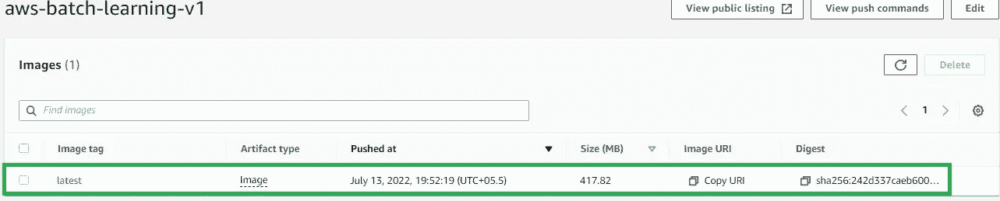

我们会在上面的截图中看到，有一张图片的名字叫‘最新’。

现在我们将进入 AWS 批处理，首先，我们将创建“计算环境”。

单击 AWS 批处理控制面板左侧的计算环境。

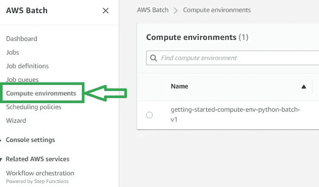

单击计算环境右侧的“创建”。

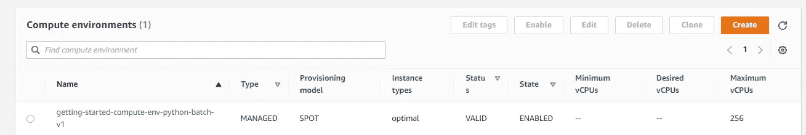

填写下面给出的详细信息:

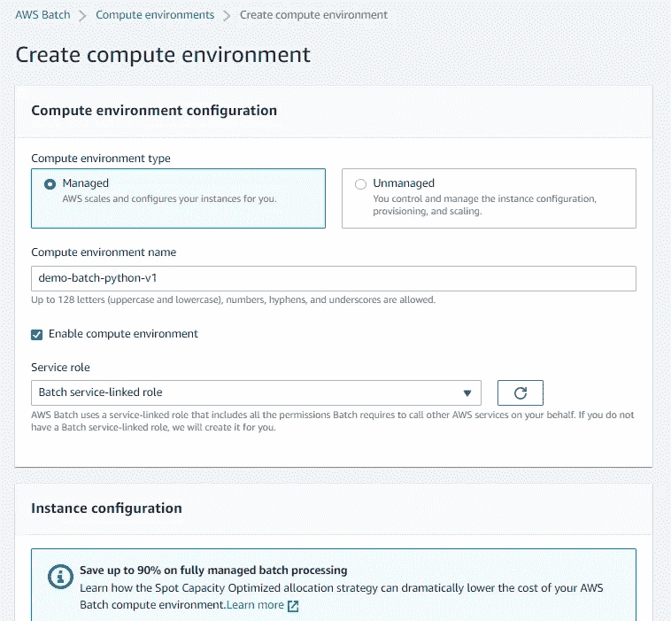

在实例配置中，我使用的是 Spot。

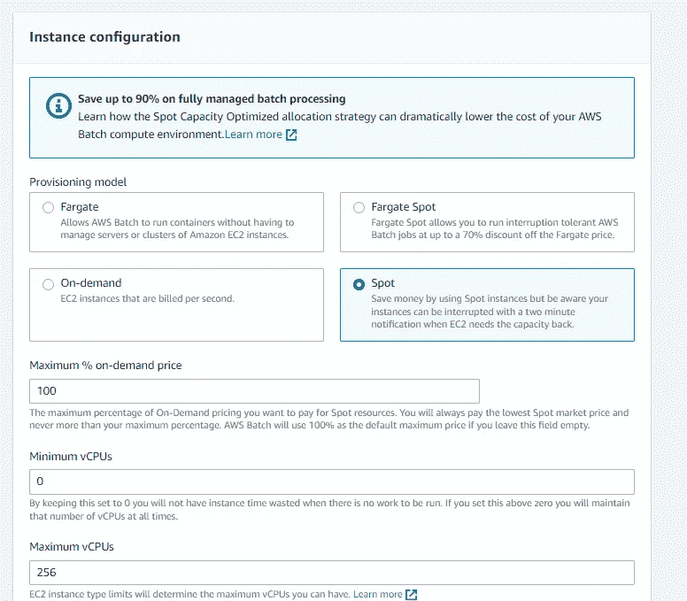

实例配置— 1

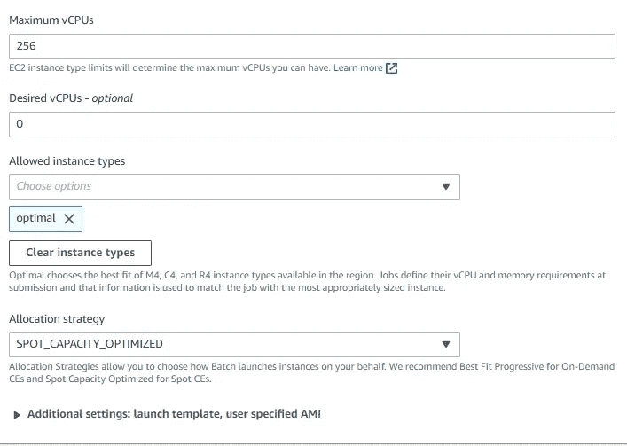

实例配置— 2

对于**联网，**我使用的是我在 AWS Redshift 中使用过的同一个 VPC Id，链接如下:[https://medium . com/codex/AWS-Redshift-connects-with-python-part-1-setup-a-Redshift-connection-with-python-b 9 F6 a 1 fa 49 f 0](/codex/aws-redshift-connects-with-python-part-1-setup-a-redshift-connection-with-python-b9f6a1fa49f0)

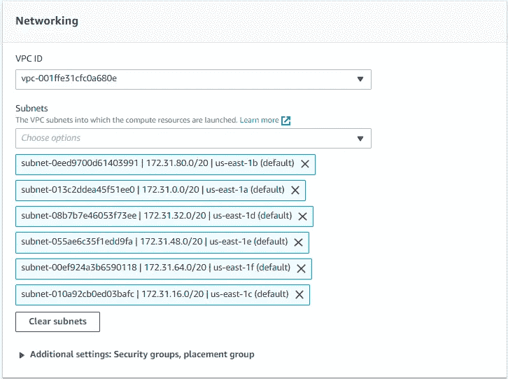

之后，点击创建计算环境。我们将看到计算环境的状态，如有效图像所示。

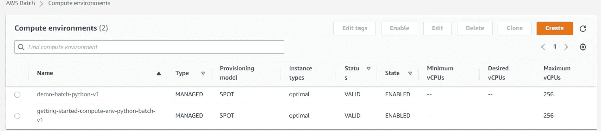

我们将在下一篇文章(第 3 部分)中看到作业队列和作业定义的创建。