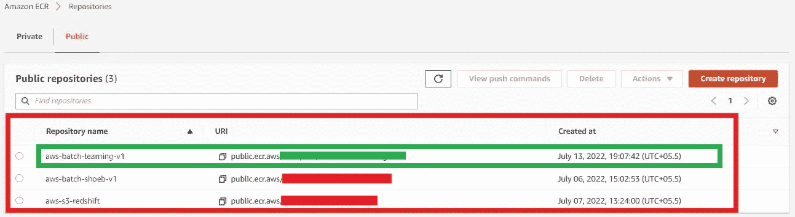

# 在 AWS 批处理上运行 Python 代码第 3 部分:创建作业队列、作业定义和运行作业。

> 原文：<https://medium.com/codex/run-a-python-code-on-aws-batch-part-3-creation-of-job-queues-job-definitions-and-run-jobs-6ee0dd49e582?source=collection_archive---------2----------------------->


标志；徽标

在前面的文章中，我们看到了如何创建容器并将容器上传到 AWS 存储库。如果您没有访问该文章，请单击下面的名称:

1.  [**在 AWS 批处理 part-1 上运行 Python 代码:创建 Python 脚本和 Docker 容器**:](/codex/run-a-python-code-on-aws-batch-part-1-creation-of-python-script-and-docker-container-1b01dc89eaed)[https://medium . com/codex/Run-a-Python-code-on-AWS-Batch-Part-1-Creation-of-Python-Script-and-Docker-Container-1 b 01 DC 89 eaed](/codex/run-a-python-code-on-aws-batch-part-1-creation-of-python-script-and-docker-container-1b01dc89eaed)
2.  [**在 AWS 批处理 Part-2 上运行 Python 代码:上传数据到 ECR 并创建计算环境**](/codex/run-a-python-code-on-aws-batch-part-2-uploading-data-to-ecr-and-creation-of-computing-c5dab12cd3eb) **。:**[https://medium . com/codex/run-a-python-code-on-AWS-batch-part-2-uploading-data-to-ECR-and-creation-of-computing-C5 dab 12 CD 3 EB](/codex/run-a-python-code-on-aws-batch-part-2-uploading-data-to-ecr-and-creation-of-computing-c5dab12cd3eb)

在本节课中，我们将运行 python 代码:

1.  创建作业队列
2.  创建作业定义
3.  创造就业机会
4.  运行作业

我们开始吧

1.  创建作业队列

首先，单击 AWS 仪表板上的作业队列，然后单击“创建”。


作业队列 AWS 批处理仪表板

我将给出作业队列名称“test-queue-batch-v1 ”,您可以给出自己感兴趣的名称。我将给出的优先级是 1000，因为对于计算环境来说，优先级的整数值较高的作业队列具有优先权。


创建作业队列— 1

我将选择计算环境，这是容器运行该计算环境所必需的。在我的例子中，我将计算环境命名为“demo-batch-python-v1”。请单击单选按钮，确保单选按钮为蓝色。


创建作业队列— 2

单击“create ”,我们将在状态中看到一条“VALID”消息。绿色横幅将出现在页面的顶部。


作业队列仪表板

2.创建作业定义

如果我们看到 AWS Batch Dashboard 导航栏的左侧，我们会看到作业定义，单击它，然后单击“Create”按钮，就像我们在作业队列中所做的那样。


作业定义仪表板

点击“创建”按钮后，将进入表格，我们需要在表格中填写作业定义的某些参数。我取的名字是“test-job-def-v1 ”,我取的代码执行超时大约为 1 小时，如果我们的代码执行时间超过 1 小时，它将终止代码的执行。


工作定义表— 1

现在，为了平台兼容性，我们必须选择 EC2，如果您熟悉的话，也可以选择 Fargate。


之后，我们会给你你的码头集装箱的位置，你保存它。你可以在下面的图片中看到，我将我的容器存储在 sider Amazon ECR 中，并复制了那个公共 ECR，它是图片中的绿色标记



并将链接粘贴到图像字段中。


设置所有作业配置后，然后点击创建按钮。

现在，我们的下一个任务是通过创建一个作业来运行该映像文件，即 AWS Batch 上的 Docker 容器。

现在点击导航栏左侧的 **Jobs** 。现在点击**提交新工作**


点击提交新工作后，我们将被重定向到表单页面，我们必须一步一步地填写一些详细信息。
在**名称**字段中，我们可以添加自己的作业名称，我们已经创建了作业定义和作业队列。


如果我们选择**作业定义**，所有字段将由 **AWS** 自动填充。

同样对于**作业配置**也是自动填充的，我们只需要验证即可。


之后，点击提交。然后转到**仪表板**，我们可以看到我们的任务已提交。


我们可以在上面的图像中看到不同的列，它们显示了我们的 AWS 批处理作业的状态，或者我们可以说批处理作业的不同阶段。

```
Stages ranges from Submitted -> Runnable -> Starting ->Running -> Succeeded/Failed.
```

所有阶段都是自动完成的，我们可以在 Succeeded/ Failed 列中观察输出。

在我的场景中，我的作业被正确执行，我可以通过单击数字**“2”看到结果，**我以前运行过相同的作业，这就是为什么它显示 2，否则它将显示 1，如果您的作业失败，它将在失败列中显示 1。


在我的场景中的上图中，我将单击 2，它将被重定向到成功的作业列表。

我将点击**“我的工作-v1”。因为我们现在已经运行了该作业。**


并且它将移动到**工作信息**页面。我们看到**日志流名称，下面的**提供了链接，请点击它包含的输出。该链接将到达 **AWS Cloudwatch** 。


什么是 AWS Cloudwatch？用我的话来说，我可以说它用于查看任何服务的输出，如 AWS Batch、AWS Lambda 等。

而你只要点击[**AWS cloud watch**](https://aws.amazon.com/cloudwatch/)**就可以获得更多细节。**


AWS 批处理的输出

我们可以看到上面的图像，即作业的输出。

我们已经成功运行了 AWS 批处理。