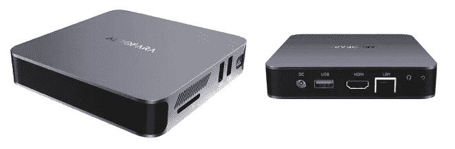

# 在迷你电脑上运行机器学习

> 原文：<https://medium.com/codex/run-machine-learning-on-a-mini-pc-2fefd1988fe3?source=collection_archive---------2----------------------->

去年，由于新冠肺炎疫情，我们都在家工作。我用我的工作笔记本电脑做公司项目，用个人笔记本电脑做机器学习爱好。几个月后，我意识到远程工作的寿命可能会变得更长。迫切需要的是一个大的电脑显示器。所以我花了 170 美元买了一台 27 英寸的显示器。不错！但是我真的不希望将来有笨重的个人电脑。为什么我不试试迷你电脑或者…