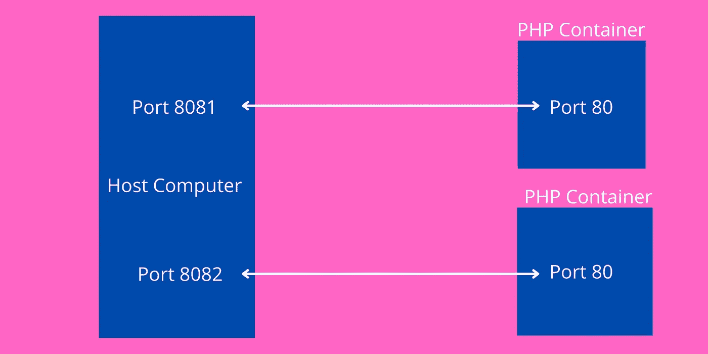

# 使用 Docker 运行多个 PHP 实例

> 原文：<https://medium.com/codex/run-multiple-instance-of-php-using-docker-5be5aca921b1?source=collection_archive---------1----------------------->

## 映射主机端口和容器端口。并访问主机网络外部的 PHP 容器。

Docker 主机端口、容器端口映射

在本教程中，我们将看到如何在同一台机器上使用 Docker 运行多个 PHP 容器。以及如何在主机外部访问正在运行的 PHP Docker 容器？。Docker 在一个隔离的环境中运行容器。所以我们…