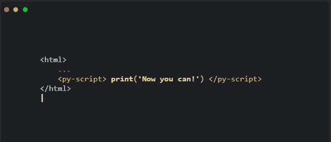
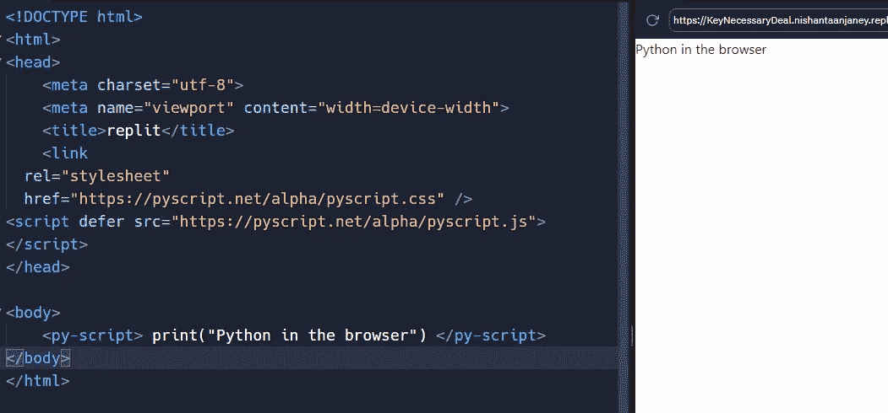
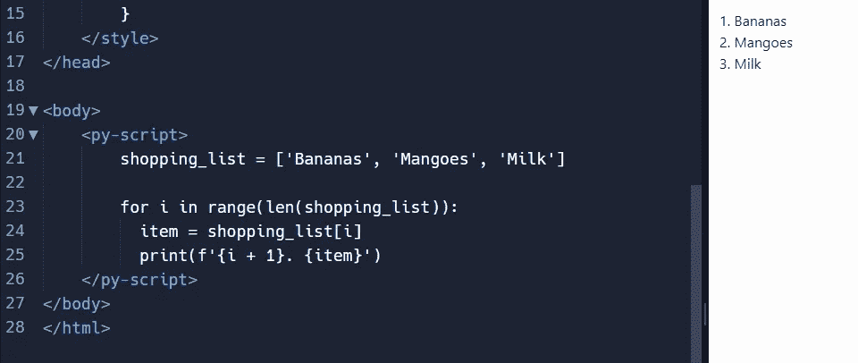

# 在 Web 浏览器中运行 Python 脚本

> 原文：<https://medium.com/codex/run-python-scripts-in-the-web-browser-afb09c4b212f?source=collection_archive---------1----------------------->

## JavaScript 的末日到了吗？

> ***爆料 PYTHON 程序员！*** 你现在可以在网络浏览器中运行 Python 脚本了。



[来源](https://pyscript.net)

Python 是一种快速发展的脚本语言，由 Guido Van Rossum 在 20 世纪 90 年代早期开发。可以说，英语是世界上最受欢迎的语言。我不是 Python 的粉丝，但是让我们来看看网站技术的最新发展。

# #0 —开始使用

打开你最喜欢的 IDE 或文本编辑器，创建你常用的 HTML 模板。要在浏览器中运行 python，需要在 HTML 的`<head />`部分添加以下代码行。

```
<link
  rel="stylesheet"
  href="https://pyscript.net/alpha/pyscript.css" />
<script defer src="https://pyscript.net/alpha/pyscript.js"></script>
```

这将在页面加载之前下载所需的文件，以便在浏览器中运行 Python 脚本。

# #1 —撰写您的脚本

正如您可能已经从图像预览中看到的，让我们将线条添加到正文中，看看会发生什么:

```
<py-script> print("Python in the browser") </py-script>
```



以下代码的输出

您可以做 python 通常能做的所有事情。



在浏览器中运行 python 中的循环。

原谅我，我的蟒蛇有点生锈了。我们会使用一个叫做`enumerate()`的函数，对吗？可能…？我不知道…😖🙃

# #2 —导入模块

我们可以将 Python 模块导入到我们的脚本中，并在需要时随时随地使用它们。

```
<body>
    <b><p>Today is <i><label id='today'></label></i></p></b>
    <py-script>
      import datetime as dt
      pyscript.write('today', dt.date.today().strftime('%A, %B %d, %Y'))
    </py-script>
</body>
```

> **今天是*2022 年 5 月 27 日星期五***

在[FreeCodeCamp.org](https://www.freecodecamp.org/news/pyscript-python-front-end-framework/)上阅读更多相关内容

# 这是 JavaScript 的终结吗？

一个简单的答案——不。

## JavaScript 社区的爱

开发人员像热爱 Python 一样热爱 JavaScript，我们用 JavaScript 编写网站已经超过 20 年了。这不会在短期内改变。

## **py-script 非常不稳定**

目前，使用 py-script 是非常不稳定的。它仍然是合理的，因为它是全新的。除非 py-script 有一些革命性的发展，否则无法取代 JavaScript。即便如此，完全接管至少也需要 20 年。

## Python 非常慢

…嗯，这里没什么好解释的——每个人都知道 Python 很慢。

## 以打字打的文件

TypeScript 是**网站开发领域真正的革命性理念**。引入静态类型使数百万开发人员免于被解雇😜提高生产率，并在运行前指出错误。

# 结论

与 py-script 有关的一个问题是 ***缩进*** 。我不确定面向缩进的语言在 HTML 文件中是如何工作的。如果项目变得复杂，我会看到关于代码可读性和许多`IndentationError`的潜在问题。JavaScript 和 TypeScript 是网站开发的最佳语言，基于这些语言构建的框架非常稳定且高效。

也许这是下一个大事件的开始，或者这只是一个会被忽视的幻想。例如，Kotlin 用 JavaScript 和 React 引入了前端网站设计，但市场上并不需要它——可能永远也不会需要。Kotlin 用于 Android 开发(也包括 Ktor 后端服务器)，Python 用于数据科学和 ML，JavaScript 用于网站开发。

非常感谢您阅读我的文章。在整整一个月的时间里，我在 Medium 上拥有了 100 名粉丝，我喜欢这种支持。✌️

```
**Want to connect?**My [GitHub](https://github.com) Profile
My [Portfolio](https://cybercoder-naj.github.io) Website
```