# 在同一个端口上运行 React 和 SpringBoot，并将它们打包成一个工件！！

> 原文：<https://medium.com/codex/run-react-frontend-and-springboot-backend-on-the-same-port-and-package-them-as-a-single-artifact-a790c9e10ac1?source=collection_archive---------0----------------------->

## 它需要 frontend-maven-plugin、maven-resources-plugin 和 thymleaf。


由 [Artem Sapegin](https://unsplash.com/@sapegin?utm_source=medium&utm_medium=referral) 在 [Unsplash](https://unsplash.com?utm_source=medium&utm_medium=referral) 上拍摄

你好。我是一名全栈开发人员，在印度西孟加拉邦工作了 3 年多。*今天，我将带您完成一个设置技巧，为在同一个端口上运行 react 和 spring boot 应用程序准备项目结构，并将它们打包成一个工件。*您将会看到，在处理这两种改变游戏规则的技术时，开发变得多么容易。

> [**这里是 GitHub 链接到我要在这里解释的演示的链接。**](https://github.com/arpan-banerjee7/demo-spring-react-maven-plugin)

# 这种设置的优点

1.结合了 [create-react-app](https://reactjs.org/docs/create-a-new-react-app.html) 和 Spring Boot 的易开发性。

2.您可以在开发前端时使用 [create-react-app](https://reactjs.org/docs/create-a-new-react-app.html) 的热重新加载功能，在做出更改后保存页面，它会立即反映在浏览器上。

3.使用 Spring Boot，您可以轻松管理开发版本(使用快照)和生产版本。您可以在 Spring Boot 使用 [Spring Actuator](https://docs.spring.io/spring-boot/docs/current/reference/html/production-ready-features.html) 或 Spring Admin 在运行时检测构建版本和时间，这可以提供构建元数据功能以及更多功能。

4.将前端和后端打包到一个 war/jar 文件中，并优化生产版本。

我在最近的一个项目中学到了这一点。它有几个带有 react 前端的 spring boot 微服务，作为它们自己的单个工件进行打包和部署。

因此，这里有一个快速指南，告诉你如何在同一个端口上运行 react 前端和 spring boot 后端，以及如何将它们打包成一个 jar 文件。

**先**，**用[https://start . spring . io](https://start.spring.io)创建一个 spring boot 项目**。添加 Web 依赖项。将`groupid`和`artifactid`设置为您想要的任何值。生成项目并将其解压缩到您的项目目录中。

或者，如果你正在使用 Spring Tools Suite，你可以简单地点击`File->new->Spring Starter Project`来创建一个 spring boot 项目。

你最初的 pom.xml 应该是这样的。

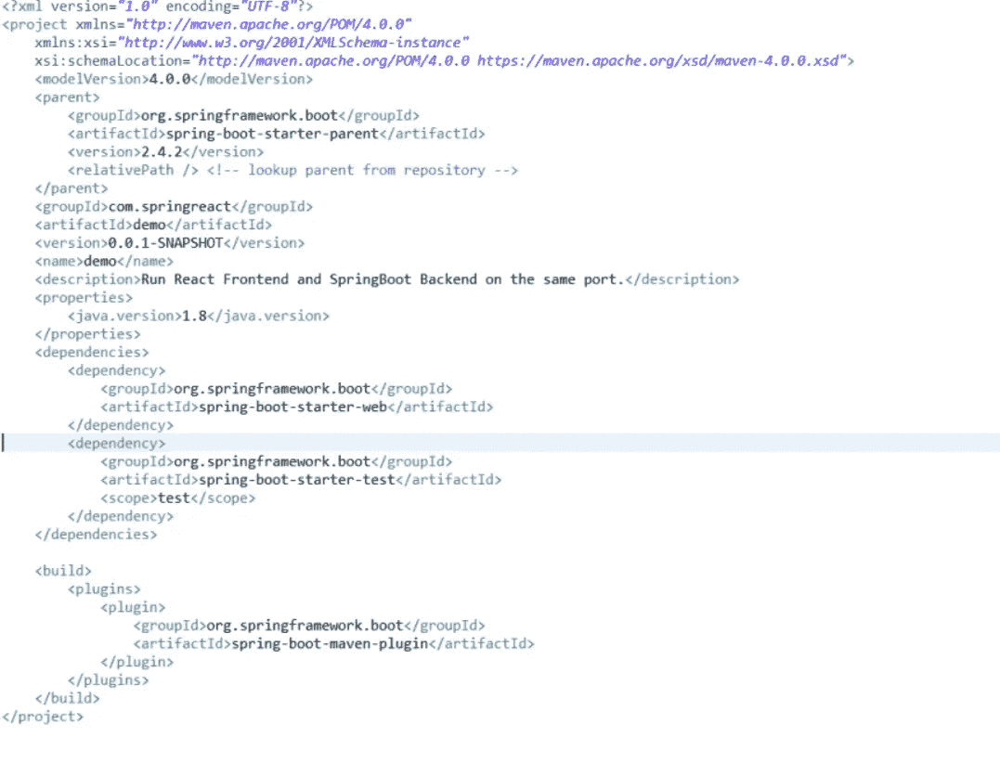

pom.xml

项目结构应该是这样的。

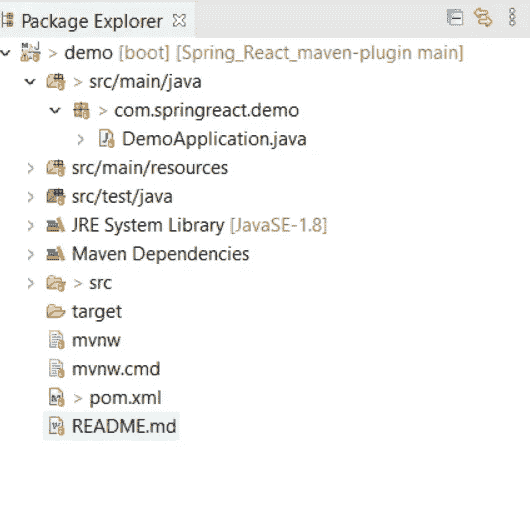

你现在可以运行应用程序，看看它是否运行没有任何错误。
虽然点击`http://localhost:8080/`你什么也看不到。

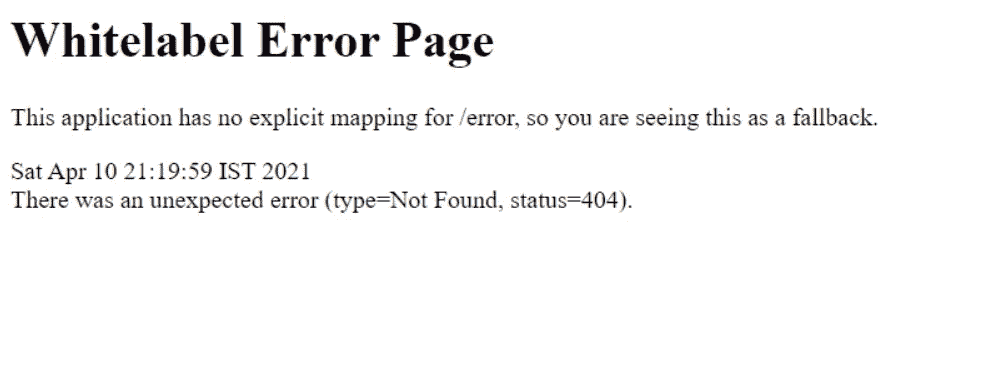

[http://localhost:8080/](http://localhost:8080/)

现在，转到`src/main/resources`，创建一个`static`文件夹。在里面创建一个包含一些文本的`test.html`文件。

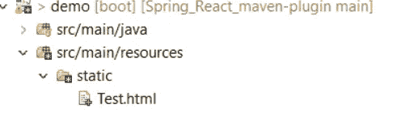

现在，如果你重启应用程序并点击`http://localhost:8080/test.html`，你会看到它在`port 8080`中旋转你的 html 页面。您可以在浏览器中看到文件的内容。


[http://localhost:8080/test . html](http://localhost:8080/test.html)

# 在端口 8080 上提供来自 Spring Boot 的 React 应用程序，并将它们打包在一起

> 我们将利用 Spring Boot 的上述功能来服务 react 项目的单个页面。我们将从“目标”目录中的“静态”文件夹提供一个 html 页面，而不是在源目录中。

现在让我们使用 [create-react-app](https://reactjs.org/docs/create-a-new-react-app.html) 创建一个 react 应用程序。在终端中导航到您的文件夹，直到`src/main`。

`D:\Codes_projects\srpingboot_react_maven_plugin\Spring_React_maven-plugin\src\main` 并运行`npx create-react-app frontend`。

这应该会在`src/main`中创建一个 react 应用程序。现在，如果你看看你的文件夹结构，它应该是这样的。

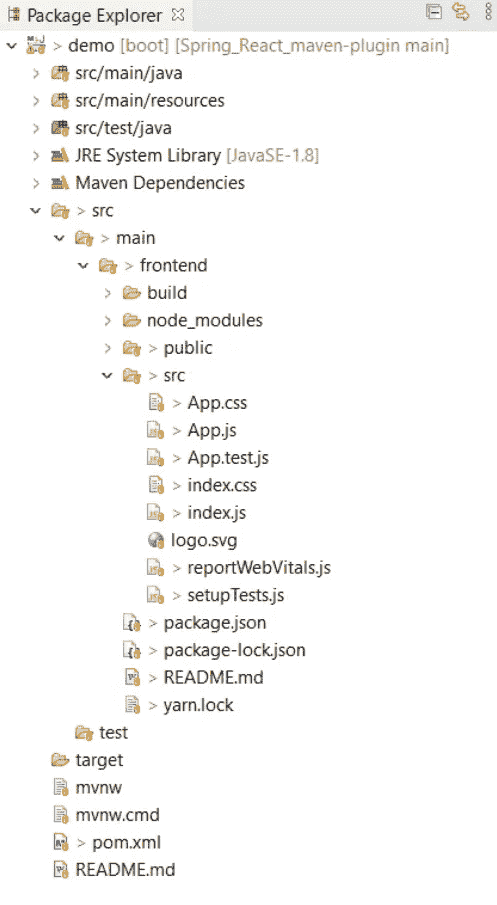

您可以运行 react 应用程序，方法是先执行`cd frontend`，然后执行`yarn start` 或`npm start`。它应该在`http://localhost:3000`上启动 react 应用程序。

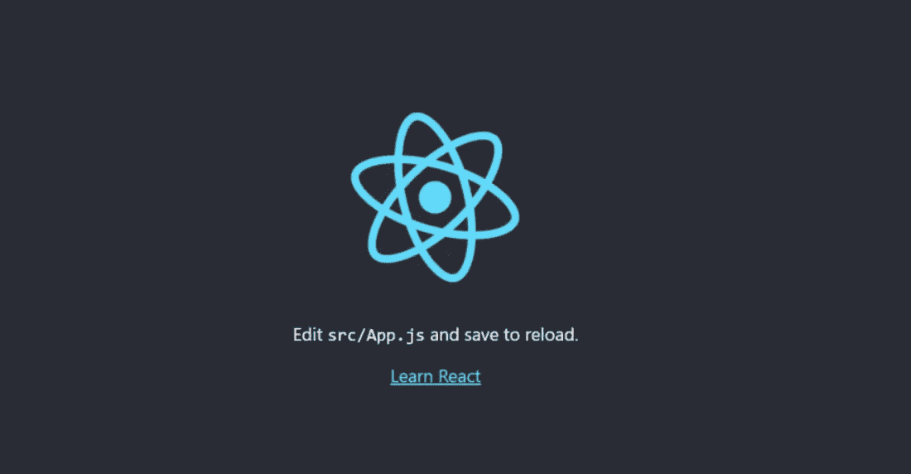

`[http://localhost:3000](http://localhost:3000)`

您可以通过运行`yarn build`来创建前端的生产版本。运行 build 命令后，您的文件夹结构将如下所示。

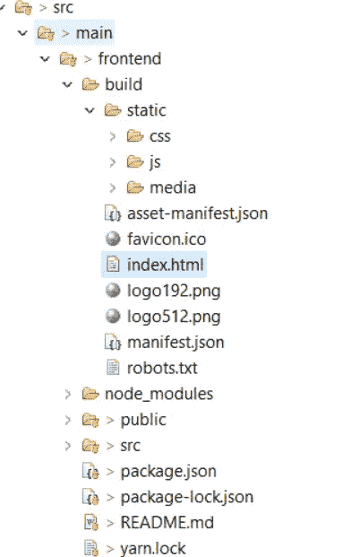

> 您需要复制这个生产版本，并将其放在项目的“目标/类”目录中，以便在您启动项目时，Spring Boot 能够提供这个“index.html”

所以，有两个步骤-

**1。创建前端
2 的生产版本。将生产版本复制到${target/classes/}**

当然，您不会手动这样做。我们将为此使用两个“maven 插件”。

**1。**[**fronted-maven-plugin**](https://github.com/eirslett/frontend-maven-plugin)**为步骤
2。**[**maven-resources-plugin**](https://maven.apache.org/plugins/maven-resources-plugin/)**为步骤 2。**

将以下内容添加到`plugins`部分下的`pom.xml`中，并更新`properties`部分，如图所示。

pom.xml 的属性部分

pom.xml 的插件部分

现在如果你从`D:\Codes_projects\springboot_react_maven_plugin\Spring_React_maven-plugin` 运行`mvn clean install`，maven 会在本地安装`npm`、`yarn`和`node`，并在前端目录运行`npm build`。

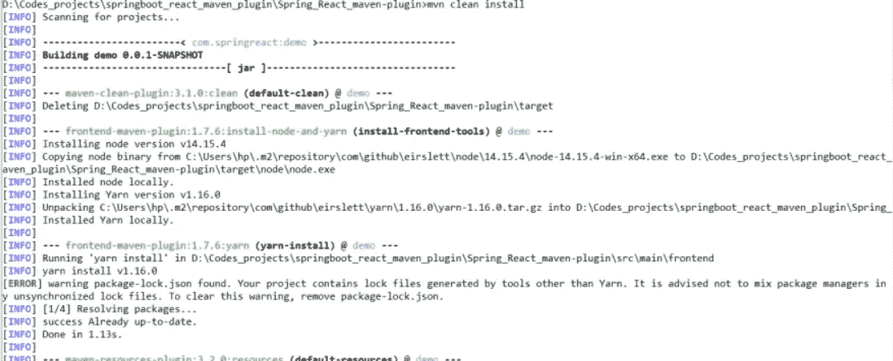

安慰

文件夹结构看起来像这样-

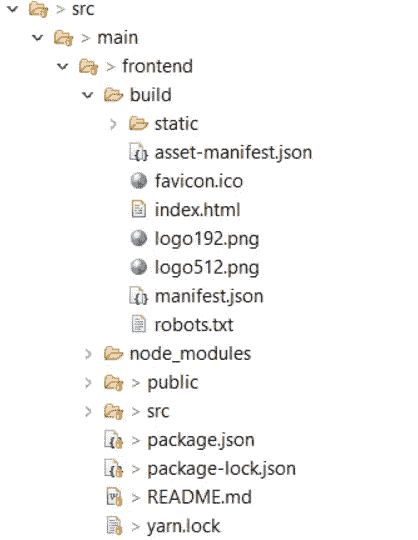

现在，给你的`pom.xml`添加第二个插件。

pom.xml 的插件部分

在依赖项部分添加以下依赖项。

pom.xml 的依赖关系部分

修改`spring-boot-maven-plugin`以包含一个配置部分。

pom.xml 的插件部分

这将确保前端构建文件在由`yarn build`生成后被复制。
现在，再次运行`mvn clean install`并从你的文件管理器检查`target/classes/static`目录。

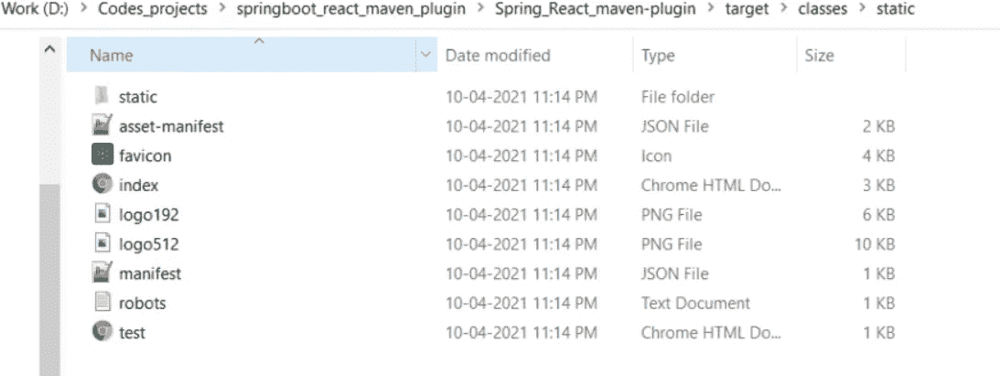

文件管理器

它将前端生产构建文件放在那里。

> 现在你已经准备好了！运行项目并进入`http://localhost:8080/index.html`瞧！！您已经通过 Spring Boot 运行了 React 应用程序。

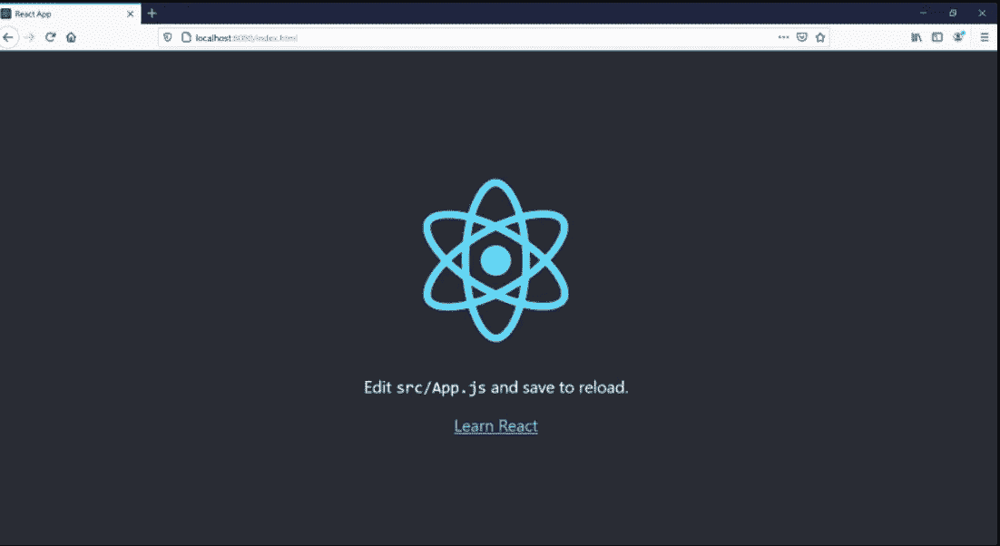

`[*http://localhost:8080/index.html*](http://localhost:8080/index.html)`

## **最终的 Pom.xml**

pom.xml

# 更进一步

您可以添加`rest controllers`并公开一个端点作为应用程序的起点。像一个`Index Controller`一样，每当应用程序加载时，spring boot 将从“目标目录”启动`index.html`文件，该文件包含前端项目优化构建的静态内容。这样你可以简单地访问`http://localhost:8080`，而不用硬编码`index.html`文件名。

就这么办吧。
添加一个控制器，在下面的文件夹结构中。

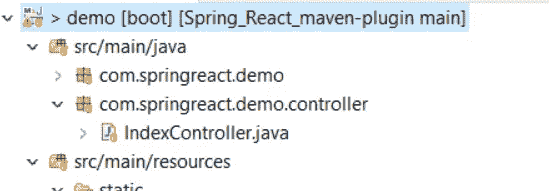

IndexController.java

> 运行您的应用程序并点击`http://localhost:8080/`。你看到什么了吗？不对，对！

**您必须添加另一个依赖项才能工作。**

pom.xml 的依赖关系部分

现在，默认情况下，Thymleaf 在`src/main/resources/templates`中寻找我们的模板。我们可以把我们的模板放在那里，并在子目录中组织它们，没有问题。

所以，让我们试试。在`src/main/resources/templates`中添加一个名为`index.html`的 html 文件，并在其中放入一些内容。

运行应用程序并访问`http://localhost:8080`，您将看到来自`src/main/resources/templates`的`index.hyml`在`port 8080`中被服务。

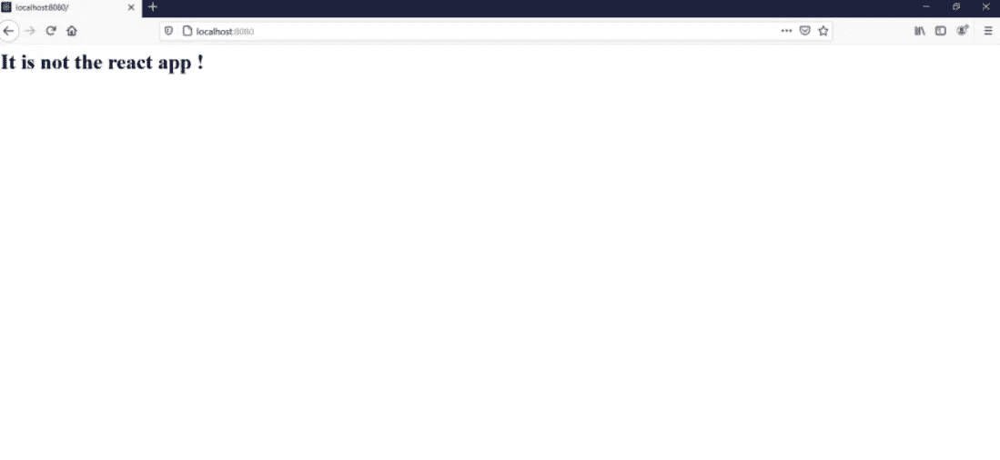

`[http://localhost:8080](http://localhost:8080)`

现在，要改变这种默认行为并让 Thymleaf 从另一个位置提供静态内容，您需要向`application.properties`文件添加一个条目。

```
spring.thymeleaf.prefix=file:///D:///Codes_projects//springboot_react_maven_plugin//Spring_React_maven-plugin//target//classes//static/
```

这里，我硬编码了路径。

最后，现在如果你“更新”你的项目并启动它。你可以看到 react 应用程序直接在`port 8080`上提供服务。

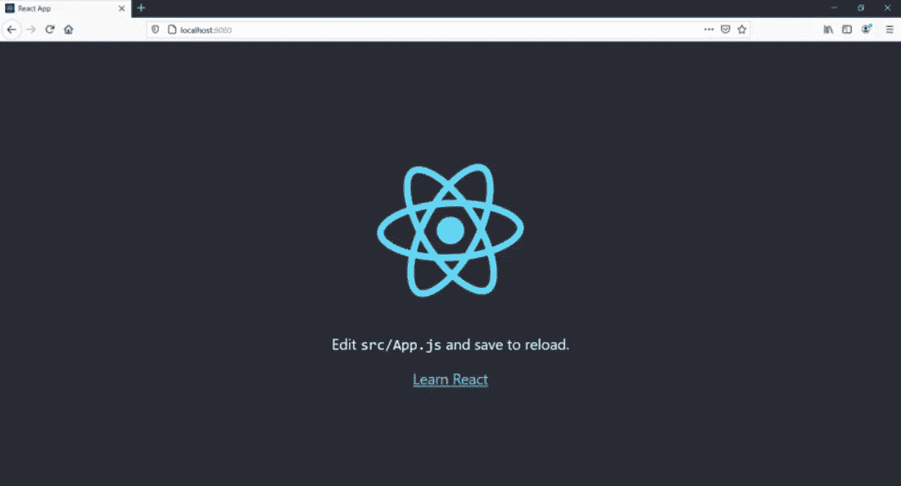

`[http://localhost:8080](http://localhost:8080)`

# 结论

您已经学习了如何使用 spring boot 运行 react 应用程序。您可以在同一个端口上运行前端和后端。我已经解释了你需要做什么来完成设置。现在，您可以创建一个有意义的应用程序，并看看使用这种设置进行开发是多么容易和快捷。您现在可以通过运行`cd frontedn`使用 React-scripts 运行前端应用程序；使用 [create-react-app](https://reactjs.org/docs/create-a-new-react-app.html) 的热重载特性进行开发，并提供有意义的错误消息，同时能够将应用程序作为单个工件部署到测试和生产环境中。

感谢阅读！

如果你觉得这有帮助，请留下评论。欢迎任何反馈或建议。