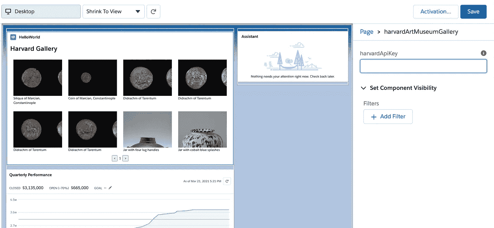

# 使用 async/await 和 Promise.all 运行并发请求

> 原文：<https://medium.com/codex/running-concurrent-requests-with-async-await-and-promise-all-daaca1b5da4d?source=collection_archive---------4----------------------->

# 介绍

在这篇文章中，我想谈谈 JavaScript 中的 async、await 和 Promise.all。首先，我将讨论并发性与并行性，以及为什么我们将在本文中关注并行性。然后，我将讨论如何使用 async 和 await 以串行方式实现并行算法，以及如何通过使用 Promise.all 使其并行工作。最后，我将使用 Salesforce 的 Lightning Web 组件创建一个示例项目，其中我将使用哈佛的 Art Gallery API 构建一个艺术画廊。

# 并发性与并行性

我想简单介绍一下并发性和并行性之间的区别。您可以将并发性与单线程 CPU 处理多个任务的方式联系起来。单线程 CPU 通过在进程之间快速切换来模拟并行性，就好像多件事情同时发生一样。并行性是指一个 CPU 拥有多个内核，实际上可以同时运行两个任务。另一个很好的例子是:

> *并发是两列客户从一个收银台下单(各列轮流下单)；并行是两列顾客从两个收银员处订购(每列有自己的收银员)。[1]*

了解这种差异有助于我们从算法的角度考虑我们有哪些选择。我们的目标是并行处理这些 HTTP 请求。由于 JavaScript 实现和浏览器可变性的一些限制，我们实际上无法确定我们的算法是并发运行还是并行运行。幸运的是，我根本不需要改变我们的算法。底层的 JavaScript 事件循环将使代码看起来像是并行运行的，这对于本文来说已经足够好了！

# 串行异步/等待

为了理解这个*并行*算法，我将首先使用 async 和 await 来构建一个*串行*算法。如果您在 IDE 中编写这段代码，您可能会收到一个通知，说在循环中使用 await 是一个错过的优化机会 *—* ，而您的 IDE 将是正确的。

```
(async () => {
	const urls = [
		"https://example.com/posts/1/",
		"https://example.com/posts/1/tags/",
	];

	const data = [];
  for (url of urls) {
    await fetch(url)
      .then((response) => response.json())
      .then((jsonResponse) => data.push(jsonResponse));
  } console.log(data);
})();
```

您可能实现这样的算法的一个原因是，如果您需要从两个不同的 URL 获取数据，然后将这些数据混合在一起以创建您的最终对象。在上面的代码中，您可以想象我们正在收集一些关于帖子的数据，然后获取关于帖子标签的数据，最后将这些数据合并到您以后实际使用的对象中。

虽然这段代码可以工作，但是您可能会注意到我们在每次读取时都使用了`await`。您会看到类似这样的内容:

*   开始去拿一号杆
*   等待提取第一步完成
*   获得帖子一回复
*   开始获取后一个标签
*   等待张贴一个标签完成
*   获得张贴一个标签响应

问题是，在开始下一个请求之前，我们一直在等待每个网络请求完成。没有必要这样做:计算机完全有能力同时执行多个网络请求。

那么如何才能让这个算法更好呢？

# 异步/并行等待

让这个算法更快的最简单的方法是删除`fetch`命令前的`await`关键字。这将告诉 JavaScript 开始并行执行所有请求。但是为了暂停执行并等待所有的承诺返回，我们需要等待一些东西。我们将使用`Promise.all`来做到这一点。

当我们使用`await Promise.all`时，JavaScript 将等待传递给`Promise.all`的整个承诺数组进行解析。只有这样，它才会同时返回所有结果。重写看起来像这样:

```
(async () => {
    const urls = [
        "https://example.com/posts/1/",
        "https://example.com/posts/1/tags/",
    ];

    const promises = urls.map((url) =>
        fetch(url).then((response) => response.json())
    ); const data = await Promise.all(promises); console.log(data);
})();
```

这段代码将每个 URL 映射到一个`promise`，然后映射到`await`，以完成所有的承诺。现在，当我们传递代码的`await Promise.all`部分时，我们可以确定两个获取请求都已解决，并且响应在数据数组中的正确位置。因此`data[0]`将是我们的文章数据，而`data[1]`将是我们的标签数据。

# 一个例子

现在我们已经有了实现预取图像库的所有必要的构建块，让我们来构建它。

下面是我为本文构建的应用程序的截图，这里是关于哈佛艺术博物馆 API 文档的链接。如果你想继续下去，你需要申请你自己的 API 密匙。这个过程对我来说似乎很自动，因为你只需填写一个谷歌表格，然后立即在你的电子邮件中收到你的 API 密匙。


它看起来不怎么样，但是当你浏览图库时，它会自动预取下一页的数据。这样，查看图库的用户就不会看到实际数据的任何加载时间。图像只有在页面上显示时才会被加载。虽然这些是事后加载的，但是页面的实际数据是即时加载的，因为它缓存在组件中。最后，作为对自己的一个挑战，我在这个项目中使用了 Salesforce 的 Lightning Web 组件 *—* 对我来说是一项全新的技术。让我们开始构建组件。

以下是我在学习 Lightning Web 组件时使用的一些资源。如果您想继续，那么您至少需要设置您的本地开发环境并创建一个“hello world”Lightning Web 组件。

[建立本地开发环境](https://trailhead.salesforce.com/content/learn/projects/quick-start-lightning-web-components/set-up-salesforce-dx) [3]

[创建一个 Hello World Lightning Web 组件](https://trailhead.salesforce.com/content/learn/projects/quick-start-lightning-web-components/create-a-hello-world-lightning-web-component) [4]

[LWC 样品画廊](https://trailhead.salesforce.com/sample-gallery)【5】

[LWC 组件参考](https://developer.salesforce.com/docs/component-library/overview/components)【6】

好了，现在你的环境设置好了，你已经创建了你的第一个 LWC，让我们开始吧。顺便说一下，本文的所有代码都可以在[my GitHub repo](https://github.com/bloveless/AsyncAwaitPromiseAllLWC)【7】中找到。

一个小题外话:如果您来自 React 背景，那么 Lightning Web 组件比您可能习惯的组件要稍微受限一些。例如，在以下示例中，您不能在组件属性(即图像 src)中使用 JavaScript 表达式:

```
<template for:each={records} for:item="record">
    
</template>
```

原因是，当您将所有代码都放在 JavaScript 文件中而不是 HTML 模板文件中时，您的代码会变得更容易测试。所以，让我们把这记在“更适合测试”的帐上，继续我们的生活。

为了创建这个图库，我们需要构建两个组件。第一个组件用于显示每个图库图像，第二个组件用于预取和分页。

第一个组件是两个组件中较简单的一个。在 VSCode 中，执行命令`SFDX: Create Lightning Web Component`并将组件命名为`harvardArtMuseumGalleryItem`。这将为我们创建三个文件:一个 HTML、JavaScript 和 XML 文件。该组件不需要对 XML 文件进行任何更改，因为项目本身在任何 Salesforce 管理页面中都不可见。

接下来，将 HTML 文件的内容更改为以下内容:

```
# force-app/main/default/lwc/harvardArtMuseumGalleryItem/harvardArtMuseumGalleryItem.html<template>
    <div class="gallery-item" style={backgroundStyle}></div>
    {title}
</template>
```

注意，在这个 HTML 文件中，样式属性被设置为`{backgroundStyle}`，这是我们的 JavaScript 文件中的一个函数，所以让我们来处理它。

将 JS 文件的内容更改为以下内容:

```
# force-app/main/default/lwc/harvardArtMuseumGalleryItem/harvardArtMuseumGalleryItem.jsimport { LightningElement, api } from 'lwc';export default class HarvardArtMuseumGalleryItem extends LightningElement {
    @api
    record; get image() {
        if (this.record.images && this.record.images.length > 0) {
            return this.record.images[0].baseimageurl;
        } return "";
    } get title() {
        return this.record.title;
    } get backgroundStyle() {
        return `background-image:url('${this.image}');`
    }
}
```

这里有几点需要注意。首先，record 属性用`@api`修饰，这允许我们从其他组件向该属性赋值。请留意主图库组件上的这个记录属性。此外，因为我们不能在 HTML 文件中使用 JavaScript 表达式，所以我也将背景图片内嵌到了 JavaScript 文件中。这允许我对图像使用字符串插值。image 函数没什么特别的，因为它是 *—* 只是我从哈佛艺术画廊 API 接收的记录中获取第一个图像 URL 的简单方法。

这个组件的最后一步是添加一个不是自动为我们创建的 CSS 文件。所以在 harvardArtMuseumGalleryItem 目录中创建`harvardArtMuseumGalleryItem.css`。您不需要告诉应用程序使用这个文件，因为它的存在会自动包含它。

将新创建的 CSS 文件的内容更改为以下内容:

```
# force-app/main/default/lwc/harvardArtMuseumGalleryItem/harvardArtMuseumGalleryItem.css.gallery-item {
    height: 150px;
    width: 100%;
    background-size: cover;
}
```

既然我们繁忙的工作已经结束，我们可以去真正的画廊了。

再次在 VSCode 中运行`SFDX: Create Lightning Web Component`，并将组件命名为`harvardArtMuseumGallery`。这将再次生成我们的 HTML、JavaScript 和 XML 文件。这次我们需要密切关注 XML 文件。XML 文件告诉 Salesforce 允许我们的组件位于何处，以及我们将如何在组件中存储我们的 API 密钥。

```
# force-app/main/default/lwc/harvardArtMuseumGallery/harvardArtMuseumGallery.js-meta.xml<?xml version="1.0" encoding="UTF-8"?>
<LightningComponentBundle >
    <apiVersion>51.0</apiVersion>
    <isExposed>true</isExposed>
    <targets>
        <target>lightning__HomePage</target>
    </targets>
    <targetConfigs>
        <targetConfig targets="lightning__HomePage">
            <property name="harvardApiKey" type="String" default=""></property>
        </targetConfig>
    </targetConfigs>
</LightningComponentBundle>
```

在这个 XML 文件中，有三件关键的事情需要注意。第一个是`isExposed`，它将允许我们的组件在 Salesforce admin 中找到。第二个是`target`，它表示我们的组件可以在 Salesforce 站点的哪些区域使用。这表明我们允许我们的组件显示在主页类型的页面上。最后，在添加组件时，`targetConfigs`部分会显示一个文本框。在那里，我们可以粘贴我们的 API 密钥(如下图所示)。你可以在这里找到关于这个 XML 文件[的更多信息。](https://developer.salesforce.com/docs/atlas.en-us.api_meta.meta/api_meta/meta_lightningcomponentbundle.htm)



接下来，让我们来处理 HTML 和 CSS 文件。

```
# force-app/main/default/lwc/harvardArtMuseumGallery/harvardArtMuseumGallery.html<template>
    <lightning-card title="HelloWorld" icon-name="custom:custom14">
        <div class="slds-m-around_medium">
          <h1>Harvard Gallery</h1>
          <div class="gallery-container">
            <template for:each={records} for:item="record">
              <div key={record.index} class="row">
                <template for:each={record.value} for:item="item">
                  <c-harvard-art-museum-gallery-item if:true={item} key={item.id} record={item}></c-harvard-art-museum-gallery-item>
                </template>
              </div>
            </template>
          </div>
          <div class="pagination-container">
            <button type="button" onclick={previousPage}>&lt;</button>
            <span class="current-page">
              {currentPage}
            </span>
            <button type="button" onclick={nextPage}>&gt;</button>
          </div>
        </div>
      </lightning-card>
</template>
```

其中大部分是带有一些定制组件的标准 HTML。我最想让你注意的一行是<c-harvard-art-museum-gallery-item>标签和它的记录属性。您会记得这是我们在 gallery item JavaScript 文件中用`@api`修饰的属性。`@api`装饰允许我们通过该属性传递记录。</c-harvard-art-museum-gallery-item>

接下来，在 CSS 文件上:

```
# force-app/main/default/lwc/harvardArtMuseumGallery/harvardArtMuseumGallery.cssh1 {
  font-size: 2em;
  font-weight: bolder;
  margin-bottom: .5em;
}.gallery-container .row {
  display: flex;
}c-harvard-art-museum-gallery-item {
  margin: 1em;
  flex-grow: 1;
  width: calc(25% - 2em);
}.pagination-container {
  text-align: center;
}.pagination-container .current-page {
  display: inline-block;
  margin: 0 .5em;
}
```

我把最有趣的留到了最后！JavaScript 文件包括我们的预取逻辑和页面滚动算法。

```
# force-app/main/default/lwc/harvardArtMuseumGallery/harvardArtMuseumGallery.jsimport { LightningElement, api } from "lwc";const BASE_URL =
  "https://api.harvardartmuseums.org/object?apikey=$1&size=8&hasimage=1&page=$2";export default class HarvardArtMuseumGallery extends LightningElement {
  @api harvardApiKey; error;
  records;
  currentPage = 1;
  pagesCache = []; chunkArray(array, size) {
    let result = [];
    for (let value of array) {
      let lastArray = result[result.length - 1];
      if (!lastArray || lastArray.length === size) {
        result.push([value]);
      } else {
        lastArray.push(value);
      }
    } return result.map((item, index) => ({ value: item, index: index }));
  } nextPage() {
    this.currentPage++;
    this.changePage(this.currentPage);
  } previousPage() {
    if (this.currentPage > 1) {
      this.currentPage--;
      this.changePage(this.currentPage);
    }
  } connectedCallback() {
    this.changePage(1);
  } async changePage(page) {
    let lowerBound = ((page - 3) < 0) ? 0 : page - 3;
    const upperBound = page + 3; // Cache the extra pages
    const promises = [];
    for (let i = lowerBound; i <= upperBound; i++) {
      promises.push(this.getRecords(i));
    } Promise.all(promises).then(() => console.log('finished caching pages')); // Now this.pages has all the data for the current page and the next/previous pages
    // The idea is that we will start the previous promises in order to prefrech the pages
    // and here we will wait for the current page to either be delivered from the cache or
    // the api call
    this.records = await this.getRecords(page);
  } async getRecords(page) {
    if (page in this.pagesCache) {
      return Promise.resolve(this.pagesCache[page]);
    } const url = BASE_URL.replace("$1", this.harvardApiKey).replace("$2", page);
    return fetch(url)
      .then((response) => {
        if (!response.ok) {
          this.error = response;
        } return response.json();
      })
      .then((responseJson) => {
        this.pagesCache[page] = this.chunkArray(responseJson.records, 4);
        return this.pagesCache[page];
      })
      .catch((errorResponse) => {
        this.error = errorResponse;
      });
  }
}
```

请注意，我们正在用`@api`装饰 harvardApiKey。这就是我们 XML 文件中的`targetConfig`属性被注入到组件中的方式。这个文件中的大部分代码都有助于改变页面和分块响应，这样我们就可以获得包含四个图库条目的行。注意`changePage`和`getRecords`:这就是神奇发生的地方。首先，注意`changePage`根据当前请求的页面计算页面范围。如果当前请求的页面是第五页，那么我们将缓存从第二页到第八页的所有页面。然后我们在页面上循环，为每一页创建一个承诺。

最初，我认为我们需要在`Promise.all`上`await`，以避免两次加载一个页面。但是后来我意识到，为了不等待所有的页面从 API 返回，这是一个很低的代价。所以目前的算法如下:

1.  用户请求第五页。
2.  从第二页到第八页计算界限，并为这些请求创建承诺。
3.  因为我们不等待承诺返回，所以我们将再次请求第五页，并发出一个额外的 API 请求(但这只发生在不在缓存中的页面)。
4.  假设用户前进到第六页。
5.  从第三页到第九页计算界限，并为这些请求创建承诺。
6.  因为我们在缓存中已经有了第二页到第八页，并且因为我们没有等待那些承诺，所以当第九页的承诺实现时，第六页将立即从缓存中加载(因为它是缓存中唯一丢失的页)。

# 结论

现在你知道了！我们探讨了并发性和并行性。我们学习了如何在串行中构建一个 async/await 流(这是您永远不应该做的)。然后，我们将串行流升级为并行流，并学习了如何在继续之前等待所有承诺解决。最后，我们使用 async/await 和`Promise.all`为哈佛艺术博物馆构建了一个 Lightning Web 组件。(尽管在这种情况下，我们不需要`Promise.all`，因为如果我们不等待所有承诺都解决后再继续，算法会工作得更好。)

感谢您的阅读，欢迎在下面留下任何评论和问题。

引用:

[1][https://stack overflow . com/questions/1050222/什么是并发与并行的区别](https://stackoverflow.com/questions/1050222/what-is-the-difference-between-concurrency-and-parallelism)

[2][https://github.com/harvardartmuseums/api-docs](https://github.com/harvardartmuseums/api-docs)

[3][https://trail head . sales force . com/content/learn/projects/quick-start-lightning-web-components/set-up-sales force-dx](https://trailhead.salesforce.com/content/learn/projects/quick-start-lightning-web-components/set-up-salesforce-dx)

[4][https://trail head . sales force . com/content/learn/projects/quick-start-lightning-web-components/create-a-hello-world-lightning-web-component](https://trailhead.salesforce.com/content/learn/projects/quick-start-lightning-web-components/create-a-hello-world-lightning-web-component)

[5][https://trailhead.salesforce.com/sample-gallery](https://trailhead.salesforce.com/sample-gallery)

[6][https://developer . sales force . com/docs/component-library/overview/components](https://developer.salesforce.com/docs/component-library/overview/components)

[https://github.com/bloveless/AsyncAwaitPromiseAllLWC](https://github.com/bloveless/AsyncAwaitPromiseAllLWC)

[8][https://developer . sales force . com/docs/atlas . en-us . API _ meta . meta/API _ meta/meta _ lightning component bundle . htm](https://developer.salesforce.com/docs/atlas.en-us.api_meta.meta/api_meta/meta_lightningcomponentbundle.htm)