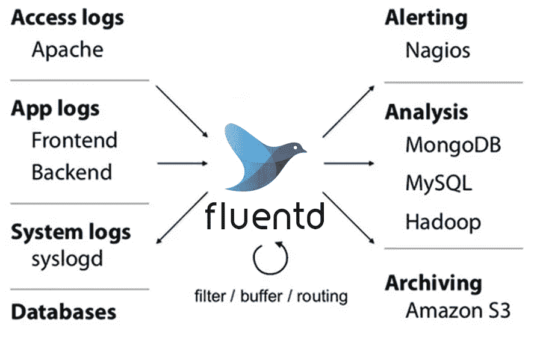

# 在 Kubernetes 像魔鬼一样奔跑

> 原文：<https://medium.com/codex/running-fluentd-as-a-daemonset-in-kubernetes-95e96ed6130d?source=collection_archive---------2----------------------->

**Fluentd** 是一个开源的数据收集器，它可以让您统一数据收集和消费，以便更好地使用和理解数据。Fluentd 试图尽可能将数据结构化为 JSON:这允许 Fluentd 统一处理日志数据的所有方面:收集、过滤、缓冲和输出跨多个源和目的地的日志。

流畅的建筑。图片来源:Fluentd.org