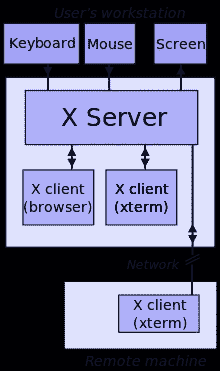
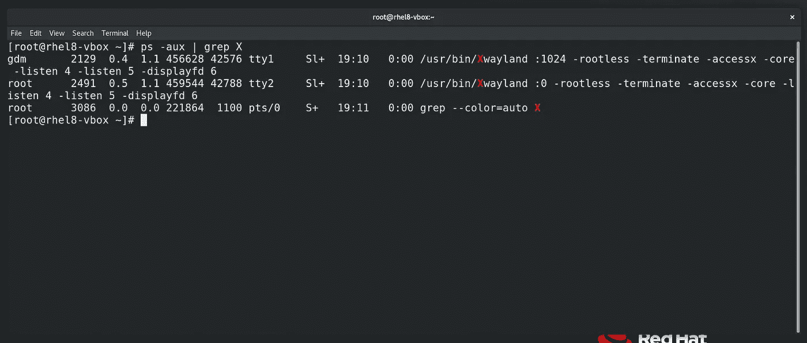
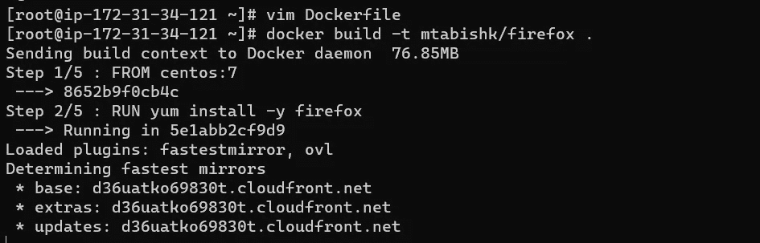
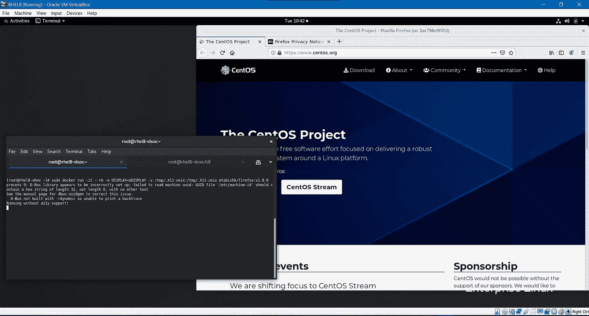
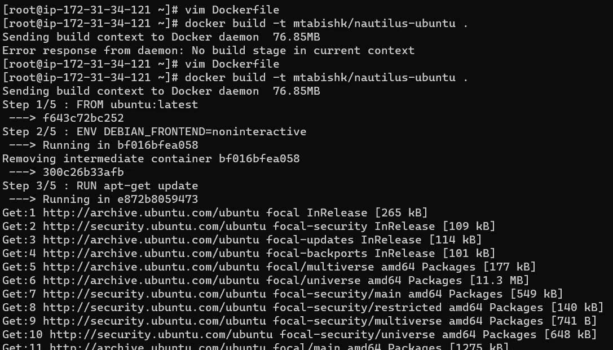
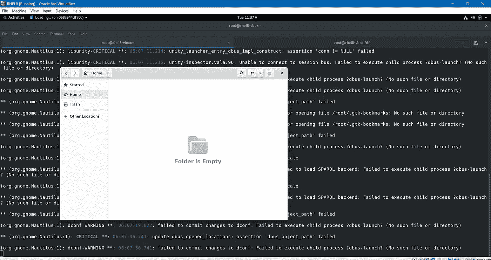
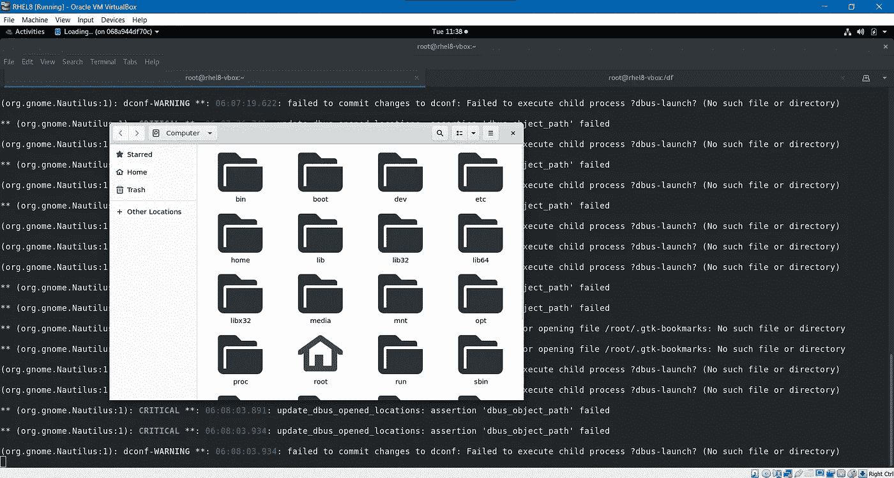

# 在 Docker 中运行 GUI 应用程序——Firefox，Nautilus 文件管理器。

> 原文：<https://medium.com/codex/running-gui-applications-in-docker-firefox-nautilus-file-manager-5424694104ec?source=collection_archive---------6----------------------->

## 药典

# Docker 是什么？

Docker 是一个工具，旨在通过使用容器来简化应用程序的创建、部署和运行。容器允许开发人员将应用程序与它需要的所有部分打包在一起，比如库和其他依赖项，并作为一个包进行部署。通过这样做，由于有了容器，开发人员可以放心，应用程序将在任何其他 Linux 机器上运行，而不管该机器的任何定制设置可能与用于编写和测试代码的机器不同。

在某种程度上，Docker 有点像虚拟机。但与虚拟机不同的是，Docker 不是创建一个完整的虚拟操作系统，而是允许应用程序使用与运行它们的系统相同的 Linux 内核，并且只要求应用程序附带主机上尚未运行的东西。这极大地提高了性能，并减小了应用程序的大小。

# 可以容器化的应用程序类型(通常是服务):

*   作为后台服务运行的应用程序(如数据库、web 服务器等)
*   在前台运行的 GUI 应用程序。

今天，我们将看到第二种选择:

# X 窗口系统/ X:

X11 是当前版本的 [*X 视窗系统*](http://www.linfo.org/x.html) 。

x 为 GUI 环境提供了基本框架:在显示设备上绘制和移动窗口，以及与鼠标和键盘交互。x 不强制用户界面——这是由单独的程序处理的。因此，基于 X 的环境的视觉风格变化很大；不同的程序可能呈现出完全不同的界面。在类似于 Unix 的操作系统上。

为了运行 GUI 应用程序，我们需要一个 XServer，它可以作为每个 Linux 桌面环境的一部分。

运行以下命令，查看运行在您的 Linux 机器上的 X 服务器和 X 客户机:

`$ ps -aux | grep X`

*对于 Windows，可以使用*[*Xming*](https://sourceforge.net/projects/xming/)*。*

*对于 OSX，可以用*[*Xquarkz*](https://www.xquartz.org/)*。*

但是在容器中，我们没有任何 x server——所以我们将:

*   将本地机器上`/tmp/.X11-unix`中的`X11`插座安装到容器中的`/tmp/.X11-unix`中。

`-v /tmp/.X11-unix:/tmp/.X11-unix`

*   将主机的**显示**环境变量共享给容器

`-e DISPLAY=$DISPLAY`

*   用主机**运行容器**网络驱动程序

`--net=host`

# 示例 1:使用示例 GUI 应用程序(Firefox)构建图像的 Dockerfile:

`$ cat Dockerfile`

`$ sudo docker build -t mtabishk/firefox .`

码头中心:[https://hub.docker.com/repository/docker/mtabishk/firefox](https://hub.docker.com/repository/docker/mtabishk/firefox)

`$ sudo docker run -it --rm -e DISPLAY=$DISPLAY -v /tmp/.X11-unix:/tmp/.X11-unix --net=host mtabishk/firefox:v1.0.0`

您应该会看到 firefox GUI 应用程序现在显示在您的主机操作系统桌面上。

# 示例 2:使用示例 GUI 应用程序(Nautilus 文件管理器)构建图像的 Dockerfile:

`$ cat Dockerfile`

`$ sudo docker build -t mtabishk/nautilus-ubuntu .`

docker Hub:[https://Hub . docker . com/repository/docker/mtabishk/nautilus-Ubuntu](https://hub.docker.com/repository/docker/mtabishk/nautilus-ubuntu)

`$ sudo docker run -it --rm -e DISPLAY=$DISPLAY -v /tmp/.X11-unix:/tmp/.X11-unix mtabishk/nautilus-ubuntu`

您应该会看到 Nautilus GUI 应用程序现在显示在您的主机操作系统桌面上。

今天就到这里吧！我很快会带一些新文章回来，谢谢！🤗

穆罕默德·塔比什·坎戴

领英:[https://www.linkedin.com/in/mtabishk/](https://www.linkedin.com/in/mtabishk/)