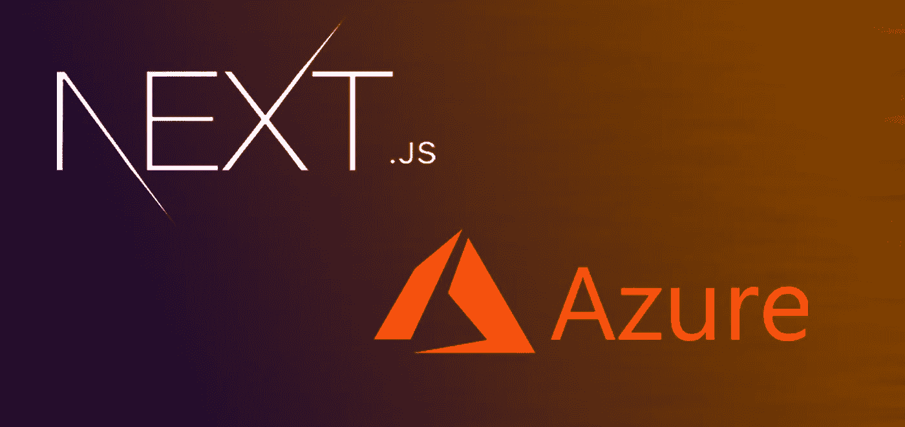

# 在 Azure 应用服务上运行 Next.js

> 原文：<https://medium.com/codex/running-next-js-on-azure-app-services-84f707af761d?source=collection_archive---------1----------------------->

David Fekke 的图片说明

*最初发布于*[*https://fek . io*](https://fek.io/blog/running-next-js-on-azure-app-services/)*。*

# 如何在 Azure 上运行你的 Next.js 应用

我最近做了一个关于使用 [Next.js](https://nextjs.org) 和 [Express.js](https://expressjs.com) 构建通用应用的演示。Next.js 是来自 Vercel 的优秀人员的框架。

Vercel 是一个很棒的托管平台，但是我正在做的一个项目已经使用了……