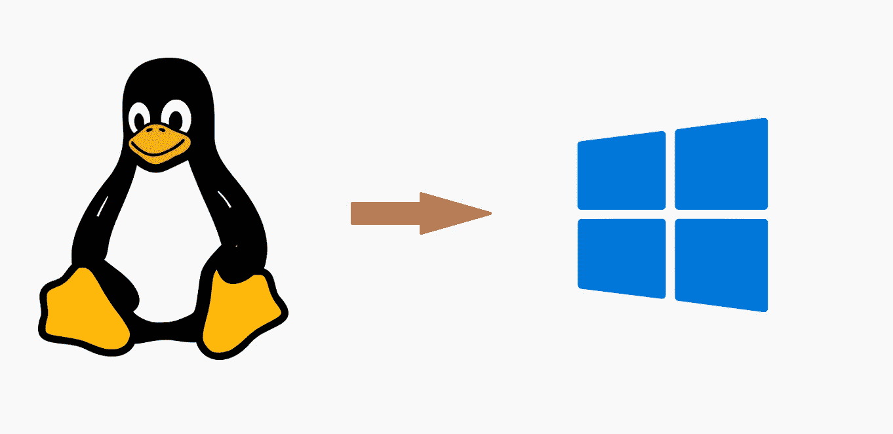

# 在 Windows 上运行开源软件

> 原文：<https://medium.com/codex/running-open-source-software-on-windows-50dd1231cae9?source=collection_archive---------10----------------------->

## 将面向 Linux 的源代码移植到 Windows 的 7 个技巧



在 Linux 上开发的开源软件可以移植到 Windows 上(来自 [Pixabay](https://pixabay.com) 的*图片*

我是一名化学系的学生，但是我第一次尝试编程是在我决定进入计算化学的时候。从我记事起，我就一直在使用我的旧 Windows 笔记本电脑。所以很自然地，我想在我的笔记本电脑上为我的项目做测试和准备工作。

这就是我遇到很多问题的地方。我所在领域的大多数代码都是用 Linux 编写的开源代码。在 Windows 上运行这些代码几乎总是很痛苦(要么程序无法编译，要么没有关于如何编译的说明)。没有程序需要的固有特性是 Windows 不能提供的。只是因为它们是在 Linux 上编写和测试的，所以只有 Linux 的函数或系统调用会渗透到源代码中。有些代码确实为 Windows 提供了预编译的二进制文件(例如 NAMD)，但它们很少。

Cygwin/WSL 是一个选项，但是它们很慢，特别是对于磁盘 I/O。在多次尝试使用 Cygwin 之后，我放弃了，一头扎进了源代码。到目前为止，我已经成功地在 Windows 上使用原生编译器(Visual C++和 Intel)修改并构建了两个软件([games](https://www.msg.chem.iastate.edu/GAMESS/)和 [MRCC](https://mrcc.hu/) )。

## 为什么在 Windows 上构建很难？


试图在 Windows 上构建一个开源软件！(图片来自 [Pixabay](https://pixabay.com/vectors/laptop-error-web-warning-text-5906264/) )

在 Windows 上编译开源科学软件并不是什么新鲜事。问题部分在于微软本身，部分在于编写这些开源软件的开发者。微软没有让编译环境在 Windows 上运行变得容易。MS Visual Studio 应该是主要的开发环境，但它只提供 C/C++编译器；如果你需要 Fortran 呢？你必须要么尝试安装 Intel Visual Fortran，要么安装 LLVM (flang)或 GNU (gfortran)等开源软件，所有这些软件的安装都很麻烦。使用命令行(cmd.exe)也很困难，因为参数解析不一致。在 Linux 上，shell 根据一组固定的规则解析参数，然后将分离的参数提供给名为。在 Windows 上，命令提示符只是将整个命令发送给程序，并由单个程序来处理参数。这意味着，例如，如果您用双引号将文本括起来，它可能被一个软件视为一个参数，而被另一个软件视为多个参数。所有这些都意味着有人需要浪费大量的时间在编码之前熟悉 Windows 的特性。Windows 也没有默认的集成构建系统，像 Linux 一样，在 Linux 中构建软件有时就像在命令行上运行`make install`一样简单。

另一方面，编写软件的开发人员也不是完全没有责任——他们使用 Linux 独有的特性，有时是故意的，这些特性在 Windows 上无法编译。这在大多数情况下是不必要的，因为我所遇到的开源代码都是命令行代码，不需要操作系统特有的特性；标准库提供的功能就足够了。许多开发人员甚至拒绝考虑 Windows 版本。对于“为什么它在 Windows 上不起作用？”这个问题的标准回答是就是“你为什么不装 Linux？”。

尽管有这些问题，我相信许多开源软件可以在 Windows 上编译，只需很少的改动。这是因为标准 C/C++和 Fortran 源代码可以在 Windows 和 Linux 上编译。正如我前面提到的，大多数时候，操作系统的低级功能(对于 Linux: `unistd.h`，对于 Windows: `windows.h`)是不必要的。

我不是在谈论专门为 Linux 移植软件。这要困难得多，而且我还不是一个优秀的程序员来给出这方面的建议！不，我只是在谈论通用开源代码，它主要是一个命令行应用程序，可能是在 Linux 上开发的。这些可以移植到 Windows 上本地运行。

## 将源代码移植到 Windows

> 1)检查编译器中的差异

如果我理解正确的话，Linux 系统的传统编译器是由 GNU 工具集提供的。所以 C/C++的编译器是 gcc 和 g++，Fortran 的编译器是 gfortran。这些编译器几乎总是保证在 Linux 上可用(或者容易安装)，所以大多数开发人员编写支持 GNU 编译器的代码。还可以在 Linux 上安装 LLVM 和 Intel 编译器。

对于 Windows，本机 C/C++编译器是微软自己的 Visual C/C++编译器。它可以作为 Visual Studio 的一部分安装。(听说可以单独安装但不确定)。但是微软没有提供 Fortran 编译器。英特尔提供了 Visual Fortran(及其自己的 C/C++编译器),可以为 Windows 生成本机可执行文件。(也有 GNU 和 LLVM 编译器的端口可用。)

这些编译器都有自己的特点。我注意到的一些趋势:

1.  编译器命令行选项都是不同的。参数格式也不同。Linux 编译器将作为`compiler -argument1 option1 -argument2 option2`在命令行中运行。对于 Visual C++和英特尔编译器，默认样式是`compiler /argument1:option1 /argument2:option2`。(然而，写作`compiler -argument1:option1 -argument2:option2`有时是允许的。)
2.  在 Linux 上，Fortran 编译器默认运行预处理器，但对于 Windows，需要通过参数`/fpp`显式请求。
3.  在 Linux 上，大多数 Fortran 编译器按照 GNU 惯例，以小写形式输出符号，并在末尾加上下划线。因此，子程序名`mysubrt`将被导出为`mysubrt_`。在 Windows 上，英特尔 Fortran 输出不带下划线的大写符号，即`mysubrt`将变成`MYSUBRT`。只有当您试图将 C/C++与 Fortran 接口时，这才是一个问题。由于这个特殊的原因，许多这样做的代码无法在 Windows 上编译。(然而，gfortran 的 Windows 端口遵循 GNU 惯例)

> Windows 中的信号处理受到限制

C 和 C++代码具有拦截“信号”的功能，这些信号是从操作系统到软件的消息，表明发生了意外情况(例如，按下了 Ctrl+C 或 Ctr+Break，或者发生了被零除的情况，或者程序试图访问它无法访问的内存位置等)。).信号处理的目的是让程序对如何响应异常和错误有所控制。

信号处理是通过安装特殊函数作为处理程序来完成的。当程序接收到信号时，这些函数将被调用。例如，如果我为`SIGINT`安装一个处理程序，那么当 Ctrl+C 被按下时，程序将调用处理函数，而不是关闭程序，这是默认的动作。

C 标准库定义了 6 种信号— `SIGABRT (abnormal termination), SIGFPE (floating point error), SIGILL (illegal instruction), SIGINT (ctrl+c signal), SIGSEGV (illegal storage access) and SIGTERM (termination request)`。Linux 和 Windows 都支持这些。Windows 还额外支持`SIGBREAK (Ctrl+Break)`。

然而，在 Linux 上，有一大堆其他信号可以被代码拦截。如果开放源代码包括对这些信号的处理，那么它们就不能在 Windows 上编译。解决方案是删除对这些信号的处理(因为它们永远不会被 Windows 操作系统发送)，并拦截 Windows 中可能需要的其他信号(从上面的列表中)。幸运的是，学术开源程序很少需要标准信号以外的任何东西。

同样，在 Linux 上，信号处理程序是由`struct sigaction`设置的。处理信号的功能由`sigaction.sa_handler`设定。在 Windows 上，只有基本的 C `signal()`函数存在。

例如，下面的 Linux 代码将`handle_sig`设置为 SIGINT 的信号处理程序:

```
void handle_sig(int signal) {
...
}struct sigaction act; //act is instance of the structure sigactionact.sa_handler = &handle_sig; // handle_sig is the handler in actsigaction(SIGINT, &act, NULL);/* Here, structure act is installed as the sigaction structure for SIGINT, which means handle_sig becomes the signal handler*/
```

在 Windows 上，它会变成:

```
void handle_sing(int signal) {
...
}signal(SIGINT,handle_sig);
```

对 Windows 来说就是这样:简单明了。

> 3)小心丢失的库

在 Linux 上，大多数库在安装时会将它们的路径放入`LD_LIBRARY_PATH`或其他环境变量中。当依赖于该库的源代码被编译时，它会在`LD_LIBRARY_PATH`中寻找该库或者该库特定的 env。可变。

然而，在 Windows 中情况并非如此。通常，库是作为归档中的`.lib`和`.dll`文件提供的。通常没有安装过程，所以不修改环境变量；它只是提取包含文件的归档文件。

在这种情况下，编译器(实际上是链接器)将无法找到这些库，编译将会失败。对于 Visual C++或英特尔编译器来说，`LNK2019 Unresolved external symbol`通常是由此引起的。

解决方法是将编译器(或链接器)指向库文件(`.lib`)。大多数开源软件在命令行上编译。对于 Visual C++或英特尔编译器，库文件的路径必须添加到环境变量`LIB`或提供给链接器的参数`/libpath:` 。在链接过程中，还必须包括库文件的名称。

这相当复杂，您需要使用的确切命令取决于您需要的库和您使用的构建系统。

例如，如果我正在编译一个名为`calculate.f90`的 Fortran 程序，并且我正在使用一个单独的库`mylibrary.lib`提供的子程序`mysub`，如下所示:

```
program calculateinteger :: i,j  !some variables!some code herecall mysub(i,j) !external subroutine called!some more code hereend program calculate
```

然后我必须在英特尔 Fortran 上像这样链接:

```
ifort calculate.f90 /link C:\path\to\mylibrary.lib
```

或者更简单地说:

```
ifort calculate.f90 C:\path\to\mylibrary.lib
```

在第一种情况下，库指向链接器，在第二种情况下，编译器将文件识别为库，并自动将其传递给链接器。

没有这个库，链接器会抛出`Unresolved external symbol`错误。

如果你用的是 GNU 编译器，他们不使用微软的`link.exe`链接器，所以以上不适用。

> 4)仅 POSIX 头文件

这是您在移植 C/C++代码时可能偶尔遇到的最后一个噩梦。Fortran 不像 C 语言那样有头文件，所以这在那里不适用。这是移植 Fortran 代码更容易的原因之一。

C/C++中特定于操作系统的头文件公开了操作系统的核心功能，并允许非常低级的操作。不幸的是，这意味着它们不是真正可移植的，因为 Windows 和 Linux 内核做的事情不同。幸运的是，这种类型的功能很少需要，而且在 Linux 和 Windows 之间经常有几乎完美的对等物。

例如，在 Linux 中，头文件`unistd.h`提供了函数`usleep(time)`，它将调用该函数的进程线程暂停`time`微秒。

```
#include <stdio.h>
#include <unistd.h>int main(){// some code hereusleep(1000); // pauses the program for 1000 microseconds i.e. 1 ms// after 1 ms, the code starts here again}
```

如果您试图在 Windows 上编译它，编译器会给出一个错误，因为 Windows 上不存在`unistd.h`头。

解决方案*是用 Windows C 头文件提供的一个函数来替换它。快速的谷歌搜索会告诉你，在 Windows 上，`Sleep()`函数做了类似的工作，并且不需要任何标题。然而，`Sleep(time)`暂停了`time`毫秒。所以，你可以把它修改成这样:

```
#include <stdio.h>int main(){// some code hereSleep(1); // pauses for 1 ms// resumes after 1 ms}
```

*尽管您可以通过逐个检查源代码来解决丢失的头，但使用 [MinGW](http://mingw-w64.org/doku.php) 要容易得多。它基本上提供了从 Linux 函数到 Windows 函数的翻译，并将其作为头文件提供。MinGW 编译的程序完全是原生的 Windows 程序，所以你避免了必须替换丢失的头文件的问题。

> 5)查看编译器错误/构建系统错误

大多数情况下，编译器错误非常能说明问题所在。由于您不是在编写新代码，而是在移植代码，所以导致错误的几乎总是缺失的库/缺失的目标文件(即`Unresolved externals`)。

虽然在一些罕见的情况下，会出现宏名冲突。宏是一些由 C 或 Fortran 预处理器读取的指令，告诉它们如何在实际编译之前修改源文件。例如，如果你在 Windows 上编译，几乎所有的编译器都定义了宏`_WIN32`。这使得程序员可以编写 Windows 特有的代码，这些代码只有在定义了`_WIN32`时才会被编译。

```
#if defined _WIN32// Some C++ code for Windows#else// C++ code for other systems#endif
```

不管怎样，软件开发人员有时会使用他们自己的自定义宏，这些宏是通过命令行参数定义的。假设我在 Linux 上开发了一个开源软件，用了一个名为`_WIN32`的宏，这个宏会关闭某一部分代码的编译。(这是编造的例子，没有人会这么做！)现在，在 Linux 上，`_WIN32`没有定义，所以它被当作一个用户自定义的宏。当您试图在 Windows 上编译该源代码时，`_WIN32`总是被定义，因此部分代码永远不会被编译。

这种类型的宏名称冲突很难检测。大多数时候，编译器甚至不会抱怨任何出错的地方，只会编译程序。那么当程序运行时，可能会有大量的错误。有时，如果用户定义的宏与系统预定义的宏同名，可能会在头文件中出现错误。

构建系统错误也有助于了解哪里出错了。

> 6)注意 shell 调用

有时，程序员在源代码中使用 shell 命令，主要是为了执行文件系统操作。这在 C/C++中由`system()`函数提供，在 Fortran 中由`system()`子程序或`execute_command_line`子程序提供。

例如，C 中的这段代码会将 Linux 中的`file1`复制到`dir`目录:

```
#include <stdlib.h>int main(){
    system("cp file1 dir/");
    return 0;
}
// works on Linux
```

通常，这种类型的 shell 调用很少见。很明显，在 Windows 上，同样的代码不能工作，因为`system()`调用了 Windows 命令提示符(`cmd.exe`)，它不能识别`cp`命令。另外，文件系统分隔符在 Windows 中是反斜杠，在 c 中需要转义。

```
#include <stdlib.h>int main(){
    system("copy file1 dir\\"); 
    return 0;
}
// works on Windows
```

> 7)经常测试

所以，在所有这些修改之后，你终于设法让软件编译了。这是否意味着该软件有效？**没有**，编译器没有抛出任何错误并不代表最终的可执行文件有效。

幸运的是，大多数学术开源软件都带有测试。这些是示例计算，您可以运行它们来检查您的软件是否工作，以及它是否在可接受的范围内给出了正确的数字结果。

您应该总是尽可能多地运行这些测试，以确保您构建的软件实际上按预期运行。

## 值得吗？

移植一个软件的所有这些麻烦值得吗？很多人会推荐转 Linux，或者安装双引导。尽管有一些进步，我仍然不相信 Linux 适合这里的普通终端用户。很多实用软件仍然不能在 Linux 上运行，只能在 Windows 和 Mac OS X 上运行。对我来说，使用 Windows 更方便，因为我用它做其他任何事情。(也许你不同意，没关系，因为你应该选择一个对你最方便的 OS。)

因此，我认为值得花时间尝试将开源代码移植到 Windows。大多数时候，这比安装 Linux 要简单得多。

感谢阅读！欢迎在回复中留下评论或问题。