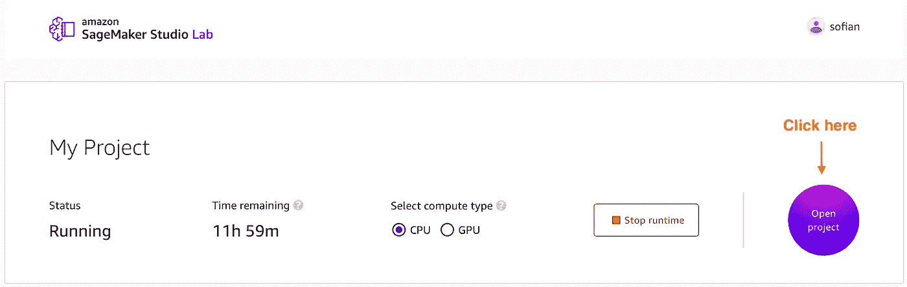
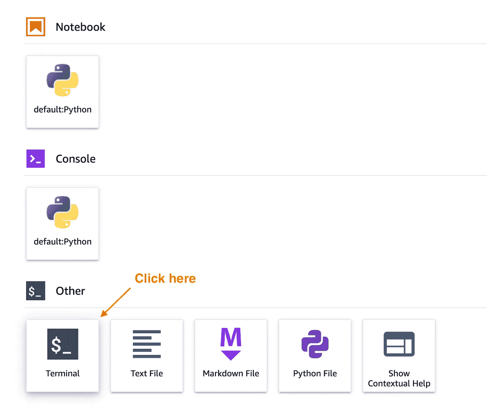
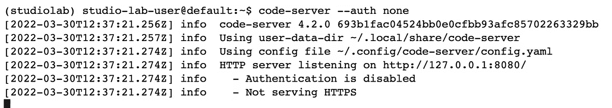
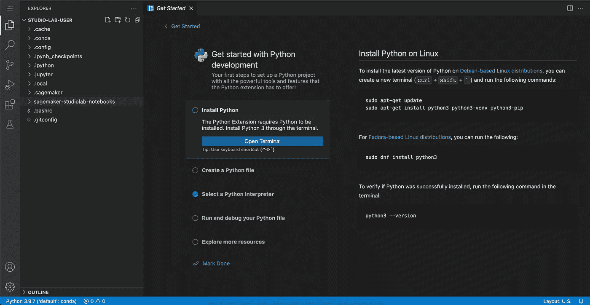

# 工作室实验室中的 VS 代码

> 原文：<https://medium.com/codex/running-vs-code-for-free-on-aws-bfb1aed7be6f?source=collection_archive---------3----------------------->

## 在您的环境中，5 分钟内完成设置和编码

[亚马逊 SageMaker Studio 实验室](http://studiolab.sagemaker.aws/)让您免费访问 AWS 计算资源，快速开始学习和尝试 ML。它设置简单，允许您在 CPU 或 GPU 实例上运行笔记本电脑。

Studio Lab 是基于 [JupyterLab](https://jupyter.org/) 的，但是你也可以在其中运行 VS 代码。

照片由[扬西·敏](https://unsplash.com/@yancymin?utm_source=unsplash&utm_medium=referral&utm_content=creditCopyText)在 [Unsplash](https://unsplash.com/s/photos/vscode?utm_source=unsplash&utm_medium=referral&utm_content=creditCopyText) 上拍摄

在这篇文章中，我将展示如何在 Studio Lab 中设置 VS 代码，并在不到 5 分钟的时间内在 web 浏览器中访问它。

# 先决条件

要浏览此示例，请确保您具备以下条件:

1.  工作室实验室账户。您可以在此处申请一个[。](http://studiolab.sagemaker.aws/)
2.  熟悉 Studio Lab。如果你对亚马逊 SageMaker Studio Lab for 初学者感到陌生，你可以访问它。

# 在您的工作室实验室中设置 VS 代码(5 分钟)

[代码服务器](https://github.com/coder/code-server)允许我们从浏览器访问 VS 代码，同时在云中进行计算。我们将分三步在我们的工作室实验室中安装它:

## 步骤 1 -启动您的工作室实验室环境

图片作者:你可以选择 GPU 计算的 CPU

## 步骤 2 -从启动器启动终端

作者图片:点击工作室实验室启动器中的终端图标

## 步骤 3 -安装并运行代码服务器

您的 Amazon SageMaker Studio 实验室环境开箱即用，带有`conda`和`pip`来安装和管理包。所以我们可以使用 [anaconda](https://anaconda.org/conda-forge/code-server) 安装代码服务器。

下面是一个可以用来安装和运行 code-server 的脚本。您可以在终端中运行命令，或者在工作室实验室中执行 shell 脚本:

为了便于说明，该脚本使用`--auth none`运行代码服务器。您可以使用密码或其他方式来保护您环境中的访问。更多细节参见[代码服务器文档](https://coder.com/docs/code-server/latest)。

Image by author:运行 code-server 命令后，您应该会看到以下内容。

# 在浏览器上访问 VS 代码

Studio Lab 有一个 Jupyter 代理，你可以通过它访问 VS 代码。

你所需要做的就是复制你的工作室的 URL，稍微修改一下，然后粘贴到一个新的标签中:

图片作者:左边是我工作室实验室的原始网址。我把 **/lab** 换成了 **/proxy/8080** ，粘贴到了一个新的浏览器标签中。

选项卡现在应该打开 VS 代码。您可以为 VS 代码安装 Python 扩展，并开始在您的 ML 项目中工作！

作者图片

# 结论

Amazon SageMaker Studio Lab 是一种在 AWS 上访问免费计算并开始进行实验项目的简单方法。

在这篇文章中，我展示了如何在 5 分钟内安装 VS 代码，给你使用笔记本或 IDE 的灵活性。

你也可以通过 MLFlow 和 Amazon SageMaker Pipelines 阅读 [MLOps，了解你可以用 SageMaker 做的其他很酷的事情。](https://towardsdatascience.com/mlops-with-mlflow-and-amazon-sagemaker-pipelines-33e13d43f238)