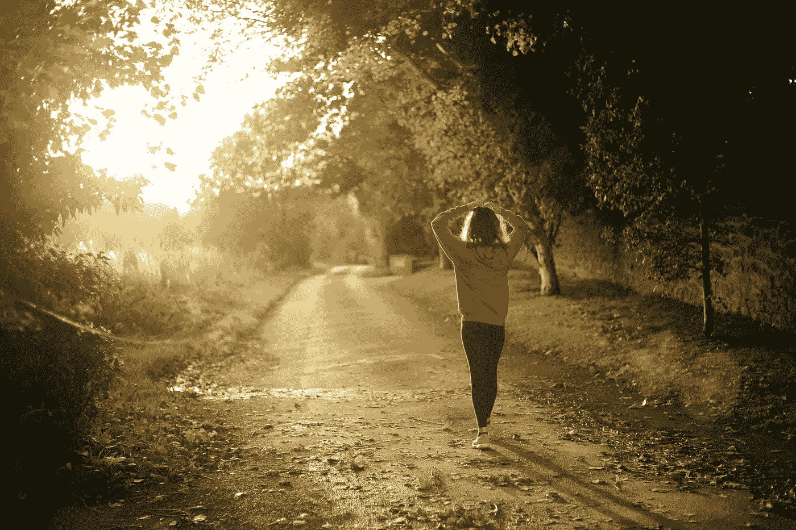

# 不带苹果手表跑步

> 原文：<https://medium.com/codex/running-without-my-apple-watch-3fc3e77a8926?source=collection_archive---------2----------------------->

艾玛·辛普森在 [Unsplash](https://unsplash.com/s/photos/running?utm_source=unsplash&utm_medium=referral&utm_content=creditCopyText) 上的照片

## 是时候抛下它了

我想成为一名跑步者，已经很多年了，实际上是几十年了。我在高中和接下来的几年里跑步，随着年龄的增长和体重的增加，它逐渐减弱，直到今天，它仍然是我失败的新年决心。我喜欢跑步的想法，一旦你克服了前一英里左右的疼痛，就能达到那种近乎催眠的状态。我说的不是高…