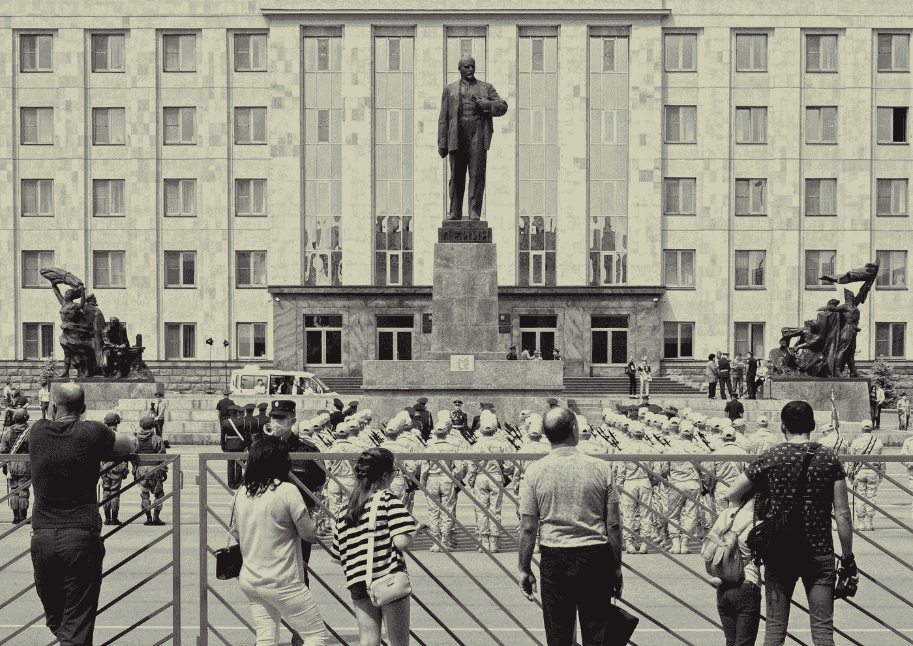

# 俄罗斯及其并不平静的绝望

> 原文：<https://medium.com/codex/russia-and-its-not-so-quiet-desperation-f8cc71f47a37?source=collection_archive---------2----------------------->

## 它的致命弱点就是忽略了过去的未来。

yasmin peyman 在 [Unsplash](https://unsplash.com?utm_source=medium&utm_medium=referral) 上拍摄的照片

当全世界都在关注和哀悼俄罗斯军队在乌克兰上演的每一个悲剧时刻的时候，我作为一名软件工程师，我的思想稍微转向了一个领域，这个领域是我自几年前的朝鲜危机以来就一直关注的———