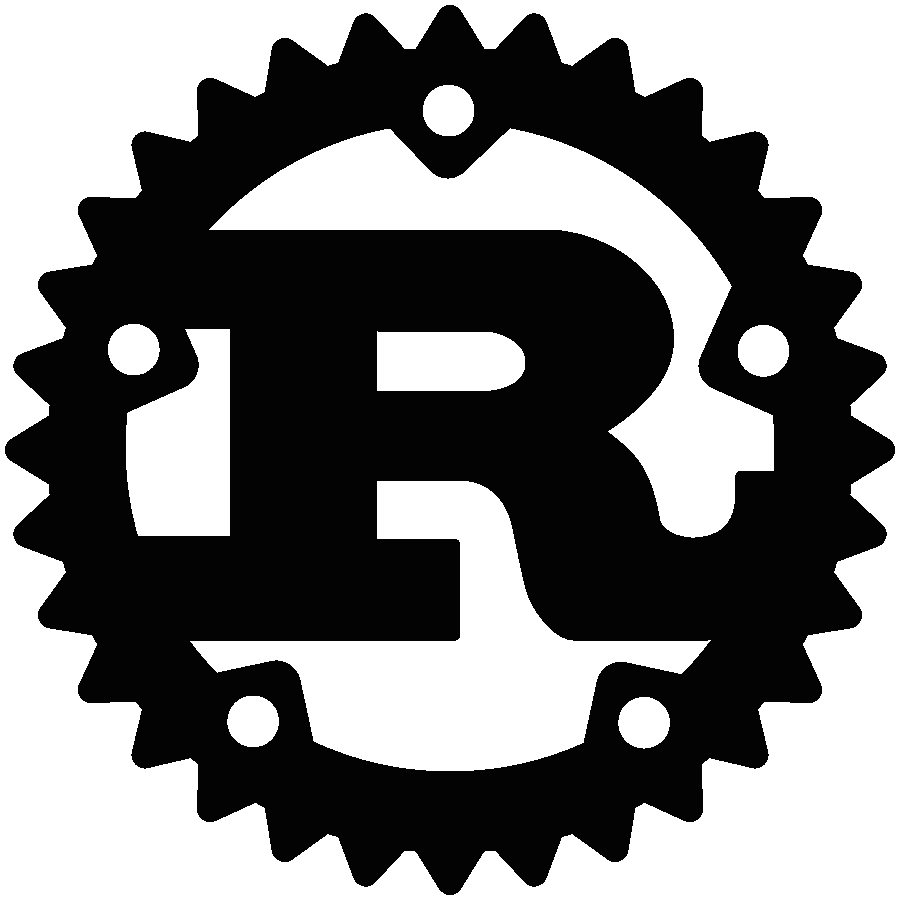

# Rust 不能让你成为更好的程序员:错误处理

> 原文：<https://medium.com/codex/rust-cant-make-you-a-better-programmer-error-handling-ed22b1ce762d?source=collection_archive---------5----------------------->

*免责声明:所有观点都是我自己的*

如你所知，我写《T2》的时间并不长(此时已经几周了)，但是一个语言特性(以及对它的热情)让我印象深刻。

我经常听说“x 语言的特性迫使你成为一名更好的程序员”，我想我应该回到我那略带戏谑的证明模式…