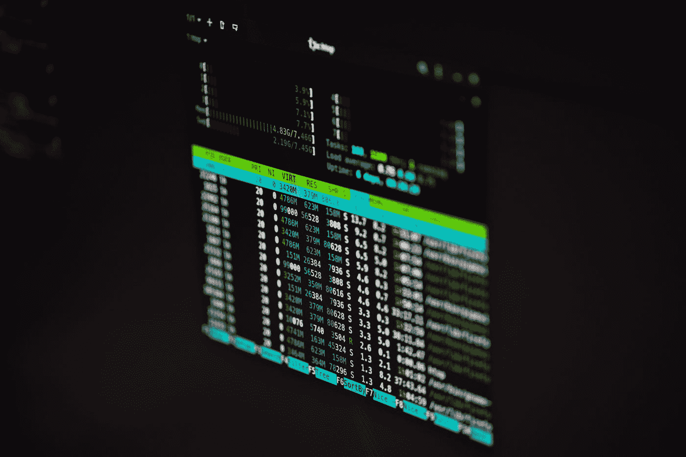

# Rust 可能最终会成为下一个 Linux 内核

> 原文：<https://medium.com/codex/rust-may-make-it-into-the-next-linux-kernel-after-all-d29f659b18e8?source=collection_archive---------16----------------------->

## Linux 创始人莱纳斯·托沃兹说

由 [Lukas](https://unsplash.com/@lukash?utm_source=medium&utm_medium=referral) 在 [Unsplash](https://unsplash.com?utm_source=medium&utm_medium=referral) 拍摄的照片

这是 CrunchX 的第三十二版，这里是我们认为值得花时间的故事和资源。

# 1.每个人都知道 YouTube 是什么——很少有人知道它是如何运作的

YouTube 一直让我着迷，因为它是一个黑匣子——每个人都觉得自己知道这个平台是如何运作的，但很少有人真正了解真正推动 YouTube 决策的内部政治和权衡。由 Nilay Patel 在边缘撰写，由 [Aniket](https://medium.com/u/63e8b30e596f?source=post_page-----d29f659b18e8--------------------------------) 编辑选择。点击此处阅读文章:

[https://www . the verge . com/2022/9/13/23349037/mark-Bergen-YouTube-creators-tiktok-算法](https://www.theverge.com/2022/9/13/23349037/mark-bergen-youtube-creators-tiktok-algorithm)

# 2.苹果在 iOS 16 中对复制粘贴过于严格

iPhone 的剪贴板通常包含敏感数据，如密码、个人照片、双因素密码等。应用程序浏览这些信息的频率可能比我们任何人意识到的都要高。这是苹果遵守隐私原则的又一个例子。由 Chris Welch 在 The Verge 撰写，由 Aniket 编辑选择。点击此处阅读文章:

[https://www . the verge . com/2022/9/16/23357198/apple-IOs-16-iphone-copy-paste-permission](https://www.theverge.com/2022/9/16/23357198/apple-ios-16-iphone-copy-paste-permission)

# 3.现实世界的人工智能问题

经过多年的承诺，人工智能终于变得有用了。但是有用的技术通常会消失。我们忘记了刚刚工作的事情，我们不应该让这种事情发生在 AI 身上。由 [Aniket](https://medium.com/u/63e8b30e596f?source=post_page-----d29f659b18e8--------------------------------) 撰写并在 The Verge 上发表和编辑选择。点击此处阅读文章:

[https://www . the verge . com/2019/1/28/18194816/ai-人工智能-问题](https://www.theverge.com/2019/1/28/18194816/ai-artificial-intelligence-issue)

# 4.Linus Torvalds: Rust 可能会成为下一个 Linux 内核

Rust 语言继续发展壮大，最近 Linus Torvalds 的评论证明了这一点，他将提议在 Linux 内核的下一个版本中加入 Rust。正如文章中提到的，在 Linux 开发中，它的使用已经仅次于 C 语言，主要是因为它在内存管理方面的显著优势。由史蒂文·沃恩-尼克尔斯撰写关于 ZDNET 的文章，由斯图尔特·伍利博士编辑选择。点击此处阅读文章:

[https://www . zdnet . com/article/Linus-Torvalds-rust-may-make-it-into-next-Linux-kernel-after-all/](https://www.zdnet.com/article/linus-torvalds-rust-may-make-it-into-the-next-linux-kernel-after-all/)

# 5.Git 合并与 Rebase:使用哪一个以及何时使用

谈到 Linux，git 已经成为事实上的源代码控制工具，但是我知道，当谈到调和特性分支和它们最初的父特性时，我并不是唯一一个对 Merge 和 Rebase 感到困惑的人。Jonathan Chaffer 有一篇精彩、简洁的文章，强调了两者之间的区别以及在特定情况下应该使用哪一种。由 Jonathan Chaffer 撰写关于原子自旋的文章，由[的 Stuart Woolley 博士编辑选择。点击此处阅读文章:](https://medium.com/u/a435b5883828?source=post_page-----d29f659b18e8--------------------------------)

[https://spin.atomicobject.com/2022/09/15/git-merge-rebase/](https://spin.atomicobject.com/2022/09/15/git-merge-rebase/)

# 6.数据故事:金钱和生存空间

这篇文章描述了一些关于全球 GDP、个人收入和租金价格的非常有趣的可视化。由 TDWI 的 Upside 工作人员撰写，由 [Christianlauer](https://medium.com/u/2696f801a31a?source=post_page-----d29f659b18e8--------------------------------) 编辑选择。点击此处阅读文章:

[https://tdwi . org/articles/2022/09/14/bi-all-visualization-wealth . aspx](https://tdwi.org/articles/2022/09/14/bi-all-visualization-wealth.aspx)

# 7.每个数据分析师都应该拥有的 5 大书签

本文介绍了 5 种不同的书签，可能会对在数据领域工作的每个数据分析师有所帮助。Ascii 表格式化程序和 SQl 美化程序就是其中的两个。由 Josh Berry 在 KDNuggets 上撰写，由 [Christianlauer](https://medium.com/u/2696f801a31a?source=post_page-----d29f659b18e8--------------------------------) 编辑选择。点击此处阅读文章:

[https://www . kdnugges . com/2022/09/top-5-bookmarks-every-data-analyst . html](https://www.kdnuggets.com/2022/09/top-5-bookmarks-every-data-analyst.html)

# 8.数据如何推动欺诈防范

公司应该更加注意使用他们的数据进行欺诈检测和防范。本文通过给出说明和最佳实践向您展示了如何实现这一点。由 varga 瓦尔加在 KDNuggets 上撰写，由[克里斯蒂安劳](https://medium.com/u/2696f801a31a?source=post_page-----d29f659b18e8--------------------------------)编辑选择。点击此处阅读文章:

[https://www . kdnugges . com/2022/09/data-science-fuels-fraud-prevention . html](https://www.kdnuggets.com/2022/09/data-science-fuels-fraud-prevention.html)

# 9.关于人类智力硬极限的十个问题

人们常说人工智能应该模仿人类的智能，然而，它只和它自己的创造者人类一样聪明。这篇文章讨论了 10 个显示人类智力极限的具体问题。由 iamspc 在数字脉冲上撰写，由 [Christianlauer](https://medium.com/u/2696f801a31a?source=post_page-----d29f659b18e8--------------------------------) 编辑选择。点击此处阅读文章:

[https://digitalpulse publishing . com/index . PHP/2022/09/05/ten-questions-about-the-hard-limits of-human-intelligence/](https://digitalpulsepublishing.com/index.php/2022/09/05/ten-questions-about-the-hard-limits-of-human-intelligence/)

# 10.架构决策记录

任何有经验的开发人员都知道 ADRs。这是提高 ADR 的要点。我们中的大多数人写下它们，然后继续前进，但是 ADR 还有更多。这对任何不熟悉 ADR 的人，甚至是 medior 开发者来说都是好消息。Joel Parker Henderson 撰写并出版，Milo ivko VI 编辑选择。点击此处阅读文章:

[https://github . com/joelparkerhenderson/architecture-decision-record](https://github.com/joelparkerhenderson/architecture-decision-record)

# 结束语

这些是我们本周的精选。希望你发现了一些新的、鼓舞人心的、惊人的、知识渊博的科技新闻。非常感谢您花时间阅读本版 CrunchX。下周请留意下一期。

## 问候，

法典小组