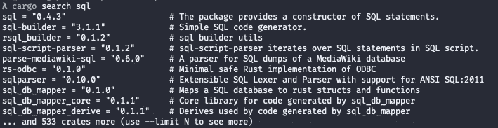

# Rust —包装管理

> 原文：<https://medium.com/codex/rust-package-management-ad4fd85026fc?source=collection_archive---------11----------------------->


照片由[布鲁诺·托佐](https://unsplash.com/@brunnotozzo?utm_source=medium&utm_medium=referral)在 [Unsplash](https://unsplash.com?utm_source=medium&utm_medium=referral) 上拍摄

这是我的*Rust*系列入门的第二部分。这篇文章将重点介绍 *cargo* cli 工具和 Rust 的包管理系统，包括:

*   寻找*板条箱*
*   在自己的项目中使用板条箱
*   配置机箱*功能切换*
*   安装(并使用)一个名为[的二进制板条箱。](https://crates.io/crates/cargo-watch)

关于*货物*和[生锈](https://www.rust-lang.org)的基础知识，请查看我的第一篇文章[生锈——初学者小抄](https://gian-lorenzetto.medium.com/rust-a-beginner-cheat-sheet-8fd7b0ce49de)

# 板条箱

生锈的包装被称为*板条箱。你可以在 [crates.io](https://crates.io) 找到完整的板条箱注册表。*

你可以使用 *cargo* cli 工具搜索板条箱。例如，搜索与 *sql —* 相关的板条箱

`$ cargo search sql`

运行*搜索*命令的结果是与您的搜索词相关的板条箱名称和版本列表



# 使用板条箱

为了使用板条箱，你将它们添加到你的 *Cargo.toml* 文件中。让我们来看看用`$ cargo new {project_name}`创建的默认 *Cargo.toml*

```
[package]
name = "hello_world"
version = "0.1.0"
edition = "2018"# See more keys and their definitions at [https://doc.rust-lang.org/cargo/reference/manifest.html](https://doc.rust-lang.org/cargo/reference/manifest.html)[dependencies]
```

为了使用上面搜索中的 *sql* crate，编辑 yout Cargo.toml，如下所示

```
[package]
name = "hello_world"
version = "0.1.0"
edition = "2018"# See more keys and their definitions at [https://doc.rust-lang.org/cargo/reference/manifest.html](https://doc.rust-lang.org/cargo/reference/manifest.html)[dependencies]
sql = "0.4.3"           <-- Add dependency here
```

注意[货物依赖与 SemVer 语法](https://doc.rust-lang.org/cargo/reference/specifying-dependencies.html)完全兼容，允许根据需要进行选择性更新。

# 板条箱、Git 和功能开关

在帮你拿板条箱的时候，货物是非常强大的。您可以用几种不同的方式指定板条箱的位置。

标准方法(如上，但注意 SemVer 语法)—

```
[dependencies]
bracket-lib = “**~**0.8.1”
```

你可以指定一个 Git repo —

```
[dependencies]
bracket-lib = **{ git = "https://github.com/thebracket/bracket-lib" }**
```

你甚至可以指定*功能切换*！在下面的例子中，将使用[支架库](https://crates.io/crates/bracket-lib)机箱，但是默认渲染引擎被禁用，而使用 vulkan 引擎——

```
[dependencies]
bracket-lib = {
  git = "https://github.com/thebracket/bracket-lib",
  **default-features = false,
  features = [ "amethyst_engine_vulkan" ]**
}
```

# 源箱和二进制箱

如果您来自 C#或 NPM 背景，您可能会有兴趣在添加一个板条箱后下次运行`$ cargo build` 时注意控制台输出

```
**Compiling sql v0.4.3**
Compiling hello_world v0.1.0 (/Users/gian/hello_world)
    Finished dev [unoptimized + debuginfo] target(s) in 0.99s
```

大多数 Rust 板条箱都是基于源代码的，当你把它们添加到你的本地项目中时，cargo 会帮你获取源代码，然后为你的本地平台编译板条箱。

如果你指定一个不同的*目标*平台，你会看到 cargo 重新编译你所有的箱子。有关针对 WebAssembly 的示例，请参见[上一篇文章](https://gian-lorenzetto.medium.com/rust-a-beginner-cheat-sheet-8fd7b0ce49de)。

货物确实支持安装*二进制*板条箱。这些是指定可执行文件的箱子。所以 cargo 获取、编译然后安装生成的可执行文件。

要安装一个二进制板条箱，你可以直接使用货物—

`$ cargo install {crate_name}`

**注意** — *一开始*对我来说有点困惑。使用`cargo install`安装板条箱仅*支持二进制板条箱。你*不要*使用这个命令来安装/添加常规板条箱(就像你使用`dotnet add`一样)。*

让我们来看一个叫做*货物观察*的例子。

# 货物监视

对于大多数板条箱，你会直接用手把它们添加到 *Cargo.toml* 中。你可能想用`cargo search`命令找最新版本，或者直接去 [crates.io](https://crates.io) ，但是你*不会*用`cargo install`。

但是，如果您想要安装的机箱*是*二进制机箱，那么您可以简单地直接使用`cargo install` ，机箱将被获取、编译并安装，以供您使用。

**注意** —与其他板条箱不同，安装二进制板条箱只需一次(除非您正在更新二进制板条箱本身的版本)。尝试一下没有坏处，但是你会得到这样的东西——

```
Updating crates.io index
    **Ignored** package `cargo-watch v7.8.1` is already installed, use --force to override
```

让我们用 [cargo-watch](https://crates.io/crates/cargo-watch) 来试试吧，这是一个漂亮的二进制机箱，它安装了一个可执行的实用程序，可以监视项目中的文件变化，并让您指定要运行的命令。

安装货舱观察器，带有—

`$ cargo install cargo-watch`

一旦命令完成(成功),您将可以立即访问*货物观察* cli 工具——

`$ cargo-watch -x build`

该命令将启动一个进程来观察项目中文件的变化，在这种情况下，当检测到变化时，自动运行`cargo build`。

你可以像这样将多个命令链接在一起—

`$ cargo-watch -x fmt -x test`

这个命令假设你已经安装了来自[上一篇文章](https://gian-lorenzetto.medium.com/rust-a-beginner-cheat-sheet-8fd7b0ce49de)的 Rust linter，但是它将触发 linter，然后在每次文件改变时运行任何测试！

你可以用*货物监视*做更多的事情，所以去看看[货物监视箱文档。](https://crates.io/crates/cargo-watch)

# 摘要

铁锈板条箱与大多数其他包装系统没有什么特别的不同，但是如上所述，有一些事情需要注意。

*cargo-watch* 板条箱是二进制板条箱的一个很好的例子，也是一个非常方便的实用工具，当你在开发像 VSCode 这样的东西，并且想要得到关于代码变化等的即时反馈时。

有很多板条箱可供选择，而且随时会有更多的板条箱推出，所以去看看 [crates.io](https://crates.io) 并保持生锈:)

接下来我将[处理 Rust 模块](https://gian-lorenzetto.medium.com/rust-modules-and-project-structure-832404a33e2e)——这可能是 Rust 中我发现的最令人困惑的方面(在借用检查器之外，但那是以后的文章；)