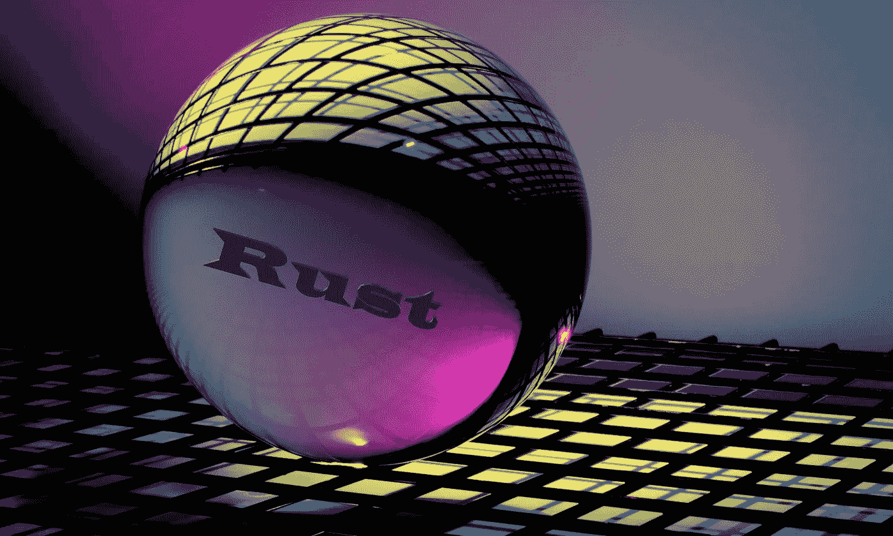

# Rust 分钟初学者编程！

> 原文：<https://medium.com/codex/rust-programing-for-beginners-in-6-mins-8fed31ce0fc2?source=collection_archive---------1----------------------->

## Rust 编程初学者教程。

图片来自 [Unsplash](https://unsplash.com/photos/qDG7XKJLKbs) ，作者修改！

有一次，同事问:“你听说过 Rust 编程吗？它是一种新的编程语言，不是面向对象的，比 C++快得多”。嗯，那时我还没有听说和使用它。然而，这个问题足够激励我去学习如何用 Rust 编程。后来，我参加了一个我的课程:[锈](https://www.udemy.com/course/rust-coding-for-beginners/) …