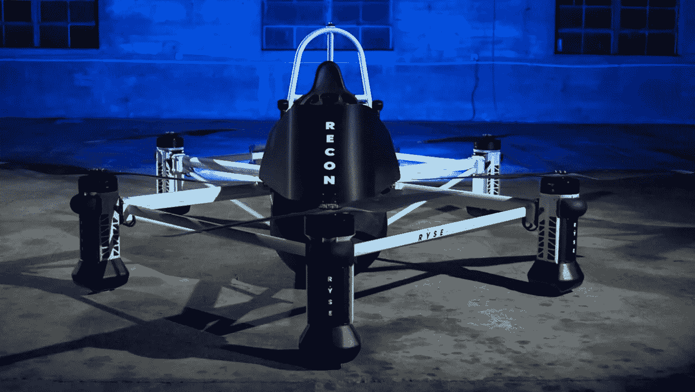

# Ryse Aero Tech 的目标是将 eVTOLs 带给非飞行员！

> 原文：<https://medium.com/codex/ryse-aero-techs-goal-to-bring-evtols-to-non-pilots-2cb7d8852d6d?source=collection_archive---------2----------------------->

## 即使像我这样的傻瓜也会开这辆车

[RECON(Ryse Aero Tech 媒体)](https://ryseaerotech.com/)

最近，电动垂直起降(电动垂直起降)飞行器有了几项创新。Ryse Aero Tech 的电动垂直起降在方法上非常简单，设计时考虑到了非飞行员。侦查机(如上图)只需要很少的训练就可以飞行，并且可以在很少…