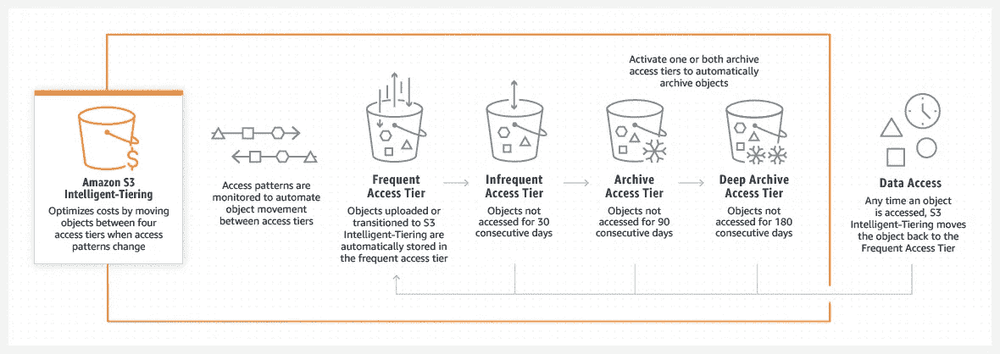

# S3 和 EFS 获得新的智能分层功能

> 原文：<https://medium.com/codex/s3-and-efs-gets-new-intelligent-tiering-features-2f5a514dd177?source=collection_archive---------11----------------------->

对于跨业务部门、团队和产品管理数据的 AWS 客户来说，不可预测的访问模式通常是常态。因此，AWS S3 智能分层于 2018 年首次推出，该功能通过随着访问模式的变化在访问层之间移动数据来自动优化成本。

如果你不知道 S3，我们建议你看看我们关于 AWS S3 基础的文章。

 [## AWS 简单存储服务(S3)

### CD、DVD、笔驱、硬盘等的时代已经一去不复返了。现在，在 AWS S3 上轻松存储从 GB 到 TB 的数据…

yogendrahj.medium.com](https://yogendrahj.medium.com/aws-simple-storage-service-s3-d84a377ebf3d) 

## AWS 在其 S3 智能分层中新增了两项功能:

*   S3 智能分层现在没有针对所有对象的最短存储持续时间。
*   对于小于 128 KB 的对象，不再收取监控和自动化费用。

凭借这些新功能，S3 智能分层成为具有未知、不断变化或不可预测的访问模式的数据的理想存储类别，不受对象大小或保留期的影响。

S3 智能分层适用于所有 AWS 区域，包括 AWS GovCloud(美国)区域、由光环新网运营的 AWS 中国(北京)区域以及由 NWCD 运营的 AWS 中国(宁夏)区域。

 [## 亚马逊 S3 智能分层-针对短期和小型对象改进成本优化|…

### 2018 年，我们首次推出了亚马逊 S3 智能分层(S3 智能分层)。对于跨…管理数据的客户

aws.amazon.com](https://aws.amazon.com/blogs/aws/amazon-s3-intelligent-tiering-further-automating-cost-savings-for-short-lived-and-small-objects/) 

— — — — — — — — — — — — — — — — — — — — — — — — — —

**AWS 弹性文件系统**提供一个简单、无服务器、一劳永逸的弹性文件系统，让您无需配置或管理存储即可共享文件数据。

亚马逊弹性文件系统(亚马逊 EFS)提供四个存储类别:两个标准存储类别，亚马逊 EFS 标准和亚马逊 EFS 标准-不频繁访问(EFS 标准-IA)，以及两个单区域存储类别，亚马逊 EFS 单区域和亚马逊 EFS 单区域-不频繁访问(EFS 单区域-IA)。标准存储类别在多个可用性区域(AZ)内和跨多个可用性区域存储数据。对于不需要多 AZ 恢复能力的工作负载，单区域存储类别在单个 AZ 内冗余存储数据，价格比使用标准存储类别的文件系统低 47%。

在下面的另一篇文章中阅读更多关于 EFS 的内容。

 [## AWS S3 vs EBS vs EFS

### 选择最佳存储选项对您获得的性能以及您将获得的成本起着重要作用…

yogendrahj.medium.com](https://yogendrahj.medium.com/aws-s3-vs-ebs-vs-efs-ec6f5810ab44) 

借助 EFS 智能层的这一新功能，它可以在数据访问模式发生变化时自动优化共享文件存储的成本，而不会产生运营开销。

借助 EFS 智能分层，生命周期管理可以监控您的文件系统的访问模式，并将在生命周期策略期间未被访问的文件从 EFS 标准或 EFS One Zone 移动到 EFS 标准 IA 或 EFS One Zone IA，具体取决于您的文件系统使用的是 EFS 标准还是 EFS One Zone 存储类别。如果再次访问该文件，它将被移回 EFS 标准或 EFS One Zone 存储类。

亚马逊 EFS 智能分层在亚马逊 EFS 可用的所有 AWS 地区都可用。

 [## 新-亚马逊 EFS 智能分层优化了不断变化的访问模式下的工作负载成本|…

### 亚马逊弹性文件系统(亚马逊 EFS)提供四个存储类:两个标准存储类，亚马逊 EFS 标准…

aws.amazon.com](https://aws.amazon.com/blogs/aws/new-amazon-efs-intelligent-tiering-optimizes-costs-for-workloads-with-changing-access-patterns/) 

— — — — — — — — — — — — — — — — — — — — — — — —

> 培养对学习的热情。如果你这样做了，你将永远不会停止成长。

我很高兴在我未来的博客中听到你对任何话题的反馈、建议和要求。

学习并保持好奇心！！！！！

快乐学习，

***尤根德拉***