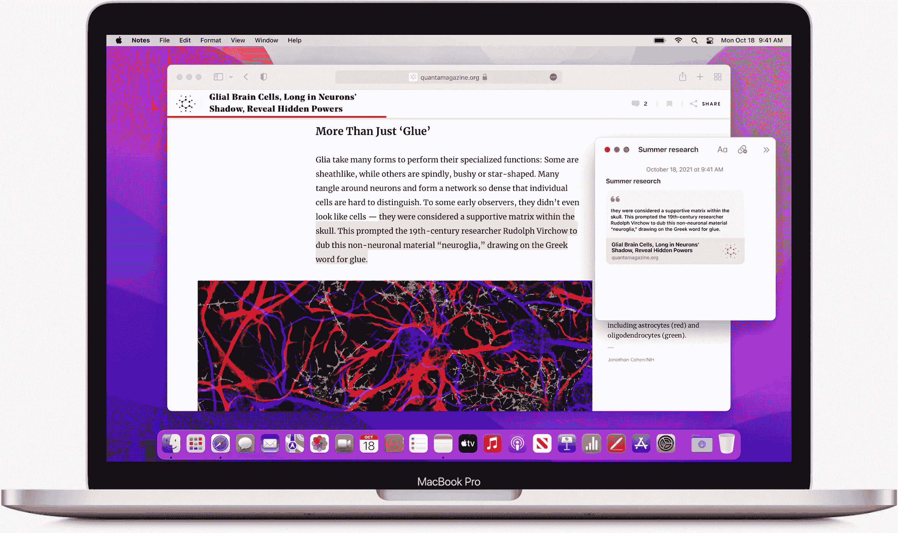
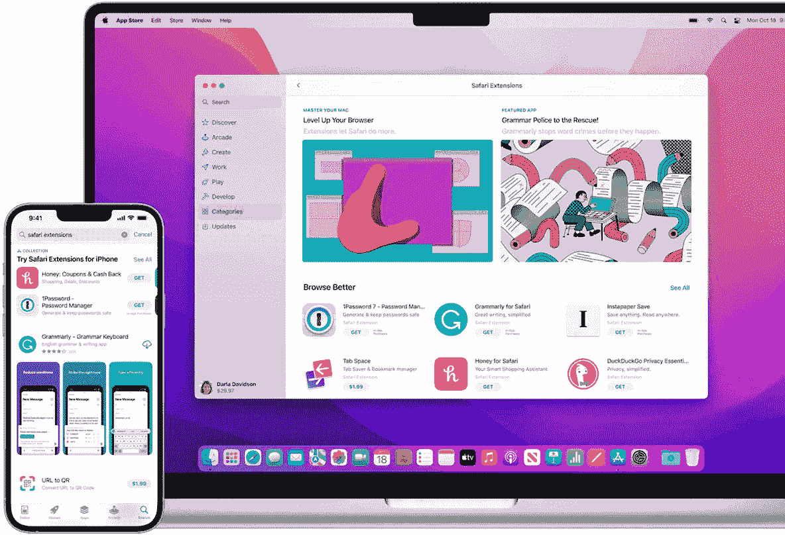
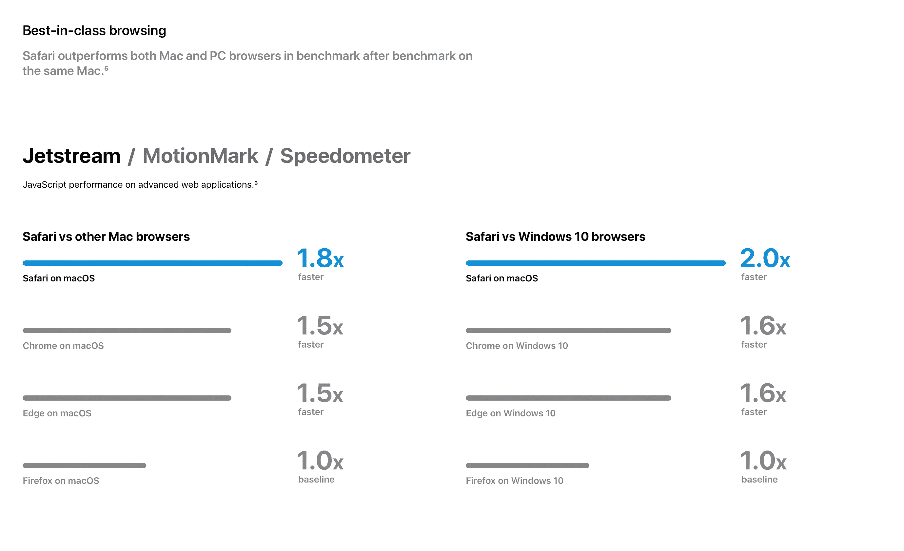
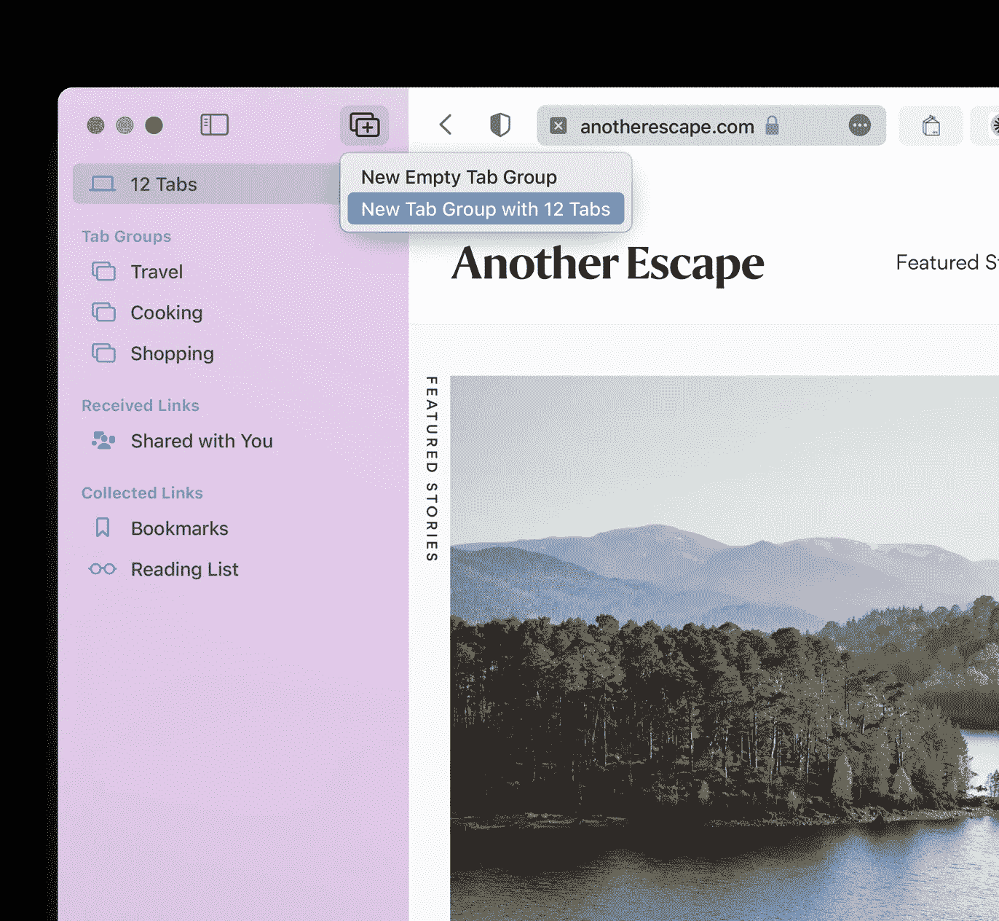

# Safari 还是 Chrome……

> 原文：<https://medium.com/codex/safari-or-chrome-172a8a04132e?source=collection_archive---------3----------------------->

## 如何最好地浏览

我们大多数人都倾向于生活中容易的选择。这是既定的，也不是一个坏政策。生活已经够复杂的了，不需要再增加什么。我们对简单性的选择甚至可以归结为我们使用的应用程序；我们正在使用的设备中的那些。这是千真万确的，当然在 iOS 设备上也是如此，在我们的台式机和笔记本电脑上也是如此。

## 你如何浏览？

我打赌你的 iPads 和 iPhones 都用 Safari。我说的对吗？这首先是因为当我们打开这些设备时，它就在那里，但也因为它非常出色地完成了它的工作。但是，由于某些原因，仍有大量用户对 Chrome 深信不疑。这是一个体面的浏览器，不要误会我的意思。我并不反对它，事实上我确实用它上传视频到 YouTube 上(稍后会有更多)。除了那一项任务，我对 Safari 完全满意，但在这篇博客中，让我们来解决浏览器和浏览器的问题，好吗？

## 力量

Chrome 因耗电而臭名昭著。如果你用的是 MacBook Pro，不要相信我的话，…你自己去查。如果您点按屏幕顶部菜单栏中的电池图标，您可以亲眼目睹哪些应用程序正在使用大量能源。期待看到铬在那里，…打赌你！

Chrome 也是一个狂热爱好者。它一直都是如此，当把 Chrome 和 Safari 进行比较时，这一点变得尤为突出。苹果公司的研究人员已经为他们的硬件优化了他们的浏览器，并且确实显示出来了。

诚然，谷歌一直在这方面努力，但它仍然是一个有利可图的应用。在你的 Mac 上打开活动监视器，然后进入 CPU，看一下内存或能量部分。如果你同时打开 Chrome 和 Safari 中的一些标签，Chrome 几乎总是会为相同的工作消耗更多的能量。

 [## 苹果标签——朋友还是敌人？

### 他们让你成为受害者了吗？

medium.com](/codex/apple-airtags-friend-or-foe-f23318a1b5b3) 

## 它以它应该做的方式工作

Safari 在 Mac 上运行如此之好的主要原因很简单，它就是为 Mac 而生的。Chromes 的大部分根源都在 ChromeOS。macOS 和 ChromeOS 完全是独一无二的野兽，这就是内在问题的开始。

你有没有想过为什么 Chrome 会提示，你要在退出之前按住 *Command+Q* 一段时间？现在你知道了。Mac 应用程序有它们的偏好设置窗口；然而，Chrome 选择使用标签页中的网站。为什么？

毫无疑问，Chrome 要赶上最新的 macOS 功能要慢得多，这不会让你感到惊讶。黑暗模式是 2018 年随着 Mojave 的发布而引入的，Safari 立即支持它。有了 Chrome，大概是六个月后。通知似乎也需要一段时间才能跟上。小事情，但对我们 Mac 用户来说，它们累积起来会对我们一天的工作产生很大影响。

另一个让我有家的感觉的因素是我也可以使用相同的快捷键。毕竟，我是一个习惯性的生物，我确实*喜欢走捷径！！*

## 在扩展方面，Chrome 胜出

我之前提到过，我用 Chrome 上传视频到 YouTube。这是因为我需要使用一个特殊的扩展。然而，这不是 Safari 的疏忽，而是苹果对我们隐私的极度关注。

扩展通过追踪和跟踪我们的浏览历史来工作，正如我们所知，苹果对此并不热衷。有一些 Safari 扩展，并且在快速增长，但是它们的数量远不及你能在 Chrome 上找到的数量。

谷歌的主要业务是广告和广告收入。你，我，我们是商品，我们的数据是他们的金矿。与苹果不同的是，我们是他们的客户，而不是商品。

所以，一定要使用扩展，但是要知道它们是如何工作的。

 [## 信息…蓝色 v 绿色气泡

### 你知道颜色很重要！

medium.com](/@Davidtalkingtech/its-all-about-those-bubbles-f77708b32297) 

## 寿命

Safari 和苹果一般来说，在支持硬件的时间上是不同寻常的。他们提供的在我们的 MAC 电脑上运行的大部分软件也是如此。新版本的 Safari 将在 T2 所有旧的苹果电脑上运行。不过，Chrome 的系统要求会让你在优胜美地(Yosemite)达到能够运行他们最新产品的上限。

## 界面

简单来说就是现在华丽了。标签组、4K 流、翻译、快速笔记集成、实时文本和 Apple Pay……在 Mac 上使用 Safari 的理由不胜枚举。我相信肯定会有反对者，他们仍然会喊着‘是的，但是 Chrome 更好’。帮你自己一个忙，下次你在你的 MacBook 上，打开最新版本的 Safari。老实说，它将浏览提升到了一个全新的水平。

## 结束的

我知道浏览器并不那么性感，但是在我们的数字生活中，我们每天都在使用它们。因此，你难道没有责任让这种体验尽可能安全快捷吗？这都是关于日常生活的质量，对吗？

在你走之前

[T5 加入我的幕后邮件列表 ](https://www.talkingtechandaudio.com)

**原载于 2022 年 2 月 7 日 https://www.talkingtechandaudio.com/blog****的** [**。**](https://www.talkingtechandaudio.com/blog)