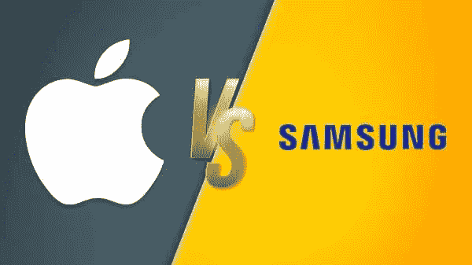
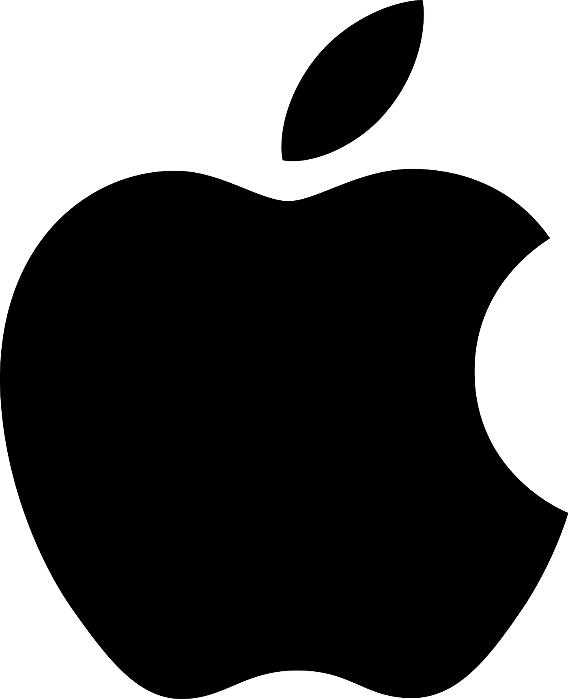
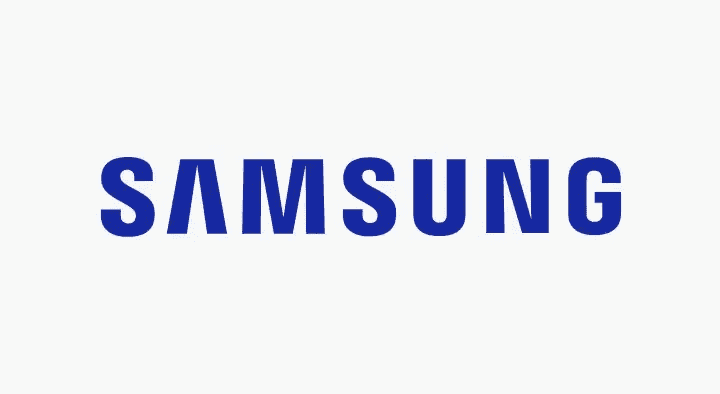

# 三星 VS 苹果——2022 年的终极对决

> 原文：<https://medium.com/codex/samsung-vs-apple-the-ultimate-showdown-2022-3dafc89d1af5?source=collection_archive---------13----------------------->

苹果 VS 三星海报

现在困扰人们太久的一件事是三星和苹果哪个更好。本文将对两家公司的*的各个方面进行比较，并放在一起。从手机质量，到客户服务，再到更好看的 logo 和口号——这是 2022 年的终极对决。请注意，我没有最喜欢的，我认为他们都很好。*

*我将在本文中讨论的方面如下:*

*   *电话价格*
*   *手机质量(包括耐用性)*
*   *手机电池*
*   *操作系统支持*
*   *手机摄像头的质量和功能*
*   *更易于使用的操作系统*
*   *客户服务质量*
*   *物理电话定制*
*   *标志外观*
*   *广告质量*
*   *口号力度*
*   *与计算机的兼容性*

*既然我已经列出了这么长的清单，让我们来看看好的东西。我想补充的另一件事是，我正在比较本文中的最新旗舰手机(Iphone 13 和 S22 Ultra)。不管怎样，首先，手机价格。*

# ***1 —手机价格—得分:苹果(0)—三星(0)***

*如果你问我，现在这两款手机都很贵，但由于一些商店会打折，我会使用三星和苹果的官方网站，如果那里有任何折扣，它们都算数。存储空间将设置为 128GB，颜色为石墨色。现在以澳元计算，Iphone 13 Pro 的新价格为 1699 美元。S22 Ultra 售价 1849 美元。这意味着苹果手机便宜了 150 澳元。所以苹果赢了。但有时价格并不代表一切，质量可能会大大有利于苹果或三星。 **1:0***

# ***2 —手机质量—得分:苹果(1) —三星(0)***

*我花了一段时间才想出如何公正地判断这个问题，但我有了一个非常好的主意。我写了一个解决耐久性问题的独立组件的列表，然后找到了其他人进行的研究和实验，然后我将它们纳入了本文。以下是我集思广益得出的几点:*

*   *屏幕抗划伤性*
*   *后盖耐刮擦性*
*   *断裂/破裂前高度下降*

# ***2a)** 屏幕耐刮性:*

*对于苹果方面，我研究了苹果用于屏幕的玻璃类型，发现这里的[【1】](https://www.knowyourmobile.com/phones/does-the-iphone-13-need-a-screen-protector/)。对了，所有参考文献都会在文章末尾。这个网站说苹果称之为陶瓷盾。现在为了充分理解这是什么，我在这里读了一篇文章[【2】](https://www.androidauthority.com/apple-ceramic-shield-1170032/)，这篇文章非常清楚地定义了这是什么。然后我发现这是什么硬度水平[这里【3】](https://www.macrumors.com/2020/10/28/iphone-12-ceramic-shield-test-jerryrigeverything/)(我知道这个网站说这是 iPhone 12，但显然屏幕是一样的——我发现这里[【4】](https://www.macrumors.com/guide/iphone-13-vs-iphone-12/))。因此，iPhone 的屏幕由陶瓷屏蔽玻璃制成，莫氏硬度为 6，凹槽的硬度为 7。*

*对于三星，我发现划痕出现在 6 处，这意味着 S22 Ultra 的莫氏硬度为 5。我在这里找到了信息。所以基本上屏幕的莫氏硬度是 5，小划痕从 6 开始出现。*

*总结这一部分，苹果得到了 6 分，三星得到了 5 分——这意味着我必须把这一部分交给苹果。 **1:0***

# ***2b)后盖防刮擦:***

*为了找出这一点，我做了与上面非常相似的事情。我发现了材料，然后莫氏硬度水平。对于苹果来说，Iphone 13 是铝制的(发现这里的[【6】](https://appleinsider.com/inside/iphone-13))，然而背面和正面涂有相同的玻璃！(发现[这里【7】](https://www.macrumors.com/roundup/iphone-13-pro/))和 S22 是一样的！(参考[此处【8】](https://screenrant.com/samsung-galaxy-s22-ultra-durability-test-results/))所以我们已经有了三星的抗刮性，Moh 的 5 级。而对于苹果铝是 2.5–3(发现[这里【9】](https://www.jewelrynotes.com/the-mohs-scale-of-hardness-for-metals-why-it-is-important/))，但是因为他们把玻璃放回去，变成了 6(和屏幕一样)。*

*总结这一小节，Iphone 13 的莫氏硬度表背面硬度为 **6** ，S22 Ultra 为 **5。**所以这部分的赢家是苹果！ **2:0***

# *2c)断裂或破裂前的下降高度:*

*我做了一些研究，发现 iPhone 13 可以承受从 6 英尺跌落到人行道上。(参考[此处【10】](https://www.cravingtech.com/how-tough-is-the-new-iphone-13-here-are-some-iphone-13-drop-test-results.html))而 S22 根据[此处【11】](https://www.corning.com/gorillaglass/worldwide/en/glass-types/gorilla-glass-victus.html)可以存活 2 米(或 6.5 英尺)。因此，S22 赢得这一部分，将比分带到 **2:1***

# *2d)总结:*

*我们获得的最终分分数是苹果的 **2** 和三星的 **1** ，这意味着苹果再次抢走了这一部分。这使比分上升到**苹果(2)——三星(0)***

# ***3 —** 手机电池—得分:苹果(2) —三星(0)*

*在本节中，我将比较电池的电量，以及它的持续时间——因为即使电池容量相同，操作系统也可能会消耗过多的电量，从而改变这个数字的含义。我还会说充电速度。*

*据称，iPhone 13 的持续视频播放时间长达 19 小时([此处【12】](https://screenrant.com/iphone-13-battery-life-lasts-how-long-apple/))，而 S22 仅为 7.5 小时([此处【13】](https://www.phonearena.com/news/Samsung-Galaxy-S22-battery-specs_id136446))。这是一个 12.5 小时的疯狂差。62 分钟充满 S22 ( [此处【14】](https://www.phonearena.com/news/samsung-galaxy-s22-ultra-plus-45w-charging-vs-25w-charging_id138976))，同样瓦数的 iPhone 13 ( [此处【15】](https://edition.cnn.com/cnn-underscored/electronics/best-iphone-13-charger))90 分钟！但三星仍然没有在这里弥补自己，iPhone 需要多充电 30 分钟，多运行 12.5 小时！我认为 iPhone 以里程碑的方式赢得这一节，所以 **3:0** 给苹果。*

# *4 —操作系统支持—得分:苹果(3):三星(0)*

*操作系统支持是指在手机首次发布后，手机制造商将在多长时间内向手机发送更新。S22 的保证支持时间是 4 年([此处【16】](https://www.androidcentral.com/how-long-will-samsung-galaxy-s22-series-receive-software-updates))，iPhone 13 的保证支持时间是 7 年([此处【17】](https://www.macworld.com/article/675021/how-long-does-apple-support-iphones.html))，所以苹果再次赢得这一部分，将比分带到 **4:0** 。*

# *5 —手机摄像头质量—得分:苹果(4 分):三星(0 分)*

*在本节中，我将比较以下内容:*

*   *背面摄像头质量*
*   *前置摄像头质量*
*   *背面摄像头 FPS*
*   *前置摄像头 FPS*
*   *火炬力量*
*   *变焦距离*

*这一部分也将有一个子分数，以确定最终的总赢家。让我们开始…*

# ***5a)背部摄像头质量:***

*S22 的后置摄像头(主摄像头)的摄像头质量是 108MP(老实说这很可笑，在这里找到)而 iPhone 13 有 12MP ( [在这里【19】](https://www.cnet.com/tech/mobile/iphone-13-vs-iphone-13-mini-vs-iphone-13-pro-vs-iphone-13-pro-max/))所以三星必须赢得这一子部分。 **0:1** 三星。*

# *5b)前置摄像头质量:*

*三星还推出了一款 4000 万像素的自拍相机([here【20】](https://www.androidauthority.com/samsung-galaxy-s22-ultra-camera-test-vs-best-camera-phones-3132563/))。与 iPhone 的 1200 万前置摄像头相比，很明显谁也赢得了这个子类别， **0:2** 三星。*

# ***5c)背部摄像头 FPS:***

*这里是 iPhone 开始竞争的地方。S22 可以在主摄像头上拍摄 4K60，也可以拍摄 8K24 ( [此处【21】](https://www.gsmarena.com/samsung_galaxy_s22_ultra-review-2382p7.php))，iPhone 13 在 Max 时产生 4k 60([此处【22】](https://www.macrumors.com/roundup/iphone-13-pro/))。所以我唯一要决定的是，S22 可以捕获 8K24，所以——对不起，iPhone，但这是三星的。 **0:3** 。*

# *5d)前置摄像头 FPS:*

*iPhone 在这方面可以做 1080 p30([此处【23】](https://www.dxomark.com/apple-iphone-13-pro-selfie-review-excellent-video-selfies/))和 S22…4K60 ( [此处【24】](https://www.phonearena.com/news/samsung-galaxy-s22-camera_id136460))，和主摄像头一样。这一小节很明显是去三星的，没有进一步说。 **0:4** 。*

# ***5e)火炬功率:***

*我找不到任何关于 S22 Ultra 或 iPhone 13 Pro Max 闪光灯发光的信息。如果你有这方面的任何信息，请评论它，因为它真的会有所帮助。*

# *5f)变焦距离:*

*S22 Ultra 可以变焦 30 倍([此处【25】](https://www.androidauthority.com/samsung-galaxy-s22-ultra-30x-zoom-3122219/))，iPhone 13 Pro Max 可以变焦 3 倍([此处【26】](https://www.tomsguide.com/reviews/iphone-13-pro-max))。所以我觉得这个子板块又去三星了。 **0:5***

# *5g)结论:*

*所以在相机部分有了 **0:5** ，我不得不把这部分交给三星，把主分提升到 **4:1** 给苹果。*

# *6 —更易于使用的操作系统—得分:苹果(4 分):三星(1 分)*

*根据[这个调查【27】](https://www.gsmarena.com/newscomm-32922p10.php)IOS 是更好的操作系统，我不知道还能怎么判断这一节——所以苹果有这个， **5:1** 。*

# *7 —客户服务质量—得分:苹果(5 分):三星(1 分)*

*对于这一次，我将再次进行客户调查，因为即使我进行了测试，也没有足够的数据来确定谁会胜出。我在 Quora 上看了一下这个调查，我发现大多数评论都是支持苹果的，所以这一部分是给他们的。 **6:1** 。*

# *8——物理手机定制——得分:苹果(6 分):三星(1 分)*

*这一部分也将分成几个部分:*

*   *电话颜色*
*   *手机存储*
*   *电话内存*

# *8a)手机颜色:*

*从苹果官方网站购买时，iPhone 13 Pro Max 有 5 种颜色可供选择。当用三星的 S22 Ultra 做同样的事情时，有 7 种颜色。将这一部分交给了三星。 **0:1** 。*

# ***8b)手机存储:***

*对于 iPhone 13 Pro Max，存储有 4 种选择，与三星的 S22 Ultra 相同。所以，这一节是平局，比分停留在 **0:1** 。*

# *8c)手机内存:*

*S22 Ultra 可以购买 8GB 或 12GB 的内存。iPhone 13 只需 6GB 内存就能买到。所以，这一小节也归三星。 **0:2** 。*

# *8d)结论:*

*这一节的最终比分是 **0:2** ，三星。这意味着他们赢得了这一部分！这使得总比分达到 **6:2** 。对于这一部分，唯一的参考是三星和苹果的官方网站。你可以在这里找到它们[【29】](https://www.apple.com/au/shop/buy-iphone/iphone-13-pro)和[【30】](https://www.samsung.com/au/smartphones/galaxy-s22-ultra/buy/)。*

# *9-标志外观-得分:苹果(6 分):三星(2 分)*

*在我们开始唤起你的记忆之前，这里是苹果和三星的标志:*

**

*苹果标志*

**

*三星标志*

*我认为这两个标志都非常简单，这没有给我太多的判断。苹果 logo 是实际的插图，三星 logo 只是文字。我认为这一部分属于苹果，因为这是一个插图，但仍然代表了他们的公司，是可以识别的。主比分现在是 **7:2** 。*

# *10 —广告质量—得分:苹果(7):三星(2)*

*这将根据苹果和三星为 S22 Ultra 和 iPhone 13 Pro Max 发布的最新广告来判断。他们在这里:*

*我觉得两个广告都不错。然而，我将把重点放在三星上，因为它更多地展示了产品。苹果的广告只是吹嘘新的绿色，并试图影响用户认为这在某种程度上与自然有关，然而三星则强调了手机的新功能，并在行动中展示了它们。所以，这又一次是三星将比分带到了 **7:3** 。*

# *11 —口号力度—得分:苹果(7):三星(3)*

*这些公司的口号是:*

***苹果:** *想不同* ( [此处【31】](https://blog.hubspot.com/marketing/brand-slogans-and-taglines))*

***三星:** *激励世界，创造未来*(此处[【32】](https://logotaglines.com/samsung-logo-tagline/))*

*我认为这两个口号都很吸引人。苹果的更短，更具体，然而三星的真的很深。所以，我要给这一节打个平手，把比分留在 **7:3** 。*

# *12——与电脑的兼容性——得分:苹果(7 分):三星(3 分)*

*这是决定三星是否能得到最后一分，将他们的分数提高一点的最后一节，或者苹果可以确保更多的胜利。让我们来看看…*

*与电脑的兼容性是手机与电脑连接的好坏。从我发现的情况来看，Android 只连接 Windows，iPhone 只连接 Mac。所以让我们看看他们是如何联系和完成这篇文章的！*

*Android 可以使用'[Phone Link[33]【T1]'连接到 Windows。该程序允许您查看通知、消息和接听电话。它还允许远程连接到手机，所以你可以在你的电脑上使用你的手机！您可以回复大多数通知，向任何人发送消息以及给任何人打电话。您还可以发送链接到 Windows，并查看手机上的所有照片-在 Windows 上！](https://apps.microsoft.com/store/detail/phone-link/9NMPJ99VJBWV?hl=en-au&gl=AU)*

*iOS 可以使用“[连续性[34]](https://www.apple.com/au/macos/continuity/) 连接到 Mac。除了远程连接到你的手机，这个应用程序可以做 Phone Link 所做的一切。因此，这一部分必须交给三星和 Windows，他们的“[”Phone Link 应用程序[35]](https://apps.microsoft.com/store/detail/phone-link/9NMPJ99VJBWV?hl=en-au&gl=AU) ”将最终得分带到苹果 7 和三星 4！*

# ***结论——得分:苹果(7 分):三星(4 分)***

*最后的赢家是苹果以三分之差击败三星。以下是所有类别的结果及其获奖者。*

*   *手机价格——苹果 **1:0***
*   *手机质量(包括耐用性)—苹果 **2:0***
*   *手机电池——苹果 **3:0***
*   *操作系统支持—苹果 **4:0***
*   *手机摄像头质量和功能—三星 **4:1***
*   *更易于使用的操作系统—苹果 **5:1***
*   *客户服务质量——苹果 **6:1***
*   *物理手机定制—三星 **6:2***
*   *标志外观—苹果 **7:2***
*   *广告质量—三星 **7:3***
*   *口号力度—平局 **7:3***
*   *与电脑的兼容性—三星 **7:4***

*所以，祝贺苹果，你似乎赢得了这场胜利，但没人说三星会带着他们的新旗舰手机回来。如果这篇文章中有任何错误，请给我发消息，因为它会有所帮助。另外，请注意，我将很快发布新的内容。感谢您的阅读，并享受您的一天…再见👋。*

*如果您需要参考资料，请参考以下内容:*

*1:[https://www . knowyourmobile . com/phones/does-the-iphone-13-need-a-screen-protector/](https://www.knowyourmobile.com/phones/does-the-iphone-13-need-a-screen-protector/)
2:[https://www . androidauthority . com/apple-ceramic-shield-1170032/](https://www.androidauthority.com/apple-ceramic-shield-1170032/)
3:[https://www . MAC rumors . com/2020/10/28/iphone-12-ceramic-shield-test-jerryrigeverything/【T7](https://www.macrumors.com/2020/10/28/iphone-12-ceramic-shield-test-jerryrigeverything/)
13:[https://www . phone arena . com/news/Samsung-Galaxy-S22-battery-specs _ id 136446](https://www.phonearena.com/news/Samsung-Galaxy-S22-battery-specs_id136446)
14:[https://www . phone arena . com/news/Samsung-Galaxy-S22-ultra-plus-45w-charging-vs-25w-charging _ id 138976](https://www.phonearena.com/news/samsung-galaxy-s22-ultra-plus-45w-charging-vs-25w-charging_id138976)
15:[https://edition . CNN . com/com](https://edition.cnn.com/cnn-underscored/electronics/best-iphone-13-charger)
26:[https://www.tomsguide.com/reviews/iphone-13-pro-max](https://www.tomsguide.com/reviews/iphone-13-pro-max)
27:[https://www.gsmarena.com/newscomm-32922p10.php](https://www.gsmarena.com/newscomm-32922p10.php)
28:[https://www . quora . com/How-would-you-compare-the-customer-support-of-Apple-to-Samsung](https://www.quora.com/How-would-you-compare-the-customer-support-of-Apple-to-Samsung)
29:[https://www.apple.com/au/shop/buy-iphone/iphone-13-pro](https://www.apple.com/au/shop/buy-iphone/iphone-13-pro)
30:[https://www . Samsung . com/au/smart phones/ HL = en-AU&GL = AU](https://www.samsung.com/au/smartphones/galaxy-s22-ultra/buy/)
34:[https://www.apple.com/au/macos/continuity/](https://www.apple.com/au/macos/continuity/)
35:[https://apps . Microsoft . com/store/detail/phone-link/9 nmpj 99 vjbwv？hl=en-au & gl=AU](https://apps.microsoft.com/store/detail/phone-link/9NMPJ99VJBWV?hl=en-au&gl=AU)*