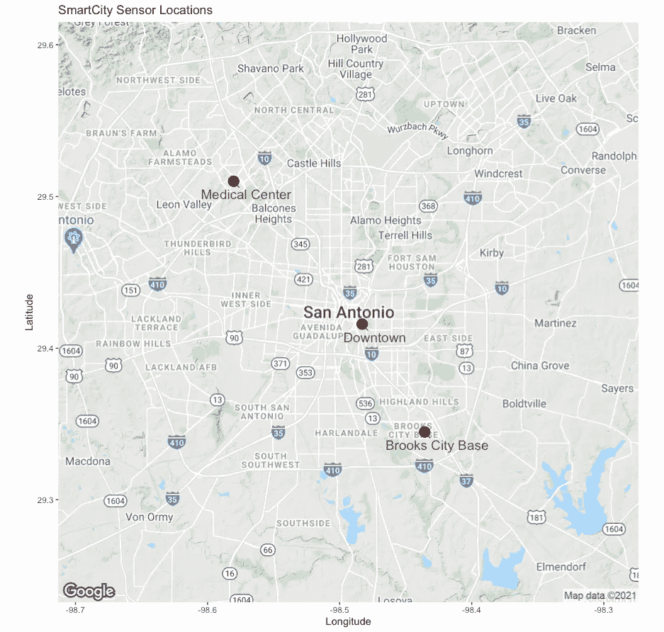
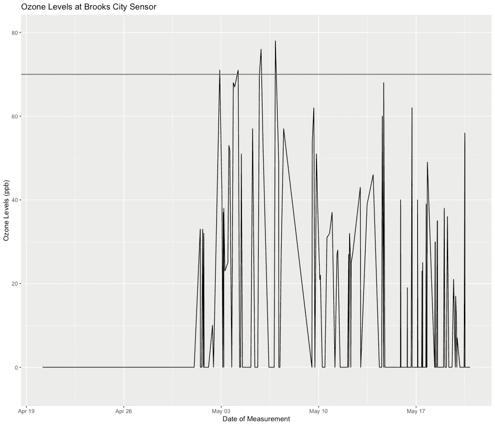
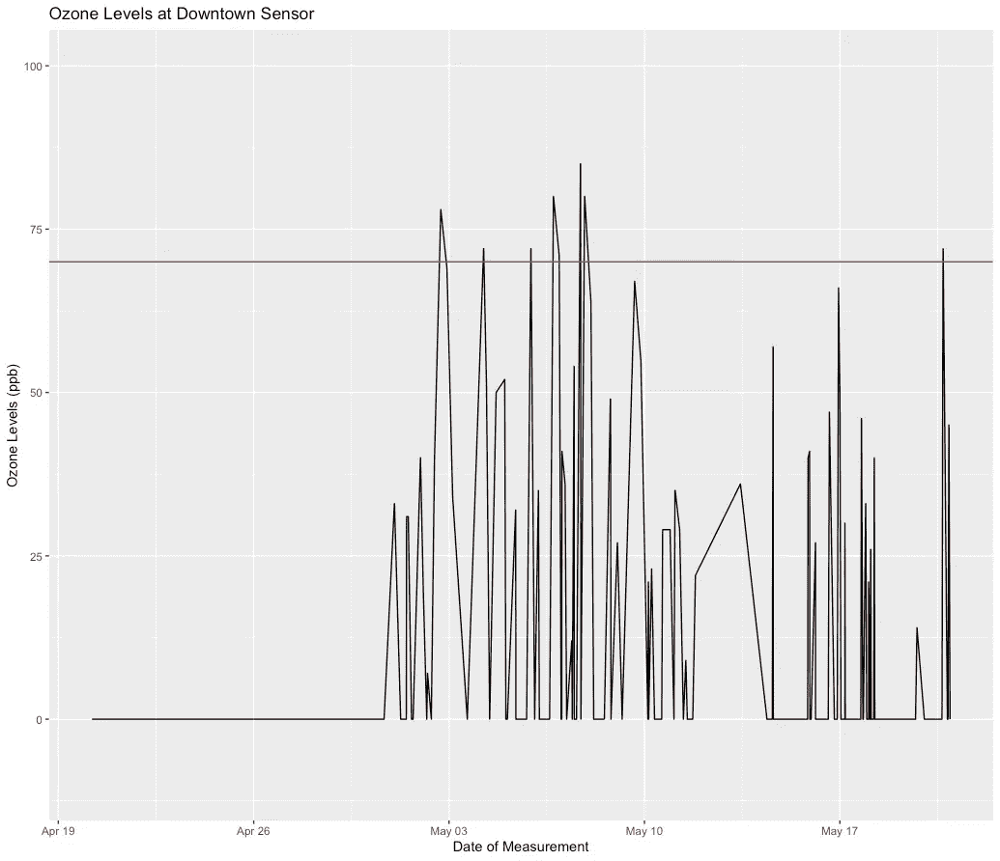
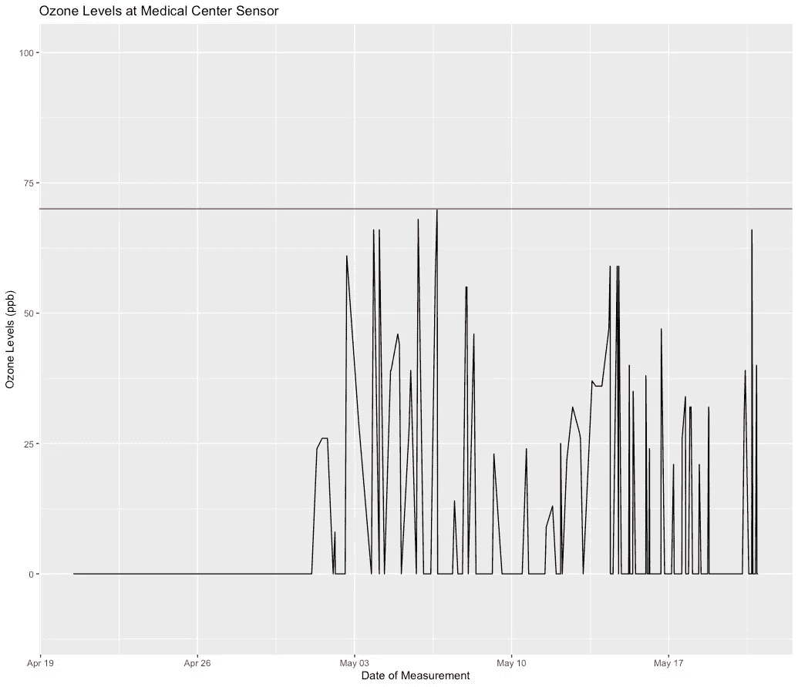
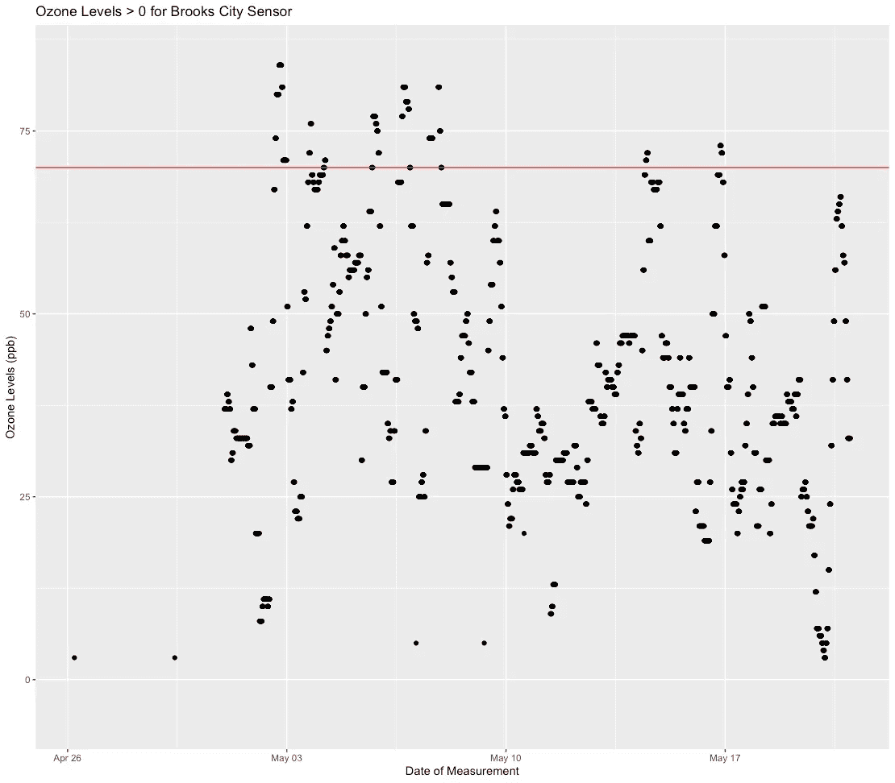
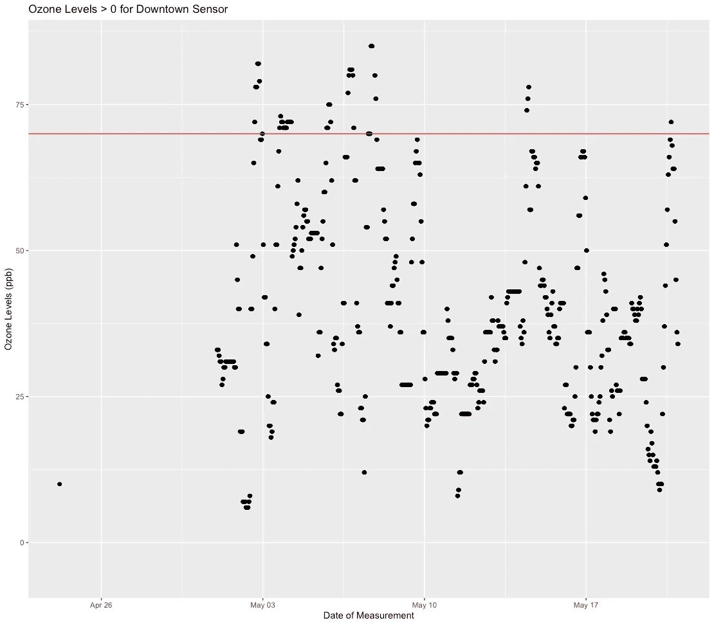
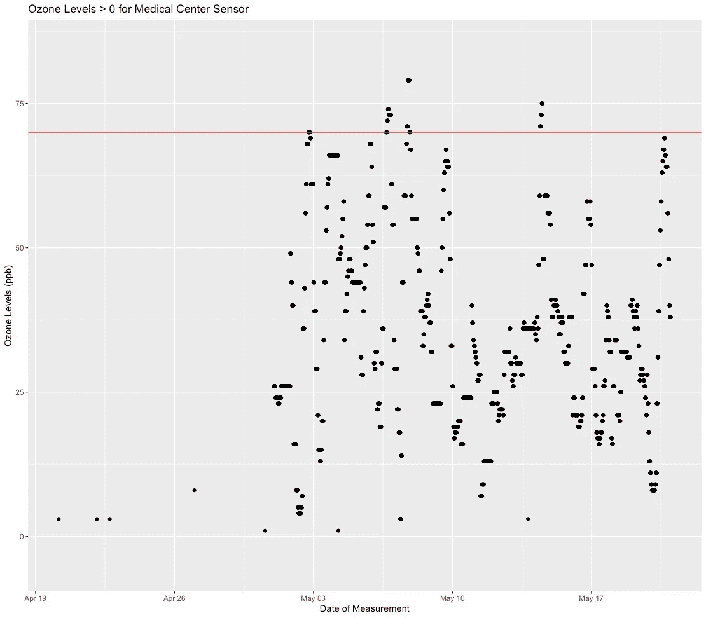

# 圣安东尼奥空气质量

> 原文：<https://medium.com/codex/san-antonio-air-quality-b4872e5bda87?source=collection_archive---------26----------------------->

这肯定会和以前的帖子有很大的不同。我不再看我最喜欢的棒球运动员的统计数据，而是看圣安东尼奥的智能城市传感器收集的一些空气质量数据。传感器被放置在城市的三个不同的地方——市中心、医疗中心和布鲁克斯市基地区。



这些智能城市传感器是几年前安装的，作为圣安东尼奥新计划的一部分，但这些数据迄今为止似乎尚未得到深入研究。传感器可以测量和跟踪多个变量。对于这个项目的第一部分，我最感兴趣的是在这些地方测量的空气质量。

圣安东尼奥最近一直在努力达到美国环保署清洁空气法案的空气质量标准，使该市受到更严格的监督和排放监管。这并不奇怪——圣安东尼奥是一个庞大、杂乱的城市，被多条高速公路和高速公路一分为二。在这个城市里，去任何地方基本上都需要一辆汽车。

圣安东尼奥报道今天刚刚发表了一篇文章，内容是关于圣安东尼奥的雾霾有多严重，以及污染的空气是如何危害居民健康的。这座城市将受到进一步的监管，这可能会损害企业和经济，至少企业主和一些政界人士是这样认为的。另一方面，这种糟糕的空气质量伤害了居民，影响了他们实际外出和出差的能力，因此，拥有清洁的空气似乎符合每个人的最佳利益。

报告中有一项我觉得很有趣，那就是车主们现在必须每年对他们的车辆进行排放测试，如果说有一件事是美国人喜欢的，那就是他们那辆排放有毒气体的大卡车。报告中特别提到了臭氧，但颗粒物等其他有害污染物也令人严重关切。糟糕的空气质量影响着每个人，尤其是生活在贫困和被忽视社区的居民。这些社区的负面健康结果发生率更高，如哮喘、肺病和各种心血管疾病。为了这个项目，我会看看所有这些。

**数据集**

圣安东尼奥的 CivTech Datathon 公布了他们的 SmartCity 传感器的数据，并要求公众查看这些数据。我无法注册一个团队参加比赛，但我想看看他们为我自己发布了什么数据。

这三个空气质量数据集非常庞大。有 16 列，每列有超过 23，000 个观察结果。从 2021 年 4 月 20 日到 2021 年 5 月 20 日，传感器每 3 分钟进行一次测量。有整整一个月的数据，我们可以用来推断一些更大的见解。感兴趣的一些列是:Pm 1.0、Pm 2.5、Pm10、SO2(二氧化硫)、O3(臭氧)、CO(一氧化碳)和 NO2(二氧化氮)的测量值。最后一栏也称为“触发警报”，指示这些污染物的测量值是否高到足以触发空气质量警报。

Pm1.0、Pm2.5 和 Pm10 都是容易吸入的细颗粒物，Pm2.5 与最严重的健康影响有关。颗粒物质可以深入到你的肺部和血液中，这会导致各种问题。颗粒物特别危险，因为它通常是由大气中其他污染物的混合物组成的。

二氧化硫(SO2)是通过燃烧化石燃料，尤其是发电厂的燃烧排放到大气中的。儿童特别容易受到大气中高浓度二氧化硫的影响。二氧化氮也通过排放物排放到空气中，并与空气中的其他颗粒相互作用，形成有害的颗粒物。一氧化碳从燃烧燃料的车辆和机器中释放到大气中。臭氧被吸入后，会对人体器官和组织产生负面影响，对患有呼吸系统疾病的人来说是一个严重的问题。

我敢肯定这些传感器仍在收集数据，但所有可用的是 4 月至 5 月的测量和读数。我计划查看所有三个地点的每种污染物的水平，触发了哪些警报，触发的频率是多少，并希望以某种易于阅读的格式将所有信息汇总起来。

**臭氧**

对于第一种污染物，我将看看由三个传感器测得的臭氧水平。我会从布鲁克斯市基地的传感器开始，一路向北。我使用 R 进行分析，我的一些代码可能很笨拙，所以如果有需要改进的地方，请告诉我！

在超过 23，000 次的观察中，我将观察随机样本。我打算从 250 开始，看看情况如何，然后在此基础上进一步完善。250 似乎不是太多的观察，所以在以后的版本中，我可能要调整我的图表轴。

首先，我将展示我用来获得随机 250 个观察样本的代码，以及我如何绘制观察结果。使用“tidyverse”包可以很容易地获取数据样本。在代码的“ggplot”部分，我使用了“scale_x_datetime()”函数来确保 x 轴易于阅读，并将 y 轴的可读性扩展到 0 以下。

```
cosa_brooks_sample <- COSA_Brooks_Air_Quality %>%
  sample_n(250)
ggplot(cosa_brooks_sample, aes(x = DateTime, y = O3)) +
  geom_line() +
  scale_x_datetime() +
  ylim(-10, 100)cosa_downtown_sample <- COSA_Downtown_Air_Quality %>%
  sample_n(250)
ggplot(cosa_downtown_sample, aes(x = DateTime, y = O3)) +
  geom_line() + 
  scale_x_datetime() + 
  ylim(-10, 100)cosa_medcenter_sample <- COSA_Medical_Center_Air_Quality %>%
  sample_n(250)
ggplot(cosa_medcenter_sample, aes(x = DateTime, y = O3)) +
  geom_line() +
  scale_x_datetime() +
  ylim(-10, 100)
```

以下是制作的图:



不幸的是，数据集没有附带数据字典，所以我假设所有的臭氧测量值都是十亿分之一(ppb ),这是 EPA 测量臭氧的传统方法。2015 年，美国环保署将地面臭氧(对人类最有害)的标准比率从 75 ppb 降至 70 ppb，并在 2018 年决定保持 2015 年的标准。

上图中的红线表示 EPA 规定的可接受的 O3 水平。Brooks City Base 传感器和 Downtown 传感器在可获得观测数据的时间内都测量到了显著的 O3 水平。在 5 月 3 日至 10 日这一周，所有三个传感器都记录了显著的 O3 峰值，尽管布鲁克斯市和市中心在此期间的 O3 水平高于医疗中心。在许多情况下，臭氧含量高于环境保护局规定的标准。比起布鲁克斯或医疗中心，我更熟悉市区，所以我很容易理解那里的 O3 浓度为什么会更高。圣安东尼奥市中心很小但是很密集，但是仍然有很多车辆来往。还有大量的建筑和重型机械参与其中，这无疑对市区的臭氧排放起到了一定的作用。

此外，需要记住的一个重要因素是，这只是数据集中 250 个观察值的随机样本。也许它不够大，无法获得更准确的信息。这让我思考如何更好地可视化这些数据。我仔细观察了一下，绝大多数的观察显示臭氧读数为 0。当我说绝大多数的时候…想象一下 22，000 个值为 0 的观察值。所以我决定只对大于 0 的观察值进行过滤和绘图。



上图显示了每次臭氧测量值大于 0 时的记录。每个传感器大约要测量 5000 次。显然，它看起来不像图表上的 5000 个单独的点，很可能每次记录时测量水平都是相同的。但是上面的散点图更准确地显示了这三个地区臭氧测量值的分布。

接下来，我查看了 3 个传感器区域的 O3 水平超过 EPA 标准的次数。使用“计数”动词，我提取了传感器测量到 O3 水平超过 70 的次数。

```
cosa_brooks_O3 %>% # How often O3 levels exceeded 70
  count(O3 > 70)
# A tibble: 2 x 2
  `O3 > 70`     n
  <lgl>     <int>
1 FALSE     22643
**2 TRUE        432**cosa_downtown_O3 %>% # How often O3 levels exceeded 70 at Downtown sensor
  count(O3 > 70)
# A tibble: 2 x 2
  `O3 > 70`     n
  <lgl>     <int>
1 FALSE     22887
**2 TRUE        492**cosa_medcenter_O3 %>% # How often O3 levels exceeded 70 at MedCenter
  count(O3 > 70)
# A tibble: 2 x 2
  `O3 > 70`     n
  <lgl>     <int>
1 FALSE     23247
**2 TRUE        132**
```

上表显示，Brooks City Base 传感器和 Downtown 传感器比医疗中心更频繁地出现高水平的 O3。在 30 天的时间里，市中心的传感器每天测量 70 以上的 O3 水平约 16 次，而医疗中心每天只有 4 次。

这些传感器触发了多少臭氧警报？

```
cosa_brooks_test %>%
  count(AlertTriggered == "o3")
# A tibble: 2 x 2
  `AlertTriggered == "o3"`     n
  <lgl>                    <int>
**1 TRUE                         5**
2 NA                        5760cosa_downtown_test %>%
  count(AlertTriggered == "o3")
# A tibble: 2 x 2
  `AlertTriggered == "o3"`     n
  <lgl>                    <int>
**1 TRUE                         4**
2 NA                        5760cosa_med_center_test %>%
  count(AlertTriggered == "o3")
# A tibble: 2 x 2
  `AlertTriggered == "o3"`     n
  <lgl>                    <int>
**1 TRUE                         7**
2 NA                        5760
```

在数据集的时间段内，臭氧触发的警报数量看起来有点低，肯定比我想象的要低，因为臭氧水平的测量次数超过 70 次。

现在，让我们来看看触发警报时测量的日期、时间和 O3 水平。

```
cosa_brooks_test %>%
  select(DateTime, O3, AlertTriggered) %>%
  filter(AlertTriggered == "o3")
# A tibble: 5 x 3
  DateTime               O3 AlertTriggered
  <dttm>              <dbl> <chr>         
1 2021-05-10 13:50:46    20 o3            
2 2021-05-09 07:19:07     5 o3            
3 2021-05-07 03:05:46     5 o3            
4 2021-04-29 10:06:18     3 o3            
5 2021-04-26 05:10:46     3 o3cosa_downtown_test %>%
  select(DateTime, O3, AlertTriggered) %>%
  filter(AlertTriggered == "o3")
# A tibble: 4 x 3
  DateTime               O3 AlertTriggered
  <dttm>              <dbl> <chr>         
1 2021-04-24 04:20:34    10 o3            
2 2021-04-24 04:35:43    10 o3            
3 2021-04-24 04:45:12    10 o3            
4 2021-04-24 04:51:31    10 o3cosa_med_center_test %>%
  select(DateTime, O3, AlertTriggered) %>%
  filter(AlertTriggered == "o3")
# A tibble: 7 x 3
  DateTime               O3 AlertTriggered
  <dttm>              <dbl> <chr>         
1 2021-05-13 19:23:43     3 o3            
2 2021-05-04 06:03:39     1 o3            
3 2021-04-30 13:40:03     1 o3            
4 2021-04-27 00:03:08     8 o3            
5 2021-04-22 02:13:19     3 o3            
6 2021-04-22 17:48:01     3 o3            
7 2021-04-20 04:02:24     3 o3
```

有趣的是，当臭氧水平达到 70 或更高时，警报从未被触发。这让我觉得要么是传感器出了问题，要么更有可能是我在数据中遗漏了什么。

这是圣安东尼奥臭氧水平的简要介绍，由圣安东尼奥的这些新的智能城市传感器测得。显然，这座城市在控制地面臭氧排放方面还有很多工作要做。但是个人行为也很重要。如果可以的话，乘公共汽车，骑自行车或者步行去你要去的任何地方。你会更喜欢这次旅行，如果你也能得到一些锻炼，这是值得的。请继续关注这些传感器测量的其他污染物的未来部分！

[](https://sanantonioreport.org/san-antonio-epa-tceq-air-quality-regulations/) [## 圣安东尼奥面临强化的联邦空气质量法规

### 圣安东尼奥很快将加入纽约和加州萨克拉门托等烟雾城市的行列，此前它未能…

sanantonioreport.org](https://sanantonioreport.org/san-antonio-epa-tceq-air-quality-regulations/) [](https://sites.google.com/geekdom.com/2021-smartsa-datathon-data-cat/home) [## 2021 SmartSA 数据通-数据目录

### 今年，Allosense Inc .慷慨地向我们的参与者提供了他们在去年的…

sites.google.com](https://sites.google.com/geekdom.com/2021-smartsa-datathon-data-cat/home)