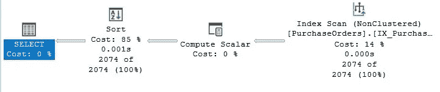
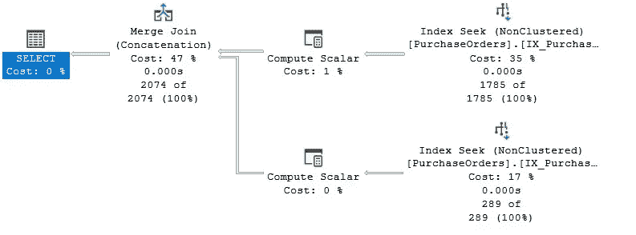
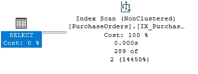
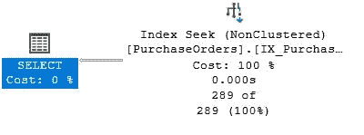

# SQL Server 中的可搜索谓词和空值

> 原文：<https://medium.com/codex/sargable-predicates-and-null-values-in-sql-server-c43ec3d8b108?source=collection_archive---------4----------------------->

## 将不可搜索谓词转换为可搜索谓词

在这篇文章中，我将讨论被称为可搜索性的概念，用一些关于空值的考虑来丰富它。在 Itzik Ben-Gan 举办的一次会议上，我有机会研究 sargable 谓词，这给了我灵感。

维基百科是这样定义[可搜索性](https://en.wikipedia.org/wiki/Sargable)的:“在关系数据库中，如果 DBMS 引擎可以利用索引来加速查询的执行，则查询中的条件(或谓词)被称为可搜索的。该术语是由 Search ARGument ABLE 的缩写而来。无法进行搜索的查询称为非搜索查询，通常会对查询时间产生负面影响，因此查询优化的一个步骤是将它们转换为搜索查询。其效果类似于在没有索引的书中搜索特定术语，每次从第一页开始，而不是跳到索引中确定的特定页面列表。”

为什么编写可搜索查询很重要？可以认为查询的执行时间与读取的页数成比例。对特定索引页的访问降低了读取受活动事务影响、由活动事务锁定的记录的可能性。读取的页面越少，并发性就越大！

考虑下面的查询，它从采购中提取采购订单。并返回按 ExpectedDeliveryDate 列升序排序的数据。

```
SELECT
  PurchaseOrderID, ExpectedDeliveryDate
FROM
  Purchasing.PurchaseOrders
ORDER BY
  ExpectedDeliveryDate;
```

默认情况下，将首先提取 ExpectedDeliveryDate 设置为 NULL 的行，这是 T-SQL 语言的一种实现选择，在这种情况下，它认为 NULL 小于任何日期。

对于这个查询，我们希望颠倒排序，我们希望将 ExpectedDeliveryDate 不等于 NULL 的行按升序排列，然后将 Expected Delivery Date 设置为 NULL 的行。

我们能做什么？一个可能的解决方案是在 ORDER BY 子句中应用 CASE 表达式，如以下查询所示。

```
SELECT
  PurchaseOrderID, ExpectedDeliveryDate
FROM
  Purchasing.PurchaseOrders
ORDER BY
  CASE
    WHEN (ExpectedDeliveryDate IS NOT NULL) THEN 0 ELSE 1
  END;
```

该查询不是可搜索的，它对 ExpectedDeliveryDate 列使用 IX _ Purchasing _ purchase orders _ ExpectedDeliveryDate 索引，对该列执行索引扫描而不是优化索引查找。

下图显示了(非可搜索的)查询执行计划。



我们如何在保持排序的前提下使这个查询可搜索？

您可以将查询拆分为两个查询，第一个查询将提取 ExpectedDeliveryDate 中值不为 NULL 的行，第二个查询将提取 ExpectedDeliveryDate 中值为 NULL 的行。UNION ALL 子句将允许您合并数据集，随后的 ORDER BY 子句将应用所需的排序。

```
SELECT
  PurchaseOrderID, ExpectedDeliveryDate, SortOrder = 0
FROM
  Purchasing.PurchaseOrders
WHERE
  ExpectedDeliveryDate IS NOT NULLUNION ALLSELECT
  PurchaseOrderID, ExpectedDeliveryDate, SortOrder = 1
FROM
  Purchasing.PurchaseOrders
WHERE
  ExpectedDeliveryDate IS NULL
ORDER BY
  SortOrder, ExpectedDeliveryDate;
```

如果我们运行该查询，我们将注意到 IX _ Purchasing _ purchase orders _ ExpectedDeliveryDate 索引被访问了两次，以读取特定范围的行(索引查找)。第一次访问将在 ExpectedDeliveryDate 中返回具有非空值的行。第二次访问将返回在 ExpectedDeliveryDate 列中具有 NULL 值的行。如下图所示，使用合并连接运算符连接这两个数据集。查询是可搜索的。



现在，我们希望实现一个存储过程，它能够提取具有特定交付日期的采购订单和交付日期未定义(NULL)的采购订单。以下 T-SQL 代码实现了采购架构中的 sp_undefined_deliverydate 存储过程。

```
CREATE PROCEDURE Purchasing.sp_undefined_deliverydate
(@DeliveryDate Date)
AS BEGIN
  SELECT
    PurchaseOrderID, ExpectedDeliveryDate
  FROM
    Purchasing.PurchaseOrders
  WHERE
    ExpectedDeliveryDate = @DeliveryDate;
END;
```

如果在@DeliveryDate 参数设置为 NULL 的情况下执行存储过程，会发生什么情况？

```
EXEC Purchasing.sp_undefined_deliverydate @DeliveryDate = NULL;
```

ANSI_NULLS 选项设置为 on(每个连接的默认值)时使用的比较运算符“=”将计算每个不同于任何其他空值的空值。当它计算表达式 NULL = NULL(？)它将返回 false。

返回的数据集将为空。从性能的角度来看，该查询是可搜索的，但是必须对其进行修改以正确处理空值。你们中的一些人可能想过使用 T-SQL ISNULL 函数，如果遇到空值，它将返回指定的值。以下版本的存储过程使用 ISNULL 函数。

```
ALTER PROCEDURE Purchasing.sp_undefined_deliverydate
(@DeliveryDate Date)
AS BEGIN
  SELECT
    PurchaseOrderID, ExpectedDeliveryDate
  FROM
    Purchasing.PurchaseOrders
  WHERE
    ISNULL(ExpectedDeliveryDate, '99991231') = ISNULL(@DeliveryDate, '99991231');
END;
```

当在@DeliveryDate 参数设置为 NULL 的情况下执行存储过程时，返回的数据集是正确的，但内部查询不可搜索，如以下执行计划所示。



我们能否通过优雅而有效的方式使查询可搜索来优化它？答案是肯定的！我们可以使用 [T-SQL INTERSECT](https://docs.microsoft.com/en-us/sql/t-sql/language-elements/set-operators-except-and-intersect-transact-sql?WT.mc_id=DP-MVP-4029181) 操作符。INTERSECT 返回由 left 和 right 输入查询运算符输出的不同行。顾名思义，返回输入中提供的数据集的交集。存储过程以这种方式进行修改..

```
ALTER PROCEDURE Purchasing.sp_undefined_deliverydate
(@DeliveryDate Date)
AS BEGIN
  SELECT
    PurchaseOrderID, ExpectedDeliveryDate
  FROM
    Purchasing.PurchaseOrders
  WHERE
    EXISTS(SELECT ExpectedDeliveryDate
           INTERSECT
           SELECT @DeliveryDate);
END;
```

重复存储过程的执行..

```
EXEC Purchasing.sp_undefined_deliverydate @DeliveryDate = NULL;
```

下图所示的执行计划现在显示了应用于 IX _ Purchasing _ purchase orders _ ExpectedDeliveryDate 索引的索引 Seek 运算符，该查询是 sargable！



## 摘要

查询优化过程中的一个步骤是将不可搜索的谓词转换为可搜索的谓词。空值的处理总是值得检查，特别是当使用传递给函数或存储过程的参数时。当需要相交两个数据集时，即使数据集为空，INTERSECT 运算符也非常有用。

尽情享受吧！