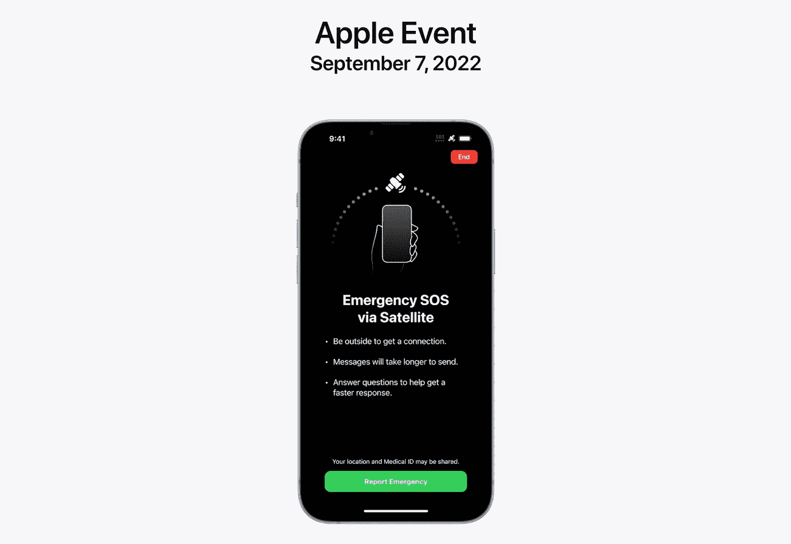

# iPhones 14 的卫星连接

> 原文：<https://medium.com/codex/satellite-connection-of-iphones-14-c9b48414a4d4?source=collection_archive---------4----------------------->

## 基本信息汇总

苹果公司推出了其 14 款 iPhones，具有独特、独特和长期以来被猜测的紧急 SOS 功能，通过卫星而不是传统的运营商网络和 Wi-Fi 连接进行通信。但是这一切是如何运作的呢？

来源:苹果 Keynote

## 它是如何工作的