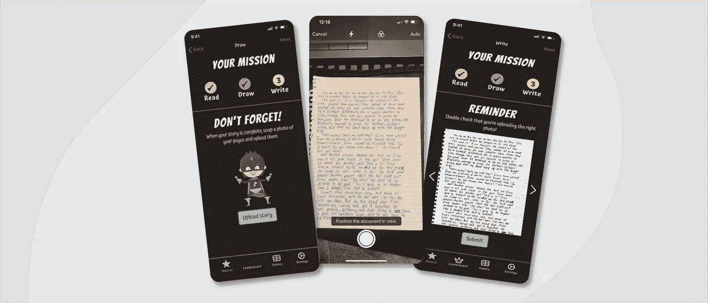
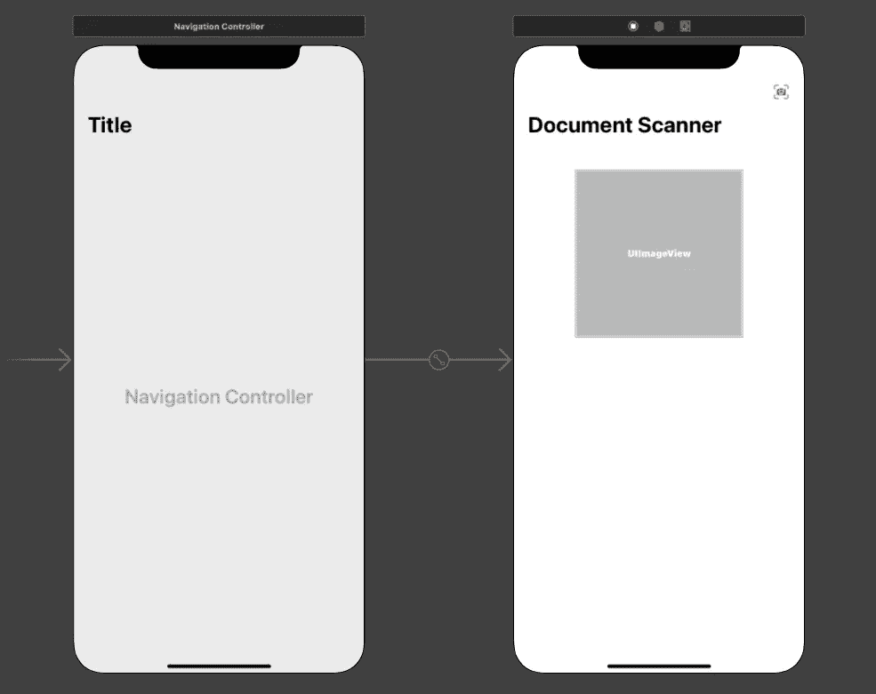

# iOS:如何将文档扫描保存到 UICollectionView

> 原文：<https://medium.com/codex/save-document-scans-to-a-uicollectionview-with-ios-visionkit-c1d0a45732d8?source=collection_archive---------4----------------------->

# &我的 Lambda 旅程

Story Squad LLC 截图

# 入职培训

在 Lambda School 的最后一个单元，学生们有机会在一个他们称为“Lambda Labs”的单元中体验类似于实地真实工作的项目工作。我的同学有幸与一个叫做故事班的组织一起工作。他们想要的产品是一个跨平台的应用程序，鼓励 8-12 岁的青少年通过他们喜欢的设备阅读和提交原创作品和绘画，我的团队负责 iOS 版本。

当被提示利益相关者希望的不同特性时，我们的 iOS 版本跟踪团队被分成了两个团队。我的团队得到了我们的用户故事，并能够从我们需要解决的问题中形成任务。需要解决的一些问题是 iOS 应用程序中使用的设备摄像头的实现，以及将捕获的图像保存到后端数据库的网络调用。

# 在模拟环境中体验真实世界的工作

在 Lambda 实验室，我们的主要关注点是协作以及如何有效地作为一个团队工作。给定我们的用户故事，我们能够创建各种任务，我们可以将这些任务作为每个团队成员负责的功能。利益相关者的一个具体要求是拥有一台相机，为用户提供更好的扫描指南。我借此机会学习了一点以前不熟悉的框架，称为 VisionKit。`VisionKit`包括一个原生文档扫描仪，用户可以使用它来提供查找页面边缘的向导、编辑相机捕捉并将它们保存为 PDF 文件而不是图像的选项。

在开始研究这个特性时，我所担心的是，起初，我在网上能找到的能为我需要解决的问题提供精确实现的资源非常少。我最初担心的是我可以使用的相关信息，但很难找到，这很快成为我在这个项目中必须跨越的第一个个人障碍。

# 设置文档扫描仪

在搜索苹果文档和谷歌搜索所有我能找到的关于如何实现我的任务的信息后，我终于找到了一条线索。因此，我创建了一个虚拟项目，这样我就可以在不接触实际代码库的情况下测试文档摄像头特性的实现。让我们来看看我在这个新框架中导航的步骤。

## 1.创建基本用户界面

*(注意:为了最大限度地利用这个 How-To:，本文的这一部分建议使用基本的 iOS/XCode 知识。项目设置、故事板、IBOutlets 和动作、集合视图设置不做全面解释)。*

正如你在下面看到的，我用 Xcode 的故事板界面设置了一个非常基本的 UI 来快速入门。我在导航栏中添加了一个按钮来启动相机，并添加了一个 UIImageView 来保存用户的捕捉。

嵌入在导航控制器中的视图控制器

## 2.实现文档扫描仪

Xcode 中的每个故事板项目都会附带一个已经连接好的`ViewController`场景和文件。首先，让我们连接 IBOutlets 和 IBActions，并相应地命名它们。在`configureDocumentView()`中，我们创建了一个`VNDocumentCameraViewController`的实例，将它的委托设置为它自己(我们将在下一个片段中看到)，然后我们呈现了 scanner 视图。`configureDocumentView()`在我们的行动中被称为`documentScannerWasPressed()`。

## 3.奇迹几乎发生的地方

我们对 ViewController 的扩展是为了符合将处理来自扫描仪的事件的`VNDocumentCameraViewControllerDelegate`。调用它的函数`didFinishWith`将会在用户完成扫描后按下 SAVE 时执行你给它的任何指令。在`didFinishWith`中，我们用 for 循环处理扫描，将图像设置到我们的`imageView`和`dismiss`最后的视图。

非常好！但是我的特性的主要功能是让用户能够捕获多个扫描图像，并通过集合视图查看这些图像。这是我遇到的第二个障碍。在我的虚拟项目中，如果我进行了 3 次扫描并保存它们，我只能将第一次捕获的图像放入视图中。这是个问题。

## 4.我如何通过多次扫描来填充集合视图

当处理多个元素时，在本例中是图像，我们希望为要存储的图像创建一个空数组`[scanImages]`。我们不想将处理后的图像设置为`imageView`，而是希望将图像的每次迭代设置为我们创建的数组`append()`。最后，我们现在要做的就是将数组注入到`collectionViewDatasource`中。

# 尽一切努力推进团队

我和我的伙伴们在前进的道路上遇到了无数的障碍。其中一些源于我们的个人任务，而另一些来自整个项目。从利益相关者希望对整个 iOS 应用程序进行彻底的重新设计，到一些团队成员没有出席会议，导致无法及时了解最新的变化，这是一次适应不同情况的测试，我和我的直接合作伙伴能够共同面对并克服这些情况。

虽然项目的当前状态仍在生产中，但我和我的合作伙伴得到的用户故事和功能是完整的。非常感谢能够以编程方式完全重写用户界面的诺兰·提贝尼尔，以及为用户上传图纸设置设备摄像头和摄像头胶卷的[萨米·阿尔瓦拉多](https://dev.to/samsdevlife)。我们目前缺少将捕获提交到自定义数据库的功能，但您可以在下面看到我的功能的完整实现。

捕获多个扫描

自定义集合视图中的多次扫描

# 继续下一个

当我们把这个项目交给未来的团队时，我希望看到捕获的图像/扫描被发送到后端提交。但是在成功之前，必须由执行授权任务的团队完成登录。在我和我的团队一起度过的许多小时里，我得到了关于我工作的反馈。我发现，尽管我非常有能力完成我负责的任务，但我仍然是一个非常保守的开发人员，需要确保让别人知道我的想法。作为这个项目的一部分，我已经获得了信心，知道我确实有有效的想法，并能在我所在的未来团队中发挥有意义的作用。感谢阅读！