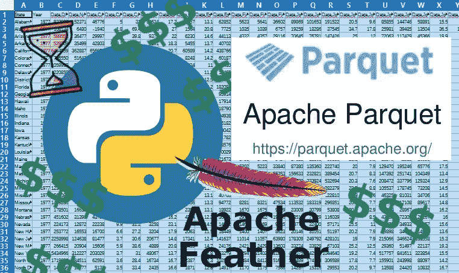

# 使用 Python 中的拼花地板和羽毛节省时间和金钱

> 原文：<https://medium.com/codex/save-time-and-money-using-parquet-and-feather-in-python-d5d6c0b93899?source=collection_archive---------3----------------------->



我花了 ***几十年*** 处理数据，大部分都是好的 ole CSV 格式。数据库导出使用 CSV。Excel 使用 CSV。日志文件可以是 CSV 格式，也可以是普通的分隔格式(没有太大的区别)。传感器输出 CSV 数据。在过去的几年里，我注意到了 Parquet 和 Cassandra 数据库，甚至将 Cassandra 集成到了我们构建的系统中。我们还使用 Parquet 加载数据图表。这两者都支持数据的列存储:

> 面向列的存储意味着存储每一列的所有值的向量，反之面向行的存储意味着每一行是每一列的单个值的向量。

这里有一个例子说明为什么这真的很有用。假设您只需要对单个列的值进行操作来计算平均值。在一个常规的面向行的 SQL 数据库中，你必须读取每一行来得到你需要的值并挑选出值。在列式存储中，您只需读取所需的列，所有数据都在那里。更简单快捷。

现在结合另一个概念-数据框架。数据帧表示二维(行和列)表格数据的内存格式。您可以将表格数据接收到 dataframe 中，这为执行操作提供了一种中性的格式。也就是说，无论原始数据文件的格式如何，数据帧都是相同的。然而，这并不意味着所有文件格式对于读/写操作都执行相同的操作。数据帧从拼花和羽毛文件中读取数据比从 CSV 中读取数据快得多。数据帧大量用于分析和机器学习(意味着处理大型数据集)，因此更快地进出数据是一件大事。

现在有一种更新的格式叫做 Apache Arrow。Parquet 和 Arrow 存在于多个系统中，并且有多种语言的 API，所以虽然我的示例代码是 Python，**但是你可以在任何支持的语言中使用这些方法。**拼花 8 岁，阿罗快 5 了。顺便说一下，Arrow 产生的二进制格式在 nVidia GPU 上与 CUDA 配合得很好。我将把那个话题留到以后再说。

[](https://parquet.apache.org/) [## 阿帕奇拼花地板

### Apache Parquet 是一种柱状存储格式，适用于 Hadoop 生态系统中的任何项目，无论选择什么…

parquet.apache.org](https://parquet.apache.org/) [](https://arrow.apache.org/) [## 阿帕奇箭头

### 用于内存分析的跨语言开发平台

arrow.apache.org](https://arrow.apache.org/) 

注意，我并不是说这些是等价的数据格式。它们存在于不同的地方/系统，可以做或用于不同的事情。我想说的是，它们都比使用 CSV 文件要好。请继续阅读，了解原因。

# 需要 Python 模块

我下面的代码需要的额外的 python 模块是 pandas 和 pyarrow。Pandas 是用于数据帧操作的，版本 1.3.3。支持拼花地板和羽毛。

Pyarrow 增加了拼花和羽毛数据格式的功能。在这些例子中，我用它来读取元数据，但是它可以做更多的事情(比如多线程读取 JSON 文件。Python API 真的很远。参见[https://arrow.apache.org/docs/python/index.html](https://arrow.apache.org/docs/python/index.html)

# 测试平台

我在以下系统上运行简单的基准测试:

*   运行 Big Sur 版本 11.6 的 MacBook Pro (2016)
*   四核英特尔酷睿 i7(2.7 GHz)
*   16 GB 内存，2133 MHz LPDDR3
*   500 GB 固态硬盘

我用的是 Python 3.8。*见最后的源代码。您需要提供自己的 csv 文件/路径作为参数，或者在代码中更改变量。不难。*

# 大型 CSV 文件测试

在这种情况下，large 意味着大约 1.8 GB，超过 60 列，大多数是数字，但也有一些字符串数据类型。这是我的测试程序的典型输出。

```
using csv file data/Dataset-Unicauca-Version2-87Atts.csv
reading CSV file into dataframe took 43.982755350999994
csv file size is 1.767404086 GB
writing csv file from dataframe took 186.065215698
writing dataframe to parquet file took 13.231199089
parquet file size is 0.682483215 GB
reading parquet file into dataframe took 10.189509552999994writing dataframe to feather file took 10.413064489000021
feather file size is 0.85888809 GB
reading feather file into dataframe took 7.5954691249999655writing dataframe to json file took 131.16764677999998
json file size is 5.006533096 GB
reading json file into dataframe took 1107.9316589139999
```

我已经运行了多次，结果是一致的，就像你在上面看到的那样。在大文件上读写拼花和羽毛格式要快得多。JSON 比 CSV 写得快，但是比其他的慢一个数量级。从 JSON 文件中读取数据是很可怕的，因为文件太大了(本例中是 x3 over CSV)。

顺便说一下，不管源文件是什么类型，得到的 dataframe 对象都是相同的。您可以使用 dataframe 对象的 equals 方法来确认这一点，即 df.equals(other_df)。还有一个 dataframe memory_usage 方法，它按数据类型打印每列使用的内存量。

# 小型 CSV 文件

虽然随着文件变大，这些新格式可以很好地扩展，但对于小文件就不太适用了。下面是对一个只有 4 列的 1.8 MB 文件运行的输出。我确实在测试运行中看到了可变性，但是重要的一点是**小文件在读/写操作**中给你带来的收益更小，在文件存储中的收益(文件大小的减少)也更少。

```
reading CSV file into dataframe took 0.03396918999999998
csv file size is 0.001835543 GB
writing csv file from dataframe took 0.2350556009999999
writing dataframe to parquet file took 0.11766440999999994
parquet file size is 0.000894606 GB
reading parquet file into dataframe took 0.026598200000000016writing dataframe to feather file took 0.19203748499999995
feather file size is 0.000952714 GB
reading feather file into dataframe took 0.008075714000000067writing dataframe to json file took 0.8354935490000002
json file size is 0.002195646 GB
reading json file into dataframe took 0.03366627099999997
```

“镶木地板”和“羽毛”文件大约是 CSV 文件的一半大小。正如所料，JSON 更大。有趣的是，feather 文件读/写操作在小文件上比 parquet 提供了更好的性能。没有哪一项收益比大文件更令人印象深刻。

# [计]元数据

无论你在做什么，元数据都是至关重要的。事实证明，Parquet 和 Feather 给出了我没有预料到的关于起始 CSV 文件的额外元数据。下面是一个示例，使用一个小文件显示 pyarrow 的输出。请注意，feather 和 parquet 推断数据类型。他们提供的信息不是来自 CSV 文件(它只有列名)。

```
Info from Parquet file
Column names: [‘question’, ‘product_description’, ‘image_url’, ‘label’]
Schema: question: string
product_description: string
image_url: string
label: int64
 — schema metadata — 
pandas: ‘{“index_columns”: [{“kind”: “range”, “name”: null, “start”: 0, “‘ + 740Info from CSV file
[‘question’, ‘product_description’, ‘image_url’, ‘label’]Info from Feather file
Column names: [‘question’, ‘product_description’, ‘image_url’, ‘label’]
Schema: question: string
product_description: string
image_url: string
label: int64
 — schema metadata — 
pandas: ‘{“index_columns”: [], “column_indexes”: [], “columns”: [{“name”:’ + 553Info from JSON file
getting metadata from JSON requires either more code or libraries I do not know.
```

# 但是 MongoDB 呢？

MongoDB 非常受欢迎是有原因的——它为您提供了一个灵活的模式，您可以轻松地修改(尤其是添加列)。然而，Mongo 将所有内容都存储为 JSON 文档。正如你在上面看到的，JSON 很难处理——文件越大，性能越慢。你需要一个中间格式和已经做好的分析工具(为什么要重新发明轮子？)，所以我建议你使用数据框架和其他格式进行分析。Pandas 数据帧可以加载到 Mongo 中，但是需要使用 to_dict()函数进行转换或者转换到 JSON。

我对 dataframe to_dict 函数做了一个非常简单的检查。在我对大文件和小文件的测试中，我发现不应该使用 to_dict()函数，因为它比简单地将数据帧直接写入 JSON 文件以导入 Mongo 要慢得多(50–100%)。

# 摘要

对于大型昂贵的系统，你需要采取整体的方法，包括系统工程的元素。你不能只写有用的代码——它必须运行良好，并有助于降低成本。我的第一个建议是在你的云账单中找一个大的开销，并且这个开销看起来不太难处理，然后应用这些新的格式。这些都是使用 CSV 文件的很好的替代方法，但是你选择哪一个取决于你的系统的其他部分和你想要减少的开销。您可能有一些非常重要的东西，比如 Apache Spark，可以很好地使用 parquet 数据。或者，您可能需要 Arrow API 来处理存储在 feather 中的数据集。或者您想将拼花地板数据读入 feather。或者您在 AWS 中存储了大量 CSV 文件，并希望减少这一费用。您可能有在多种语言中运行的代码和一些共享的数据库，这些数据库将 feather 和 IPC 可以替代的所有东西绑定在一起(feather 文件在任何语言中都是一样的)。

# 使用源，卢克

您需要传入一个指向 CSV 文件的命令行参数，或者您可以将它放在 data_file 变量的代码中。

```
import csv
import os
import pandas as pd
import pyarrow.parquet as pq
import pyarrow.feather as pf
import sys
import time

'''
This is is some code to show key comparisons between csv, feather, parquet, and
JSON data formats. This will do conversion time, size and performance 
comparisons for common operations.
'''

# change this one parameter and use whatever csv file you want as a start point
data_file = 'data/Dataset-Unicauca-Version2-87Atts.csv'

def analyze(csv_file = data_file):
    start = time.perf_counter()
    print(f'using csv file {csv_file}')
    df = pd.read_csv(csv_file)
    stop = time.perf_counter()
    elapsed = stop - start
    print(f'reading CSV file into dataframe took {elapsed}')
    #look at first 5 rows of dataframe: print(df.head())
    print_size('csv', csv_file)
    # write data frame to new csv
    start = time.perf_counter()
    df.to_csv('data/new.csv', index=False)
    stop = time.perf_counter()
    elapsed = stop - start
    print(f'writing csv file from dataframe took {elapsed}')

    #parquet
    start = time.perf_counter()
    df.to_parquet('data/test.parquet')
    stop = time.perf_counter()
    elapsed = stop - start
    print(f'writing dataframe to parquet file took {elapsed}')
    print_size('parquet', 'data/test.parquet')

    start = time.perf_counter()
    df_parquet = pd.read_parquet('data/test.parquet')
    stop = time.perf_counter()
    elapsed = stop - start
    print(f'reading parquet file into dataframe took {elapsed}\n')

    #feather
    start = time.perf_counter()
    df.to_feather('data/test.feather')
    stop = time.perf_counter()
    elapsed = stop - start
    print(f'writing dataframe to feather file took {elapsed}')
    print_size('feather', 'data/test.feather')

    start = time.perf_counter()
    df_feather = pd.read_feather('data/test.feather')
    stop = time.perf_counter()
    elapsed = stop - start
    print(f'reading feather file into dataframe took {elapsed}\n')

    #json
    start = time.perf_counter()
    df.to_json('data/test.json')
    stop = time.perf_counter()
    elapsed = stop - start
    print(f'writing dataframe to json file took {elapsed}')
    print_size('json', 'data/test.json')

    start = time.perf_counter()
    df_json = pd.read_json('data/test.json')
    stop = time.perf_counter()
    elapsed = stop - start
    print(f'reading json file into dataframe took {elapsed}\n')

    # memory usage (same for all dataframes, since equal
    if df.equals(df_json):
        print('csv and json dataframes are equivalent')
        print(df.memory_usage())

# read file metadata
def read_metadata(csv_file = data_file):
    print('Info from Parquet file')
    pfile = pq.read_table('data/test.parquet')
    print("Column names: {}".format(pfile.column_names))
    # Parquet infers the data type of each column
    print("Schema: {}".format(pfile.schema))

    print('Info from CSV file')
    # just column names- no inference of data types
    with open(csv_file, newline='') as f:
        reader = csv.reader(f)
        row1 = next(reader)
        print (row1)

    # note the symmetry within the pyarrow API
    print('Info from Feather file')
    ffile = pf.read_table(('data/test.feather'))
    print("Column names: {}".format(ffile.column_names))
    # Parquet infers the data type of each column
    print("Schema: {}".format(ffile.schema))

    print('Info from JSON file')
    print('getting metadata from JSON requires either more code or libraries I do not know.')

# look at file sizes for different storage technology (feather, parquet, csv)
def print_size(name, file):
    file_size = os.path.getsize(file) / 1000000000
    print(f"{name} file size is {file_size} GB")

def mongo_conversion(csv_file = data_file):
    df = pd.read_csv(csv_file)

    start = time.perf_counter()
    for_mongo = df.to_dict()
    stop = time.perf_counter()
    elapsed = stop - start
    print(f'converted dataframe to dict for Mongo import  took {elapsed}')

# run the tests
if __name__ == '__main__':

    if len(sys.argv) < 2:
        # uses default value
        analyze()
        read_metadata()
        mongo_conversion()
    else:
        # use csv file and path from command line
        analyze(sys.argv[1])
        read_metadata(sys.argv[1])
        mongo_conversion(sys.argv[1])
```

你可以用这个资源做任何你喜欢的事情。