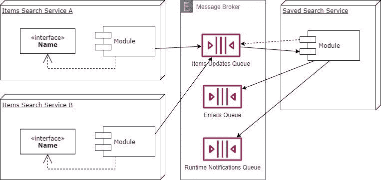
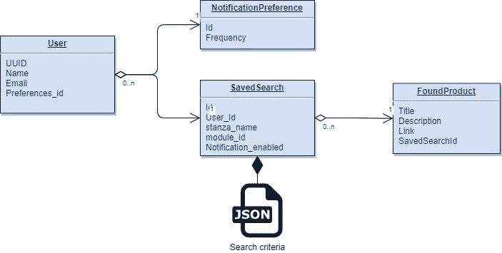
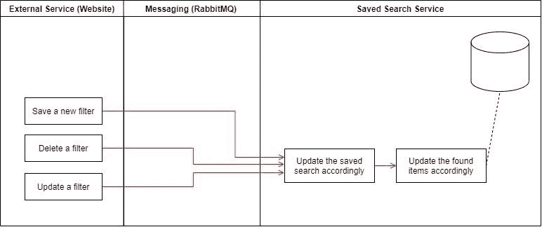

# “保存的搜索”功能的建议体系结构

> 原文：<https://medium.com/codex/saved-search-feature-proposed-architecture-2e216a3ed52f?source=collection_archive---------3----------------------->

## 药典

我最近花了一些时间为一个保存的搜索网络服务设计了一个解决方案，我相信它值得被出版，我感谢你的评论，特别是如果你能突出问题或能建议一个更好的结构。

# 要求

提出一个“保存的搜索”服务，它是可重用的、可伸缩的、Restful 的，并且尊重关注点分离模型。包括以下细节:

*   已经保存搜索的用户将开始接收通知电子邮件，根据他保存的过滤器，最多包括 10 个项目。
*   每个用户都可以根据自己的喜好设置定期接收保存的搜索邮件的时间间隔。
*   已经保存了搜索的用户将在运行时被通知添加了任何新项目，并且符合他的任何过滤器。
*   该服务将可用于面向未来的产品。
*   该服务应该为不同类别的多个网站或列表提供服务。

# 假设

*   我们的环境是基于微服务的应用程序。
*   所有服务都可以使用单点登录服务访问，用户拥有一个通用 ID。
*   添加该功能需要对相关服务进行一些更改。
*   为了避免复杂化，我们不会处理产品之间的结构差异，标题、描述和行动号召是所有产品的共同属性。

# 提议的解决方案概念

保存的搜索特性将作为一个独立的服务添加，尽可能地保持服务之间的松散耦合。为此，我们建议使用 RabbitMQ 这样的消息代理来进行服务间的通信。

另一方面，为了避免每次我们需要向用户显示其保存的搜索结果时搜索数百万个产品，我们建议在我们的服务中维护一个找到的产品列表，其大小不会超过用户数量的 10 倍。

更新保存的搜索

深入我们保存的搜索服务，我们需要保存以下详细信息:

*   用户详细信息
*   引用用户的已保存过滤器。
*   找到引用已保存过滤器的产品。
*   引用用户的用户首选项。

如下图所示:

如图所示，我们将关系表与基于文档的数据库混合在一起，因此，我们建议使用 Postgres，它将两者混合在一起，同时具有很高的性能。

转到事务级别，基于这个提议的体系结构，找到的项目列表将主要在更新产品列表时进行更改。相关服务将允许用户添加其项目，而不会受到任何干扰，同时我们的已保存搜索服务将决定此项目是否需要驻留在任何已保存搜索的已找到项目列表中，删除或更新项目也会影响该列表，下图说明了此过程:

更新找到的项目列表的另一个过程是由用户更新保存的搜索列表，在管理搜索(基本或高级)时，用户已经使用服务器的资源来查找结果，如果他想要保留他的发现，我们要做的就是将两者:标准和找到的结果都带到我们的服务数据库，如下图所示:

# 摘要

最后，这是一个为保存的搜索功能提出的架构，我们试图挑选最合适的技术，技巧和方法，以符合验收标准。

我们选择了 Postgres 数据库，并受益于关系数据库和基于文档的数据库，以便更快地处理长过滤器数据。

除了原始数据流和过滤器的延迟更新，我们还使用 RabbitMQ 来保证良好的用户体验和未来的可伸缩性。

我们还指定了所需的端点，混合了 Restful 和 JSON/RPC，以获得两者的优势。

最后，我们倾向于将搜索功能放在每个模块中，远离我们的服务，这样我们的服务就可以保持通用性和可重用性。决定将过滤逻辑封装在任何模块中，就像它应该的那样。