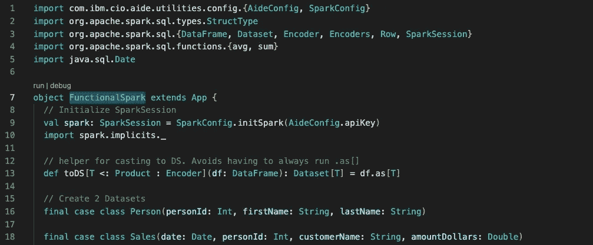

# Spark 数据集上的 Scala 函数式编程

> 原文：<https://medium.com/codex/scala-functional-programming-with-spark-datasets-e470f48fcc11?source=collection_archive---------3----------------------->



## [法典](http://medium.com/codex)

本教程将给出使用 Scala 和 Spark 转换数据的例子。本教程的重点是如何在读入数据之后，写出数据之前使用 Spark 数据集…在`Extract, Transform, Load` (ETL)中的`Transform`。

在 Spark 上用 Scala 编写代码的一个好处是，Scala 允许你用面向对象编程(OOP)或者函数式编程(FP)的风格来编写。当 Java 开发人员只知道如何用 OOP 风格编写代码时，这是很有用的。然而，Spark 是一个分布式处理引擎，它受益于以 FP 风格编写代码。在我看来，如果你写的函数是纯的、无副作用的、小的，那么写单元测试也更容易。Scala/Spark 开发人员的目标应该是朝着用函数式风格编写应用程序的方向前进。这意味着使用纯函数、不可变值、高阶函数和复合。

如果这些想法对你来说是新的，花些时间去理解为什么它们在 Spark 世界中是重要的。一个很好的资源是[函数式编程](https://learning.oreilly.com/library/view/functional-programming-in/9781617290657/)，可以在 O'Reilly books 上找到。

# 进口

仅导入您将在应用程序中使用的内容。这些是我们将在本教程中使用的导入。

```
import org.apache.spark.sql.types.StructType
import org.apache.spark.sql.{Encoder, Encoders, DataFrame, Dataset, Row, SparkSession}
import org.apache.spark.sql.functions.{avg, sum}
import java.sql.Date
```

# 创建您的对象

我们正在创建一个`object`，在 Scala 中是`Singleton`设计模式。我们将用特征`App`来扩展它，使它可以运行。你也可以选择使用`def main`而不是`App`。

```
object FunctionalSpark extends App {
```

# 助手功能

这是一个帮助器函数，用于将数据帧转换为数据集。您应该始终对数据进行强类型化。

```
def toDS[T <: Product: Encoder](df: DataFrame): Dataset[T] = df.as[T]
```

# 创建数据集

我们将创建两个数据集用于本教程。在您自己的项目中，您通常会使用自己的框架来读取数据，但是我们将手动创建一个数据集，以便这些代码可以在任何环境中运行。

Case 类用于对数据进行强类型化。当将它们应用到`DataFrames`时，这允许您在 Spark 中使用`Dataset` API。DataFrames 相当于 Dataset[Row]，它是非类型化数据集。

```
final case class Person(
    personId: Int,
    firstName: String,
    lastName: String) final case class Sales(
    date: Date,
    personId: Int,
    customerName: String,
    amountDollars: Double)
```

这是我们将使用`Seq`类型创建的数据。我们将使用其中的两个，一个用于人员，另一个用于一组销售数据。

```
val personData: Seq[Row] = Seq(
    Row(1, "Eric", "Tome"),
    Row(2, "Jennifer", "C"),
    Row(3, "Cara", "Rae")
  ) val salesData: Seq[Row] = Seq(
    Row(new Date(1577858400000L), 1, "Third Bank", 100.29),
    Row(new Date(1585717200000L), 3, "Pet's Paradise", 1233451.33),
    Row(new Date(1585717200000L), 2, "Small Shoes", 4543.35),
    Row(new Date(1593579600000L), 1, "PaperCo", 84990.15),
    Row(new Date(1601528400000L), 1, "Disco Balls'r'us", 504.00),
    Row(new Date(1601528400000L), 2, "Big Shovels", 9.99)
  )
```

使用 Spark，我们可以从 Scala `Seq`对象中读取数据。下面的代码将从上面定义的 case 类中创建一个`StructType`对象。然后我们有一个带参数`data`和`schema`的函数`getDSFromSeq`。然后，我们使用 Spark 读取我们的`Seq`对象，同时对它们进行强类型化。

```
private val personSchema: StructType = Encoders.product[Person].schema
  private val salesSchema: StructType  = Encoders.product[Sales].schema def getDSFromSeq[T <: Product: Encoder](data: Seq[Row], schema: StructType) =
    spark
      .createDataFrame(
        spark.sparkContext.parallelize(data),
        schema
      ).as[T] val personDS: Dataset[Person] = getDSFromSeq[Person](personData, personSchema)
  val salesDS: Dataset[Sales] = getDSFromSeq[Sales](salesData, salesSchema)
```

`show()`方法会将`Dataset`或`DataFrame`中的数据显示到控制台。这是结果:

**人员数据**

```
+--------+---------+-------------+
|personId|firstName |     lastName|
+--------+---------+-------------+
|       1|     Eric|         Tome|
|       2| Jennifer|            C|
|       3|     Cara|          Rae|
+--------+---------+-------------+
```

**销售数据**

```
+----------+--------+----------------+-------------+
|      date|personId|    customerName|amountDollars|
+----------+--------+----------------+-------------+
|2020-01-01|       1|      Third Bank|       100.29|
|2020-04-01|       3|  Pet's Paradise|   1233451.33|
|2020-04-01|       2|     Small Shoes|      4543.35|
|2020-07-01|       1|         PaperCo|     84990.15|
|2020-10-01|       1|Disco Balls'r'us|        504.0|
|2020-10-01|       2|     Big Shovels|         9.99|
+----------+--------+----------------+-------------+
```

# 过滤

有多种方法可以过滤您的数据，以下是一些例子:

```
personDS.filter(r => r.firstName.contains("Eric"))
```

结果:

```
+--------+--------+--------+
|personId|firstName|lastName|
+--------+--------+--------+
|       1|    Eric|    Tome|
+--------+--------+--------+
```

滤波器，其中`personId`等于`1`。

```
salesDS.filter(r => r.personId.equals(1))
```

结果:

```
+----------+--------+----------------+-------------+
|      date|personId|    customerName|amountDollars|
+----------+--------+----------------+-------------+
|2020-01-01|       1|      Third Bank|       100.29|
|2020-07-01|       1|         PaperCo|     84990.15|
|2020-10-01|       1|Disco Balls'r'us|        504.0|
+----------+--------+----------------+-------------+
```

在`amountDollars`大于`100`的地方过滤。

```
salesDS.filter(r => r.amountDollars > 100)
```

结果:

```
+----------+--------+----------------+-------------+
|      date|personId|    customerName|amountDollars|
+----------+--------+----------------+-------------+
|2020-01-01|       1|      Third Bank|       100.29|
|2020-04-01|       3|  Pet's Paradise|   1233451.33|
|2020-04-01|       2|     Small Shoes|      4543.35|
|2020-07-01|       1|         PaperCo|     84990.15|
|2020-10-01|       1|Disco Balls'r'us|        504.0|
+----------+--------+----------------+-------------+
```

在`amountDollars`大于`600`的地方过滤。

```
salesDS.filter(r => r.amountDollars > 600)
```

结果:

```
+----------+--------+--------------+-------------+
|      date|personId|  customerName|amountDollars|
+----------+--------+--------------+-------------+
|2020-04-01|       3|Pet's Paradise|   1233451.33|
|2020-04-01|       2|   Small Shoes|      4543.35|
|2020-07-01|       1|       PaperCo|     84990.15|
+----------+--------+--------------+-------------+
```

过滤`amountDollars`在`600`和`5000`之间的地方。

```
salesDS.filter(r => r.amountDollars > 600 && r.amountDollars < 5000)
```

结果:

```
+----------+--------+------------+-------------+
|      date|personId|customerName|amountDollars|
+----------+--------+------------+-------------+
|2020-04-01|       2| Small Shoes|      4543.35|
+----------+--------+------------+-------------+
```

# 重命名列

您可以使用`withColumn`或`withColumnRenamed`在 spark 中创建新列或重命名列。假设我们想要重命名所有的列，就像它们出现在数据库中一样。我们可以为数据集中的每一列调用一个`withColumnRenamed`，就像这样:

```
df.withColumnRenamed("col1", "newcol1")
        .withColumnRenamed("col2", "newcol2")
        .withColumnRenamed("col3", "newcol3")
        .withColumnRenamed("col4", "newcol4")
        ...
        .withColumnRenamed("coln", "newcoln")
```

然而，当修改大量的列时，有更好的解决方案。

1.  创建一个 case 类，定义最终数据集的外观。
2.  创建一个返回`Map[String, String]`的函数，其中第一个字符串是当前列名，第二个是新名称。
3.  创建一个接受`Map`并折叠输入`Dataset`的函数。fold 中的函数是`withColumnRenamed`，它从`Map`中获取当前列名和新名称的值。一个新的`Dataset`被返回给你最后的 case 类。

```
final case class SalesChangeColumnNames(
    SALES_DATE: Date,
    PERSON_ID: Int,
    CUSTOMER_NAME: String,
    SALES_IN_DOLLARS: Double) def saleColumns: Map[String, String] =
    Map(
      "date"          -> "SALES_DATE",
      "personId"      -> "PERSON_ID",
      "customerName"  -> "CUSTOMER_NAME",
      "amountDollars" -> "SALES_IN_DOLLARS"
    ) def renameColumns(ds: Dataset[Sales], m: Map[String, String]): Dataset[SalesChangeColumnNames] =
    toDS {
      m.foldLeft(ds.toDF())((acc, colnames) => acc.withColumnRenamed(colnames._1, colnames._2))
    } renameColumns(salesDS, saleColumns)
```

结果:

```
+----------+---------+----------------+----------------+
|SALES_DATE|PERSON_ID|   CUSTOMER_NAME|SALES_IN_DOLLARS|
+----------+---------+----------------+----------------+
|2020-01-01|        1|      Third Bank|          100.29|
|2020-04-01|        3|  Pet's Paradise|      1233451.33|
|2020-04-01|        2|     Small Shoes|         4543.35|
|2020-07-01|        1|         PaperCo|        84990.15|
|2020-10-01|        1|Disco Balls'r'us|           504.0|
|2020-10-01|        2|     Big Shovels|            9.99|
+----------+---------+----------------+----------------+
```

# 连接

在 Spark 中连接数据很简单，但是当连接两个不同的数据集时，您需要创建一个新的 case 类并输入连接的输出。Spark 支持多种连接类型，左连接、右连接、全连接、反连接以及 SQL 标准中的所有外部连接。在这种情况下，我们在`personId`上连接，并使用一个`left`连接。

```
final case class JoinedData(
    personId: Int,
    firstName: String,
    lastName: String,
    date: Date,
    customerName: String,
    amountDollars: Double) val joinedData: Dataset[JoinedData] =
    toDS(personDS.join(salesDS, Seq("personId"), "left"))
```

结果:

```
+--------+---------+-----+----------+----------------+-------------+
|personId|firstName|lastN|      date|    customerName|amountDollars|
+--------+---------+-----+----------+----------------+-------------+
|       1|     Eric| Tome|2020-01-01|      Third Bank|       100.29|
|       1|     Eric| Tome|2020-07-01|         PaperCo|     84990.15|
|       1|     Eric| Tome|2020-10-01|Disco Balls'r'us|        504.0|
|       3|     Cara|  Rae|2020-04-01|  Pet's Paradise|   1233451.33|
|       2| Jennifer|    C|2020-04-01|     Small Shoes|      4543.35|
|       2| Jennifer|    C|2020-10-01|     Big Shovels|         9.99|
+--------+---------+-----+----------+----------------+-------------+
```

# 使用地图

地图是 Scala 语言中一个强大的特性。我们在这里使用它们将数据从一种类型的对象转换成另一种类型的对象。map 函数将使用用户定义的函数(`dollarToEuro`、`initials`)和原始字符串类型的函数(`toUpperCase`、`toLowerCase`、`trim`)遍历数据集中的每条记录，将该记录映射到一个新的对象。我们再次创建一个 case 类，用于创建我们映射到的对象。还可以使用地图更改列顺序，您可以在这里看到我们将日期移动到列列表的顶部。我们地图的输出产生了一个类型为`JoinedDataWithEuro`的数据集。

```
final case class JoinedDataWithEuro(
    date: Date,
    personId: Int,
    firstName: String,
    lastName: String,
    initials: String,
    customerName: String,
    amountDollars: Double,
    amountEuros: Double) def dollarToEuro(d: Double): Double = d * 1.19 def initials(firstName: String, lastName: String): String =
    s"${firstName.substring(0, 1)}${lastName.substring(0, 1)}" val joinedDataWithEuro: Dataset[JoinedDataWithEuro] =
    joinedData.map(r =>
      JoinedDataWithEuro(
        r.date,
        r.personId,
        r.firstName.toUpperCase(), // modified column
        r.lastName.toLowerCase(), // modified column
        initials(r.firstName, r.lastName), // new column
        r.customerName.trim(), // modified column
        r.amountDollars,
        dollarToEuro(r.amountDollars) // new column
      )
    )
```

结果:

```
+----------+--------+---------+--------+--------+----------------+-------------+------------------+
|      date|personId|firstName|lastName|initials|    customerName|amountDollars|       amountEuros|
+----------+--------+---------+--------+--------+----------------+-------------+------------------+
|2020-01-01|       1|     ERIC|    tome|      ET|      Third Bank|       100.29|          119.3451|
|2020-07-01|       1|     ERIC|    tome|      ET|         PaperCo|     84990.15|101138.27849999999|
|2020-10-01|       1|     ERIC|    tome|      ET|Disco Balls'r'us|        504.0|            599.76|
|2020-04-01|       3|     CARA|     rae|      CR|  Pet's Paradise|   1233451.33|      1467807.0827|
|2020-04-01|       2| JENNIFER|       c|      JC|     Small Shoes|      4543.35|         5406.5865|
|2020-10-01|       2| JENNIFER|       c|      JC|     Big Shovels|         9.99|           11.8881|
+----------+--------+---------+--------+--------+----------------+-------------+------------------+
```

# 聚集

聚合是通过使用 DataFrame API 来完成的，但是在聚合之后我们又回到了强类型数据集。聚合中可以使用各种函数:avg、sum、count 等。下面的示例按用户汇总了我们的销售数据，并计算了销售额的平均值。

```
final case class TotalSalesByPerson(
    personId: Int,
    firstName: String,
    lastName: String,
    initials: String,
    sumAmountDollars: Double,
    sumAmountEuros: Double,
    avgAmountDollars: Double,
    avgAmountEuros: Double) val totalSalesByPerson: Dataset[TotalSalesByPerson] =
    toDS {
      joinedDataWithEuro
        .groupBy($"personId", $"firstName", $"lastName", $"initials").agg(
          sum($"amountDollars").alias("sumAmountDollars"),
          sum($"amountEuros").alias("sumAmountEuros"),
          avg($"amountDollars").alias("avgAmountDollars"),
          avg($"amountEuros").alias("avgAmountEuros")
        )
    }
```

结果:

```
+--------+---------+--------+--------+-----------------+------------------+------------------+------------------+
|personId|firstName|lastName|initials| sumAmountDollars|    sumAmountEuros|  avgAmountDollars|    avgAmountEuros|
+--------+---------+--------+--------+-----------------+------------------+------------------+------------------+
|       2| JENNIFER|       c|      JC|          4553.34|5418.4746000000005|           2276.67|2709.2373000000002|
|       3|     CARA|     rae|      CR|       1233451.33|      1467807.0827|        1233451.33|      1467807.0827|
|       1|     ERIC|    tome|      ET|85594.43999999999|101857.38359999999|28531.479999999996|        33952.4612|
+--------+---------+--------+--------+-----------------+------------------+------------------+------------------+
```

# 结论

这是对如何使用 Scala 在 Spark 中处理数据的简单介绍。我们关注使用数据集的转换的功能实现。如果您有任何问题，请随时发表评论！