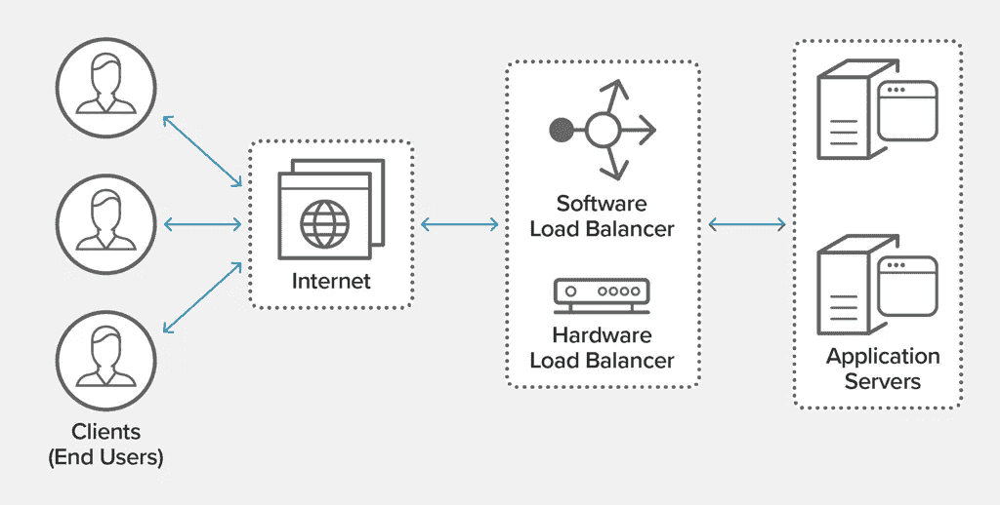
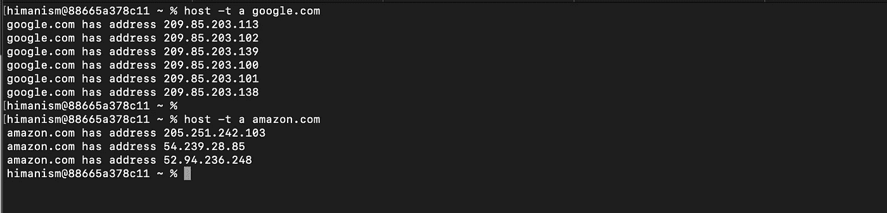
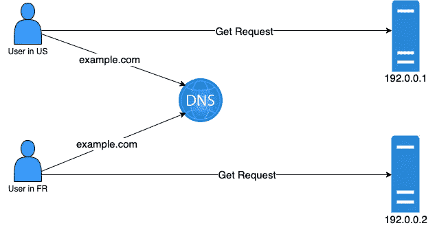
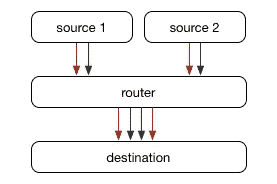
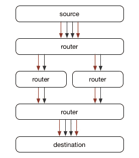
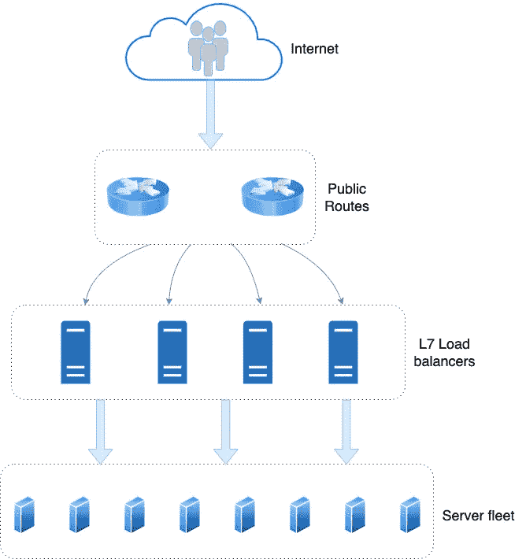
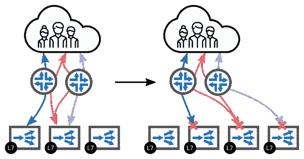
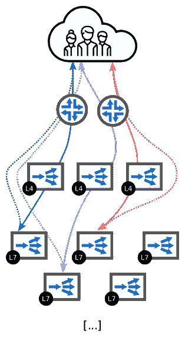

# 像 FAANG 一样扩展您的负载平衡器

> 原文：<https://medium.com/codex/scale-your-load-balancer-like-faang-c44aa75e70eb?source=collection_archive---------4----------------------->

## 什么是负载平衡器

当你第一次推出一个网站时，你几乎不用担心任何事情。您启动 EC2 实例或任何其他服务器，获取其公共 IP 地址，将该地址映射到您的域，就这样。你完了。但是，当流量开始增加，每秒钟收到数千个请求时，会发生什么呢？您的服务器将会因收到的请求而过载，最终崩溃。

那你会怎么做？这就是负载平衡器的用武之地。

[https://www.nginx.com/resources/glossary/load-balancing/](https://www.nginx.com/resources/glossary/load-balancing/)

我们在这里所做的是增加您拥有的服务器数量，以便可以毫无问题地处理增加的流量，并将它们连接到您的负载平衡器。然后，获取负载平衡器所在服务器的 IP 地址，并将其映射到您网站的域。请求现在到达负载平衡器，它将请求平均分配给应用服务器。

很好，现在您可以根据需要添加任意多的应用服务器，并为您的网站提供不断增长的流量。
但是等一下，您的负载均衡器也是一个服务器，它必须对它可以处理的请求数量有一个上限，对吗？没错。

现在想想像 google.com 或 Amazon.com 这样的网站，它们每天服务于数千万个请求。你的硬件再好，也赶不上这个不断增长的数字。

那你是做什么的？很简单，你只需要增加更多的负载均衡器，在它们前面再加一层负载均衡器。与您在扩展应用服务器时所做的一样。就是这样，感谢阅读文章。

**嗯，不完全是**。这种方法的问题是，前端层将再次达到它所能服务的流量的上限。

这时，您需要开始考虑负载均衡器以外的问题，这也是我们将在本文中讨论的内容。

# 如何大规模实现负载平衡

这里我们将讨论几种不同的方法。根据您的使用情况和您所服务的流量，它们可能是有用的。

## 1.DNS 循环赛

循环法 [DNS](https://www.cloudflare.com/learning/dns/what-is-dns/) 是一种负载平衡技术，平衡由 DNS 服务器完成，而不是使用专用的负载平衡硬件。
循环 DNS 可用于在多个负载平衡器之间平衡负载，其中 DNS 服务器每次轮流分发与不同 LB 对应的 IP 地址。

> 我们在这里可以看到 **Google** 和 **Amazon** 使用 DNS 轮循来实现他们的前端负载平衡。

在上面的例子中，209.85.203.113 209 . 85 . 203 . 102……可能是不同负载均衡器的公共 IP。

**DNS 循环法的问题**

1.  由于 DNS [缓存](https://www.cloudflare.com/learning/cdn/what-is-caching/)和[客户端缓存](https://www.cloudflare.com/learning/serverless/glossary/client-side-vs-server-side/)，循环法并不总是提供均匀分布的负载平衡。如果用户对特定网站的特别高流量[递归解析器](https://www.cloudflare.com/learning/dns/dns-server-types#recursive-resolver)进行 DNS 查询，该解析器将缓存该网站的 IP，可能会向该 IP 发送大量流量。
2.  另一个缺点是不能依靠循环法来保证站点的可靠性；如果其中一台服务器出现故障，DNS 服务器仍将在循环轮换中保留该服务器的 IP。因此，如果有六台服务器，其中一台离线，六分之一的用户将被拒绝服务。此外，循环 DNS 不考虑服务器负载、交易时间、地理距离和其他可以配置传统负载平衡的因素。

## 2.基于地理位置的负载平衡

让我们假设你的网站现在在世界各地都很有名，并且为欧洲、美洲和亚洲的用户提供流量服务。
您的负载平衡器和应用服务器都在印度。这产生了两个主要问题。
1。往返时间:-由于服务器位于印度，美国用户的请求必须穿越半个世界并返回。
2。特定于地区的信息:-作为一个产品所有者，你会希望向一个在中国而不是在美国的用户显示不同的网站。

这两个问题都有一个简单的解决方案。 [**基于地理位置的 DNS**](https://en.wikipedia.org/wiki/GeoDNS) 或**[geodn](https://jameshfisher.com/2017/02/08/how-does-geodns-work/)。这样，DNS 现在将根据用户的位置为您的网站解析不同的 IP 地址。您可以将位于中国的用户重定向到离该位置最近的服务器，以确保最少的往返时间，并使服务器能够公开特定于该地理位置的内容。**

**但是话说回来，它对扩展负载平衡器有什么帮助呢？
有了这个 GeoDNS 特性，您现在可以在不同的区域拥有不同的负载平衡器，并分别扩展每个堆栈。**

****

**基于 GeoDNS 的负载均衡**

**在上面的例子中，对于同一个 URL example.com，一个在法国的用户将总是得到一个 192.0.0.2 的 IP 地址，而一个在美国的用户得到 192.0.0.1 的 IP 地址。**

> ****亚马逊(至少在内部)**广泛使用这种负载均衡。我做过的微服务几乎都用这个。**

****基于地理位置的负载平衡问题****

1.  **您几乎不可能遇到这个问题，但是使用这种方法，您仍然会受到负载平衡器在一个区域中所能提供的流量的限制。我们仍然面临着最初开始时的问题，但现在你将在区域一级而不是全球一级面临它。**
2.  **并非所有 DNS 提供商都提供 GeoDNS。亚马逊 Route53 为你提供了这种能力，而 CloudFare 没有。**

## **3.通过 ECMP + BGP 路由实现负载均衡**

**在我们试图了解如何扩展我们的负载平衡设备之前，让我们先了解一下 ECMP 和 BGP 协议。**

****等价多路径** 通常，我们认为 IP 地址指的是一台物理机器，而路由器指的是将数据包移动到距离该机器最近的下一个路由器。在最简单的情况下，总是有一个最佳的下一跳，路由器选择该跳，并在那里转发所有数据包，直到到达目的地。**

****

**事实上，大多数网络要复杂得多。两台机器之间通常有多条路径可用，例如，当有多个 ISP 可用时，甚至当两台路由器通过多条物理电缆连接在一起以增加容量和提供冗余时。这就是[等价多路径(ECMP)路由](https://en.wikipedia.org/wiki/Equal-cost_multi-path_routing)发挥作用的地方——路由器不是选择单个最佳下一跳，它们有多个相同开销的跳，而是散列流量，以便在所有等价的可用路径上平衡连接。**

****

**ECMP 是通过对每个数据包进行哈希运算来确定一条相对一致的可用路径来实现的。此处使用的哈希函数因设备而异，取决于源和目的 IP 地址以及 TCP 流量的源和目的端口。这意味着同一正在进行的 TCP 连接的多个数据包通常会经过相同的路径，这意味着即使路径具有不同的延迟，数据包也会以相同的顺序到达。值得注意的是，在这种情况下，路径可以在不中断连接的情况下改变，因为它们将总是在同一个目标服务器上结束，并且在这一点上，它们采用的路径基本上是不相关的。**

****边界网关协议** 坦率地说，BGP 是一个非常庞大的话题，也是我们今天所知的互联网的构建模块之一。[这个](https://en.wikipedia.org/wiki/Border_Gateway_Protocol)是维基百科的定义。
就本文而言，我们需要了解的是，您可以使用 BGP 来广播您的相邻路由。有了 BGP，你还可以向互联网广播你离一个 IP 地址只有一跳之遥。**

**这个理论很好，但是我们该如何将它用于我们的目的呢？**

> **我将首先举一个简单的例子来理解这两种协议的优点。**

**让我们假设我们已经保留了 IP 地址 1.2.3.4。我们可以启动 n 台负载均衡器主机，然后这些主机将使用 BGP 协议向互联网广播它们距离 IP 1.2.3.4 只有 1 跳的距离。通过这种方式，使用 BGP 协议，我们基本上扩展了我们的负载平衡器堆栈。在任何时候，您都可以将更多的服务器添加到您的负载平衡设备中，广播该服务器距离您保留的 IP 地址只有 1 跳的距离，就这样。**

**但是这种设置仍然有一个问题。您有 n 个负载平衡服务器，但是您如何知道它们之间的流量是平均分布的，或者至少是均匀分布的呢？考虑这样一种情况:所有流量仍然只被路由到一台服务器。这是 ECMP 的闪光点。
如上所述，如果路由器支持 ECMP，它将确保流量在到达目的地的成本相同的节点之间平均分配。在我们的例子中，我们所有的 n 个负载平衡服务器都离 1.2.3.4 有 1 跳的距离，所以路由器将确保请求在每个服务器之间分配。**

## **3.1.L7 ECMP + BGP 负载均衡**

**现在让我们从架构的角度来看看上面的例子是什么样子的。**

****

****L7 ECMP + BGP 负载均衡****

**现在，基于上面的配置，您可以水平扩展您的负载平衡器设备，并拥有无限的扩展能力。在任何时候，当你的负载均衡器过载时，你只需要再增加一个 LB 就可以了。
但是这种解决方案有一个主要问题，即****路由器的无状态特性。******

******这种方法的问题******

****如上所述，路由器不维护连接状态。为了选择与 ECMP 的下一跳，它们根据源和目的 IP 地址进行哈希运算。当路由器和负载平衡器之间的拓扑被扰乱时，就会出现问题。****

****添加或删除负载平衡器时，目的地的可用路由数量会发生变化。路由器使用的哈希算法不一致，流在可用的负载平衡器之间重新洗牌，破坏了现有的连接。****

********

****此外，每个路由器可以选择自己的路由，也可能有不同的缓存算法。当一个路由器变得不可用时，第二个路由器可能会以不同的方式路由相同的流。****

****如果您需要处理长时间的连接，如文件下载、视频流或网络套接字连接，这种解决方案肯定是行不通的。****

> ****如果所有的路由器都使用一致的散列法，这些问题可以被最小化。在添加新的负载平衡器的情况下，一致的散列将确保连接的重新洗牌最小化，并且由于所有路由器使用相同的散列算法，即使添加或移除了路由器，分组也将被定向到相同的 LB。****

## ****3.2 L4-L7 与 ECMP + BGP 的分离****

****现在，在所有的方法和努力之后，我们仍然不能建立理想的解决方案。需要记住的一点是，上述方法的问题是路由器是无状态的，甚至是哑的。拓扑结构的任何变化都会导致所有连接的混乱。
我们已经讨论了 ECMP 的一致性哈希如何解决这个问题，但是要确保所有路由器都以相同的方式设置是不可能的，除非您使用自定义路由器预先加载整个网络。****

****因此，要解决上述问题，如果我们引入一个能够管理 L7 负载均衡器群和路由器之间的连接的层，我们应该会做得很好。****

****这就是 L4-L7 分裂出现的原因****

********

****有了另一层服务器来管理连接，我们可以完全控制通过 L7 LB 建立的连接，这是路由器所不具备的。****

****让我们看看如何使用 L4 负载平衡器解决上述问题。****

******添加/删除 L4 LB 或路由器** 这些 L4 LB 完全在我们的控制之下，我们可以确保我们想要使用哪种算法进行哈希运算。不管路由器或者甚至 L4 服务器是否被移除，所有运行的服务器将使用相同的散列算法，并且对于给定的源和目的地 IP 对，将分组定向到相同的 L7 LB。****

******添加/删除 L7 负载平衡器** 即使我们启用了一致散列，当您在最后一层添加或删除服务器时，散列函数的输出也会发生变化，因为任何散列都会考虑服务器的总数。
那么，我们如何解决这个问题呢？这是 L4 层的亮点。现在你已经完全控制了这些服务器。通过保存一个连接表，可以确保已经建立的连接仍然路由到同一个 LB。您可以使用 [IPVS](https://kubernetes.io/blog/2018/07/09/ipvs-based-in-cluster-load-balancing-deep-dive/) 为您的 L4 负载平衡器提供负载平衡和连接管理。****

> ****谷歌创造了 [**磁悬浮**](https://research.google/pubs/pub44824/)Github 创造了 [**GLB**](https://github.blog/2018-08-08-glb-director-open-source-load-balancer/) 它们使用相同的原理来实现它们的负载平衡解决方案。****

******上述方法的问题******

1.  ******复杂性** :-除非绝对需要，否则您为什么会选择这种解决方案？如此复杂的设置有如此多的层，使用 AWS 或 Google cloud 提供的 LB 会更好。****
2.  ******L4 和 L7 LB 同时发生变化** :-假设在两层都添加了新的服务器，我们现在有一个没有连接表的 L4 服务器，而随着 L7 主机数量的增加，哈希函数返回不同的输出。在这种情况下，来自新 L4 LB 的所有连接将被转发到不同的 L7 LB。****

****这就是了。在本文中，我们讨论了扩展负载均衡器的 4 种方法，老实说，我们大多数人，包括我，都不需要这些方法。但是希望你比以前有更多的答案。****

> ****此外，我希望对这些技术有更多的了解，并愿意致力于它们的实现。如果有人感兴趣，请联系:)****

****如果你喜欢这篇文章，并希望我写更多，请跟我来。
通过[**Linkedin**](https://www.linkedin.com/in/himanishmunjal/)**联系我了解更多信息。******

# ****参考****

****[http://wtarreau . blogspot . com/2006/11/making-applications-scalable-with-load . html](http://wtarreau.blogspot.com/2006/11/making-applications-scalable-with-load.html)
https://www . bizety . com/2017/01/17/Facebook-billion-user-load-balancing/
[https://github . blog/2018-08-08-GL b-director-open-source-load-balancer/](https://github.blog/2018-08-08-glb-director-open-source-load-balancer/)
[https](https://vincent.bernat.ch/en/blog/2018-multi-tier-loadbalancer)****