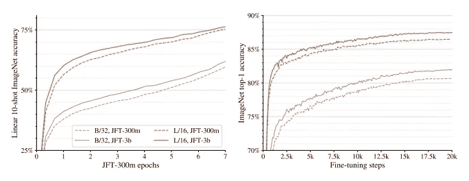

# 缩放视觉变压器

> 原文：<https://medium.com/codex/scaling-vision-transformers-ca51034246df?source=collection_archive---------8----------------------->

杰克·威瑞克在 [Unsplash](https://unsplash.com?utm_source=medium&utm_medium=referral) 上的照片

现代深度学习系统相信*规模*。具有数十亿甚至数万亿参数的大型神经网络似乎表现得令人惊讶，因此神经网络的缩放特性很重要。在 CNN 和变压器的有效缩放方法方面有突出的工作。Vision transformer(ViT)是一个完全转换的架构，在图像分类方面表现出与最先进的 CNN 相当的训练性能。我们应该如何扩展视觉变形金刚？如果我们在训练 ViT 时缩放数据和模型会发生什么？

这篇最近(2021 年 6 月)的论文通过对不同数据和模型大小进行实验，研究了缩放视觉变压器的属性。作为结论，本文提出了一个用于视觉变形器的*缩放法则*，一个缩放视觉变形器的准则。本文还建议对 ViT 管道进行架构上的更改。截至 8 月 4 日，提议的网络在 ImageNet 上达到了最先进的水平，最高准确率为 90.45%。

我们在[之前的文章](/codex/how-do-vision-transformers-work-an-image-is-worth-16x16-words-df47aed1b634)中探讨了 ViT 的概念。这个帖子将是论文的总结:“ [*缩放视觉变形金刚*](https://arxiv.org/pdf/2106.04560.pdf)*”*

## 建筑变化

本文对 ViT 框架进行了更改，并对超参数空间做出了如下结论。

*   “头部”的解耦权重衰减:本文发现，对于最终的线性层(头部)和主干，少击学习中优选的权重衰减强度是不同的。上图表明，身体的小重量衰减和头部的大重量衰减对模型非常有益。
*   通过删除[class]标记来节省内存:在原来的 256 个补丁编码标记中添加一个[class]标记会产生 257 个标记，在 TPU 硬件中，从 256 个标记增加到 257 个标记会产生 50%的内存开销。不使用类标记，而是使用全局平均池或多头注意力池来聚合补丁编码。通过去除最后的非线性投影来简化头部。
*   根据右图，修改似乎不会对性能产生显著影响。

*   将 300 米的数据放大到 3B 影像可以提高小型和大型模型的性能。
*   内存高效优化器:因为训练了数十亿个参数，adam 优化器所需的存储空间是一个很大的瓶颈(根据论文，需要额外的 16GiB)。该论文提出使用具有半精度动量的 Adam 或修改的 Adafactor 优化器，这将优化器开销从权重的 2 倍减少到 0.5 倍。
*   附加训练技术:本文实验了用于提高模型性能的常用训练技术的效果，例如学习率计划。

## 缩放 ViT

CNN 通常由以下三个因素决定:

*   宽度:每层的通道数
*   深度:层数
*   分辨率:输入图像尺寸

由于与注意的密切关系，有许多参数控制着 ViT 的规模。这些包括面片大小、编码器块的数量(深度)、面片嵌入和自我注意的维度(宽度)、注意头的数量和 MLP 块的隐藏维度(MLP 宽度)。

本文使用 Tensorflow [XLA 编译器](https://www.tensorflow.org/xla)优化运行速度和内存。XLA 以最佳方式权衡了内存和速度，并输出了下表中列出的许多模型体系结构配置。

然而，并不是每个网络都能在一台设备上运行。作者执行了下图中描述的模拟，以测量每种配置是否可以实际实现。本文中与记忆相关的修改允许在绿色和蓝色区域中训练模型。

ViT 论文包含了一项关于权衡不同成分的有效规则的研究。规则是以相似的量同时缩放所有深度、宽度、MLP 宽度和面片大小。最终型号以这种方式选择，如下图所示的对角线模式所示。

## 关于扩展 ViT 的见解

最重要的是，本文研究了修改网络规模、数据和持续时间的影响模式。在实验中，一个*表示质量*度量标准测量了学习特征的有用性。准确地说，它是通过 *(i)通过在冻结重量上训练线性分类器的少量转移，(ii)通过在所有数据上微调整个模型的转移*来测量的。该文件建议

*   上图描绘了作为计算函数的错误率。较大模型的性能似乎在某个程度后饱和(ImageNet 中约 10%的误差)。
*   当单独针对模型大小(右上图)或数据集大小(右下图)绘制时，最佳训练设置的比例也会增加。
*   将计算、模型和数据一起放大可提高制图表达质量。如左图和中图所示，使用最大模型、datatset 和 compute 的训练在右下角达到最佳性能。
*   较小的模型(蓝色)或在较少图像上训练的模型(小)在训练时间较长时会脱离曲线。
*   较小的模型不会从增加数据集大小/计算资源中受益。而大型模型似乎明显受益于甚至超过 1B 的图像。

*   上图研究了不同尺寸模型相对于步数的误差率。
*   大模型更有效。例如，在 10 次拍摄的学习中，Ti/16 模型需要看到 100 倍以上的图像才能达到 L/16 模型的性能，在微调中需要看到 20 倍。当在足够的数据上训练时，用更少的步骤学习更大的模型更好。

然而，少量的学习结果似乎是不公平的。竞争对手使用未标记但在域内的数据进行预训练，而 ViT-G 模型能够在不同任务的更大数据上进行自我监督学习。

我可能遗漏了一些东西，但这篇论文似乎提出了关于伸缩 ViTs 属性的矛盾陈述。第 3.3 节中的句子“*小模型和大模型都受益于这种变化，受益系数约为……*”和“*”此外，当增加数据集大小时，我们观察到大模型的性能提高，而小模型的性能没有提高。*2.1 节中的“是矛盾的。

## 摘要

我们将把这项研究中所观察到的情况总结出来。

*   同时缩放总计算和模型大小是有效的。特别是，当额外的计算变得可用时，不增加模型的大小是次优的。
*   具有足够训练数据的视觉转换器模型大致遵循(饱和)幂定律。
*   较大的模型在少数镜头学习中表现更好。
*   提出新的训练技术，提高性能并减少计算瓶颈。

视觉变形器是计算机视觉中一个有效但尚未研究的分支。讨论维生素 t 各种特性的后续论文越来越引起人们的兴趣。特别是，谷歌大脑的研究人员似乎有很大的兴趣。要进一步了解 vit 的各种特性，请阅读:

*   [如何训练你的 ViT？视觉转换器中的数据、增强和规则化](https://arxiv.org/pdf/2106.10270.pdf)
*   [当视觉转换器在没有预训练或强大数据增强的情况下优于 ResNets 时](https://arxiv.org/pdf/2106.01548.pdf)
*   [Vision Transformer 架构搜索](https://arxiv.org/pdf/2106.13700)
*   [什么造就了分层视觉转换器？](https://arxiv.org/pdf/2107.02174.pdf)