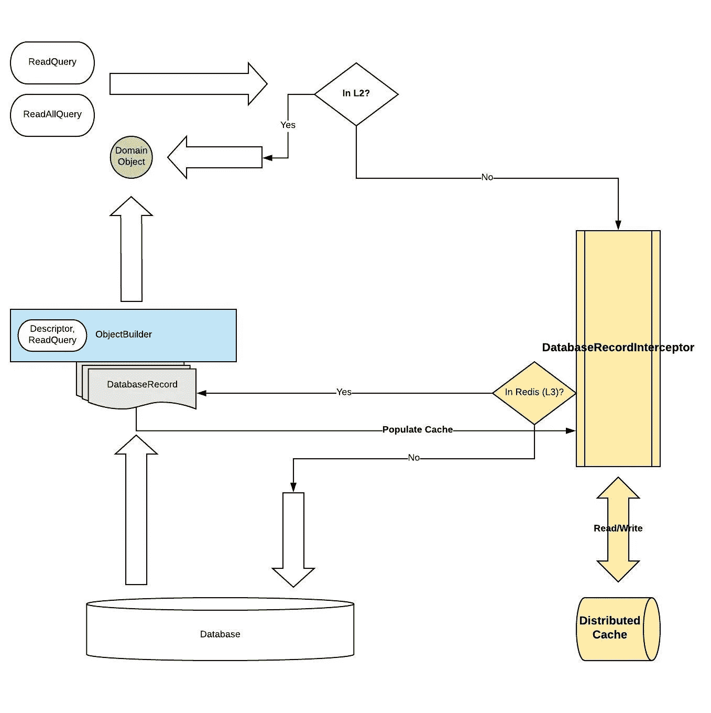

# 使用 EclipseLink 和 Redis 扩展数据库

> 原文：<https://medium.com/codex/scaling-your-database-with-eclipselink-and-redis-d8a6c809a155?source=collection_archive---------3----------------------->

# **概述**

**EclipseLink** 有两种类型的缓存:共享缓存(L2)维护从数据库读取的对象，隔离缓存(L1)保存事务生命周期中各种操作的对象。L2 生命周期与特定的 JVM 相关联，并且跨越多个事务。默认情况下，不同 JVM 之间的缓存协调是关闭的。EclipseLink 提供了一个分布式缓存协调特性，您可以启用它来确保分布式应用程序中的数据保持最新。L1 和 L2 缓存都存储域对象。

**“Redis**是一个开源的(BSD 许可的)、内存中的数据结构存储，用作数据库、缓存和消息代理。Redis 提供数据结构，如字符串、哈希、列表、集合、带有范围查询的排序集合、位图、超级日志、地理空间索引和流。— **redis.io**

这篇文章是关于 EclipseLink 和 Redis 的，但是这个概念可以应用于任何 ORM 和分布式缓存库。

# **挑战**

与 Hibernate 对 L2 与 Redis 集成的现成支持不同，EclipseLink 没有像 L2 与分布式缓存集成那样的等效支持。

EclipseLink 确实为 CacheInterceptor 类提供了几个 API，从理论上讲，开发人员可以实现这些 API 来拦截 EclipseLink 缓存上的各种操作。不幸的是，这些 API 没有很好的文档记录，并且不容易实现，所以您还没有看到任何支持 EclipseLink L2 与 Redis 集成的开源库。

# **解决方案**

好消息是，有一种比通过 CacheInterceptor 接口更容易、更简单的方法来集成 EclipseLink 和 Redis。这种方法使用缓存备用模式来读取数据，并将*数据库记录*存储为缓存条目。我们已经在 Intuit for QuickBook Online Payroll 的生产中使用这种方法来帮助扩展我们的数据库并提高应用程序性能。这是一个巨大的成功。

**缓存备用**

1.  当您的应用程序需要从数据库中读取数据时，它将首先检查 Redis (L3)以查看数据是否可用
2.  如果数据可用(缓存命中)，则返回缓存的数据
3.  如果数据不是(缓存未命中)，则向数据库查询数据。将填充缓存并将数据返回给调用者

**数据库记录**

DatabaseRecord 是 EclipseLink 中的一个对象，它将数据库行表示为字段值对。DatabaseRecord 向一个或多个域对象提供数据。EclipseLink 有从 DatabaseRecord 构建域对象的 API。

L2 缓存使用域对象。使用 DatabaseRecord 作为缓存条目极大地简化了实现，因为我们不必担心维护域对象关系。主键可以与域类名一起使用来创建缓存的键。在概念层面上，DatabaseRecord 类似于数据库表行。重要的一点是，这种方法缓存的是数据，而不是对象树。

**这里是概念性的读取流程**

对于实现，我们使用 AspectJ 组合来挂钩 EclipseLink 生命周期，以拦截填充和失效缓存的读/写操作

# **说够了，给我看看代码**

【DatabaseRecordAspect.java**:这个类将拦截 EclipseLink 使用的 selectOneRow 和 selectAllRows 方法来读取一个对象和一个对象集合**

**DatabaseRecordInterceptor.java**:负责在结果转化为 EclipseLink 对象之前，拦截 expressionquerymechanism . selectonerow()和 expressionquerymechanism . selectall rows()来缓存 DatabaseRecord。

对于缓存失效，您只需要向 DescriptorEventAdapter 注册您的失效器，并实现 postUpdate()、postDelete()和 postInsert()。当 EclipseLink 写入发生时，这些方法中的一个将被执行，您可以调用失效器来删除/更新 Redis 中的缓存条目。您应该异步填充缓存和使缓存失效，以避免阻塞应用程序。

我们使用莴苣作为客户端库来与 Redis 和 Kryo 进行序列化对话

# **结论**

如果缓存用于填充域对象的数据，那么将 EclipseLink 与 Redis 集成会容易得多。最初，我们试图缓存域对象，但是遇到了 EclipseLink 的几个问题。域对象维护与其他对象的关联。当您从 Redis 读回对象时，您必须重建对象树。当对象之间存在延迟加载关联时，这就变得复杂了。数据缓存很简单，缓存条目大小是一致的(即一个数据库行)。可预测的缓存条目大小有助于我们优化 Redis 缓存大小，并使序列化和反序列化更快。您不必对现有的代码做太多的修改就可以让它工作。在减少数据库负载和提供一致的性能方面，这对我们来说是一个真正的游戏规则改变者。