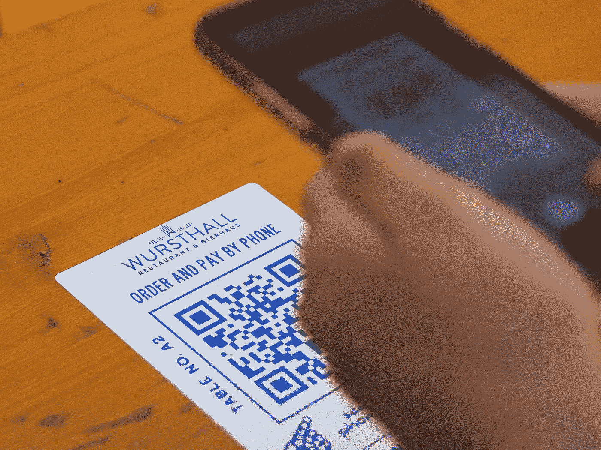
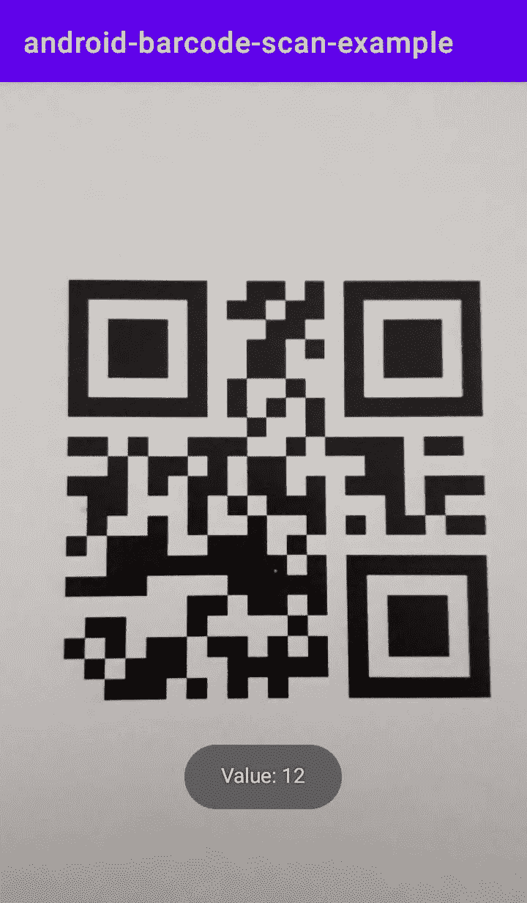
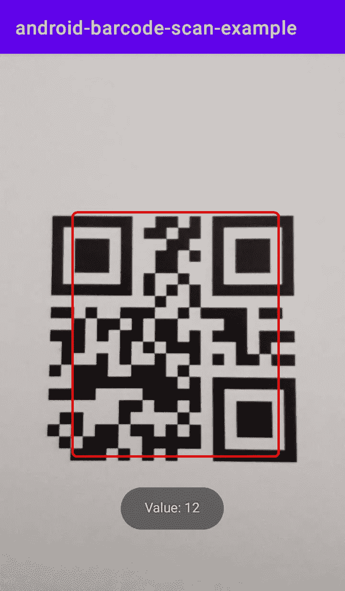

# 使用 ML 套件扫描 Android 中的条形码

> 原文：<https://medium.com/codex/scan-barcodes-in-android-using-the-ml-kit-30b2a03ccd50?source=collection_archive---------0----------------------->

## 如何借助 Google APIs 在 Kotlin 中实现实时条形码扫描仪



照片由[阿尔伯特·胡](https://unsplash.com/@alberthu?utm_source=unsplash&utm_medium=referral&utm_content=creditCopyText)在 [Unsplash](https://unsplash.com/s/photos/qr-code?utm_source=unsplash&utm_medium=referral&utm_content=creditCopyText) 上拍摄

移动应用中要求的一个非常常见的功能是检测、扫描和分析条形码的能力。

Github 上有很多适合需求的开源库。无论如何，我认为使用官方的 Google APIs 是一个更好的方法。
官方图书馆通常得到更好的维护和优化。

谷歌开发了一系列专用于移动开发者的 API，这些开发者需要在他们的应用程序中添加机器学习功能。

ML 套件兼容 iOS 和 Android。
您可以在[官方文档](https://developers.google.com/ml-kit)中查看其所有功能。

# 必需的库

对于这个项目，您将需要使用两个库:

1.  **条形码扫描 API**
    该库是 ML Kit Vision API 的一部分。
    顾名思义，它的功能是读取各种条形码格式的数据。
    你可以在[官方文档](https://developers.google.com/ml-kit/vision/barcode-scanning)中找到关于这个 API 的更多信息。
2.  **CameraX** 这个支持库是 [Android Jetpack](https://developer.android.com/jetpack) 套件的一部分。它提供了一个 API，使得与相机相关的功能易于开发和实现。你可以在官方文档中了解更多关于这个库的信息。

# 项目设置

开始的第一步是向项目添加所需的依赖项和权限。

1.  将`mavenCentral()`存储库包含到您的项目级`build.gradle`文件中。
2.  将依赖项添加到您的应用程序级`build.gradle`文件中:

```
// Barcode scanning API
implementation 'com.google.mlkit:barcode-scanning:17.0.0'// CameraX library
def camerax_version = "1.0.1"implementation "androidx.camera:camera-camera2:$camerax_version"
implementation "androidx.camera:camera-lifecycle:$camerax_version"
implementation "androidx.camera:camera-view:1.0.0-alpha28"
```

3.将所需的`CAMERA`权限添加到您的`AndroidManifest.xml`文件中:

```
<uses-permission android:name="android.permission.CAMERA" />
```

一旦完成了这些配置步骤并同步了所有的依赖项，就可以进入实现阶段了。

# 项目执行

让我们使用单个活动应用程序实现一个简单的条形码扫描器。

## 1.创建`ImageAnalysis.Analyzer class`的子类

这个类将负责处理从摄像机接收到的所有帧。

该类必须覆盖`analyze(image: ImageProxy)`方法。
该方法将从摄像机捕捉的每一帧作为`ImageProxy`对象接收，并允许您对其进行处理。

要设置处理环境，您需要:

1.  通过`fromMediaImage`方法从接收到的图像中创建一个`InputImage`对象
2.  创建一个将处理`InputImage`的`BarcodeScanner`对象。
    该对象将为其配置接收一个`BarcodeScannerOptions`参数。
    初始化后，您将能够处理收到的条形码或处理扫描阶段出现的错误。

您可以通过使用`setBarcodeFormats`方法指定扫描仪接受的格式来优化扫描过程。

**一旦分析终止，调用** `**image.close()**` **方法**是很重要的。
这将为待处理的其他图像释放分析队列。

下面是该类的完整实现:

## 2.创建 BarcodeScanner 活动

现在，是时候设置应用程序的主要活动了。

在您的`/res/layout`文件夹中创建一个 XML 布局文件，姑且称之为`activity_barcode_scanner.xml`

如您所见，该布局仅包含`PreviewView`组件。这将负责在屏幕上显示相机预览。

然后，**创建与布局相关联的活动**，姑且称之为`BarcodeScannerActivity.kt`

在这个类中有 3 个基本特性需要实现:

1.  设置一个`ExecutorService`实例。
2.  处理`Android.manifest.CAMERA`权限的请求。
3.  编写负责设置相机预览的代码，并将其绑定到之前创建的图像分析器。

让我们从**初始化** `**ExecutorService**`开始。

这个类提供了产生一个`Future`的方法，它将负责跟踪摄像机生成的任务。
你可以在[官方文档](https://developer.android.com/reference/java/util/concurrent/ExecutorService)上找到更多信息。

我们声明一个`lateinit` var，它将在活动创建时初始化，并在活动被销毁后关闭。

然后，是负责许可请求的**代码的时候了。**

您需要实现 **3 个方法**:

1.  一个负责提示用户许可的功能，如果用户还没有被授予许可的话。
2.  一种控制权限是否被授予的功能，如果不是，则提示用户。
3.  分析用户对权限请求的响应的功能。

您可以在下面的代码中看到上述函数的实现。
创建活动后，您可以通过调用`checkCameraPermission`请求用户的许可。

正确管理权限后，让我们执行**摄像机设置代码**。

您需要声明一个方法。
这种方法将需要:

1.  检索一个`ProcessCameraProvider`实例。
    该对象将相机生命周期绑定到应用程序。
2.  设置`Preview`对象，连接布局中声明的`PreviewView`
3.  设置`QrCodeAnalyzer`类。
    你应该指定`ImageAnalysis.STRATEGY_KEEP_ONLY_LATEST`用于优化目的。通过这样做，每次只有一个帧将被传送用于分析，避免处理队列的大小增长。
4.  通过`CameraSelector`属性选择预览的首选摄像机
5.  使用`bindToLifecycle`方法用指定的配置设置摄像机会话。

下面是一个实现这些步骤的函数。

现在，您应该能够使用您的应用程序扫描条形码了:



## 3.(可选)在条形码上绘制一个图形轮廓

您可以在应用程序中实现的一个可选功能是在检测到的条形码周围添加一个边框。增加这个功能会给用户友好的反馈。

您可以通过以下两个步骤添加图形轮廓:

1.  实现`View`类的一个子类。这个类将负责在屏幕上绘制矩形。
2.  编辑您的`ImageAnalysis.Analyzer`类，以便在检测到条形码时处理`View`类的添加。

让我们从 `**View**` **子类**的**创建开始。
新建一个文件，姑且称之为`BarcodeBoxView`。**

这个类将接收一个符合`View`构造函数的`Context`参数。

此外，您将使用两个全局变量:

1.  一个`Paint`物体。
    这将负责存储包围盒的样式信息。
2.  一个`RectF`物体。它将包含将要在屏幕上绘制的矩形的坐标。
    这个变量将有一个自定义的`setter`来更新它的值。

该类的主要功能是`onDraw(canvas: Canvas?)`方法。
它负责在每次调用`setRect`方法时在屏幕上显示所需的图形。

下面是该类的完整实现:

一旦你创建了这个类，你需要修改`QrCodeAnalyzer`类，以在每次新的条形码可视化时更新边界框。

为此，您需要**向类构造函数**添加 3 个变量:

1.  在`BarcodeScannerActivity`中初始化的`BarcodeBoxView`实例
2.  `PreviewView`的宽度
3.  `PreviewView`的高度

最后两个参数将用于调整边界框相对于`PreviewView`大小的比例。

之后，你需要实现负责缩放边界框的代码，以适应`PreviewView`的尺寸。

您可以通过以下步骤实现这一点:

1.  声明水平和垂直比例因子，即`scaleX`和`scaleY`。
2.  声明两个函数，负责参数的调整。将此功能称为`translateX`和`translateY`。
3.  声明一个函数，该函数将应用从`barcode.boundingBox`参数接收到的对`Rect`的调整。

在初始化阶段完成后，您可以通过使用`BarcodeBoxView`类的`setRect`方法来更新条形码的边界框。

下面是所讨论的类的完整实现:

最后，为了让它工作，您需要通过添加所需的参数来修改`startCamera`方法中的`QrCodeAnalyzer`构造函数:

```
QrCodeAnalyzer(
    this,
    barcodeBoxView,
    binding.previewView.*width*.toFloat(),
    binding.previewView.*height*.toFloat()
)
```

完成这些步骤后，您应该能够看到每次扫描条形码时都会显示一个边界框。



# 包扎

这就是功能的实现。
你可以在这个 [GitHub repo](https://github.com/lpizzinidev/android-barcode-scan-example) 找到完整的示例项目。

我希望这篇文章能帮助你构建令人惊叹的应用程序，并让你更清楚如何使用 Android 集成 ML 工具包库。

编码快乐！