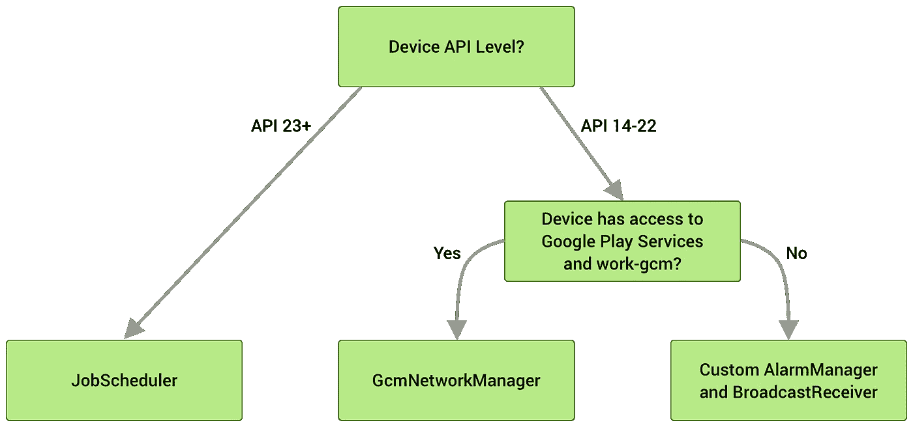
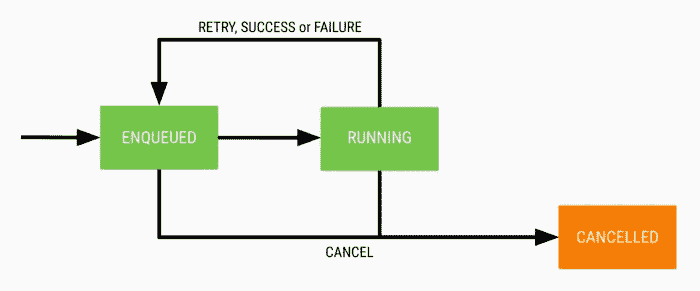

# 使用工作管理器计划任务

> 原文：<https://medium.com/codex/scheduling-tasks-with-workmanager-13c4ad62704d?source=collection_archive---------2----------------------->


照片由[莫里茨·金德勒](https://unsplash.com/@moritz_photography?utm_source=unsplash&utm_medium=referral&utm_content=creditCopyText)在 [Unsplash](https://unsplash.com/s/photos/clock?utm_source=unsplash&utm_medium=referral&utm_content=creditCopyText) 上拍摄

有一个简单的方法，通过拆分名称来描述 WorkManager 的特性。想象一下，你正在经营一家公司，你要负责同时处理大量的事情。在某些时候，你很难独自完成这一切。让我们称这些任务为**工作**。自然，你会把这些**作品**委托给你的下属或者你的员工。他们有能力在不打扰你的情况下管理它。他们可以和你一样高效地完成这些任务，同时减轻你肩上的负担。让我们称他们为"**管理者**"所以工作+经理=工作经理。

让我们重新思考一下 Android 世界中的相同场景。使用 WorkManager API，您可以调度可推迟或异步的任务。WorkManager 将确保这些任务将运行，即使您的应用程序已退出或处于后台。它是 Android 后台调度 API 的继承者，如 FirebaseJobDispatcher、GcmNetworkManager 和 JobScheduler。你可以说工作管理器是一个结合了所有前辈力量的野兽。此外，它是向后兼容的(API 级别 14)，并意识到电池寿命。还有一个很酷的特性叫做“约束”我们将很快了解它。

## 在后台



图片来源:Android 开发者

当您发送工作请求时，WorkManager 会将其保存在本地数据库中。这就是即使应用程序退出或处于后台，它也能记住工作的方式。然后，它将检查您是否正在使用 API 级别 23+,如果是，它将向 JobScheduler 发送工作请求。如果你的 API 等级在 14-22 之间，它会检查你的设备是否安装了 Google play 服务。如果是，那么将调用 GcmNetworkManager。否则，自定义 AlarmManager 和 BroadcastReceiver。

## 我们要建造什么？

我们将创建一个应用程序，将从网络下载图像，并在 ImageView 上显示它。通过使用这个例子，我们将了解工作管理器的特性。

## 定义工作

我们已经决定从网络上下载一张图片，然后在 ImageView 上显示。就是我们所说的`Work`。我们定义这项工作的类被称为`Worker` 类。

```
class ImageDownloadWorker(context: Context, params: WorkerParameters): CoroutineWorker(context, params) {

    override suspend fun doWork(): Result {
        return try {
            downloadImage()
            Result.success(outputData)
        }catch (e: Exception) {
            Result.failure()
        }

    }
}
```

我们可以通过简单地用一个`Worker`类扩展任何一个类来创建一个`Worker`类。它将覆盖一个名为`doWork()`的方法，该方法将在 WorkManager 提供的后台线程上异步运行。你可能已经注意到我们正在扩展一个`CoroutineWorker` 而不是一个普通的`Worker` 类。如果你用的是 Java，那么你可以用`ListenableWorker` 。原因是`Worker`类在后台同步运行，而`ListenableWorker` 和`CoroutineWorker` 会异步运行。

结果将通知您您的工作是成功、失败还是需要重试。

## 创建工作请求

既然我们已经定义了我们的`Worker`类，我们必须使用 WorkManager 服务来调度我们的工作请求。有两种方法可以安排您的工作请求。您可以在一段时间间隔内定期运行您的请求，也可以安排它只运行一次。

> 创建一次性工作请求

创建 WorkManager 类的新实例。

```
private val workManager by *lazy* **{** WorkManager.getInstance(*applicationContext*)
**}**
```

接下来，创建您的工作请求

```
 val constraints = Constraints.Builder()
    .setRequiredNetworkType(NetworkType.*CONNECTED*)
    .build()

val imageDownloadWorker = *OneTimeWorkRequestBuilder*<ImageDownloadWorker>()
    .setConstraints(constraints)
    .addTag(*UNIQUE_TAG*)
    .build()

workManager.enqueueUniqueWork(
    "oneTimeImageDownloader",
    ExistingWorkPolicy.*KEEP*,
    imageDownloadWorker
)
```

让我们仔细检查每一行代码，了解发生了什么。

```
val constraints = Constraints.Builder()
    .setRequiredNetworkType(NetworkType.*CONNECTED*)
    .build()
```

顾名思义，如果不满足某些条件，约束将限制工作管理器的操作。在这里，我确保工作管理器只有在互联网连接正常的情况下才会运行。这样，您可以设置一些其他约束，例如，

*   设备电池状况良好
*   设备存储很好

```
val imageDownloadWorker = *OneTimeWorkRequestBuilder*<ImageDownloadWorker>()
    .setConstraints(constraints)
    .addTag(*UNIQUE_TAG*)
    .build()
```

创建一个 OneTimeWorkRequestBuilder，并添加约束细节和一个唯一标记。我们可以使用这个标签来取消或观察我们的工作。

```
workManager.enqueueUniqueWork(
    "oneTimeImageDownloader",
    ExistingWorkPolicy.*KEEP*,
    imageDownloadWorker
)
```

最后，将工作请求排队。

> 创建定期工作请求

有时候，我们的应用程序需要定期运行一些任务。比如，同步一天的活动，或者像 WhatsApp 一样备份数据。在这种情况下，可以使用 PeriodicWorkRequest。

```
val builder = Data.Builder()
builder.putString(*KEY_IMAGE_ID*, "1")
val data = builder.build()

val constraints = Constraints.Builder()
    .setRequiredNetworkType(NetworkType.*CONNECTED*)
    .build()

val imageDownloadWorker = *PeriodicWorkRequestBuilder*<ImageDownloadWorker>(
    15, TimeUnit.*MINUTES* ).setInputData(data)
    .setConstraints(constraints)
    .addTag(*UNIQUE_TAG*)
    .build()

workManager.enqueueUniquePeriodicWork(
    "periodicImageDownloader",
    ExistingPeriodicWorkPolicy.*KEEP*,
    imageDownloadWorker)
```

OneTimeWorkRequest 和 PeriodicWorkRequest 之间的区别在于，我们有一个额外的参数来指定最小间隔。你可能会想，为什么它被称为最小间隔**而不是重复间隔**呢？原因是，由于我们之前设置的约束，时间间隔可能会延长。如果没有互联网连接，那么工作将不会运行，并且这个间隔可以被延长。此外，请记住最短时间长度为 15 分钟。

> 添加输入和输出

为此，我们使用了`Data`对象。它们是键/值对的轻量级容器。它们帮助我们从`WorkRequest`传入和传出数据。

```
val builder = Data.Builder()
builder.putString(*KEY_IMAGE_ID*, "1")
val data = builder.build()
```

*   创建数据构建器对象
*   然后，使用 putString 方法将 ImageId 添加到构建器中。常量中的 KEY_IMAGE_ID 作为“键”,值为“1”。
*   在`Data.Builder`对象上调用`build`来创建你的`data`对象并返回它。

完全码

```
val builder = Data.Builder()
builder.putString(*KEY_IMAGE_ID*, "1")
val data = builder.build()

val constraints = Constraints.Builder()
    .setRequiredNetworkType(NetworkType.*CONNECTED*)
    .build()

val imageDownloadWorker = *OneTimeWorkRequestBuilder*<ImageDownloadWorker>()
    .setConstraints(constraints)
    .setInputData(data)
    .addTag(*UNIQUE_TAG*)
    .build()

workManager.enqueueUniqueWork(
    "oneTimeImageDownloader",
    ExistingWorkPolicy.*KEEP*,
    imageDownloadWorker
)
```

接下来，让我们在`Worker` 类中检索 ImageId。

```
override suspend fun doWork(): Result {
    return try {
        val imageId = *inputData*.getString(*KEY_IMAGE_ID*)
        val picture = downloadImage(imageId)
        val outputData = *workDataOf*(*KEY_IMAGE_ID to* picture)
        Result.success(outputData)
    }catch (e: Exception) {
        Log.e("doWorkException", e.printStackTrace().toString())
        Result.failure()
    }

}
```

*   我们可以使用`inputData`方法获取传递给`Worker`类的 imageId。因为我们使用了`putString`方法传递数据，所以我们应该使用`getString`来检索它。
*   同样，我们可以从`WorkRequest`返回任何数据。这里，我们将从 API 返回 imageUrl。创建一个新的数据对象，就像我们为输入所做的那样，使用相同的键“KEY_IMAGE_ID”并使用“picture”作为值。
*   使用`Result.success(outputData)`将`outputData`返回到工作管理器

完全码

```
class ImageDownloadWorker(context: Context, params: WorkerParameters) :
    CoroutineWorker(context, params) {

    override suspend fun doWork(): Result {
        return try {
            val imageId = *inputData*.getString(*KEY_IMAGE_ID*)
            val picture = downloadImage(imageId)
            val outputData = *workDataOf*(*KEY_IMAGE_ID to* picture)
            Result.success(outputData)
        }catch (e: Exception) {
            Log.e("doWorkException", e.printStackTrace().toString())
            Result.failure()
        }

    }

    private suspend fun downloadImage(imageId: String?): String? {

        val service = ServiceGenerator.createService(Service::class.*java*)
        var imageUrl: String? = null
        if (imageId != null) {
            val response = service.getImage(imageId)
            if (response.*isSuccessful*) {
                response.body().*let {*
                    imageUrl = response.body()?.download_url
                **}** }
        }
        return imageUrl
    }
}
```

> 观察工作进度

我们可以观察工作进度，并根据结果更新我们的 UI。

```
private fun observeWork(id: UUID) {
    workManager.getWorkInfoByIdLiveData(id).observe(this, **{** info **->** if (info != null && info.*state*.*isFinished*) {
            val imageUrl = info.*outputData*.getString(*KEY_IMAGE_ID*)
            Log.e("imageUrlSuccess", imageUrl.*toString*())
            if (imageUrl != null) {
                binding.button.*visibility* = View.*GONE* binding.imageView.*visibility* = View.*VISIBLE* setImage(imageUrl)
            }
        }
    **}**)
}
```

您可以使用工人 id 轻松观察工作，然后以`LiveData`的形式获取信息。我们将能检查工作是否完成了。如果这样，我们可以尝试从 Worker 类中检索 WorkRequest 的输出。

注意:如果您正在执行 PeriodicWorkRequest，那么您不能检查状态是否为完成。原因是**工作链**在 PeriodicWorkRequest 中是不可能的。在工作链中，一个请求在成功后结束，然后转移到下一个工作者。由于工作链是不可能的，PeriodicWorkRequest 将处于排队状态，等待下一次执行。



图片来源:Android 开发者博客

我希望你能够理解工作管理器的工作原理及其许多有用的特性。WorkManager 还有许多其他特性我在本文中没有提到。如果你很好奇想了解更多，我建议你查看 Android 开发者的这个[文档](https://developer.android.com/topic/libraries/architecture/workmanager?gclid=Cj0KCQjwytOEBhD5ARIsANnRjVjsZ0xqf65W5fh4H9FQwlm6YEj2mPwWj-F5XkDWAW93tjGoSzdy5a8aAvxREALw_wcB&gclsrc=aw.ds)。此外，您可以在我的 GitHub [资源库](https://github.com/clint22/WorkManagerSample)中获得完整的代码。

我希望你和你的家人在疫情期间平安无事。让我们一起坚强，互相帮助。

文章原贴[此处](https://clintpauldev.com/workmanager-android/)。

你可能也想阅读我最近的文章

[](/swlh/android-room-testing-made-easy-using-dagger-hilt-89d2d5d0e7f2) [## 使用匕首柄使 Android 房间测试变得容易

### 我一直想知道是否有一种方法可以确保我们的 DAO 函数在运行…

medium.com](/swlh/android-room-testing-made-easy-using-dagger-hilt-89d2d5d0e7f2) [](/swlh/how-to-create-a-simple-camera-app-using-android-camerax-library-7367778498e0) [## 如何使用 Android CameraX 库创建简单的相机应用程序

### 我只记得少数几个由 Android 团队开发的 API 像这个 API 一样轻松和先进…

medium.com](/swlh/how-to-create-a-simple-camera-app-using-android-camerax-library-7367778498e0) [](/swlh/how-to-add-multiple-headers-to-grid-recyclerview-in-androidx-9dbd3460e06b) [## 如何在 AndroidX 中向 Grid recyclerView 添加多个头

### 这篇博文的封面图片不是巧合。我想和你分享我经历的情感创伤…

medium.com](/swlh/how-to-add-multiple-headers-to-grid-recyclerview-in-androidx-9dbd3460e06b)