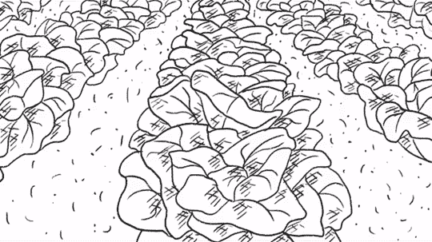
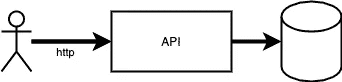
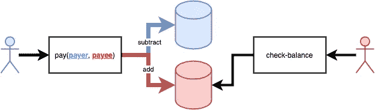
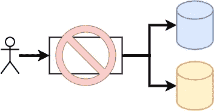
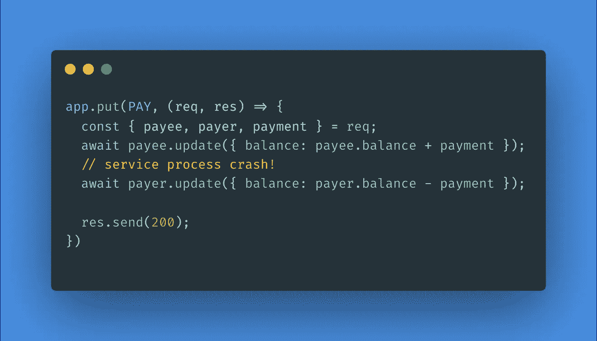
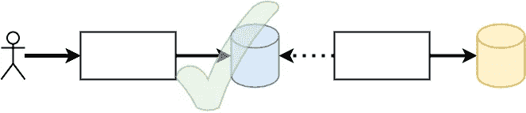
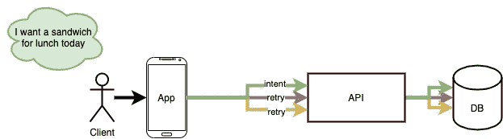
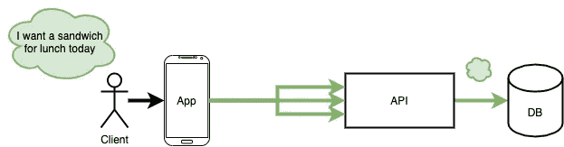
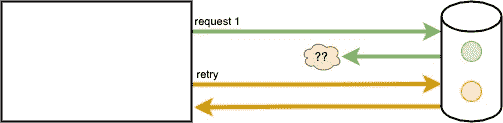

# 薛定谔的微服务

> 原文：<https://medium.com/codex/schr%C3%B6dingers-microservice-c4035cb75094?source=collection_archive---------3----------------------->

在分布式系统或微服务架构中，操作的设计必须不同于采用传统整体式事务存储的应用程序。微服务架构中的 API 通常很复杂，由许多部分组成。状态分散在各种存储技术、第一方组件、第三方 SaaS 产品、云数据库、队列和服务中。

经常被忽视的是，状态分布的这一特性将微服务置于软件的“量子叠加”中，在这种情况下，状态似乎表现得不直观。

我有时认为软件产品是一个物理的东西，就像一把铲子，一扇门，或者一株植物。软件产品和实物都释放了一些用户没有的能力。继续这个比喻，使软件产品运转的服务星座就像赋予物理事物形状的分子。组成服务的操作是它的原子，只有链接在一起才变得有用。

这些数据——分散在整个软件系统中的各个状态——就像组成物质的奇怪的小亚原子粒子，两者的行为在检查时都违反直觉。

就像物理世界中夸克和μ子的自旋属性一样，分布式软件世界中的数据状态在任何时刻都不是很好定义的。设计一个大规模的分布式系统就像放牧薛定谔的猫一样。依赖项同时可用和不可用，数据库同时更新和不更新。

下面，我将讨论分布式系统的重要设计点，包括原子性、一致性、部分失败和幂等性，以及处理大规模怪异的有用设计和思维模式。

我提出的主要观点如下:

1.  在微服务架构中构建原子操作是困难的。
2.  运营应该将幂等性建模为业务意图的标识符。
3.  操作的可用性大致是其依赖关系的产物。

# 原子性和一致性

在软件中，术语“原子”指的是全有或全无。如果原子多部分操作的任何效果都没有发生，那么其他效果也不会发生。

通常，操作的“副作用”是数据库中的状态改变、文件的创建、队列中的新消息等。，而“操作”是同步 HTTP API。

原子复杂操作的一个典型例子是银行交易。

*付款人向收款人支付款项。*

银行交易操作由两部分组成:

a)向收款人
添加付款 b)从付款人处减去付款

重要的是，如果任何一部分没有发生，那么任何一部分都不应该发生，否则这个系统就不是封闭的。如果加法成功而减法失败，那么货币就是从以太中虚假地“创造”出来的。相反，如果减法成功而加法失败，钱就会“流失”。

这对微服务的分布式系统提出了一个问题。因为状态分布在许多组件中，所以很难使用数据库事务之类的工具来实现所需的原子行为。

分布式系统中的复杂操作只有在客户端无法观察到它是许多部分的总和、状态分布在许多组件上的情况下才是真正的原子操作。

## 设计具有同步副作用的公共操作

根据我的经验，微服务中最常被忽略的设计考虑是部分故障。在复杂的公共操作中，有多个部分可以被服务边界之外的客户端调用，应该有一个同步副作用，并且所有其他副作用应该作为第一个副作用的结果而次要发生。

具体地说，在公共 API 的同步路径中应该只有一个状态变化。一个表中的一个新项目。跨多个表的一个事务。对一个变化的远程依赖的一个远程调用。仅此而已！

## 耐用的线

操作应该只有一个状态变化的原因是我称之为“线程持久性”的东西如果有某种*服务内部的*非短暂机制确保线程的所有步骤都被执行，那么执行线程就是*持久的*。如果一个执行线程依赖于服务边界之外的某个参与者来确保该线程在它的一部分先前失败的情况下被完成，那么该线程就不是*持久的。*

[Moritz 320 拍摄的照片](https://pixabay.com/photos/frayed-rope-cord-worn-crack-6094604/)

非持久执行线程的例子包括链式 REST API 调用:当智能手机进入电梯时，没有什么能阻止它在连续的 API 调用之间丢失网络。类似地，不持久但不太明显的执行线程是 JVM 堆、NodeJS 服务中的承诺或任何其他只存在于主机内存中的状态的未来。

如果进程崩溃，网络瘫痪，或者在连续的状态更新之间发生任何其他的事情，就不能保证所有期望的更新都会发生。

从客户端的角度来看，没有数据库总是可访问的。没有一个远程依赖项具有 100%的可用性。没有！即使是最复杂、高可用性的网络和冗余云服务有时也无法实现。有时你的服务器会崩溃。

此外，公共操作的客户将做他们想做的任何事情，而不是服务的设计者所期望的。客户端可能会重试，也可能不会重试，因此服务本身需要保护自己的状态，并确保线程完成。

“有时”的意思是“每天”。建立随时可能失败的运营，不要依赖外部因素来保持一致性。

## 标识实体和变更数据捕获

与原子性相关的是一致性。“最终一致”操作的客户端无法观察到一段时间后操作由许多部分组成。

最终的一致性是实现上述类型的“螺纹耐久性”的有用工具。我的首选方法是[变更数据捕获](https://en.wikipedia.org/wiki/Change_data_capture) (CDC)设计模式。在 CDC 中，数据库本身保证作为数据被改变的结果，执行的线程被传递到一些其他组件(例如，改变处理器)。

在数据库中创建一个“请求”、“分类帐”或“身份”实体，然后立即向客户端发回一个响应。这个响应的信息足够让客户端拥有一个已创建实体的 id，用一个状态指示它的创建正在进行，并且为系统的其余部分存储了足够的数据，以便最终完成线程的所有部分。

在观察到数据已经改变之后，CDC 处理程序异步完成线程的所有其他部分。

CDC 很容易实现，并且成本不高，但是对于开发团队来说，这是一个可怕的范式转变。CDC 在很多常见的数据库中是原生可用的，实现包括 MongoDB CDC、DynamoDB Streams、Kafka connectors、PostgreSQL CDC 等。许多这样的集成还保证变更处理程序实际上成功了，否则变更将被放入死信队列。

反对这种模式的论点是，由于最终的一致性，它会导致额外的复杂性或延迟。

在大规模实践中，“总是最终一致”比“偶尔永远不完整”更好。契约是明确的，最终会自行解决，对于大多数应用程序来说通常足够快，并且是可以设计的粗糙边缘。

# 运算应该是幂等的

当设计一个复杂的操作时，考虑任何一个子操作以任何顺序发生零次、一次或十次时对系统的影响是很有用的。

如果为原子性设计是处理发生零次的子操作，那么为幂等性设计是处理发生十次的子操作。

幂等运算可以用相同的输入重复调用，但只会引起一次客户端可观察到的状态变化。所有的公共变异操作都应该是幂等的，因为客户端可以(并且愿意)按照他们想要的次数和频率重试。

通常，幂等性是通过使用随机生成的唯一请求标识符并跳过已经执行的请求来实现的。这些标识符有许多名称，通常称为幂等令牌、客户端令牌、客户端密钥、幂等密钥，有时也称为请求 id。

## 将幂等性建模为意图

考虑幂等性的一个好方法，甚至可能是一个更好的名称，是对意图的识别。客户的单一意图应该对应于单一的副作用。由此可见，单个意图应该具有单个唯一的意图标识符(即客户端令牌、幂等令牌等)。

在这里，意图意味着一种身体或商业姿态，比如我想买一个三明治当午餐，因为我饿了。我的意图不是“按下订购三明治按钮”，也不是“调用 *POST /sandwich* API。”商业姿态——我的肚子关心的事情——是得到一个三明治，而不是让它发生的任何事情。

幂等性的“基于令牌的请求去重复”方法最常见的错误是错误地选择熵来生成随机的幂等性请求标识符。

如果一个操作收集熵来在服务器端生成这样一个标识符，那么这个操作实际上几乎从来都不是等幂的。当您考虑到客户端发出请求后，它们可能会由于网络故障而自动重试时，这一点就很明显了。该服务将为原始意图和重试生成请求标识符。

意向(绿色)和重试(红色、黄色)请求都生成一个 ID

我喜欢把幂等请求标识符想象成业务决策输入的校验和。从这个意义上说，操作应该收集用于随机生成幂等请求标识符的熵，尽可能将*映射到意图。*

在上面的例子中，“SHA(购物车)”可以用作“三明治订单幂等请求标识符”的种子，因为它包含业务手势的所有输入的适当近似(下订单的用户、会话、购物车的内容、供应商等)。).

intent(绿色)用于标识初始请求和重试请求，仅生成一个 ID

## 超时并不等同于失败

最常见的动机是，远程依赖关系的“网络超时”与明确建模的完全故障不同。从客户端的角度来看，客户端超时后服务器端的状态是不确定的。

当相关服务或存储超时时，客户端无法确定该服务是忙于处理请求、完成处理请求，还是从未收到请求。当请求超时时，客户端无法知道所请求的状态是否在服务器端发生了改变。由于光同时表现为波和粒子，超时表现为成功和失败。

亚历山大·别尔德尼科夫拍摄的

这是一个被广泛研究的现象，叫做[两位将军](https://en.wikipedia.org/wiki/Two_Generals%27_Problem)的问题。

当实现超时反应重试时，请考虑系统有以下可能的状态:

1.  一个远程依赖被**请求** **一次**，被**接收** **一次**
2.  一个远程依赖被**请求** **两次**，被**接收** **一次**
3.  一个远程依赖被**请求** **两次**，被**接收** **两次**
4.  一个远程依赖被**请求了两次**，其中**从未被**接收

..诸如此类。

重试(黄色)状态是不必要的—原始状态变化(绿色)已经被记录

# 概率故障

复杂操作的可用性是所有依赖关系的最小可用性的乘积，假设它们本身不共享依赖关系。如果任何一个依赖项失败，复杂操作将会失败。

[植村明德的照片](https://unsplash.com/photos/-T6vP7ZGz0Q)

考虑一个具有三个同步远程依赖项的复杂操作:云数据库、SaaS 服务和第一方组件。云数据库可以有 99.9%的可用性。SaaS 服务具有 99.9%的可用性。并且第一方组件具有 99.9%的可用性。

乍一看，复杂操作的可用性似乎是 99.9% —所有三个依赖项的可用性。然而，事实并非如此。如果可用性是失效的倒数，失效概率是三个依赖关系中任意一个**失效的概率，那么最大可用性就是 99.9% x 99.9% x 99.9% = 99。 ***7*** %。**

**随着微服务架构的发展，操作变得更加复杂(例如，更多的部件)，考虑最大可用性成比例下降。当依赖服务的数量超过 10 个或更多时，这在面向服务的体系结构中很常见，可用性很快开始下降一些重要的 9。**

# **摘要**

**如果您在分布式系统中工作，考虑一下如果操作的任何部分出现零次、一次或十次，或者以任何顺序出现，您的用户会发生什么。**

**运营应该将幂等性建模为业务意图的标识符**

**复杂操作中的故障概率是所有组件的故障概率的乘积。依赖项越多，服务的可用性就越低。**

# **附录，参考文献**

## **两位将军**

**这篇文章的部分灵感来自乔伊·林奇的《[分布式系统词汇](https://jolynch.github.io/posts/distsys_shibboleths/)》。强烈推荐阅读👌。**

## **编辑**

**感谢[埃文·万拉塞克](https://evanw.com/)的编辑！**