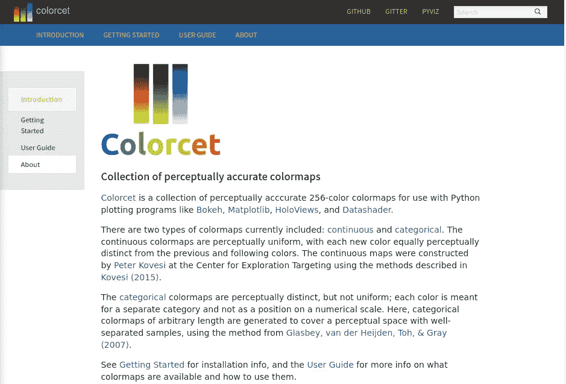
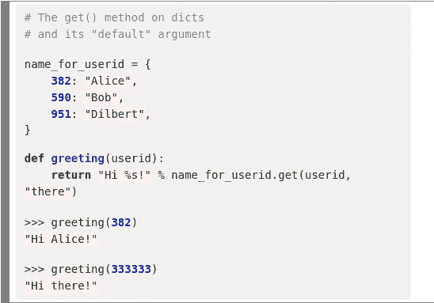

# 科学短片#2:孟加拉文字识别、可感知的彩色地图和 Python 时事通讯

> 原文：<https://medium.com/codex/science-shorts-2-bengali-character-recognition-perceptible-colour-maps-python-newsletters-83f3cc922bab?source=collection_archive---------11----------------------->

## [法典](http://medium.com/codex)

*Kaggle* *特级大师*处理第五大流行母语的字符识别，如何为你的情节选择正确的配色方案和有用的 *Python* 时事通讯。

# 范围

*英伟达* *机器学习* (ML) *特级大师*参加了 *Kaggle* 世界第五大流行母语*孟加拉语*的字符识别比赛。该团队在调整这些模型时解决了一些“不成文”的语言规则。与其从你最喜欢的绘图库中选择默认颜色方案或个人偏好，不如在 *Colorcet* 库中找到更科学的依据。最后，我最近订阅了两篇基于 Python 和 T21 的时事通讯。

# 介绍

以下三篇文章是从我的*袖珍*列表中随机选取的，这是我在过去 5 年里在*数据科学*领域策划的；动机和背景在以前的帖子中讨论过: [*数据科学短片*:我的*口袋*清单](https://aero-data-science.medium.com/science-shorts-an-introduction-to-my-pocket-list-fb915c4569f2)介绍。

# 孟加拉文字识别

Nvidia 关于孟加拉卡格尔挑战赛的文章|作者截图| Nvidia 的文章和插图

## 摘要

2019 年 12 月至 2020 年 3 月期间， *Kaggle* 跑了[孟加拉。AI 手写字形分类](https://www.kaggle.com/c/bengaliai-cv19)挑战。本文描述了训练集数据面临的挑战以及缓解这些不足的后续策略。该团队的最高排名是第五，但大多数成员都进入了前 30 名，这令人印象深刻。学习率的方法和模型的选择一样重要。

## 语境

对于很多人(包括我)来说，大部分接触*机* *学*都是从优秀的 [sci-kit 学](https://scikit-learn.org/stable/)、 [keras](https://keras.io/) 和 [pyTorch](https://pytorch.org/) 开始(也是结束)。这篇博客展示的是一些为新的应用程序微调现有模型的“艺术”。同时，展示了说英语的人在对我们共同语言的研究中所享有的特权。

# 彩色地块的现代彩色地图

Colorcet 库|作者截图| Colorcet 的文章和作品

## 摘要

下面两张图片比较了相似的彩色地图，来自`matplotlib`的`hot`和来自 [*的可选颜色*](https://colorcet.holoviz.org/index.html) 使用 256 色渐变称为`fire`:

热色图|按[颜色分类的图像](https://colorcet.holoviz.org/index.html)

火焰颜色图|图像由[颜色生成](https://colorcet.holoviz.org/index.html)

两幅图像的右侧都显示了`fire` `colormap`相对于`matplotlib`的历史默认值增加的保真度。还要注意光谱中间的差异，这使得用`fire`图辨别变化更加容易。这些建议已经被各种绘图库采用，包括 [*Matplotlib*](https://matplotlib.org/stable/tutorials/colors/colormaps.html) ，它现在有大量关于这个主题的文档。这篇文章展示了一个很好的例子，使用美国的数据阴影图。

## 语境

我们都有过这样的经历，当图表看起来不太对劲的时候，或者我们花了几个小时在线图或条形图中选择我们的`categorical`颜色。如果你尝试过色彩定制，你就会知道这是一个容易陷入的生产陷阱。原因是这样很容易陷入当下，迷失最初的目的。

作为一名经验丰富的数据科学家，你很快学会挑选一张现有的彩色地图并继续前进。Colorcet 所做的，是让选择一个明智的，即容易阅读和理解`colormap`几乎毫不费力。 *Colorcet* 让您可以选择独立于个人喜好的颜色，至少效果不错，而不是手动微调配色方案或选择看起来不太合适的默认颜色。

# Python 时事通讯

Pycoders 和 Real Python 时事通讯|作者截图|各方文章和作品

## 摘要

最近，我看到了两篇时事通讯，它们向我介绍了 *Python* 、`pandas`以及相关的*数据科学*生态系统中的新概念。首先是 [*PyCoders*](https://pycoders.com/) ，这是一个涵盖了 *Python* 应用广泛的优秀资源。第二个当然是 [*真正的 Python* 简讯](https://realpython.com/newsletter/) *PyTricks* ，重点是 *Python* 的语言片段。

## 语境

我喜欢来自真正 Python 的代码片段:

PyTricks 邮件来自[真蟒](https://realpython.com/) |作者截图|内容来自[真蟒](https://realpython.com/)

然而，自从注册以来，我已经收到了 12 封来自*真蟒*的*丹*的邮件，其中 7 封是关于 *PyTricks* 的，其余的是关于加入*真蟒*的；超过 40%的邮件都是关于广告的。收到这些片段很好，因为它使电子邮件不那么无聊，而且你想保留这些信息，不像大多数时事通讯。

然而，PyCoders 对他们赞助的材料更加微妙。每个链接都有明确的标签，17-20 个链接中大约有 3 个是由赞助商赞助的，约占 15%。公平地说，两者都有自己的角色——py tricks 电子邮件是一种真正的享受，是独立的，而 PyCoders 电子邮件则更有深度。

# 结论

我的*口袋*清单中的三个不同主题。第一个显示了所需的经验深度和调整现有的*机器* *学习*模型用于手写字符识别领域中新的但相似的应用的经验性质。第二篇文章表明，使用一个已经研究过有效配色方案的库可以潜在地增强任何可视化。鉴于对于任何*数据* *科学家*来说，结果的交流是该角色的一个关键要素， *Colorcet* 应该是默认的。应该注意的是, *PyViz* 生态系统中的许多工具已经采用了这些地图。最后，关于 *Python* 新闻的两个来源以及与赞助材料的交换。

## 相关职位

*   [科学短片#1:函数式编程，Nomad & Pylance](/mlearning-ai/science-shorts-1-functional-programming-nomad-pylance-906e238ed725)
*   [科学短裤#0:我的口袋清单简介](https://aero-data-science.medium.com/science-shorts-an-introduction-to-my-pocket-list-fb915c4569f2)