# 用 Scrapy 和 Selenium 分析新闻文章

> 原文：<https://medium.com/codex/scraping-and-analyzing-news-articles-with-scrapy-and-selenium-cbbd94381d78?source=collection_archive---------5----------------------->

## [法典](http://medium.com/codex)

当我在 Udemy 上[这门课的时候，我亲爱的朋友 Sruthi 给了我一个令人惊讶的相关挑战:从两个不同的新闻出版物中抓取一些与移民相关的文章，并比较它们使用的关键词。这听起来非常有趣，所以这是献给她的进度报告！](https://www.udemy.com/course/web-scraping-in-python-using-scrapy-and-splash)

虽然这听起来像是一个直截了当的问题，但其中有几个棘手的部分，具体如下:

1.  *如何找到与某个话题相关的文章？*
2.  *如果使用搜索，如何处理全部用 JavaScript 编写的搜索结果？*
3.  *如何定义和提取「关键词」？*

如果我有一个比 Sruthi 更严格的客户，当然，我必须确定最佳时间段和最合适的出版物。谢天谢地，在这方面我有充分的自主权。

所以计划是这样的:我决定把重点放在 CNN 和福克斯新闻频道，在 CNN 上使用简单的搜索查询“移民”,同时利用福克斯新闻频道下预先存在的“移民”部分(这部分是因为我似乎只能从福克斯新闻频道获得最多 100 个搜索结果)。至于时间段，为了避免让这个小项目过于庞大，我将缩小到选举前和选举期间的 4 个月以及选举后的 4 个月——因此从 2020 年 8 月到 2021 年 3 月(考虑到写作时间，不考虑几天)。

# 擦

在我写“任务简介”的时候，我刚刚接触到那门课程中的“抓取 JavaScript 网站”部分，所以这对我来说很切题。

与我在[上一篇文章](/nerd-for-tech/mining-fanfics-on-ao3-part-1-data-collection-eac8b5d7a7fa)中谈到的不同，简单地使用 urllib 或 requests 不适合大量使用 JavaScript 的网站，Scrapy 也是如此。这就是硒发挥作用的方式。

Selenium 最初是作为 web 测试工具创建的。对于一个以前从未做过 web 测试的人来说，我发现玩起来相当有趣——当你坐着看着你的浏览器被控制——不，是被编程控制——做各种事情，同时用双手喝咖啡。

我不会进入设置的细节。除了安装 [Scrapy](https://docs.scrapy.org/en/latest/intro/overview.html) 和 [Selenium](https://selenium-python.readthedocs.io/installation.html) 之外，还需要一个[网络驱动](https://selenium-python.readthedocs.io/installation.html#drivers)来让 Selenium 与浏览器交互，并且它必须与你的浏览器版本相匹配。

下面是在终端中键入的命令:

```
scrapy startproject [project name]
cd [project name] 
scrapy genspider [spider name]
```

请注意，web 驱动程序需要位于项目文件夹下的第一层—即与“scrapy.cfg”文件相同的层，该文件起初欺骗了我。

## 美国有线新闻网；卷积神经网络

在 CNN 上，如果没有 JavaScript，搜索词甚至不会出现，我们会收到一个空白页—

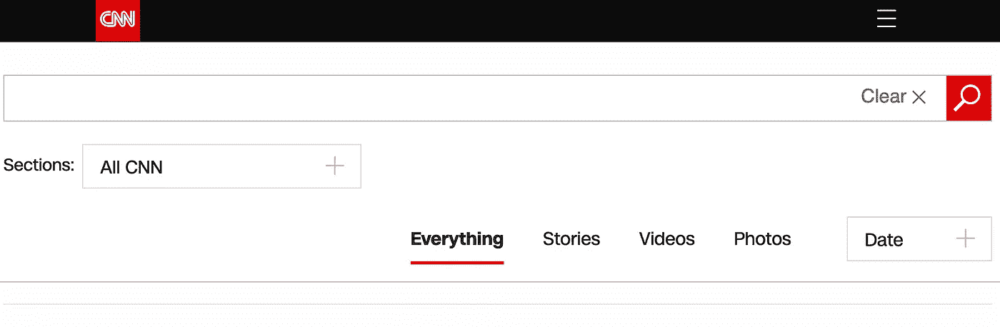

相比之下，这显示了 JavaScript 的神奇(和麻烦)

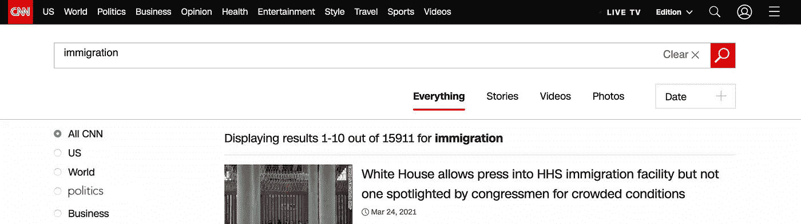

因此，我们首先需要模拟发送搜索请求的过程(只需使用“search？q =中的 string 也可以，但下面是为了展示从主页运行 Selenium 的更完整的过程)。然后我们会处理分页——


另一方面，“日期”按钮只给出了按日期或相关性排序的选项，而不是指定搜索日期范围的方法。

下面是抓取 CNN 的代码，注释中添加了解释。

## 福克斯新闻频道

抓取福克斯新闻频道非常相似，但是我们在这里处理的是显示更多按钮，而不是传统的分页


这一次，只评论与 CNN 蜘蛛相比的显著差异。

为了运行这些蜘蛛，只需在终端中键入:

```
scrapy crawl [spider name] [-o fileName.csv/.json/.xml] 
# Saving the output to a file is optional
# only these three file types are allowed by Scrapy
```

# 分析

我们收集的数据会有一个奇怪的顺序，因为 Scrapy 不会按顺序处理它们[。请求被并发发送以加速该过程。](https://doc.scrapy.org/en/latest/faq.html#does-scrapy-crawl-in-breadth-first-or-depth-first-order)

我们在这一部分需要的包包括:

```
# for standard data wrangling
import pandas as pd
import numpy as np# for plotting
import matplotlib.pyplot as plt# for pattern matching during cleaning
import re# for frequency counts
from collections import Counter# for bigrams, conditional frequency distribution and beyond
import nltk# for word cloud
from wordcloud import WordCloud, STOPWORDS, ImageColorGenerator
from PIL import Image# for (one way of) keyword extraction
from sklearn import feature_extraction
from nltk.stem.snowball import SnowballStemmer
from sklearn.feature_extraction.text import TfidfVectorizer
```

以下是 CNN 和福克斯新闻频道数据的预览:

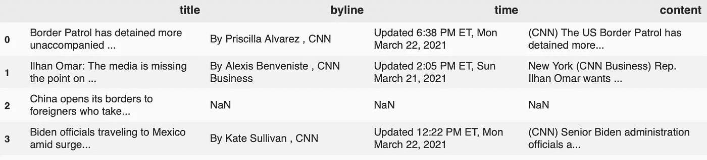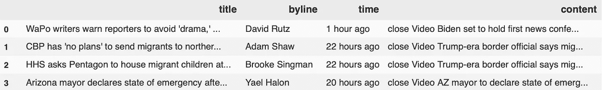

有几个标准的清洁步骤需要考虑，这最终取决于我们想要实现的目标。例如，如果只是我们想看的内容，我们可以完全忽略其他专栏中的混乱。出于我的目的，我执行了以下步骤:

1.  扔掉非传统格式的文章，比如幻灯片(导致 NA)

```
df = df.dropna(subset=['column to consider']).reset_index(drop=True)
```

2.格式化日期

```
# for CNN
df['date'] = df['time'].apply(lambda x: x.split('ET,')[1][4:].strip())
df.date = pd.to_datetime(df.date, format = '%B %d, %Y')# for Fox News
for _, row in df.iterrows():
    if 'hour' in row['time']:
        row['time'] = ('March 24, 2021')
    elif 'day' in row['time']:
        day_offset = int(row['time'].split()[0])
        row['time'] = 'March {}, 2021'.format(24 - day_offset)
    elif ('March' in row['time']) or ('February' in row['time']) or ('January' in row['time']):
        row['time'] += ', 2021'
    else:
        row['time'] += ', 2020'
df = df.rename(columns = {'time':'date'})
df.date = df.date.apply(lambda x: x.strip())
df.date = pd.to_datetime(fn.date, format = '%B %d, %Y')
```

我还创建了一个新的月-年列，用于以后的汇总汇总。这也有助于删除 7 月份发表的不需要的文章(之前是粗略的页数)。

```
df['month_year'] = pd.to_datetime(df['date']).dt.to_period('M')
df_cleaned = df[df['month_year']!=pd.Period('2020-07', 'M')].copy()
```

经过修整，我们现在得到了 CNN 的 644 篇文章和福克斯新闻频道的 738 篇文章。看起来两家新闻机构每月发表的移民相关文章的数量都在上升，福克斯在 3 月份的兴趣明显增加。

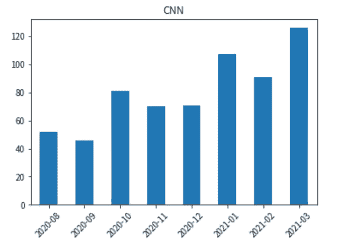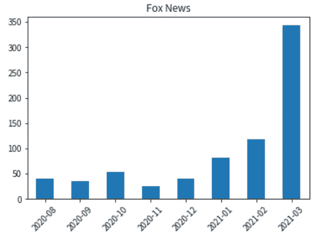

3.干净的物品

我们可以在清理文章正文方面做得更好，因为抓取阶段已经不加区分地包含了所有不必要的内容，比如广告横幅、媒体源和“宽度”或“视频关闭”等标记。但是其中一些很难破坏我们的内容分析。

然而，绝对需要我们注意的是嵌入的 JavaScript 代码(大部分来自页面上的视频)。如果我在处理原始 HTML 时嵌入一个“更干净”的函数可能会更好，但幸运的是，这些函数中的大多数都很容易识别。经过一番检查后，我把大部分都拿走了——

```
df['content'] = df['content'].apply(lambda x: x.lower())
cnn.content = cnn.content.apply(lambda x: re.sub(r'use\sstrict.*?env=prod"}', '', x))
```

## 词云

我从标题开始，以了解这两种出版物之间的区别。一种可视化文本数据的方法是 word cloud。

以下是几个月来 CNN 头条新闻中的关键词:

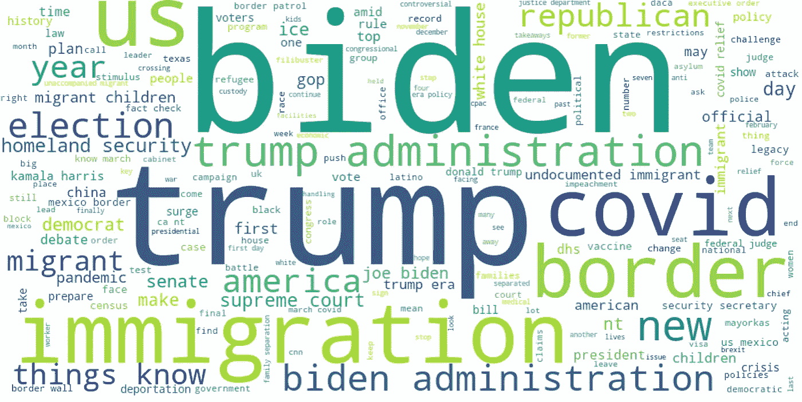

注意，所有的单词都是小写的，所以这里的“us”是“我们”的意思，“ice”是“ICE”(移民和海关执法)等等。

福克斯新闻频道:

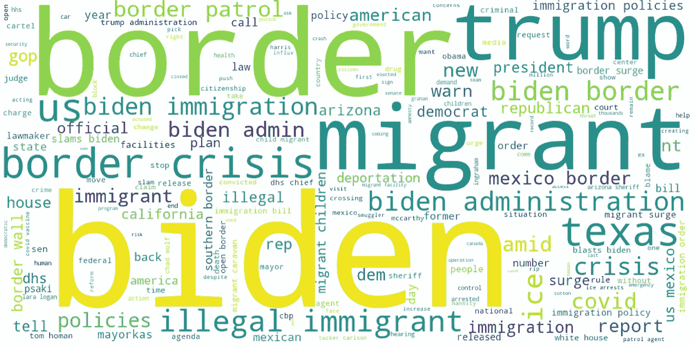

虽然 CNN 给予拜登和川普同等的关注，但在移民政策方面，福克斯新闻频道似乎对拜登和他的政府更感兴趣。一些在 CNN 头条新闻中不存在的关键词，如“非法移民”和“边境危机”，却经常出现在福克斯新闻频道的头条新闻中。

我们还可以并排查看每个月的 word cloud。

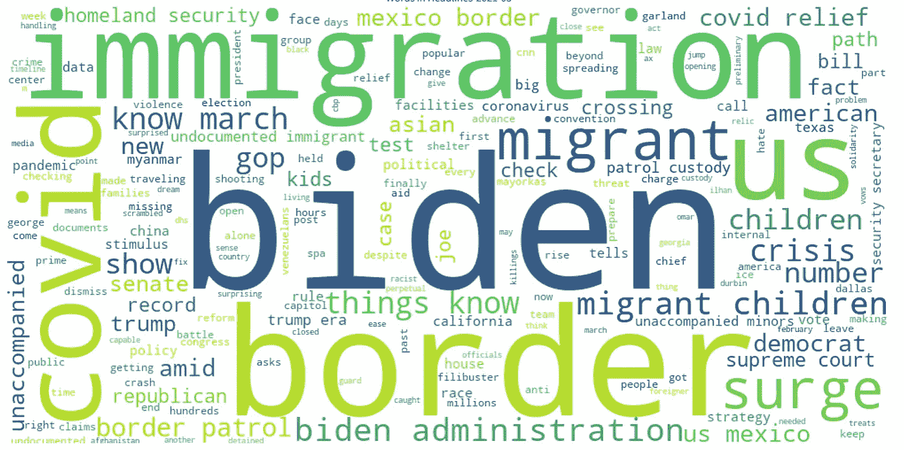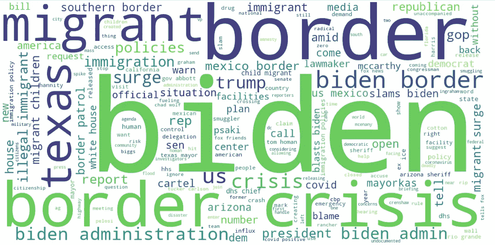

例如，今年 3 月，这两份出版物对移民问题给予了越来越多的关注。当 CNN(左上)仍然关注科维德时，福克斯新闻频道(左下)正在警告一场汹涌的“边境危机”

当谈到移民时，COVID 肯定是两人经常谈论的话题，但经常在相当不同的上下文中提及。在美国有线电视新闻网，例子包括“拉丁美洲人正在克服新冠肺炎疫苗接种的障碍，专家说这归结于获取”和“Covid 救济对无证重要工人至关重要。”另一方面，我们可以看到福克斯新闻频道的头条新闻，如“拜登政府通过不保护边境将冠状病毒'输入'得克萨斯州:州长阿博特”，事实上，“COVID 阳性”只在福克斯新闻频道出现，如“官员说，在得克萨斯州释放的 COVID 阳性移民人数激增”和“汉尼提:拜登允许 COVID 阳性移民进入美国是实际的'穴居人思维'。”

## 二元模型

我们可以看的另一件事是二元模型。

```
out = []
for title in list(df['title']):
    out.append(nltk.word_tokenize(title))bi = []
for title_words in out:
    bi += nltk.bigrams(title_words)Counter(bi).most_common()
```

除了像“拜登政府”和“特朗普政府”这样的预期热门人物外，还有几个奇怪的人。

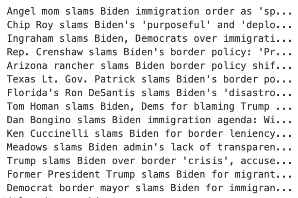

例如，我发现福克斯新闻频道的 bigram“slams Biden”和 CNN 的“Joe Biden”有相似的计数。显然拜登已经被不同的人员“抨击”了很多次(左)，这确实是一些值得观察的场景…

有了二元列表，我们可以进一步搜索具有条件频率分布的特定关键字对。比如说—

```
cfd = nltk.ConditionalFreqDist(bi)cfd['Covid']
# CNN: FreqDist({'relief': 8, ',': 6, 'law': 1})
cfd['coronavirus']
# Fox News: FreqDist({'pandemic': 4, 'death': 2, 'vaccine': 1, 'relief': 1, 'records': 1, 'travel': 1, 'is': 1, 'rules': 1, 'canceled': 1, ',': 1, ...})cfd['border']
# CNN: FreqDist({'wall': 7, 'crisis': 3, 'is': 3, '.': 2, ',': 2, 'alone': 2, 'surge': 1, 'closed': 1, 'problem': 1, 'encounters': 1, ...})
# Fox News: FreqDist({'crisis': 50, 'wall': 19, ',': 14, 'surge': 13, ':': 8, 'as': 7, 'policy': 7, 'crossings': 6, "'crisis": 5, 'situation': 5, ...})
```

## 随时间变化

观察词频在八个月中的变化可能会很有趣，所以我建立了一个新的数据集，其中包含每月的字数:

```
bag = df['title'].str.cat(sep = ' ')
tokens = process(bag)
word_df = pd.DataFrame.from_dict(dict(Counter(tokens)), orient='index', columns=['overall'])# create a custom merge
def merge(original_df, frames):
    out = original_df
    for df in frames:
        out = out.merge(df, how='left', left_index=True, right_index=True)
    return outframes = []
for time in df['month_year'].unique()[::-1]: # in reverse (chronological) order
    df_subset = foxnews[foxnews['month_year']==time].copy()
    bag = df_subset['title'].str.cat(sep = ' ')
    tokens = process(bag)
    frames.append(pd.DataFrame.from_dict(dict(Counter(tokens)), orient='index', columns=[str(time)]))end_df = merge(word_df, frames)
end_df = end_df.fillna(0)
```

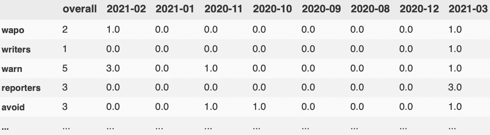

输出范围

虽然这样的数据集适合逐月比较，但在 Tableau 中可视化和动画化变化时，长格式会更方便—因此转换为:

```
df_long_temp = end_df.drop(columns='overall').reset_index()
df_long = pd.melt(df_long_temp,id_vars=['index'],var_name='year', value_name='frequency')
```

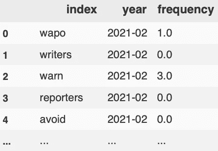

输出—长型

这里有一个关于如何在 Tableau 中制作可视化动画的有用资源。

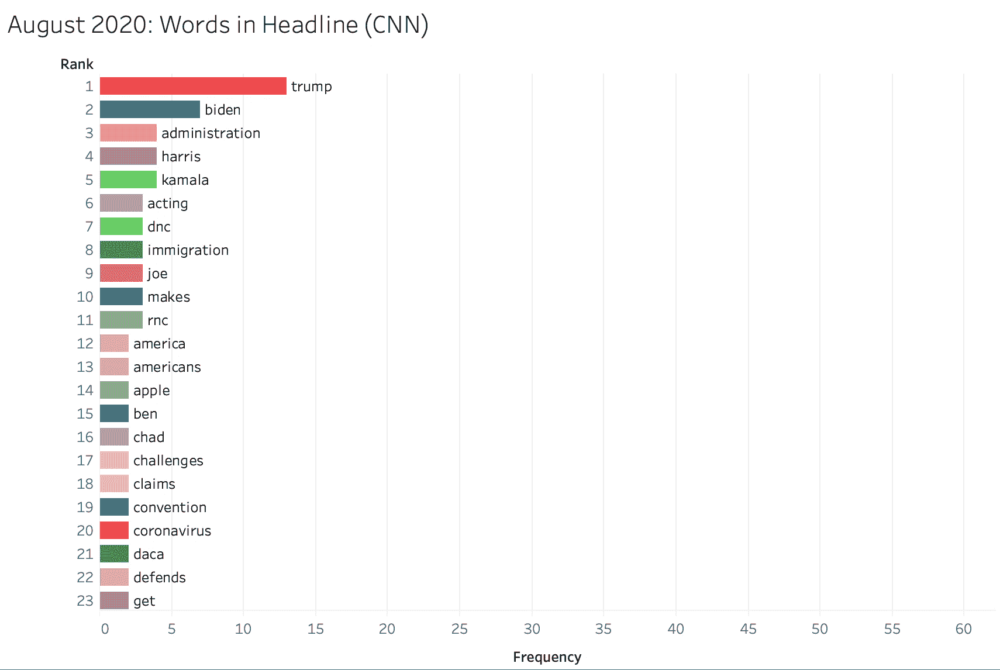

时间的动画变化(我希望它为你而动)

我们看到，从选举月开始，拜登的提及率迅速攀升，“特朗普”在 3 月份完全退出了名单，而对移民儿童的关注随着“边境”而激增。

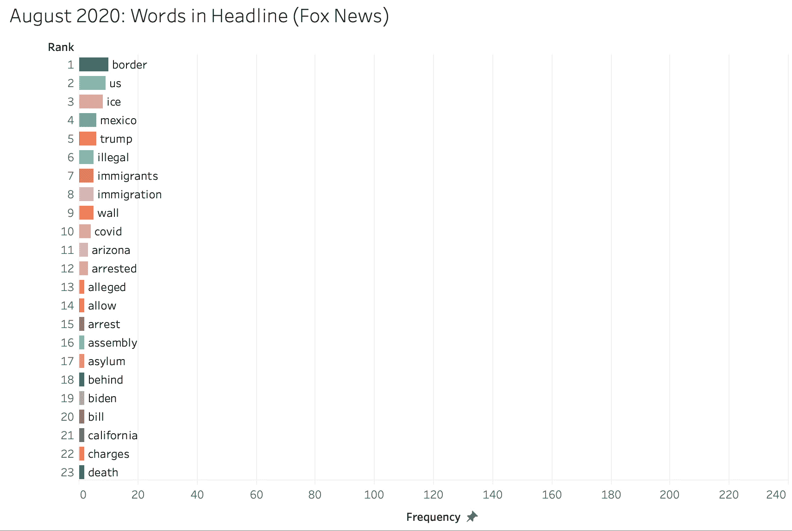

时间的动画变化(我希望它为你而动)

像 CNN 一样，“拜登”自选举以来一直领先，但直到 2021 年初，随着“危机”和“增兵”开始占据头条，人们的兴趣才开始增加。

## 文章中的关键词

为了查看哪些词在文章中可能承载更多的含义，我再次使用了 TF-IDF，它以鸟瞰的方式考虑了一个术语在文档中的重要性(在本例中是一篇特定的新闻文章)及其在整个语料库中的重要性，太常见的词权重较小。我还加入了词干。

当然，有许多不同的方法可以做到这一点，但在这里，我试图汇集所有文章中的前十个关键词(根据其 TF-IDF 权重排序)，以比较每个出版物的总体词汇的差异。

由此，我们可以看出关键词的共性:

```
set(fn_content_words).intersection(set(cnn_content_words))# word endings altered due to stemming
{'administr', #administration
 'biden',
 'bill',
 'children',
 'democrat',
 'facil', # facilities
 'ice',
 'mayorka',
 'mexico',
 'migrant',
 'polic', # policy
 'polici', # policies
 'presid', # president
 'republican',
 'senat', # senate
 'trump',
 'unaccompani', # unaccompanied
 'wolf'} # Chad Wolf
```

要看到一个人采用而另一个人没有采用的单词，我们可以使用—

```
set(fn_content_words).difference(set(cnn_content_words))
set(cnn_content_words).difference(set(fn_content_words))
```

从上面的分析中可以看出，福克斯新闻频道独有的关键词包括逮捕、大篷车、非法、华尔街、墨西哥以及亚利桑那州和得克萨斯州等多个州，而 CNN 经常使用美国人、黑人、中国人、白人、拉丁美洲人、妇女、运动、抗议和工人，这些词没有出现在福克斯新闻频道的热门词汇中。

下一步，可以尝试情感分析、主题建模或更详细的内容分析，如比较实体/专有名词、情态动词、引语或词汇多样性。让乐趣继续！