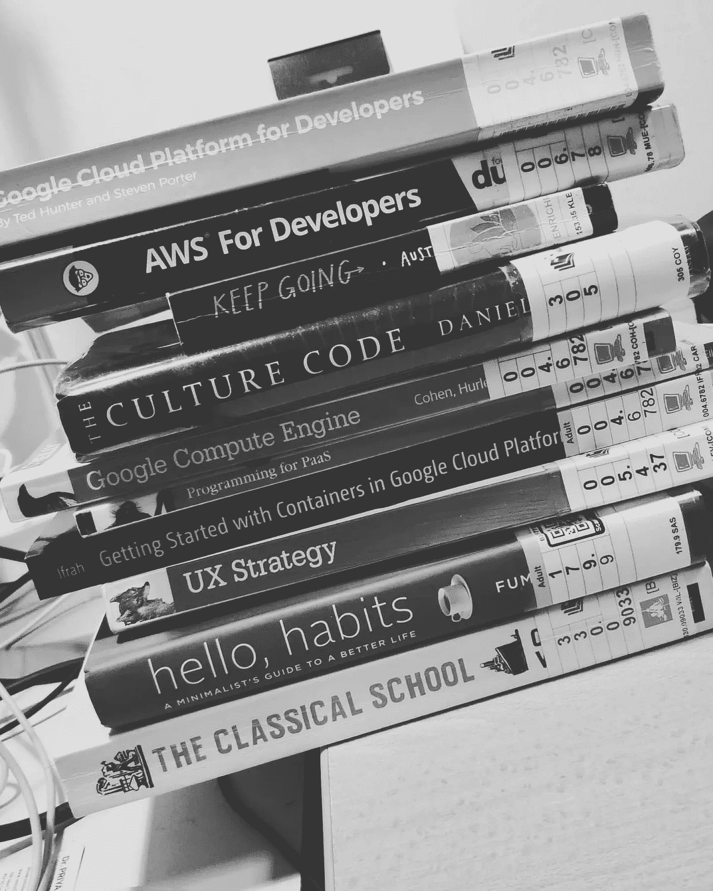
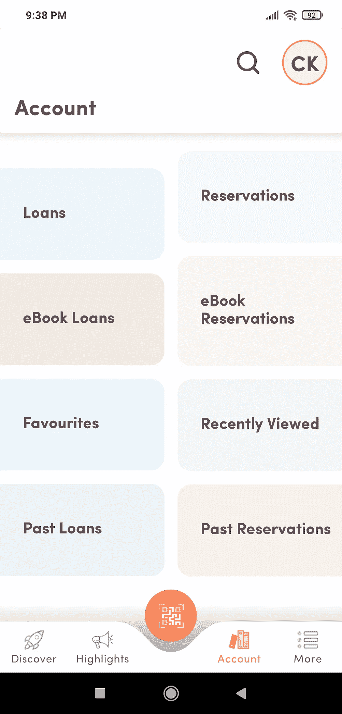
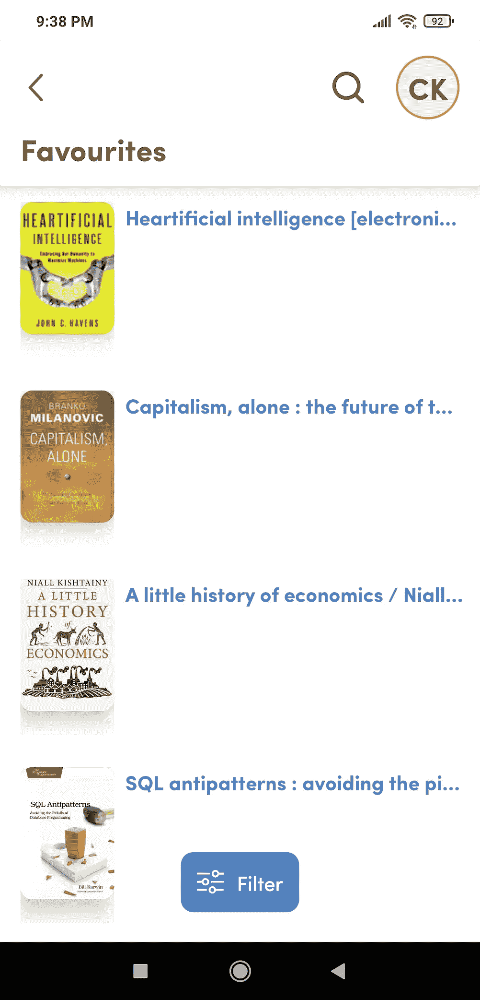
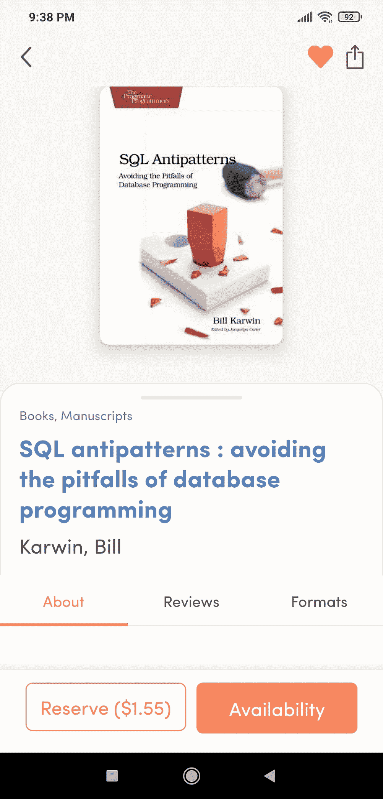
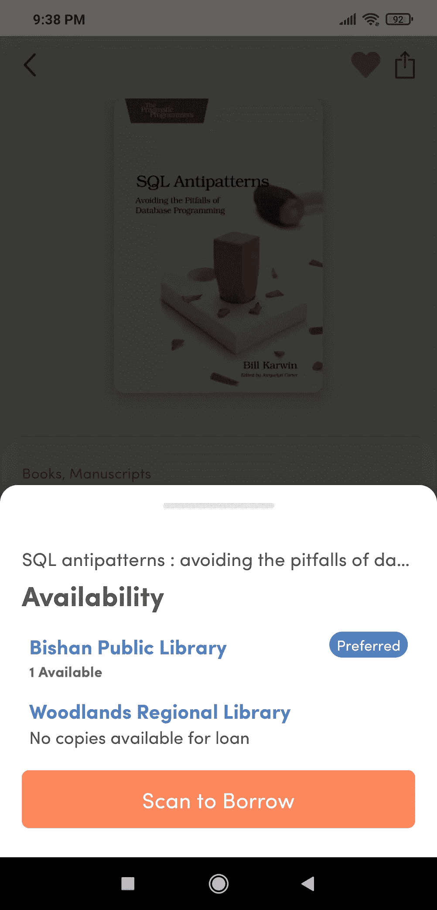
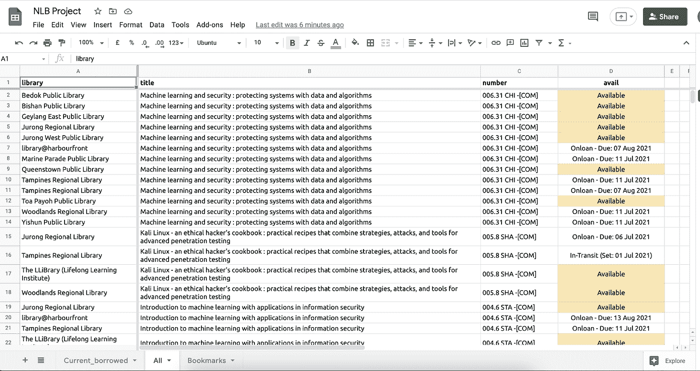
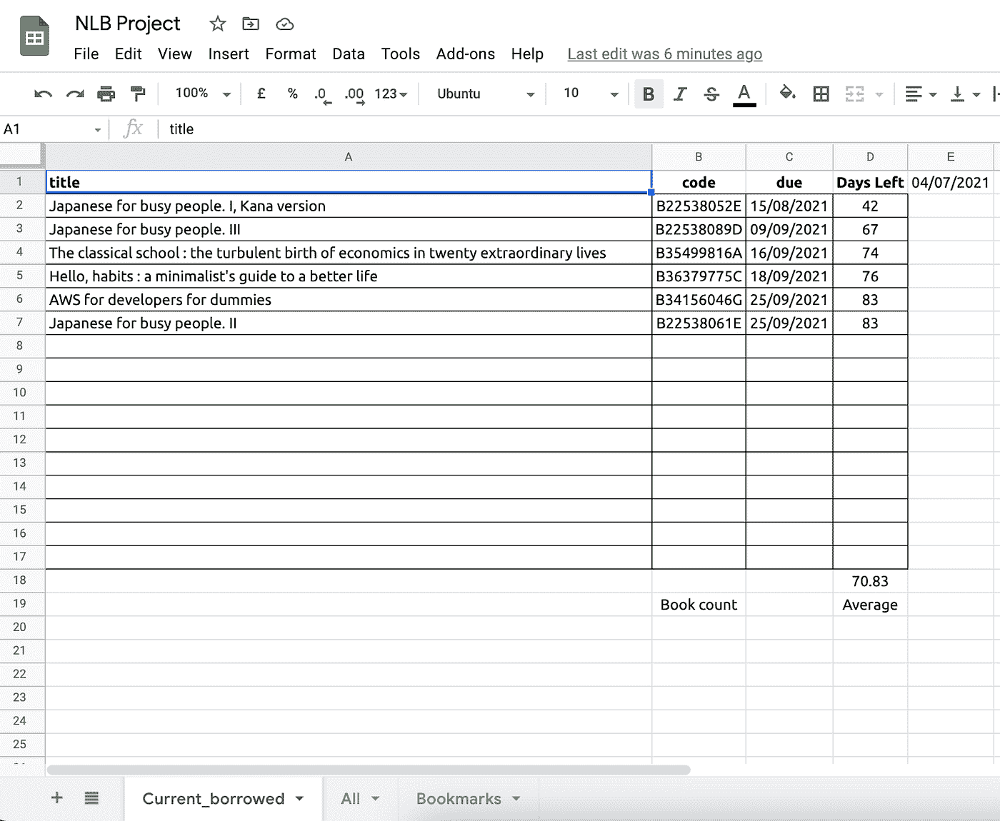

# 刮新加坡图书馆

> 原文：<https://medium.com/codex/scraping-singapore-libraries-f74c541f1f94?source=collection_archive---------14----------------------->

如果我们不以封面来判断一本书，我们应该以封面来判断一个人吗？

## **我在搜集图书馆书籍数据时的思维过程**

## **新加坡图书馆！**

由国家图书馆委员会(NLB)管理的新加坡图书馆，在物理基础设施、可访问性和图书选择方面都令人惊叹。我喜欢去图书馆借书，因为它们不花我一分钱，我也不需要担心这些书长期存放在哪里。这种轻量级的图书消费方式让我可以大胆地阅读哲学、艺术、编程、数据科学和其他书籍。我知道电子书的存在，但我喜欢纸质书的感觉，我喜欢在图书馆里“逛商店”，让图书馆的书架不时地给我带来新书精选的惊喜。

## **我遇到了一个用户问题…**

我们的新加坡图书馆有一个[网络](https://www.nlb.gov.sg/)和[移动应用](https://mobileapp.nlb.gov.sg/)，允许会员访问我们的图书馆账户和其他图书馆资源。我最喜欢的应用程序功能允许我通过使用智能手机的摄像头扫描图书的条形码来借书，这让我可以跳过借书机的队列。我使用的另一个功能是搜索书籍信息，主要是我感兴趣的书籍在哪些地方有售。不幸的是，尽管该应用和网站自几年前问世以来已经有了很大的改进，但要点击所有按钮来查看我感兴趣的书籍是否在我感兴趣的图书馆中可以找到，仍然是一件很麻烦的事情。

NLB 手机应用截图

这些截图排除了主页和不同接触点的加载时间，然后我才能最终知道一本书在特定的图书馆是否可用。想象一下，在经历了这一切之后，意识到这本书没有了，然后往回导航，看看下一本书是否有了。**作为一个用户，我宁愿选择一个图书馆，看看我收藏的哪些书可以在图书馆找到！**

作为 NLB 应用的重度用户(每周 2-3 次)，反复体验这个痛点真的让我想解决它！**我所做的是编写一个 web scraper 来获取我感兴趣的书籍(我在应用程序上加了书签的书籍)，然后创建一个视图(在 Google Sheets 上)来显示哪些书籍在哪些图书馆可用。**在本文中，我想分享更多关于从识别问题(如上所述)到构建工作流程以获取数据，以及如何使用我收集的数据的思考过程。在这篇文章的最后，我还会分享我的网页抓取工具 Github repo。

最后，我希望这篇文章可以提供一个 web 抓取项目的视图，以及如果你想自己执行一个项目，你需要考虑的一些因素(肯定不是全部)。

## **注意事项**

Web 抓取器很难编写和维护(至少对于像我这样的数据分析师来说)。如果 API 存在的话，我更愿意使用它们(正如我在过去的文章[这](https://cliffy-gardens.medium.com/i-am-back-a560f1e43884)和[这](https://cliffy-gardens.medium.com/my-1st-productivity-web-app-prototype-e189b6d7e7bd)中所写的)。当编写一个 scraper 时，你必须理解数据在站点上是如何表示的，并找出一个逻辑和一致的方法来提取你需要的数据。有些网站没有一个好的逻辑结构让你这样做，这并没有什么帮助(有些网站故意这样做是为了阻止网页抓取者)。因为网页抓取工具依赖于网站的用户界面，网站用户界面的改变通常意味着你需要花时间去重新理解网站的新用户界面并更新你的网页抓取工具。NLB 网站的用户界面确实改变过一次，在我能让它再次工作之前，它确实让我的网页抓取器坏了一段时间。因此，在投入时间和精力建立一个网络爬虫之前，要注意你可能会陷入的困境。

## **流程**

当我创建我的 NLB 抓取工具时，我意识到的第一件事是，为了获得我想要的数据，我需要我的网络抓取工具登录我的 NLB 账户。为了让我的代码执行这个登录步骤，我必须为我的 web scraper 使用 Selenium。

抓取由两个 Jupyter 笔记本执行，其中一个(1)提取我加书签的书，而另一个(2)提取我借的书。我还在另一个单独的 python 中将一些代码重构为函数，我可以在两个笔记本上使用它们。

我还将登录我的 NLB 账户和验证我的谷歌表单所需的数据保存在一个单独的文件夹中，而不是推到我的 Github repo 中。**千万不要在你的 Github repo 中包含这些信息，或者将它们硬编码到你的代码中，因为其他人可能会恶意使用这些信息**。

对于这个 web scraper，我决定使用 Google Sheets 作为我的“前端”，因为那时，我没有任何前端技能(那时我甚至不知道 Streamlit)。此外，我意识到我可以利用谷歌工作表功能来计算数值和添加颜色条件。我可能会将数据导入 Streamlit 应用程序，但这是我目前的首要任务。

这里不想太深入实际代码，但是**对实际代码感兴趣的可以访问我的 Github** [**回购**](https://github.com/cliffchew84/nlb_scraper) **。**

## **最终输出**

在运行我的 web scraper 之后，我会在我的 Google sheets 上拥有所有我加了书签的书，它们可以在哪个图书馆找到，如果这些书被借走了，它们什么时候到期。我有一个专门针对璧山图书馆的标签，因为那是我去得最多的图书馆。当我知道我要去其他图书馆附近的地方时，我会运行我的 web scraper 来识别那些图书馆中我收藏的书籍。

作为一个产品，Google Sheets 在手机上显得相当笨重，所以体验并不是很好。在我最后一次在笔记本电脑上执行 Python web scraper 和我在图书馆使用手机之间也有时间延迟。有时前一天晚上这本书还在，但第二天我去图书馆时却没有。最后，当我在图书馆时，即使我能以某种方式执行脚本，如果我有很多书签书籍，实际的 web 抓取也会花费一些时间。因此，我仍然离理想的用户体验很远，在理想的用户体验中，我可以“打开一个应用程序，选择一个图书馆，并实时查看一本书是否可用”。

在一个单独的、较小的脚本中，我还把我借的书刮了下来，这样我就可以监控我完成所有这些书的总天数和平均天数。

## **最后的话**

这一流程并不完美，因为我无法轻松地在手机上查看数据，而且在我用笔记本电脑运行 web scraper 和到达图书馆之间，这本书可能已经被借走了。最后，NLB 网站的用户界面可能会再次改变，并破坏我的网页抓取器，到那时，我可能会太忙而无法维护我的网页抓取器。

尽管如此，这个项目让我学到了很多关于使用 Selenium 进行 web 抓取的知识，以及如何使用它的 API 将数据从 Python 推送到 Google Sheets。特别是，我在我的日常活动项目之前创建了这个 web scraper，所以从我的 web scraper 中学到的东西肯定对那个项目有帮助。总的来说，对于我想要解决的棘手问题，以及我所获得的经验，我对整个过程和最终结果都很满意。当我有时间时，我会考虑创建 Streamlit 应用程序，为我收集的数据提供一个更加移动友好的用户界面。

最后，对于任何对使用 Python 进行 web 抓取感兴趣的人，我可以推荐这本叫做 ***《使用 Python 进行 Web 抓取》*** 的书。感兴趣的人可以从新加坡图书馆([链接](https://catalogue.nlb.gov.sg/cgi-bin/spydus.exe/FULL/WPAC/BIBENQ/199246043/133961741,4))借到这本书，不要惊讶，我也是从新加坡图书馆得到这本书的。这本书不仅涵盖了网页抓取的代码、工具和技术，而且还有一章介绍了网页抓取的道德规范、如何阅读和解释 robots.txt 文件，以及编写网页抓取器时需要考虑的整体因素。你将需要更多的资源(Stackoverflow)来构建更广泛的 web 抓取工具，但这本书无疑提供了一个良好的开端。

这就是我这篇文章的全部内容。如果您有任何建议或推荐，请随时联系我！我还在学习，并试图建立更多的技术能力。希望在这里张贴更多我的学习和附带项目！