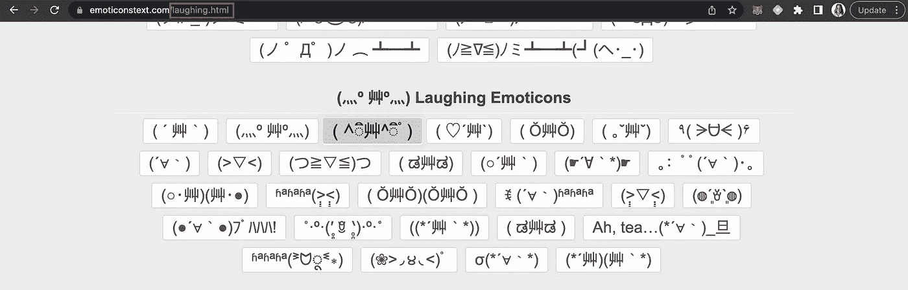

# 使用 Python 在 5 分钟内抓取网站数据

> 原文：<https://medium.com/codex/scraping-website-data-in-5-minutes-with-python-5c4a3af0ffb0?source=collection_archive---------4----------------------->

## 电报机器人系列的第 3 部分。我们将创建我们自己的数据集，并用我们的机器人测试它！

## 行动计划

在制作我的表情机器人时，我遇到了一个相当大的不便——没有表情符号的公共数据库！在寻找了几个小时后，我决定是时候采取主动，自己做一个了。

另外，如果你碰巧发现了一个文字表情数据库，一定要告诉我(这样我就可以嘲笑自己浪费的时间)。

凯文·Ku 在 [Unsplash](https://unsplash.com?utm_source=medium&utm_medium=referral) 上的照片

总体战略:

1.  使用 **BeautifulSoup** 制作一个解析器
2.  让这个解析器避免**验证码和 HTTP 错误 403**
3.  找到所有包含表情符号的容器
4.  根据情绪将它们放入一维数组中(一个代表快乐，一个代表愤怒，等等)
5.  将我们所有的数组组合成一个**单个熊猫数据帧**
6.  **没有剧透，但我对结果数据帧的不寻常感到非常惊讶:)**

## 步骤 1-获取网站和库

表情符号以字符串的形式出现，所以从 HTML 代码中检索它们应该相对容易。这是我发现的最好的一个:

> [https://www.emoticonstext.com/flip-table.html](https://www.emoticonstext.com/flip-table.html)

这个网站有一个小窍门:

看左上角——它写着“翻转表”,表示部分名称

现在看这里，它说“笑”，也指部分名称

如你所见，网站每个部分的 URL 都是不同的。这没问题，只是需要注意一些事情，这会给我们的抓取过程增加一些工作量。

让我们导入库:

导入库

现在让我们创建请求。这将打开网页并检查其内容。你可以放任何你想要的浏览器，我用了 Mozilla，因为它似乎引起的麻烦最少(只是澄清一下，我用 Chrome 作为浏览器来抓取，你不需要放你实际浏览器的名称！)

阅读网页并创建请求

好了，解析时间到了！

## 步骤 2—检索数据

以下是该流程背后的逻辑:

1.  我们获取 url 并设置解析器
2.  解析器将寻找一个特定的容器(在我们的例子中，是 *span 容器*
3.  我们将收集的数据放入 1D 阵列
4.  我们确保数组长度相同(这将有助于我们稍后创建数据帧)

那有点拗口，让我们进入正题吧！

首先，获取 url 并设置解析器:

很好，我们为网站的一部分返回了一个数组。我将使用这个函数创建 7 个不同的数组——每种情绪一个数组。虽然这看起来又长又难，但它只是对每种情绪的前两行代码的重复！

恭喜你，你刚刚做了很多 1D 数组！

## 步骤 3-制作数据框

要创建一个数据框，我们只需将数组作为列添加到数据框中。我们将使用熊猫创建我们的数据框。

好吧，让我们看看我们努力的成果:

最终数据帧

您现在可以在这个数据框上使用熊猫，并对它做任何您喜欢的事情！

> 就这样了，伙计们！请继续关注第 4 部分，也就是最后一部分，在这里，我们将汇集我们所做的一切，并将我们的机器人发布到 Telegram。