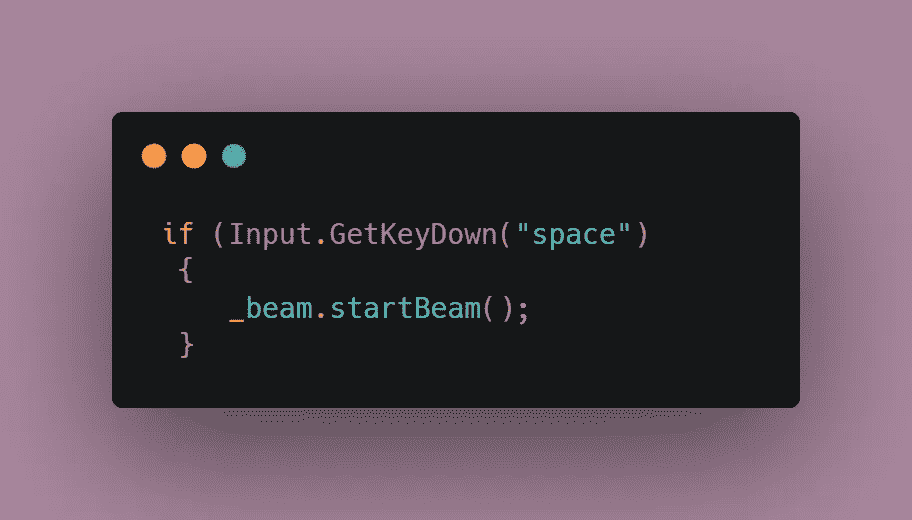

# 使用 GetComponent 编写 Unity 中的通信脚本

> 原文：<https://medium.com/codex/script-communication-in-unity-using-getcomponent-ca4444bfec6?source=collection_archive---------6----------------------->

在编程时，我们的脚本需要相互交互，引用游戏对象，并高效地移动数据。在本文中，我们将探讨如何使用 GetComponent 在两个脚本之间进行有效的通信。

假设您想从**脚本 A** 访问一个变量或方法，并从**脚本 B** 调用它。为此，我们需要创建对所需脚本的引用。

在下面的例子中， **Beam** 是脚本的实际名称，而 **_beam** 是存储它的变量。这个变量将成为全局变量，并在脚本 B(想要访问另一个脚本的脚本)中初始化。

要使用该脚本，您需要在它所附加的对象中找到它，这就是 GetComponent 的用武之地。 [**GetComponent**](https://docs.unity3d.com/ScriptReference/GameObject.GetComponents.html) 函数在指定对象中搜索与我们指定的类型相匹配的组件。如果没有找到这样的组件，则返回一个空引用。

该搜索在 **void Start()** 功能中执行。

> **最佳实践提示:**您应该始终检查组件是否可用，如果找不到组件，这个 **if 语句**将显示一条错误日志消息。

有了参考集，就该访问脚本了。这可以简单地通过输入你的引用变量，后跟你试图调用的方法名来完成。

在这个例子中，如果用户按下空格键，前面提到的脚本通信被用来从 Beam 脚本中调用一个方法。

在下一篇文章中，我们将看看[协程](/codex/coroutines-with-unity-b5a2b3fc3426)！