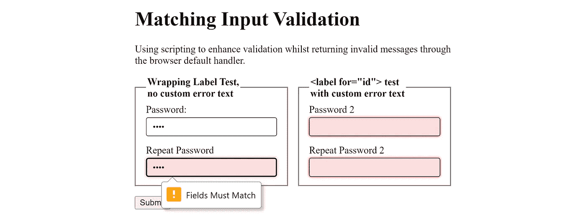

# 脚本化的与本机错误报告相匹配

> 原文：<https://medium.com/codex/scripted-input-matching-with-native-error-reporting-8287dd7ac40a?source=collection_archive---------1----------------------->

我们大多数从事 JS 工作的人都知道如何捕获“输入”和“提交”事件，以便进行“匹配输入”，比如当用户创建新密码时。问题是，大多数实现都在标记中添加了一些没有意义的段落，或者需要您自己的错误报告机制，或者许多其他解决方法，这些都与 HTML 5 提供的内置浏览器验证不一致。