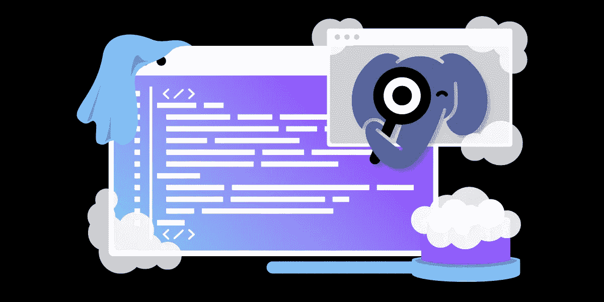
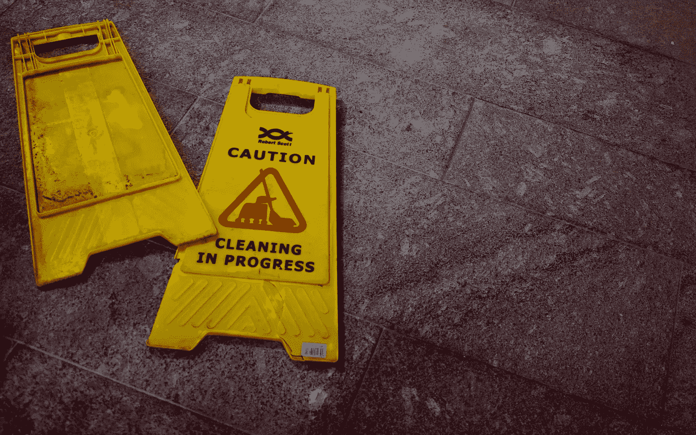

# 擦洗干净！用 PHPStan 清理 PHP 应用程序

> 原文：<https://medium.com/codex/scrub-up-cleaning-your-php-application-with-phpstan-6d1c17ddd272?source=collection_archive---------1----------------------->

在我做 PHP 开发人员期间，我们编写和发布代码的方式发生了巨大的变化。在早期的 Symfony T1 和 T2 Zend Framework T3 应用程序中，T4 PHP-FIG T5 并不存在，编码标准由编写它的人决定。这些年来，我们已经看到 PSR 标准被广泛采用，坚如磐石的静态分析工具已经变得有些零碎。也就是直到现在，随着 PHPStan1.0 版本的[发布。让我们通过浏览它的一些特性来庆祝这一时刻吧！](https://phpstan.org/blog/phpstan-1-0-released)

# 编译语言，你先发制人的 bug squasher

使用编译语言(比如 Java 或 C#)的一个很大的好处是，如果你的代码不是强制标准的类型安全的，编译时将会完全失败(尽管这对我来说很容易，因为现在不是凌晨 2 点，我已经喝了晚上的第 10 杯咖啡了)。由于 PHP 是一种解释语言，我们没有同样的奢侈。

# 解释为编译:CI +工具

由于在现代 web 开发和静态分析中我们可以使用大量的 DevOps 工具，事情是这样的*我们确实有相同的工具，但是通过不同的方式*。既然是这样，我不能提倡**多少**我建议你有一些类似的环境，我将展示出来。那么你为什么想要这个工具呢？让我们看一个例子。

# 场景

当涉及到像这样的工具时，尝试选择一个有趣的或适用于您所写内容的主题是很常见的。但是，在这篇文章中，我将向您展示一个我个人在机构环境中多次遇到的场景:

**“救命啊！别人建立了我的 PHP 应用程序，我需要有人来拯救它并接管它的维护，因为 X/Y/Z 功能需要建立，但 A/B/C 功能甚至不能很好地工作！”**

接管别人的代码库/项目总是一件完全碰运气的事。如果你接管它是因为它需要新的功能，而它已经是一个科技债务缠身的烂摊子，你知道你必须在接触其他任何东西之前解决这个问题。更糟糕的是，很多这样的项目(以我的经验来看)在到达时都没有测试来自我记录代码。考虑一个经典的例子，我已经看过很多次了:

您没有编写实体类或存储库方法。他们没有类型提示，因为这是用 PHP5.3 编写的，或者开发者没有使用任何类型提示。如果你的 ORM 返回相同实体的数组，这没什么，但是一个 bug，一个 null 结果在`findAllBySomething()`和`doTheThing()`的返回值中会抛出一个致命的错误。

是时候在上面设置 [PHPStan](https://github.com/phpstan/phpstan) 了。

虽然说“使用 PHPStan”很容易，但如果您有一个遗留的或技术债务沉重的应用程序，您将需要一个策略，而不是只是把东西扔在那里看看会发生什么。首先，您需要熟悉规则级别。

## 规则级别

PHPStan 的结构是以给定的规则级别运行，编号从 0 到 9:

1.  基本检查，未知的类，未知的函数，在`$this`上调用的未知方法，传递给这些方法和函数的参数数量错误，总是未定义的变量
2.  可能是未定义的变量，未知的魔法方法，以及带有`__call`和`__get`的类的属性
3.  对所有表达式(不仅仅是`$this`)检查未知方法，验证 PHPDocs
4.  返回类型，分配给属性的类型
5.  基本死代码检查—总是假的`instanceof`和其他类型检查，死的`else`分支，返回后不可达的代码；等等。
6.  检查传递给方法和函数的参数类型
7.  报告缺失的类型提示
8.  报告部分错误的联合类型——如果您调用一个只存在于联合类型中的某些类型上的方法，级别 7 开始报告这种情况；其他可能不正确的情况
9.  报告调用方法和访问可空类型的属性
10.  对`mixed`类型要严格——唯一允许的操作是将它传递给另一个`mixed`

这就是为什么你的策略很重要。如果你有一个别人写的遗留项目，而你在第 9 级启动了 PHPStan 任务运行器，你可能会被它产生的结果淹没。一切都坏了！为了重构，我建议如下:

*   为你自己设定每一级的里程碑，从小处着手。
*   长期投资最终会有回报(我们很快会谈到管道)，但在你自己的“完成的定义”下，设定你在归类“修复技术债务”时愿意达到的最高水平
*   遗留项目的一个好的实际目标是通过规则级别 6。正是在这一点上，您的代码库可能会从“危险”状态过渡到“正确”状态。这将使第 6 级规则[成为你的基线](https://phpstan.org/user-guide/baseline)。
*   **这一点非常重要**:确保分配时间(冲刺，受虐者的分解吉拉门票)来*修复【PHPStan 在每个规则级别标记的内容。在许多情况下，解决技术债务并不容易，你也不知道在你的应用程序中会出现什么样的业务领域逻辑错误。*
*   在为规则级别设置增量目标时，确保在提交更改之前设置好您的[管道](https://gist.github.com/DanyF-github/aa1bf6bb04b617570d521dd883a343a7#pipeline)，以便在重构时不会引入任何新的代码味道。建立你的管道需要你建立[你的基线](https://phpstan.org/user-guide/baseline)，我们会谈到的。

## 管道

在 DevOps 的世界中，有大量的工具选项可以用来解决您的问题。对于这个实例，我只提供了一种方法，但是它没有其他可用的方法复杂。一旦你建立了你的策略，是时候建立你的管道了，这样我们就不会提交任何没有先通过 PHPStan 的新代码。

## 防御壁垒:本地与服务器端

我喜欢引入工具来消除任何单点故障的可能性，由于这种愤世嫉俗的态度，我强烈建议您在本地开发人员的机器上运行静态分析*以及在您的存储库中运行*服务器端 CI 检查。

*本地*

*   作曲家+ PHPStan

首先，您需要在项目中安装 PHPStan。我们将使用 [composer](https://getcomposer.org/) 来完成这项工作，假设您的遗留代码确实使用了包管理。如果没有，你可以[安装作曲家](https://getcomposer.org/doc/00-intro.md#installation-linux-unix-macos)并使用`composer init`创建一个新项目。

要安装 PHPStan，请运行以下命令:

我们添加`--dev`是因为我们在生产中不需要它(理论上！).

*   配置:建立基线

这是 PHPStan 的一个非常好的特性。你的基线建立了你的应用程序的“地面零点”,这样在你选择的规则级别内存在的任何当前错误都会被忽略*,直到你决定处理它们*,但同时*可以为提交的任何新更改强制执行一个规则级别*。该战略中概述的一个明智的方法是在规则级别 6 设定一个基线:

*   提交给项目的所有新代码都需要处于规则级别 6
*   然后，你可以根据你的战略目标，设定较低层次的科技债务目标。

要创建基线，请运行以下命令:

现在，您将在指定的文件(`phpstan.neon`)中设置您的基线配置，这将保存每个文件的错误的详细概述。

现在，您会希望 PHPStan 在将提交推送到您的源代码之前，阻止提交到您的存储库。为此，我们使用 Git 钩子。

*   Git 挂钩

不知何故，我花了几年时间才意识到，git 实际上在`git init`上的一个新的 git 存储库中安装了钩子作为标准。你可以在这里阅读更多关于 git 钩子的内容。我们将要编辑`pre-commit`钩子。只要您以前没有接触过项目中的任何钩子，您就可以通过重命名它来启用预提交钩子——从项目的根目录运行它:

现在打开文件，删除内容并复制以下内容:

现在您已经启用了`pre-commit`，PHPStan 将在每次提交之前触发，并根据基线*分析在 git 提交*中已经更改的任何新文件。不再有难闻的提交代码！

当您向上移动时，您可能想要调整命令行触发器，所以当它需要改变时(或者您想要启用其他 PHPStan 特性)，更改`analysisResult=$(vendor/bin/phpstan analyse $gitDiffFiles)`行参数。

*服务器端*

你能为你的代码做的辩护越多，就越好。作为持续集成的一部分，在推送代码之后运行 PHPStan 服务器端是*必须具备的*。对于本例，我们将使用 Github 动作，但请记住，您可以在 [CircleCI](https://circleci.com/) 、 [Bitbucket Pipelines](https://support.atlassian.com/bitbucket-cloud/docs/get-started-with-bitbucket-pipelines/) 、 [Gitlab CI/CD](https://docs.gitlab.com/ee/ci/) 或 [Jenkins](https://www.jenkins.io/) 中设置相同级别的功能。下面是一个在 Github 上设置的动作工作流示例，用一个 [Ubuntu](https://ubuntu.com/) 容器构建您的代码:

“Run PHPStan”下的命令可以根据您的需求进行配置，就像在本地运行 PHPStan 时配置该命令一样。我已经编写了这个工作流，在项目中的所有文件上以默认级别运行 PHPStan(这个工作流还没有触发`composer`，所以不会有在您的`vendor`文件夹上运行它的不必要的和低效的步骤),所以在这里我建议引入一个配置来设置您整个项目的规则级别。

您的遗留项目现在有了一个清理代码的策略，以及在对所有现有代码的基线执行分析时阻止提交中出现新错误的管道。这种设置可以给你更多的信心投入到项目中，同时让你洞察到哪里可能需要重构来消除技术债务。

# 最后，但同样重要的是:静态分析与测试

我大声地说，尤其是对后面的人:PHPStan 和任何其他静态分析工具都不能代替您的测试！我认为它的用法是测试套件和 PHPStan *在评估你的代码质量时互相补充*。

认为您很少或者不需要测试套件是一种误解。这里最重要的是**静态分析不能测试你的领域逻辑**。虽然这似乎是一个显而易见的声明，但值得注意的是，它可能会令人困惑，因为 PHPStan **可以**消除某些测试的需要。一个这样的例子是一个`instanceOf`测试，它断言一个被创建的类是一个过程的最终结果。PHPStan 可以消除这一需求，因为它提供了消除这一潜在缺陷所需的分析，但是它*并不*预先知道您所需的域逻辑——这是您*做*需要测试的。

## 记住，还有其他选择！

你试过了吗？不太喜欢吗？每个人都有自己的偏好，虽然我会对 Ondřej 在 PHPStan 上的工作大加赞赏，但值得注意的是，还有其他几个工具可以完成同样的工作，或者可以与 PHPStan 结合使用:

## 谢谢

特别感谢 ondřej·米尔特斯的建议和他为发布这个令人敬畏的工具所做的努力。

*最初发布于*[*https://learn . vonage . com/blog/2021/11/30/scrub-up-cleaning-your-PHP-application-with-PHP stan/*](https://learn.vonage.com/blog/2021/11/30/scrub-up-cleaning-your-php-application-with-phpstan/)