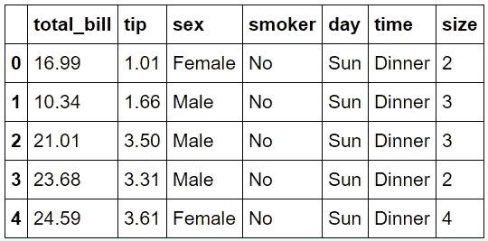

# 使用 Python 学习 Seaborn 的简单指南

> 原文：<https://medium.com/codex/seaborn-fd047c4a1add?source=collection_archive---------0----------------------->


卢克·切瑟在 [Unsplash](https://unsplash.com?utm_source=medium&utm_medium=referral) 上的照片

## 统计数据可视化

Seaborn 是一个基于 [matplotlib](https://matplotlib.org/) 的 Python 数据可视化库。它提供了一个高层次的界面来绘制有吸引力的和信息丰富的统计图形。它通常用于可视化随机分布。

Seaborn 可以作为熊猫来加载数据集，它也有一些预加载的数据集。

```
tips = sns.load_dataset('tips')

tips.head()
```



输出

```
sns.barplot(x=’sex’,y=’total_bill’,data=tips) *#y has mean*
```


它类似于总条形图。您不能更改聚合函数，它将保持计数。因此我们不需要给 y。

```
sns.countplot(x='sex',data=tips)
```

# 箱形图

这些点是异常值

```
sns.boxplot(x='day',y='total_bill',data=tips)
```


# 分布图

允许查看一个变量的分布，即该变量的分布情况。

```
tips=sns.load_dataset('tips')
sns.distplot(tips['total_bill'])
```


这条线是 KDE，代表核密度估计。要关闭它，我们可以写 kde= **False。**我们还可以指定箱数，默认值为 10。

```
sns.distplot(tips['total_bill'],kde=**False**,bins=40)
```


# 联合地块

*   这意味着显示两个参数之间的关系。
*   它显示或者您可以将两个分布图合并为一个。
*   上图显示 total_bill 的分布，下图显示小费的分布。
*   随着账单总额的增加，小费也在增加。
*   所以我们可以从这个图表中看到一个线性趋势


```
sns.jointplot(x='total_bill',y='tip',data=tips,kind='hex',color='red')
```


```
sns.jointplot(x='total_bill',y='tip',data=tips,kind='kde')
```


# 配对图

为了比较所有特征之间的关系，它绘制了所有特征之间的成对关系。提示有 7 列，所以它将每个人与每个人。

**要比较两个变量或特征，您可以使用联合图！！**


*   当两个变量相同时，就产生了正态分布，即在对角线上
*   而左图是成对比较

有关 matplotlib 的更多信息，请参考:

[https://medium.com/r/?URL = http % 3A % 2F % 2faditrisriv . medium . com % 2F](http://aditrisriv.medium.com/)