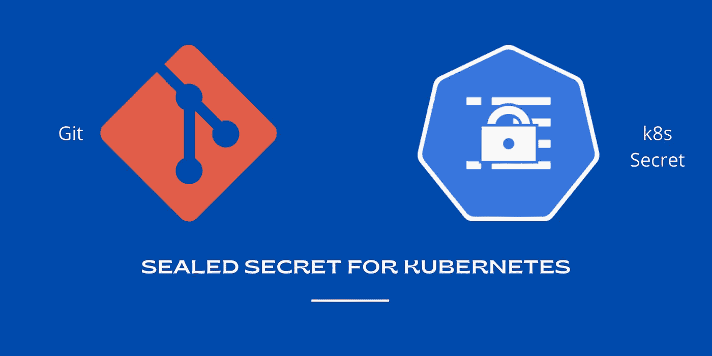

# 库伯内特的秘密

> 原文：<https://medium.com/codex/sealed-secrets-for-kubernetes-722d643eb658?source=collection_archive---------0----------------------->

如何加密 Kubernetes Secret 组件并将其存储在 Git 上。并用 Kubernetes 控制器解密。

密封的秘密

当您使用清单文件(YAML 文件)来创建/管理 Kubernetes 组件(如 pod、Secrets、Services 等)时，建议使用版本控制系统(Git)。如果使用版本控制，许多问题都会迎刃而解。这里我列举了几件事。