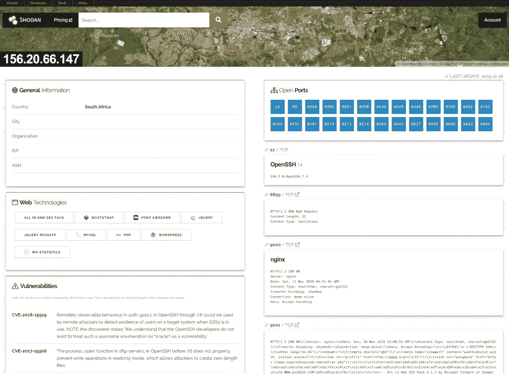
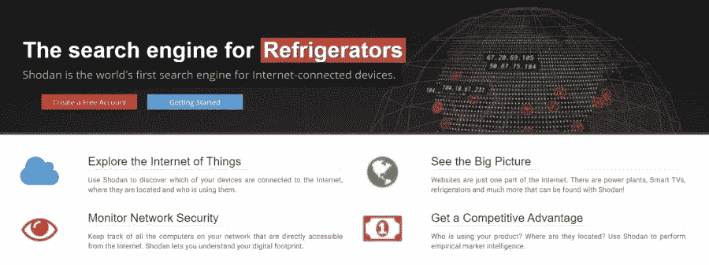
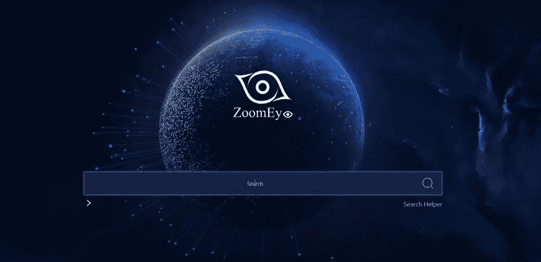
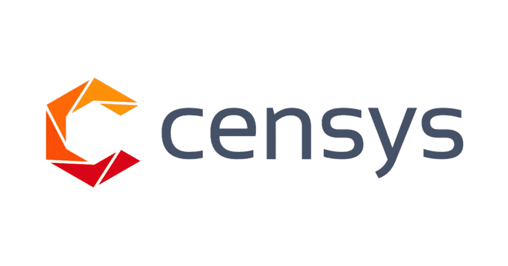
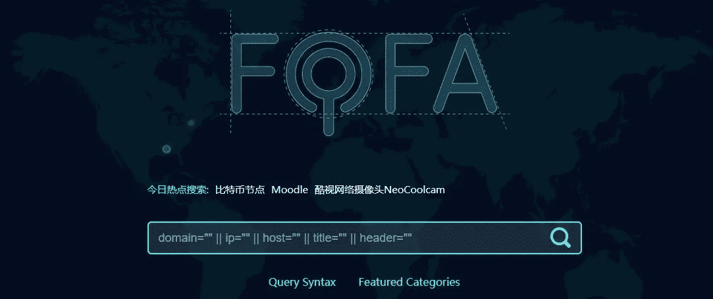
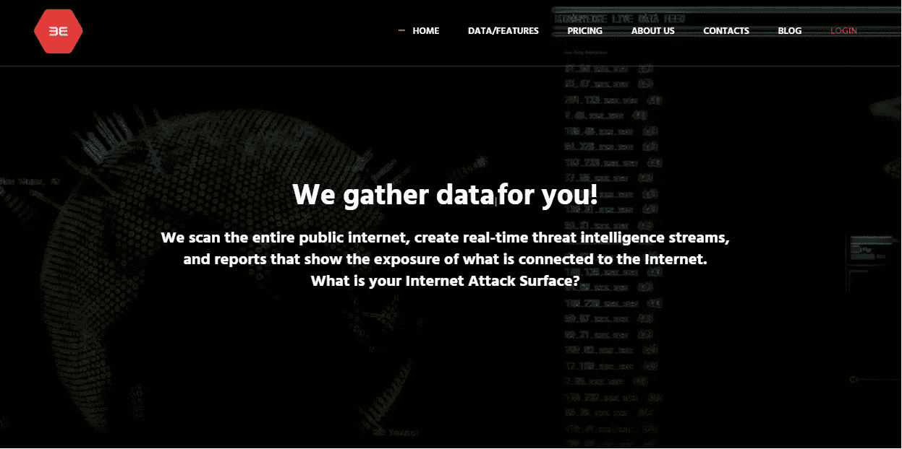

# 安全研究人员使用的搜索引擎

> 原文：<https://medium.com/codex/search-engines-used-by-security-researchers-542095b81580?source=collection_archive---------5----------------------->

照片由[弗兰克](https://unsplash.com/@franckinjapan?utm_source=medium&utm_medium=referral)在 [Unsplash](https://unsplash.com?utm_source=medium&utm_medium=referral) 上拍摄

我们都熟悉 Google、Bing 甚至 Yahoo 等互联网搜索引擎的概念。但是，如果你寻找的信息比这些搜索引擎的能力更深呢？

有一些基于网络的工具可以让人们从**网络空间的海洋中挑选特定的信息。在本文中，我们收集了其中的五种:**

## 1- Shodan

Shodan 是一个流行的搜索引擎，用于对联网设备进行安全研究。这个工具被全世界成千上万的安全专家、研究人员、CERTs、大型组织和其他人使用。

除了网页之外，它还可以用于网络摄像头、物联网设备、冰箱、建筑、智能电视、发电厂等。Shodan 允许您找出哪些设备连接到互联网，它们在哪里，以及谁在使用它们。它允许您跟踪用户可以通过互联网直接访问的所有网络系统，并识别您的数字足迹。

这是一个很方便的工具，可以用来找出谁可能会购买某个特定的产品，哪个国家生产的最多，或者哪个公司最容易受到安全漏洞或攻击。Shodan 还提供了一个公共 API 供其他工具使用，以便访问 Shodan 的数据。它支持集成 Nmap、Chrome、Firefox、FOCA、Maltego、Metasploit 等等。

## 2- ZoomEye

ZoomEye 是由 Knownsec 实现的。ZoomEye 使用基于 IPv6、IPv4 和站点域名数据库的大量绘图节点和全球勘测，通过每周 7 天、每天 24 小时扫描和查找大量服务协议和端口来绘制本地或全球网络空间的地图。

可以使用 ZoomEye 的组件搜索导航，准确快速的获取目标资产。为此，他们需要多种设备类型，如网关、CDN、大数据、录音机、CMS、web 框架、软件平台等。

您还可以搜索特殊主题并检查漏洞影响评估。这些话题包括数据库、行业、区块链、防火墙、路由器、网络存储、相机、打印机、WAFs、网络存储等。，并检查报告，以敦促关闭的想法。
ZoomEye 提供每月 10，000 个结果的免费定价方案。
它的付费计划从每月 70 美元开始，提供 30，000 个结果。

## **3-许可系统**

该搜索引擎允许您获取监控风险和提高安全性所需的信息。它还可以发现和检测 web 服务器版本、数据库服务器、未打补丁的错误、路由器、操作系统版本、不安全的服务、web 应用程序防火墙等。

您可以通过 web 界面访问的信息也可以通过这个 API 以编程方式访问。

您需要这个工具来执行所有的脚本访问。它们的 API 端点需要通过 API ID 使用 HTTP 进行身份验证。它们提供了多个 API 端点，包括:

*   搜索端点对 Alexa Top Million、IPv4 和 Certificates 索引执行搜索。因此，端点显示所选字段的最新数据。
*   View 端点会在取得网站网域、主机的 IP 位址或凭证的 SHA-256 指纹后，收集有关特定网站、主机或凭证的结构化资料。
*   报告端点允许您发现特定查询的提取结果的聚合值细分。
*   一旦您拥有批量证书的 SHA-256 指纹，批量端点就会收集关于这些证书的结构化数据。
*   Account endpoint 在 Censys 中获取您的帐户数据，包括您当前查询的配额使用情况。
*   数据端点显示您可以从 Censys 下载的信息的元数据。

## 4- Fofa

Fofa 是 Shodan 的另一个很好的替代品，就像 Censys 一样。如果您想检查另一个来源的指标的正确性，fofa 是一个很好的方法。它允许您搜索的东西，如 IP，域名，主机，标题和标题。

**5-二进制边缘**

BinaryEdge 基本上收集互联网数据，并在他们自己的搜索引擎上进行搜索，如 Shodan、Censys 和许多其他
它允许你每个月最多查询 250 次，5000 次查询的价格从 10 美元/m 起。

*来源:* [*https://socradar . io/top-5-cyberspace-search-engines-used-by-security-researchers/*](https://socradar.io/top-5-cyberspace-search-engines-used-by-security-researchers/)