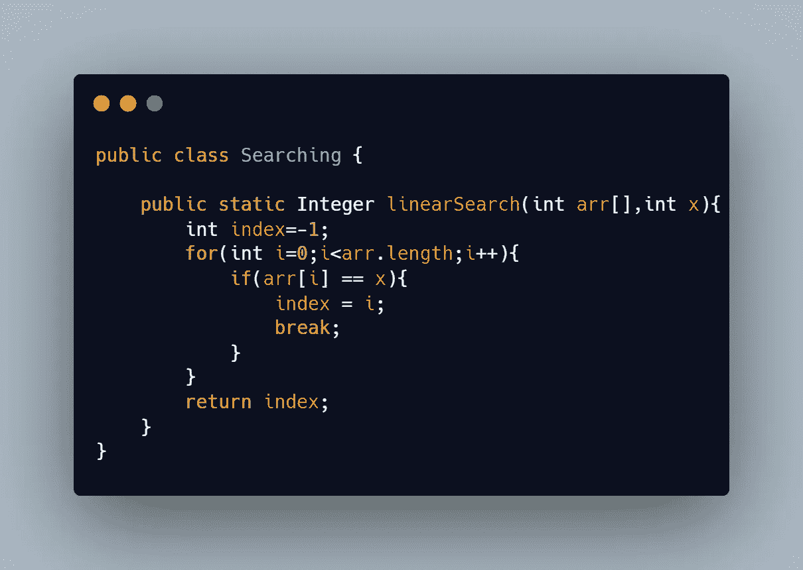
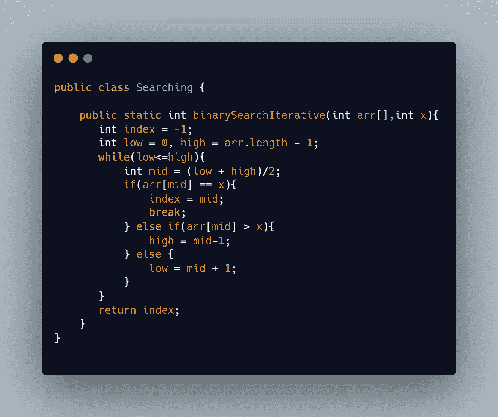
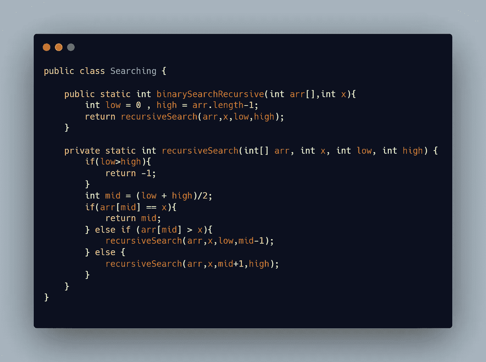

# 数据结构和算法中的搜索

> 原文：<https://medium.com/codex/searching-in-data-structures-and-algorithms-5ae390504e6d?source=collection_archive---------22----------------------->

搜索意味着在数组中找到一个元素。有两种方法来搜索数组线性搜索未排序的数组和二分搜索法(迭代或递归)排序的数组。

# 线性搜索

它线性遍历整个数组，看看元素是否存在。时间复杂度为 O(n)，空间复杂度为 O(1)。

# 二进位检索

二分搜索法是一种用于以 O(log(n))时间复杂度搜索排序数组中的元素的技术。利用二分搜索法的微小变化可以解决许多问题。

## **迭代二分搜索法**

## 递归二分搜索法

迭代方法是一种更好的方法，因为在递归方法中，有堆栈函数调用，因此空间复杂度不是 O(1)。然而，两种情况下的时间复杂度是相同的。

要了解更多关于二分搜索法的信息，请访问:

https://www.geeksforgeeks.org/binary-search/